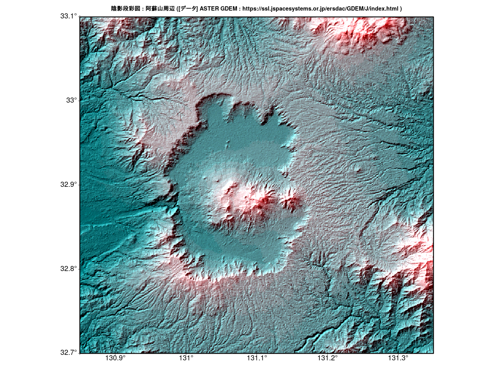
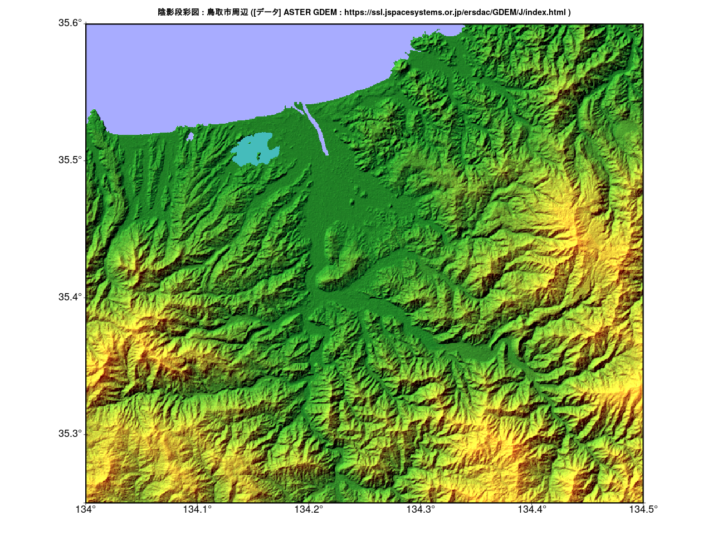
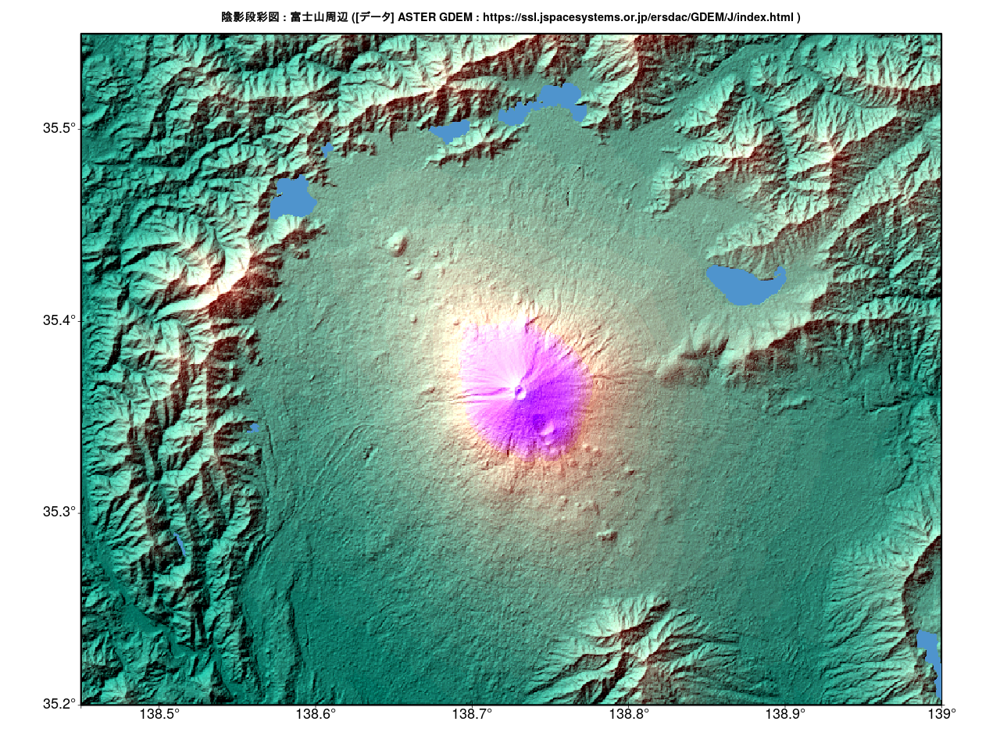

# Rで陰影段彩図03

## ASTER GDEMのデータ

ASTER GDEMバージョン3:https://ssl.jspacesystems.or.jp/ersdac/GDEM/J/   
権利がパブリックドメインになり、誰でも自由に使える。

### ASTGTMV003 : ASTER Global DEMのVersion 3

- **_dem.tif : 数値標高モデル (海水面：0 欠損データ：-9999)
- **_num.tif : 品質評価

### ASTWBDV001 : ASTER Global Water Bodies DatabaseのVersion 1

- **_dem.tif : 水域標高データ
- **_att.tif : 水域区分データ(陸:0 海:1 川:2 湖:3)

(注意する点)  
- 欠損データが「-9999」でNAではない
- 数値標高モデルだけではなく、水域区分データも使用する。


(参考)  
GMT Tutorial  
[陰影図の光源を指定する](http://hydro.iis.u-tokyo.ac.jp/~agata/archive/GMT334/doc/html/tutorial/node70.html)

(立体地形データ)  
[ASTER GDEMバージョン3](https://ssl.jspacesystems.or.jp/ersdac/GDEM/J/)

## 準備

[ASTER GDEMバージョン3](https://ssl.jspacesystems.or.jp/ersdac/GDEM/J/)から  

(阿蘇山)  
Download_N32E130.zip,Download_N32E131.zip,Download_N33E130.zip,Download_N33E131.zipを入手。解凍。

(鳥取市)  
Download_N35E134.zipを入手。解凍。  

(富士山)  
Download_N35E138.zipを入手。解凍。


## 手順
1. 数値標高データおよび水域区分データを読み込み(raster等)、必要な箇所を切り出す(crop)。
1. 水域区分データの陸をNA　水域を1に変更。
1. 数値標高データからhillShadeを作成(terrain,hillShade)
1. 配色を決める。(terrain.colorsを使うか、colorRampPaletteで作成)
1. 標高と色を対応させる。( as.vector(cut(...)) )
1. 立体地形データの対応させた色 RGBをHSV色に変換する(rgb2hsv)
1. hillShadeの陰影の度合いにより対応させた色をHSV色に変換する(rgb2hsv)
1. 陰影の効果を付け加える(H:元データのHそのまま S,V:元データのS,VとhillShadeのS,Vのそれぞれ平均)
1. plotRGB関数を使えるようにする。( col2rgb(hsv()) 、stack)
1. 標高＋hillshade彩色データをプロット(plotRGB)
1. 水域をプロット


## 陰影段彩図（阿蘇山） 


## 陰影段彩図(鳥取市)  


## 陰影段彩図(富士山) ＊富士五湖も描かれています。  



## Rコード

### パッケージの読み込み(共通)

```R
library(raster)
library(rgdal)
library(zoo) #欠損値の処理
```

### 作図のパラメータの指定等

### 阿蘇山周辺の場合

```R
##使用するデータ(阿蘇山)
NE<-c("N32E130","N32E131","N33E130","N33E131")
# 作図範囲を指定
Lon.range = c(130.85, 131.35)
Lat.range = c(32.7, 33.1)
# 目盛り
#axes1<-seq(ceiling(Lon.range[1]),floor(Lon.range[2]),0.5)
#axes2<-seq(ceiling(Lat.range[1]),floor(Lat.range[2]),0.5)
axes1<-seq(ceiling(Lon.range[1]*10)/10,floor(Lon.range[2]*10)/10,0.1)
axes2<-seq(ceiling(Lat.range[1]*10)/10,floor(Lat.range[2]*10)/10,0.1)
# タイトル名
title<-"陰影段彩図 : 阿蘇山周辺 ([データ] ASTER GDEM : https://ssl.jspacesystems.or.jp/ersdac/GDEM/J/index.html )"
# pngファイル名（図を保存する場合）
pngname<-"Aso02.png"
#水域の色
watercolor<-"#45BCBB"
```

### 鳥取市周辺の場合

```R
#使用するデータ(鳥取)
NE<-"N35E134"
# 作図範囲を指定
Lon.range = c(134, 134.5)
Lat.range = c(35.25, 35.6)
# 目盛り
#axes1<-seq(ceiling(Lon.range[1]),floor(Lon.range[2]),0.5)
#axes2<-seq(ceiling(Lat.range[1]),floor(Lat.range[2]),0.5)
axes1<-seq(ceiling(Lon.range[1]*10)/10,floor(Lon.range[2]*10)/10,0.1)
axes2<-seq(ceiling(Lat.range[1]*10)/10,floor(Lat.range[2]*10)/10,0.1)
# タイトル名
title<-"陰影段彩図 : 鳥取市周辺 ([データ] ASTER GDEM : https://ssl.jspacesystems.or.jp/ersdac/GDEM/J/index.html )"
# pngファイル名（図を保存する場合）
pngname<-"Tottori02.png"
#水域の色
watercolor<-"#45BCBB"
```

### 富士山周辺の場合

```R
#使用するデータ(富士山)
NE<-"N35E138"
# 作図範囲を指定
Lon.range = c(138.45, 139)
Lat.range = c(35.2, 35.55)
# 目盛り
#axes1<-seq(ceiling(Lon.range[1]),floor(Lon.range[2]),0.5)
#axes2<-seq(ceiling(Lat.range[1]),floor(Lat.range[2]),0.5)
axes1<-seq(ceiling(Lon.range[1]*10)/10,floor(Lon.range[2]*10)/10,0.1)
axes2<-seq(ceiling(Lat.range[1]*10)/10,floor(Lat.range[2]*10)/10,0.1)
# タイトル名
title<-"陰影段彩図 : 富士山周辺 ([データ] ASTER GDEM : https://ssl.jspacesystems.or.jp/ersdac/GDEM/J/index.html )"
# pngファイル名（図を保存する場合）
pngname<-"Fuji02.png"
#水域の色
watercolor<-"steelblue3"
```

### データ読み込み、データ処理と作図(共通)

```R
### 立体地形データを読み込み
# ASTER_GDEM https://ssl.jspacesystems.or.jp/ersdac/GDEM/J/index.html
map<-raster(paste0("ASTER_GDEM/Download_",NE[1],"/ASTGTMV003_",NE[1],"/ASTGTMV003_",NE[1],"_dem.tif"))
for (i in NE[-1]){
	fn <- paste0("ASTER_GDEM/Download_",i,"/ASTGTMV003_",i,"/ASTGTMV003_",i,"_dem.tif")
	map<-merge(map,raster(fn))
}
#
wd<-raster(paste0("ASTER_GDEM/Download_",NE[1],"/ASTWBDV001_",NE[1],"/ASTWBDV001_",NE[1],"_dem.tif"))
for (i in NE[-1]){
	fn <- paste0("ASTER_GDEM/Download_",i,"/ASTWBDV001_",i,"/ASTWBDV001_",i,"_dem.tif")
	wd<-merge(wd,raster(fn))
}
#sum(values(wd)>=1) 
#
########## 必要な箇所を切り出す ##########
Crop <- c(Lon.range[1],Lon.range[2],Lat.range[1],Lat.range[2])
r1 <- crop(map,Crop)
#
wd1<- crop(wd,Crop)
#陸をNA　水域を1
fun<-function(x){as.numeric(as.vector(cut(x, breaks=c(-Inf,0,Inf), labels = c("NA","1"), right = T)))}
wd1<-calc(wd1,fun)
#
slope <- terrain(r1, opt='slope')
aspect <- terrain(r1, opt='aspect')
hill <- hillShade(slope, aspect,45,315) 
#欠損値の個数
sum(is.na(values(hill)))
#欠損値の処理1
m <- matrix(1, ncol=5, nrow=5)
hill <- focal(hill, m, fun="mean", na.rm=TRUE, NAonly=TRUE, pad=TRUE) 
sum(is.na(values(hill)))
########## 配色を決める。##########
breakpoints<-c(-1,0,seq(100,4000,100)) # 0が最小
colors<-c(watercolor,terrain.colors(length(breakpoints)-2)) # "#45BCBB" : 海の色
########## 標高と色を対応させる。##########
v<-getValues(r1)
v<-as.vector(cut(v, breaks=breakpoints, labels = colors, right = T)) # 0m以下を海とするので、right = Tとする
#
########## 立体地形データの対応させた色 RGBをHSV色に変換する ##########
v1<-rgb2hsv(col2rgb(v))
#
## 陰影
x<-getValues(hill)
#最大値を M、最小値を mにする正規化
m<-0 ; M<-max(v1[3,])
x<-(M-m)*((x-min(x))/(max(x)-min(x)))+m
#
########## hillShadeの陰影の度合いにより対応させた色をHSV色に変換する ##########
h<-NULL
for ( i in 1:length(x)){
  h[i]<-gray(x[i])
}
h1<-rgb2hsv(col2rgb(h))
#
########## 陰影の効果を付け加える ##########
d1<-NULL
d1<-(v1+h1)/2
d1[1,]<-v1[1,] # H
# plotRGB関数を使えるようにする。
g<-c(col2rgb(hsv(d1[1,],d1[2,],d1[3,]))[1,],
     col2rgb(hsv(d1[1,],d1[2,],d1[3,]))[2,],
     col2rgb(hsv(d1[1,],d1[2,],d1[3,]))[3,] )
s<-NULL
r<-r1
s <- stack(r, r, r)
values(s)<-g
#
########## 作図 ##########
#png(pngname,width=1280,height=960)
par(mar=c(4,4,3,2), xaxt="n", yaxt="n")
plotRGB(s,stretch='lin',axes=TRUE)
par(xpd=T)
text(axes1,extent(s)[3],paste0(as.character(axes1),"°"),pos=1,cex=1.5)
text(extent(s)[1],axes2,paste0(as.character(axes2),"°"),pos=2,cex=1.5)
rect(extent(s)[1],extent(s)[3],extent(s)[2],extent(s)[4],lwd=3)
points(x=axes1,y=rep(extent(s)[3],length(axes1)),cex=1,pch=3)
points(x=rep(extent(s)[1],length(axes2)),y=axes2,cex=1,pch=3)
par(xpd=F)
plot(wd1,col=watercolor,bty="n", box=F,legend=F, axes=F,add=T) # 水域を塗りつぶす
title(title)
#dev.off()
```

### データ保存(任意[* 作図のために読み込むファイルが多い場合]、共通) 

#### 保存ファイル名は適当に変更すること

```R
save(r1, file = "GTM01.rda")
save(wd1, file = "WBD01.rda")
```

### 保存したファイルの読み込み、作図 (例)

#### 読み込みファイル名、パラメータは適当に変更すること

```R
#水域の色
watercolor<-"#45BCBB"
# タイトル名
title<-"陰影段彩図 :  ([データ] ASTER GDEM : https://ssl.jspacesystems.or.jp/ersdac/GDEM/J/index.html )"
# pngファイル名（図を保存する場合）
pngname<-"dem01.png"
#
library(raster)
library(rgdal)
library(zoo) #欠損値の処理
#
load("GTM01.rda")
load("WBD01.rda")
#
# 目盛り
#axes1<-seq(ceiling(extent(r1)[1]),floor(extent(r1)[2]),0.5)
#axes2<-seq(ceiling(extent(r1)[3]),floor(extent(r1)[4]),0.5)
axes1<-seq(ceiling(extent(r1)[1]*10)/10,floor(extent(r1)[2]*10)/10,0.1)
axes2<-seq(ceiling(extent(r1)[3]*10)/10,floor(extent(r1)[4]*10)/10,0.1)
#
slope <- terrain(r1, opt='slope')
aspect <- terrain(r1, opt='aspect')
hill <- hillShade(slope, aspect,45,315) 
#欠損値の個数
sum(is.na(values(hill)))
#欠損値の処理1
m <- matrix(1, ncol=5, nrow=5)
hill <- focal(hill, m, fun="mean", na.rm=TRUE, NAonly=TRUE, pad=TRUE) 
sum(is.na(values(hill)))
########## 配色を決める。##########
breakpoints<-c(-1,0,seq(100,4000,100)) # 0が最小
colors<-c(watercolor,terrain.colors(length(breakpoints)-2)) # "#45BCBB" : 海の色
########## 標高と色を対応させる。##########
v<-getValues(r1)
v<-as.vector(cut(v, breaks=breakpoints, labels = colors, right = T)) # 0m以下を海とするので、right = Tとする
#
########## 立体地形データの対応させた色 RGBをHSV色に変換する ##########
v1<-rgb2hsv(col2rgb(v))
#
## 陰影
x<-getValues(hill)
#最大値を M、最小値を mにする正規化
m<-0 ; M<-max(v1[3,])
x<-(M-m)*((x-min(x))/(max(x)-min(x)))+m
#
########## hillShadeの陰影の度合いにより対応させた色をHSV色に変換する ##########
h<-NULL
for ( i in 1:length(x)){
  h[i]<-gray(x[i])
}
h1<-rgb2hsv(col2rgb(h))
#
########## 陰影の効果を付け加える ##########
d1<-NULL
d1<-(v1+h1)/2
d1[1,]<-v1[1,] # H
# plotRGB関数を使えるようにする。
g<-c(col2rgb(hsv(d1[1,],d1[2,],d1[3,]))[1,],
     col2rgb(hsv(d1[1,],d1[2,],d1[3,]))[2,],
     col2rgb(hsv(d1[1,],d1[2,],d1[3,]))[3,] )
s<-NULL
r<-r1
s <- stack(r, r, r)
values(s)<-g
#
########## 作図 ##########
#png(pngname,width=1280,height=960)
par(mar=c(4,4,3,2), xaxt="n", yaxt="n")
plotRGB(s,stretch='lin',axes=TRUE)
par(xpd=T)
text(axes1,extent(s)[3],paste0(as.character(axes1),"°"),pos=1,cex=1.5)
text(extent(s)[1],axes2,paste0(as.character(axes2),"°"),pos=2,cex=1.5)
rect(extent(s)[1],extent(s)[3],extent(s)[2],extent(s)[4],lwd=3)
points(x=axes1,y=rep(extent(s)[3],length(axes1)),cex=1,pch=3)
points(x=rep(extent(s)[1],length(axes2)),y=axes2,cex=1,pch=3)
par(xpd=F)
plot(wd1,col=watercolor,bty="n", box=F,legend=F, axes=F,add=T) # 水域を塗りつぶす
title(title)
#dev.off()
```
