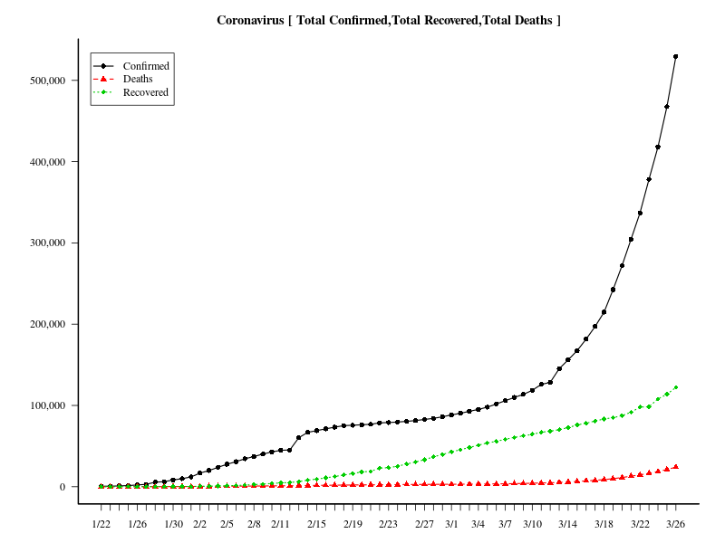

# Rでグーグルスプレッドシート01 (Coronavirus)  

## 新型コロナウイルスの感染状況

米ジョンズ・ホプキンス大学が新型コロナウイルスの感染状況をまとめたWebサイトを公開されています。
[Coronavirus 2019-nCoV Global Cases by Johns Hopkins CSSE](https://gisanddata.maps.arcgis.com/apps/opsdashboard/index.html#/bda7594740fd40299423467b48e9ecf6)

データはグーグルスプレッドシートから入手できます。

「gsheet」パッケージでは２枚め(Recovered)、３枚め(Death)が読み込めない。（やり方が悪かった？）  
で、「rvest」パッケージを使ってやってみました。

### 新型コロナウイルスに感染された方、回復された方、亡くなった方の数の推移（日別）
#### グラフ作成時間(日本時間２０２０年２月８日AM11:38)



２月６日から２月７日にかけて跳ね上がりました。

## Rコード

### パッケージの読み込み。データをグーグルスプレッドシートから入手。

```R
library(rvest)
library(lubridate)
library(xts)
#
html <- read_html("https://docs.google.com/spreadsheets/d/1UF2pSkFTURko2OvfHWWlFpDFAr1UxCBA4JLwlSP6KFo/htmlview?usp=sharing&sle=true")
g <- html_table(html,fill=T)
# 
Confirmed<-g[[1]]
Recovered<-g[[2]]
Death<- g[[3]]
#
# Confirmed
Confirmed<-Confirmed[-2,-1]
# 1行目をcolnames
colnames(Confirmed)<-Confirmed[1,]
Confirmed<-Confirmed[-1,-3]
# 3列めas.Date
Confirmed[,3]<- as.Date(Confirmed[,3],format="%m/%d/%y")
# 4列目以降 as.numeric
Confirmed[,4:ncol(Confirmed)]<-sapply(Confirmed[,4:ncol(Confirmed)],as.numeric)
# Recovered
Recovered<-Recovered[-2,-1]
# 1行目をcolnames
colnames(Recovered)<-Recovered[1,]
Recovered<-Recovered[-1,-3]
# 3列めas.Date
Recovered[,3]<- as.Date(Recovered[,3],format="%m/%d/%y")
# 4列目以降 as.numeric
Recovered[,4:ncol(Recovered)]<-sapply(Recovered[,4:ncol(Recovered)],as.numeric)
# Death
Death<-Death[-2,-1]
# 1行目をcolnames
colnames(Death)<-Death[1,]
#Deathだけ空列が２列め
Death<-Death[-1,-2]
# 3列めas.Date
Death[,3]<- as.Date(Death[,3],format="%m/%d/%y")
# 4列目以降 as.numeric
Death[,4:ncol(Death)]<-sapply(Death[,4:ncol(Death)],as.numeric)
```

### 時間ごとのトータルデータを作成。
### 元データは１日に何度かデータを更新しているので、それを１日ごとのデータにまとめる。

```R
# AM,PMの処理(lubridateパッケージ)
t<-mdy_hm(colnames(Confirmed)[6:ncol(Confirmed)])
# 時間ごとのトータルデータを作成
d<-data.frame(t,Confirmed=as.vector(colSums(Confirmed[,6:ncol(Confirmed)],na.rm=T)))
# apply.daily関数を使いたいのでxtsオブジェクトにする。
d.xts <- read.zoo(data.frame(t,Confirmed=as.vector(colSums(Confirmed[,6:ncol(Confirmed)],na.rm=T))))
# 元データは１日に何度かデータを更新しているので、それを１日ごとのデータにまとめる。
nCoV<-data.frame(date=as.Date(index(apply.daily(d.xts,max))),Confirmed=as.vector(coredata(apply.daily(d.xts,max))))
#
t<-mdy_hm(colnames(Recovered)[6:ncol(Recovered)])
d<-data.frame(t,Recovered=as.vector(colSums(Recovered[,6:ncol(Recovered)],na.rm=T)))
d.xts <- read.zoo(data.frame(t,Recovered=as.vector(colSums(Recovered[,6:ncol(Recovered)],na.rm=T))))
# merge
nCoV<-merge(nCoV,data.frame(date=as.Date(index(apply.daily(d.xts,max))),Recovered=as.vector(coredata(apply.daily(d.xts,max)))))
#
t<-mdy_hm(colnames(Death)[6:ncol(Death)])
d<-data.frame(t,Death=as.vector(colSums(Death[,6:ncol(Death)],na.rm=T)))
d.xts <- read.zoo(data.frame(t,Death=as.vector(colSums(Death[,6:ncol(Death)],na.rm=T))))
nCoV<-merge(nCoV,data.frame(date=as.Date(index(apply.daily(d.xts,max))),Death=as.vector(coredata(apply.daily(d.xts,max)))))
```

### 感染者、回復された方、亡くなった方の数の推移（日別）

```R
# png("Coronavirus01.png",width=800,height=600)
matplot(nCoV[,2:4],type="o",col=1:3,lwd=1.5,lty=1:3,pch=16:18,las=1,xaxt="n",ylab="")
axis(1,at=1:nrow(nCoV), labels =gsub("2020-","",nCoV[,1] ))
legend("topleft", legend = colnames(nCoV[,2:4]),col=1:3,lwd=1.5,lty=1:3,pch=16:18,inset =c(0.02,0.03))
title("Coronavirus [ Total Confirmed,Total Recovered,Total Death ]")
# dev.off()
```
