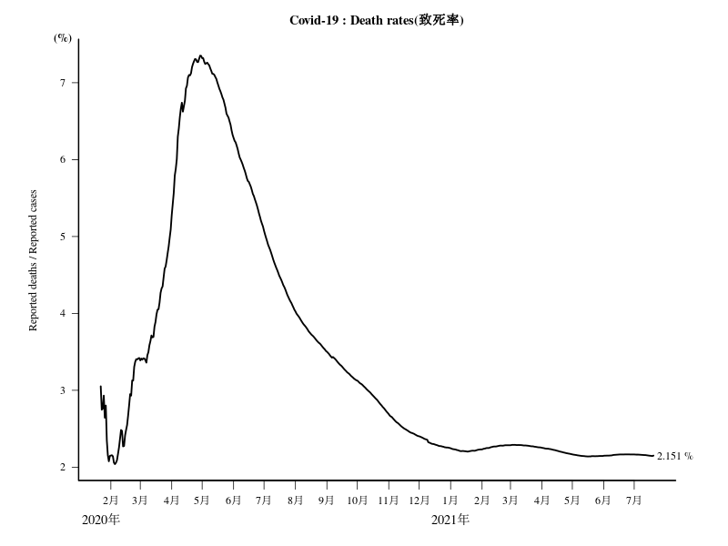

# Rでグーグルスプレッドシート01 (Coronavirus)  

# (注意) 公開データの場所がグーグルスプレッドシートからGithubに移動したので以下のＲコードは動きません。

## グーグルスプレッドシートのデータを読み込む方法は応用ができるので記事は残します。

## データの移動先  
[Novel Coronavirus 2019 Time Series Data:https://github.com/CSSEGISandData/2019-nCoV/tree/master/time_series](https://github.com/CSSEGISandData/2019-nCoV/tree/master/time_series)

## 新型コロナウイルスの感染状況

米ジョンズ・ホプキンス大学が新型コロナウイルスの感染状況をまとめたWebサイトを公開されています。
[Coronavirus 2019-nCoV Global Cases by Johns Hopkins CSSE](https://gisanddata.maps.arcgis.com/apps/opsdashboard/index.html#/bda7594740fd40299423467b48e9ecf6)

データはグーグルスプレッドシートから入手できます。

「gsheet」パッケージでは２枚め(Recovered)、３枚め(Death)が読み込めない。（やり方が悪かった？）  
で、「rvest」パッケージを使ってやってみました。

### 新型コロナウイルスに感染された方、回復された方、亡くなった方の数の推移（日別）
#### グラフ作成時間(日本時間2020年2月9日PM03:02)



### 新型コロナウイルスの感染状況
#### グラフ作成時間(日本時間2020年2月9日PM03:02)


## Rコード

### パッケージの読み込み。データをグーグルスプレッドシートから入手。

```R
library(rvest)
library(lubridate)
library(xts)
#
html <- read_html("https://docs.google.com/spreadsheets/d/1UF2pSkFTURko2OvfHWWlFpDFAr1UxCBA4JLwlSP6KFo/htmlview?usp=sharing&sle=true")
g <- html_table(html,fill=T)
# 
Confirmed<-g[[1]]
Recovered<-g[[2]]
Death<- g[[3]]
#
# Confirmed
Confirmed<-Confirmed[-2,-1]
# 1行目をcolnames
colnames(Confirmed)<-Confirmed[1,]
Confirmed<-Confirmed[-1,-3]
# 3列めas.Date
Confirmed[,3]<- as.Date(Confirmed[,3],format="%m/%d/%y")
# 4列目以降 as.numeric
Confirmed[,4:ncol(Confirmed)]<-sapply(Confirmed[,4:ncol(Confirmed)],as.numeric)
# Recovered
Recovered<-Recovered[-2,-1]
# 1行目をcolnames
colnames(Recovered)<-Recovered[1,]
Recovered<-Recovered[-1,-3]
# 3列めas.Date
Recovered[,3]<- as.Date(Recovered[,3],format="%m/%d/%y")
# 4列目以降 as.numeric
Recovered[,4:ncol(Recovered)]<-sapply(Recovered[,4:ncol(Recovered)],as.numeric)
# Death
Death<-Death[-2,-1]
# 1行目をcolnames
colnames(Death)<-Death[1,]
#Deathだけ空列が２列め
Death<-Death[-1,-2]
# 3列めas.Date
Death[,3]<- as.Date(Death[,3],format="%m/%d/%y")
# 4列目以降 as.numeric
Death[,4:ncol(Death)]<-sapply(Death[,4:ncol(Death)],as.numeric)
```

### 時間ごとのトータルデータを作成。
### 元データは１日に何度かデータを更新しているので、それを１日ごとのデータにまとめる。

```R
# AM,PMの処理(lubridateパッケージ)
t<-mdy_hm(colnames(Confirmed)[6:ncol(Confirmed)])
# 時間ごとのトータルデータを作成
d<-data.frame(t,Confirmed=as.vector(colSums(Confirmed[,6:ncol(Confirmed)],na.rm=T)))
# apply.daily関数を使いたいのでxtsオブジェクトにする。
d.xts <- read.zoo(data.frame(t,Confirmed=as.vector(colSums(Confirmed[,6:ncol(Confirmed)],na.rm=T))))
# 元データは１日に何度かデータを更新しているので、それを１日ごとのデータにまとめる。
nCoV<-data.frame(date=as.Date(index(apply.daily(d.xts,max))),Confirmed=as.vector(coredata(apply.daily(d.xts,max))))
#
t<-mdy_hm(colnames(Recovered)[6:ncol(Recovered)])
d<-data.frame(t,Recovered=as.vector(colSums(Recovered[,6:ncol(Recovered)],na.rm=T)))
d.xts <- read.zoo(data.frame(t,Recovered=as.vector(colSums(Recovered[,6:ncol(Recovered)],na.rm=T))))
# merge
nCoV<-merge(nCoV,data.frame(date=as.Date(index(apply.daily(d.xts,max))),Recovered=as.vector(coredata(apply.daily(d.xts,max)))))
#
t<-mdy_hm(colnames(Death)[6:ncol(Death)])
d<-data.frame(t,Death=as.vector(colSums(Death[,6:ncol(Death)],na.rm=T)))
d.xts <- read.zoo(data.frame(t,Death=as.vector(colSums(Death[,6:ncol(Death)],na.rm=T))))
nCoV<-merge(nCoV,data.frame(date=as.Date(index(apply.daily(d.xts,max))),Death=as.vector(coredata(apply.daily(d.xts,max)))))
```

### 感染者、回復された方、亡くなった方の数の推移（日別）

```R
# png("Coronavirus01_1.png",width=800,height=600)
matplot(nCoV[,2:4],type="o",col=1:3,lwd=1.5,lty=1:3,pch=16:18,las=1,xaxt="n",ylab="")
axis(1,at=1:nrow(nCoV), labels =gsub("2020-","",nCoV[,1] ))
legend("topleft", legend = colnames(nCoV[,2:4]),col=1:3,lwd=1.5,lty=1:3,pch=16:18,inset =c(0.02,0.03))
title("Coronavirus [ Total Confirmed,Total Recovered,Total Death ]")
# dev.off()
```

### Cruise Shipの場所が横浜になっていないので、直す。など

```R
#Cruise Shipの場所が横浜になっていない。139.63800に直す。
Confirmed[Confirmed$"Province/State"=="Cruise Ship",5]<- 139.638
# 重なってわかりにくいのでJapanの緯度、経度を変更する。
Confirmed[Confirmed$"Country/Region"=="Japan",4]<- 35.447227
Confirmed[Confirmed$"Country/Region"=="Japan",5]<- 136.756165
```

### 新型コロナウイルスの感染状況(世界)

```R
library(oce)
data(coastlineWorldFine, package="ocedata")
df<- Confirmed[,c(4,5,ncol(Confirmed))]
# 欠損値を0に置き換える。
df[is.na(df[,3])] <- 0
max.size=20
min.size=2
size <- ((df[,3]-min(df[,3]))/
    (max(df[,3])-min(df[,3]))*(max.size-min.size)
  +min.size)
# png("Coronavirus02_1.png",width=1200,height=800)
# ミラー図法
par(mar=c(3,3,3,2))
mapPlot(coastlineWorldFine, projection="+proj=mill", col='lightgray')
mapPoints(df$Long, df$Lat,pch=21,bg=rgb(1,0,0,alpha=0.5),col="black",cex=size)
title("新型コロナウイルスの感染状況1")
# dev.off()
```

### 新型コロナウイルスの感染状況(アジア：武漢周辺)

```R
library(oce)
data(coastlineWorldFine, package="ocedata")
#
# stackoverflow : Drawing a Circle with a Radius of a Defined Distance in a Map
# https://stackoverflow.com/questions/23071026/drawing-a-circle-with-a-radius-of-a-defined-distance-in-a-map
#
mapLonLat <- function(LonDec, LatDec, Km) {
    ER <- 6371 #Mean Earth radius in kilometers. Change this to 3959 and you will have your function working in miles.
    AngDeg <- seq(1:360) #angles in degrees 
    Lat1Rad <- LatDec*(pi/180)#Latitude of the center of the circle in radians
    Lon1Rad <- LonDec*(pi/180)#Longitude of the center of the circle in radians
    AngRad <- AngDeg*(pi/180)#angles in radians
    Lat2Rad <-asin(sin(Lat1Rad)*cos(Km/ER)+cos(Lat1Rad)*sin(Km/ER)*cos(AngRad)) #Latitude of each point of the circle rearding to angle in radians
    Lon2Rad <- Lon1Rad+atan2(sin(AngRad)*sin(Km/ER)*cos(Lat1Rad),cos(Km/ER)-sin(Lat1Rad)*sin(Lat2Rad))#Longitude of each point of the circle rearding to angle in radians
    Lat2Deg <- Lat2Rad*(180/pi)#Latitude of each point of the circle rearding to angle in degrees (conversion of radians to degrees deg = rad*(180/pi) )
    Lon2Deg <- Lon2Rad*(180/pi)#Longitude of each point of the circle rearding to angle in degrees (conversion of radians to degrees deg = rad*(180/pi) )
    return(data.frame(Lon2Deg,Lat2Deg))
}
#
df<- Confirmed[,c(4,5,ncol(Confirmed))]
# 欠損値を0に置き換える。
df[is.na(df[,3])] <- 0
Number_of_people<-c(0,1,10,50,100,1000,10000,100000)
size<-c(0,1,2,3,4,8,16)
# cut関数 なに以上なになに未満となるようにright = F
size<- as.vector(cut(df[,3], breaks=Number_of_people, labels = size, right = F))
#
lonlat<- c(112.27070, 30.97564)
LonDec<- lonlat[1]
LatDec<- lonlat[2]
Km<- 2000
LonLat<- mapLonLat(LonDec, LatDec, Km)
par(mar=c(2, 2, 3, 2))
lonlim <- range(LonLat[,1])
latlim <- range(LonLat[,2])
#
# 正距方位図法  azimuthal equidistant projection
aeqd_proj <- paste("+proj=aeqd +lon_0=",lonlat[1]," +lat_0=",lonlat[2])
#
# png("Coronavirus03_1.png",width=1200,height=800)
par(mar=c(3,3,3,2))
mapPlot(coastlineWorldFine, projection=aeqd_proj ,
        col="lightgray", longitudelim=lonlim, latitudelim=latlim)
mapPoints(df$Long, df$Lat,pch=21,bg=rgb(1,0,0,alpha=0.7),col="black",cex=as.numeric(size))
title("新型コロナウイルスの感染状況2")
legend("bottomright",legend=c("[1 10)","[10 50)","[50 100)","[100 1000)","[1000 10000)","[10000 100000)"),
	pch=21,pt.cex =c(1,2,3,4,8,16),col="black",pt.bg="red",inset=c(0.01,0.01),x.intersp=5,y.intersp=4.7,bty="n" )
# dev.off()
```


