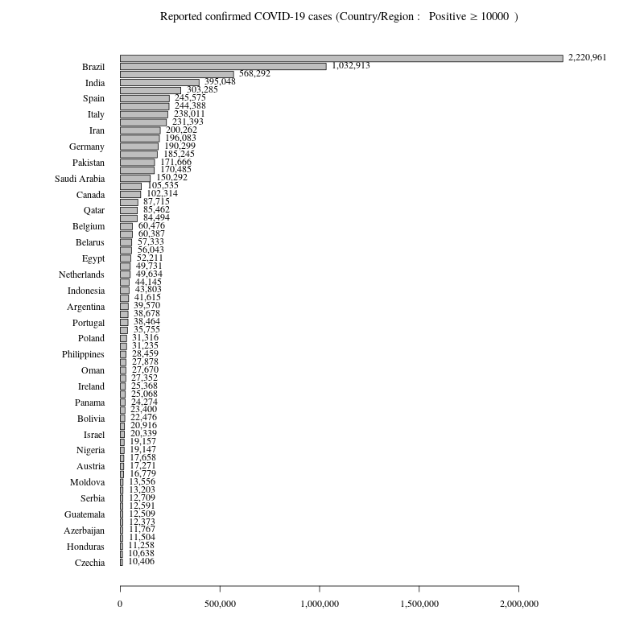
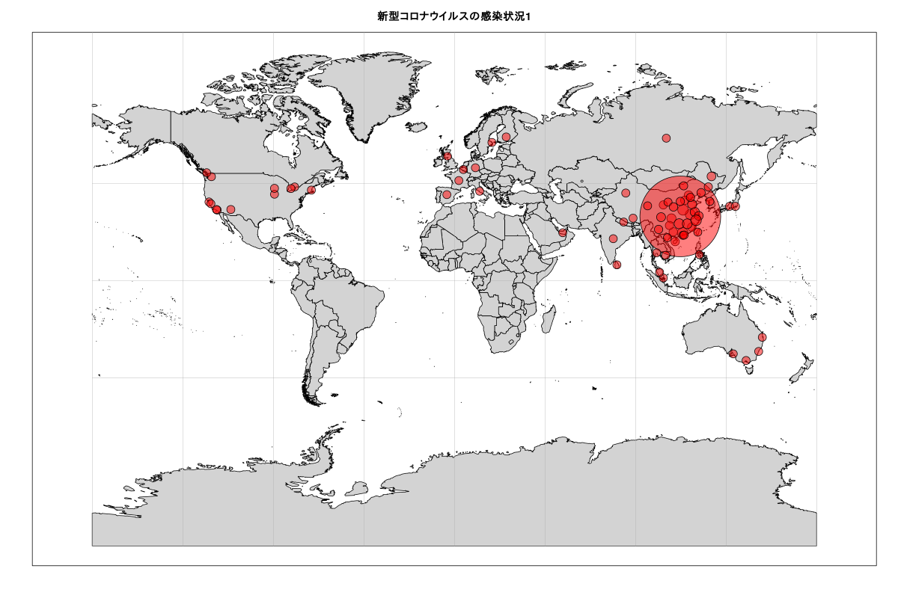

# RでGitHub01 (Coronavirus)  

公開データの場所がグーグルスプレッドシートからGitHubに移動したのでＲコードを書き直しました。

## 新型コロナウイルスの感染状況

米ジョンズ・ホプキンス大学の新型コロナウイルスの感染状況をまとめたWebサイト  
[Coronavirus 2019-nCoV Global Cases by Johns Hopkins CSSE](https://gisanddata.maps.arcgis.com/apps/opsdashboard/index.html#/bda7594740fd40299423467b48e9ecf6)

データはGitHubから入手できます。  
[Novel Coronavirus 2019 Time Series Data:https://github.com/CSSEGISandData/2019-nCoV/tree/master/time_series](https://github.com/CSSEGISandData/2019-nCoV/tree/master/time_series)


### 新型コロナウイルスに感染された方、回復された方、亡くなった方の数の推移（日別）
#### グラフ作成時間(日本時間2020年2月11日AM10:02)



### 新型コロナウイルスの感染状況
#### グラフ作成時間(日本時間2020年2月11日AM10:02)




[クルーズ船での新たな感染確認は65人 厚労省 2020年2月10日 23時07分](https://www3.nhk.or.jp/news/html/20200210/k10012279941000.html)  
このＮＨＫの記事によると  
（日本）国内で感染が確認されたのは
▽クルーズ船の135人、  
▽チャーター機の10人、  
▽それ以外の観光客などが16人の合わせて161人となっています。


YouTube:[去年4月に田村智子議員が質問した、国立感染症研究所の人員削減についての質問(公務員削減告発　感染症対策が弱体化)](https://www.youtube.com/watch?v=q9LTMiuq-tQ&feature=youtu.be)  

## Rコード

### パッケージの読み込み。データをGitHubから入手。(read.csvの際には、check.names=Fをつける)

```R
library(xts)
library(lubridate)
#
# read.csvの際には、check.names=Fをつける
url<- "https://raw.githubusercontent.com/CSSEGISandData/2019-nCoV/master/time_series/time_series_2019-ncov-Confirmed.csv"
Confirmed<- read.csv(url,check.names=F)
url<- "https://raw.githubusercontent.com/CSSEGISandData/2019-nCoV/master/time_series/time_series_2019-ncov-Recovered.csv"
Recovered<- read.csv(url,check.names=F)
url<- "https://raw.githubusercontent.com/CSSEGISandData/2019-nCoV/master/time_series/time_series_2019-ncov-Deaths.csv"
Deaths<- read.csv(url,check.names=F)
```

### 時間ごとのトータルデータを作成。
### 元データは１日に何度かデータを更新しているので、それを１日ごとのデータにまとめる。

```R
#lubridateパッケージを使うのが便利
t<-mdy_hm(colnames(Confirmed)[5:ncol(Confirmed)])
# 時間ごとのトータルデータを作成
d<-data.frame(t,Confirmed=as.vector(colSums(Confirmed[,5:ncol(Confirmed)],na.rm=T)))
# apply.daily関数を使いたいのでxtsオブジェクトにする。
d.xts <- read.zoo(data.frame(t,Confirmed=as.vector(colSums(Confirmed[,5:ncol(Confirmed)],na.rm=T))))
# 元データは１日に何度かデータを更新しているので、それを１日ごとのデータにまとめる。
nCoV<-data.frame(date=as.Date(index(apply.daily(d.xts,max))),Confirmed=as.vector(coredata(apply.daily(d.xts,max))))
#
t<-mdy_hm(colnames(Recovered)[5:ncol(Recovered)])
d<-data.frame(t,Recovered=as.vector(colSums(Recovered[,5:ncol(Recovered)],na.rm=T)))
d.xts <- read.zoo(data.frame(t,Recovered=as.vector(colSums(Recovered[,5:ncol(Recovered)],na.rm=T))))
# merge
nCoV<-merge(nCoV,data.frame(date=as.Date(index(apply.daily(d.xts,max))),Recovered=as.vector(coredata(apply.daily(d.xts,max)))))
#
t<-mdy_hm(colnames(Deaths)[5:ncol(Deaths)])
d<-data.frame(t,Deaths=as.vector(colSums(Deaths[,5:ncol(Deaths)],na.rm=T)))
d.xts <- read.zoo(data.frame(t,Deaths=as.vector(colSums(Deaths[,5:ncol(Deaths)],na.rm=T))))
nCoV<-merge(nCoV,data.frame(date=as.Date(index(apply.daily(d.xts,max))),Deaths=as.vector(coredata(apply.daily(d.xts,max)))))
```

### 感染者、回復された方、亡くなった方の数の推移（日別）

```R
# png("Coronavirus01_2.png",width=800,height=600)
par(mar=c(3,5,3,2))
matplot(nCoV[,2:4],type="o",col=1:3,lwd=1.5,lty=1:3,pch=16:18,las=1,xaxt="n",ylab="")
axis(1,at=1:nrow(nCoV), labels =gsub("2020-","",nCoV[,1] ))
legend("topleft", legend = colnames(nCoV[,2:4]),col=1:3,lwd=1.5,lty=1:3,pch=16:18,inset =c(0.02,0.03))
title("Coronavirus [ Total Confirmed,Total Recovered,Total Deaths ]")
# dev.off()
```

### 日本国内で感染が確認された数

```R
ConfirmedJ<- Confirmed[Confirmed$"Country/Region"=="Japan",5:ncol(Confirmed)]
t<-mdy_hm(colnames(ConfirmedJ))
# 欠損値を0に置き換える。
ConfirmedJ[is.na(ConfirmedJ)] <- 0
# apply.daily関数を使いたいのでxtsオブジェクトにする。
d.xts <- read.zoo(data.frame(t,as.numeric(ConfirmedJ)))
# 元データは１日に何度かデータを更新しているので、それを１日ごとのデータにまとめる。
nCoVJ<-data.frame(date=as.Date(index(apply.daily(d.xts,max))),ConfirmedJ=as.vector(coredata(apply.daily(d.xts,max))))
# Diamond Princess cruise ship
DP<- Confirmed[Confirmed$"Province/State"=="Diamond Princess cruise ship",5:ncol(Confirmed)]
# 欠損値を0に置き換える。
DP[is.na(DP)] <- 0
# apply.daily関数を使いたいのでxtsオブジェクトにする。
d.xts <- read.zoo(data.frame(t,as.numeric(DP)))
# 引数 by で，2 つのデータフレームを紐付けする。紐付けする列名（date）
nCoVJ<- merge(nCoVJ,data.frame(date=as.Date(index(apply.daily(d.xts,max))),DP=as.vector(coredata(apply.daily(d.xts,max)))),by="date")
# 感染者の推移（日本国内）
# png("Coronavirus04_2.png",width=800,height=600)
par(mar=c(3,5,3,2))
matplot(nCoVJ[,2:3],type="o",col=1:3,lwd=1.5,lty=1:3,pch=16:18,las=1,xaxt="n",ylab="")
axis(1,at=1:nrow(nCoV), labels =gsub("2020-","",nCoV[,1] ))
legend("topleft", legend = c("Japan","Diamond Princess"),col=1:2,lwd=1.5,lty=1:2,pch=16:17,inset =c(0.02,0.03))
title("Coronavirus [Confirmed in Japan]")
# dev.off()
```

### Diamond Princess cruise ship の場所が横浜になっていないので、直す。など

```R
# Diamond Princess cruise ship の場所が横浜になっていない。139.63800に直す。
Confirmed[Confirmed$"Province/State"=="Diamond Princess cruise ship",4]<- 139.638
# 重なってわかりにくいのでJapanの緯度、経度を変更する。
Confirmed[Confirmed$"Country/Region"=="Japan",3]<- 35.447227
Confirmed[Confirmed$"Country/Region"=="Japan",4]<- 136.756165
```

### 新型コロナウイルスの感染状況(世界)

```R
library(oce)
data(coastlineWorldFine, package="ocedata")
df<- Confirmed[,c(3,4,ncol(Confirmed))]
# 欠損値を0に置き換える。
df[is.na(df[,3])] <- 0
max.size=20
min.size=2
size <- ((df[,3]-min(df[,3]))/
    (max(df[,3])-min(df[,3]))*(max.size-min.size)
  +min.size)
# png("Coronavirus02_2.png",width=1200,height=800)
# ミラー図法
par(mar=c(3,3,3,2))
mapPlot(coastlineWorldFine, projection="+proj=mill", col='lightgray')
mapPoints(df$Long, df$Lat,pch=21,bg=rgb(1,0,0,alpha=0.5),col="black",cex=size)
title("新型コロナウイルスの感染状況1")
# dev.off()
```

### 新型コロナウイルスの感染状況(アジア：武漢周辺)

```R
library(oce)
data(coastlineWorldFine, package="ocedata")
#
# stackoverflow : Drawing a Circle with a Radius of a Defined Distance in a Map
# https://stackoverflow.com/questions/23071026/drawing-a-circle-with-a-radius-of-a-defined-distance-in-a-map
#
mapLonLat <- function(LonDec, LatDec, Km) {
    ER <- 6371 #Mean Earth radius in kilometers. Change this to 3959 and you will have your function working in miles.
    AngDeg <- seq(1:360) #angles in degrees 
    Lat1Rad <- LatDec*(pi/180)#Latitude of the center of the circle in radians
    Lon1Rad <- LonDec*(pi/180)#Longitude of the center of the circle in radians
    AngRad <- AngDeg*(pi/180)#angles in radians
    Lat2Rad <-asin(sin(Lat1Rad)*cos(Km/ER)+cos(Lat1Rad)*sin(Km/ER)*cos(AngRad)) #Latitude of each point of the circle rearding to angle in radians
    Lon2Rad <- Lon1Rad+atan2(sin(AngRad)*sin(Km/ER)*cos(Lat1Rad),cos(Km/ER)-sin(Lat1Rad)*sin(Lat2Rad))#Longitude of each point of the circle rearding to angle in radians
    Lat2Deg <- Lat2Rad*(180/pi)#Latitude of each point of the circle rearding to angle in degrees (conversion of radians to degrees deg = rad*(180/pi) )
    Lon2Deg <- Lon2Rad*(180/pi)#Longitude of each point of the circle rearding to angle in degrees (conversion of radians to degrees deg = rad*(180/pi) )
    return(data.frame(Lon2Deg,Lat2Deg))
}
#
df<- Confirmed[,c(3,4,ncol(Confirmed))]
# 欠損値を0に置き換える。
df[is.na(df[,3])] <- 0
Number_of_people<-c(0,1,10,50,100,1000,10000,100000)
size<-c(0,1,2,3,4,8,16)
# cut関数 なに以上なになに未満となるようにright = F
size<- as.vector(cut(df[,3], breaks=Number_of_people, labels = size, right = F))
#
lonlat<- c(112.27070, 30.97564)
LonDec<- lonlat[1]
LatDec<- lonlat[2]
Km<- 2000
LonLat<- mapLonLat(LonDec, LatDec, Km)
par(mar=c(2, 2, 3, 2))
lonlim <- range(LonLat[,1])
latlim <- range(LonLat[,2])
#
# 正距方位図法  azimuthal equidistant projection
aeqd_proj <- paste("+proj=aeqd +lon_0=",lonlat[1]," +lat_0=",lonlat[2])
#
# png("Coronavirus03_2.png",width=1200,height=800)
par(mar=c(3,3,3,2))
mapPlot(coastlineWorldFine, projection=aeqd_proj ,
        col="lightgray", longitudelim=lonlim, latitudelim=latlim)
mapPoints(df$Long, df$Lat,pch=21,bg=rgb(1,0,0,alpha=0.7),col="black",cex=as.numeric(size))
title("新型コロナウイルスの感染状況2")
legend("bottomright",legend=c("[1 10)","[10 50)","[50 100)","[100 1000)","[1000 10000)","[10000 100000)"),
	pch=21,pt.cex =c(1,2,3,4,8,16),col="black",pt.bg="red",inset=c(0.01,0.01),x.intersp=5,y.intersp=4.7,bty="n" )
# dev.off()
```

