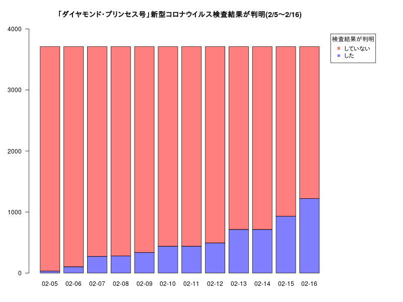
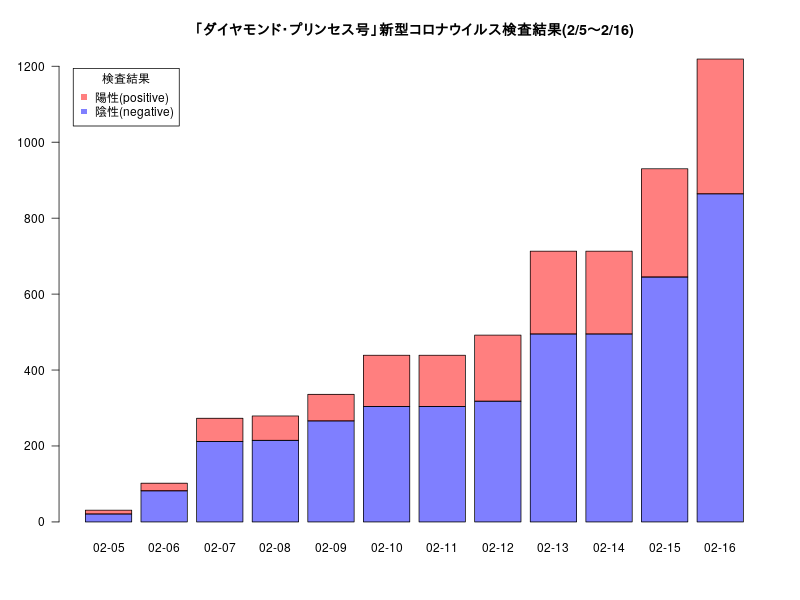

# Rで棒グラフ01 (Coronavirus in Japan)

厚生労働省 報道発表資料を元に「ダイヤモンド・プリンセス号」の
- 「乗員・乗客」の総数とコロナウィルスの検査結果が判明した人数
-  コロナウィルスの検査結果が判明した人数の内訳（"陰性(negative)" or "陽性(positive)"）  
を棒グラフにしました。

(参考)  
[香港男性以外からも感染か　新型肺炎、クルーズ船内で](https://www.nikkei.com/article/DGXMZO55302210V00C20A2CC1000/)  

- 厚生労働省などによると、クルーズ船は乗員1045人、乗客2666人。  
- 56の国・地域の人々がおり、乗客のうち日本人は1281人

[厚生労働省 報道発表資料　2020年2月](https://www.mhlw.go.jp/stf/houdou/houdou_list_202002.html)  
クルーズ船「ダイヤモンド・プリンセス号」  
- 2月3日に横浜港に到着
- 令和2年2月05日（水）  
検査結果が判明した31名のうち、10人については、新型コロナウイルス検査の陽性が確認された  
- 新型コロナウイルス感染症の現在の状況と厚生労働省の対応について（令和２年２月６日版）  
新たに７１人のうち１０人について新型コロナウイルス検査の陽性が確認された  
陽性が確認されたのは、２月５日と合わせて１０２人中２０人  
- 令和2年2月07日（金）  
新型コロナウイルスに関する検査結果が判明した171名のうち41名について、新型コロナウイルスの陽性が確認された  
陽性が確認されたのは、合わせて273名中61名  
- 令和2年2月08日（土）  
検査結果が判明した６名のうち、３名について新型コロナウイルスの陽性が確認  
陽性が確認されたのは、合わせて279名中64名  
- 令和2年2月09日（日）
検査結果が判明した５７名のうち、６名について新型コロナウイルスの陽性が確認  
陽性が確認されたのは、延べ３３６名の検査中７０名  
- 令和2年2月10日（月）   
検査結果が判明した１０３名のうち、６５名について新型コロナウイルスの陽性が確認  
陽性が確認されたのは、延べ４３９名の検査中１３５名  
- 令和2年2月12日（水）  
検査結果が判明した５３名のうち、３９名について新型コロナウイルスの陽性が確認  
陽性が確認されたのは、延べ４９２名の検査中１７４名  
- [ クルーズ船 新たに44人の新型ウイルス感染確認 計218人に 2020年2月13日 13時41分](https://www3.nhk.or.jp/news/html/20200213/k10012283591000.html)
新たに221人の検査を実施した結果、合わせて44人が新型コロナウイルスに感染。  
感染が確認された乗客と乗員は合わせて218人  
- 令和2年2月15日（土）
２１７名のうち、６７名（うち無症状病原体保有者３８名）について新型コロナウイルスの陽性が確認  
延べ９３０名の検査中２８５名（うち無症状病原体保有者延べ７３名）
- 令和2年2月16日（日）
２８９名のうち、７０名（うち無症状病原体保有者３８名）について新型コロナウイルスの陽性が確認  
延べ１,２１９名の検査中３５５名（うち無症状病原体保有者延べ１１１名）  

### 香港の対応（日本との比較）
[香港に足止めのクルーズ船に下船許可 乗員のウイルス検査後 2020年2月10日 7:06　発信地：香港/中国 ](https://www.afpbb.com/articles/-/3267486)  
- 5日間にわたり足止め  
- クルーズ船の乗員1800人のウイルス検査結果が陰性となったので、クルーズ船に下船許可。
#### つまり、香港は「5日間で1800人のウイルス検査を行った」

### 乗客・乗員のうち「ダイヤモンド・プリンセス号」新型コロナウイルス検査結果が判明した割合(2/5〜2/16)



#### 日本は「12日間で延べ1219人」の検査結果が判明。

### 「ダイヤモンド・プリンセス号」新型コロナウイルス検査結果(2/5〜2/16)



## Rコード

### 乗客・乗員のうち「ダイヤモンド・プリンセス号」新型コロナウイルス検査結果が判明した割合(2/5〜2/13)

```R
d <- seq(as.Date("2020/02/05"), as.Date("2020/02/16"), "days")
Test<- c(31,102,273,279,336,439,439,492,713,713,930,1219)
Positive<- c(10,20,61,64,70,135,135,174,218,218,285,355)
# 1045+2666 乗客乗員合わせて、3711
mat<-rbind(Test , 3711-Test)
# png("dp02_2.png",width=800,height=600)
par(mar=c(4,4,4,10))
barplot(mat,names.arg=substring(d,6,10),col=c(rgb(0,0,1,0.5),rgb(1,0,0,0.5)),las=1,ylim=c(0,4000))
legend("topright",legend=rev(c("した","していない")),pch=15,col=rev(c(rgb(0,0,1,0.5),rgb(1,0,0,0.5))),
	title="検査結果が判明",inset=c(-0.15,0.02),xpd=T)
title("「ダイヤモンド・プリンセス号」新型コロナウイルス検査結果が判明(2/5〜2/16)")
# dev.off()
```

### 「ダイヤモンド・プリンセス号」新型コロナウイルス検査結果(2/5〜2/13)

```R
# 陰性 = Test-Positive
mat<-rbind(Test-Positive , Positive)
# png("dp01_2.png",width=800,height=600)
barplot(mat,names.arg=substring(d,6,10),col=c(rgb(0,0,1,0.5),rgb(1,0,0,0.5)),las=1)
legend("topleft",legend=rev(c("陰性(negative)","陽性(positive)")),pch=15,col=rev(c(rgb(0,0,1,0.5),rgb(1,0,0,0.5))),title="検査結果",inset=0.02)
title("「ダイヤモンド・プリンセス号」新型コロナウイルス検査結果(2/5〜2/16)")
# dev.off()
```

