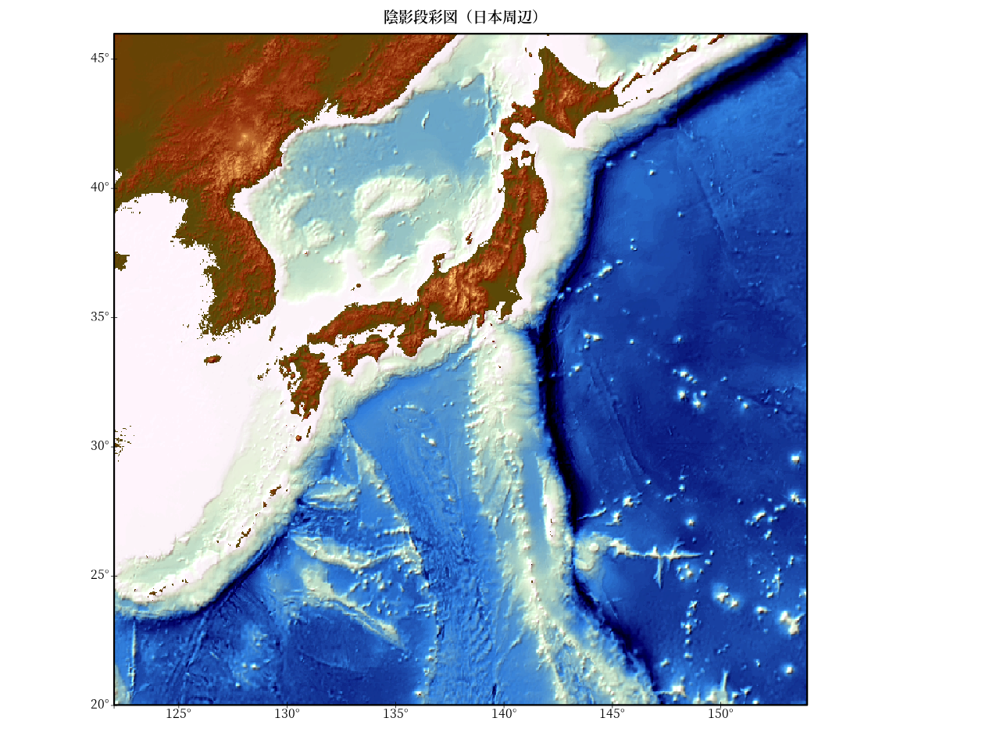

# Rで陰影段彩図03（陸地＋海洋）

(参考)  
GMT Tutorial  
[陰影図の光源を指定する](http://hydro.iis.u-tokyo.ac.jp/~agata/archive/GMT334/doc/html/tutorial/node70.html)

(立体地形データ)  
ETOPO : 米国地球物理データセンターが提供しているグローバル地形データセット。  
marmap::getNOAA.bathy関数でデータをダウンロード。(keep=TRUE)  
marmap::read.bathyで読み込む。    
marmap::as.rasterでラスターデータに変換。  

## 準備（データをダウンロードする場合のみ実行する。）

### marmap::getNOAA.bathy関数でデータをダウンロード。(keep=TRUE) 

```R
library(marmap)
axes1<-seq(125,150,5)
axes2<-seq(20,45,5)
#日本周辺のETOPOデータをkeep=TRUEで保存しておく。read.bathy関数でデータを読み込む。
#read.bathy("marmap_coord_122;20;154;46_res_1.csv", header=TRUE)
#read.bathy("marmap_coord_122;20;154;46_res_2.csv", header=TRUE)
#resolution=1
dat<-getNOAA.bathy(Lon.range[1],Lon.range[2],Lat.range[1],Lat.range[2],res=1,keep=TRUE)
#resolution=2
dat<-getNOAA.bathy(Lon.range[1],Lon.range[2],Lat.range[1],Lat.range[2],res=2,keep=TRUE)
```

## 陰影段彩図（日本周辺）


## Rコード

### パッケージの読み込み。データ処理。
＊ 配色はGMTのカラーパレット“relief”を参考にした。

```R
library(raster)
library(rgdal)
library(marmap)
library(zoo)
Lon.range = c(122, 154)
Lat.range = c(20, 46)
#
axes1<-seq(125,150,5)
axes2<-seq(20,45,5)
#dat<-getNOAA.bathy(Lon.range[1],Lon.range[2],Lat.range[1],Lat.range[2],res=1,keep=TRUE)
#
dat<-read.bathy("marmap_coord_122;20;154;46_res_2.csv", header=TRUE)
r1<-marmap::as.raster(dat)
#配色はGMTのカラーパレット“relief”を参考にした。
ocean<-colorRampPalette(c("#000000", "#000413", "#000728", "#002650", "#005E8C", 
                          "#0096C8", "#45BCBB", "#8AE2AE", "#BCF8B9" , "#DBFBDC"))
#
land1 <- colorRampPalette(c("#467832","#786432"))
land2 <- colorRampPalette(c("#786433","#927E3C"))
land3 <- colorRampPalette(c("#927E3D","#C6B250"))
land4 <- colorRampPalette(c("#C6B251","#FAE664"))
land5 <- colorRampPalette(c("#FAE665","#FAEA7E"))
breakpoints <- c(seq(-11000,0,100),1,seq(50,500,50),seq(550,1000,50),seq(1100,2000,100),seq(2100,3000,100),seq(3500,9000,500))
colors <- c(ocean(110),land1(11),land2(10),land3(10),land4(10),land5(12))
slope <- terrain(r1, opt='slope')
aspect <- terrain(r1, opt='aspect')
hill <- hillShade(slope, aspect,45,315) 
#欠損値の個数
sum(is.na(values(hill)))
#
m <- matrix(1, ncol=5, nrow=5)
hill <- focal(hill, m, fun="mean", na.rm=TRUE, NAonly=TRUE, pad=TRUE) 
sum(is.na(values(hill)))
#
## 彩色
v<-getValues(r1)
#欠損値の個数
sum(is.na(v))
#欠損値があった場合
#直前の値を入れる
#v<-na.locf(v) #zoo package
#平均値を入れる
#v[is.na(v)] <- mean(v,na.rm=T)
#0を入れる
#v[is.na(v)] <- 0
#duplicated(colors)
#colors[!duplicated(colors)]
#length(unique(colors))
#
v<-as.vector(cut(v, breaks=breakpoints, labels = colors, right = F))
v1<-rgb2hsv(col2rgb(v))
#
## 陰影
x<-getValues(hill)
#欠損値の個数
#sum(is.na(x))
#x[is.na(x)] <- mean(x,na.rm=T)
#
#最小値を m、最大値を Mにする正規化
m<-0 ; M<-max(v1[3,])
x<-(M-m)*((x-min(x))/(max(x)-min(x)))+m
#
h<-NULL
for ( i in 1:length(x)){
  h[i]<-gray(x[i])
}
#h
h1<-rgb2hsv(col2rgb(h))
#
d1<-NULL
d1<-(v1+h1)/2
d1[1,]<-v1[1,]
#
g<-c(col2rgb(hsv(d1[1,],d1[2,],d1[3,]))[1,],
     col2rgb(hsv(d1[1,],d1[2,],d1[3,]))[2,],
     col2rgb(hsv(d1[1,],d1[2,],d1[3,]))[3,] )
s<-NULL
r<-r1
s <- stack(r, r, r)
#nlayers(s)
values(s)<-g
```

### 作図（今回はshowtextパッケージを使用。）  
（注意）font_add_google関数を使っているので、インターネットに接続している必要あり。


```R
library(showtext)
#https://fonts.google.com/
font_add_google("Noto Serif JP", regular.wt = 400, bold.wt = 600)
#png("Japan01.png",width=1280,height=960)
par(family="Noto Serif JP")
showtext_begin()
par(mar=c(4,1,3,8), xaxt="n", yaxt="n")
plotRGB(s,stretch='lin',axes=TRUE)
par(xpd=T)
rect(extent(s)[1],extent(s)[3],extent(s)[2],extent(s)[4],
     lwd=3)
text(axes1,extent(s)[3],paste0(as.character(axes1),"°"),pos=1)
text(extent(s)[1],axes2,paste0(as.character(axes2),"°"),pos=2)
points(x=axes1,y=rep(extent(s)[3],length(axes1)),cex=1,pch=3)
points(x=rep(extent(s)[1],length(axes2)),y=axes2,cex=1,pch=3)
title("陰影段彩図（日本周辺）")
showtext_end()
#dev.off()
```


