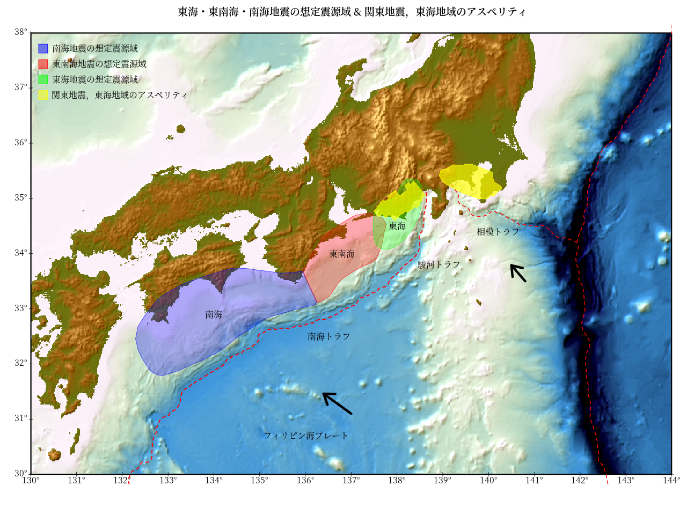

# Rで陰影段彩図05（陸地＋海洋）

(参考)  
GMT Tutorial  
[陰影図の光源を指定する](http://hydro.iis.u-tokyo.ac.jp/~agata/archive/GMT334/doc/html/tutorial/node70.html)

(立体地形データ)  
ETOPO : 米国地球物理データセンターが提供しているグローバル地形データセット。  
marmap::getNOAA.bathy関数でデータをダウンロード。(keep=TRUE)  
marmap::read.bathyで読み込む。    
marmap::as.rasterでラスターデータに変換。  

## 準備（データをダウンロードする場合のみ実行する。）

### marmap::getNOAA.bathy関数でデータをダウンロード。(keep=TRUE) 

```R
library(marmap)
axes1<-seq(125,150,5)
axes2<-seq(20,45,5)
#日本周辺のETOPOデータをkeep=TRUEで保存しておく。read.bathy関数でデータを読み込む。
#read.bathy("marmap_coord_122;20;154;46_res_1.csv", header=TRUE)
#read.bathy("marmap_coord_122;20;154;46_res_2.csv", header=TRUE)
#resolution=1
dat<-getNOAA.bathy(Lon.range[1],Lon.range[2],Lat.range[1],Lat.range[2],res=1,keep=TRUE)
#resolution=2
dat<-getNOAA.bathy(Lon.range[1],Lon.range[2],Lat.range[1],Lat.range[2],res=2,keep=TRUE)
```

### 東海・東南海・南海地震の想定震源域のデータをダウンロード
Fuyuki Hirose's HP[プレート形状の数値データ] : http://www.mri-jma.go.jp/Dep/st/member/fhirose/ja/PlateData.html  
plate_data.tar.gz [331 KB]をダウンロード。解凍。「mapdata」フォルダを作業フォルダ内に配置。    
今回使用するデータは「mapdata」フォルダに入っている  
- 「trench.dat」
- 「nankai.region」
- 「tokai.region」
- 「tonankai.region」
- 「kanto_eq.dat」
- 「tokai_asperity.data」。


## 陰影段彩図＋東海・東南海・南海地震の想定震源域


## Rコード

### パッケージの読み込み。データ処理。
＊ 配色はGMTのカラーパレット“relief”を参考にした。

上記のRコードで保存した「marmap_coord_122;20;154;46_res_1.csv」を読み込み、rasterデータに変換したものを切り出します。


```R
library(raster)
library(rgdal)
library(marmap)
library(geosphere)
library(zoo)
#使用する領域をgetNOAA.bathy関数で読み込む場合
#Lon.range = c(130, 144)
#Lat.range = c(30, 38)
#dat<-getNOAA.bathy(Lon.range[1],Lon.range[2],Lat.range[1],Lat.range[2],res=1,keep=TRUE)
#
#「marmap_coord_122;20;154;46_res_1.csv」を読み込み使用する場合（今回はこっち）
dat<-read.bathy("marmap_coord_122;20;154;46_res_1.csv", header=TRUE)
#
map<-marmap::as.raster(dat)
#
Lon.range = c(130, 144)
Lat.range = c(30, 38)
#
axes1<-seq(130,144,1)
axes2<-seq(30,38,1)
#
#必要な部分を切り出し
Crop <- c(Lon.range[1],Lon.range[2],Lat.range[1],Lat.range[2])
r1 <- crop(map,Crop)
#配色はGMTのカラーパレット“relief”を参考にした
ocean<-colorRampPalette(c("#000000", "#000413", "#000728", "#002650", "#005E8C", 
                          "#0096C8", "#45BCBB", "#8AE2AE", "#BCF8B9" , "#DBFBDC"))
#
land1 <- colorRampPalette(c("#467832","#786432"))
land2 <- colorRampPalette(c("#786433","#927E3C"))
land3 <- colorRampPalette(c("#927E3D","#C6B250"))
land4 <- colorRampPalette(c("#C6B251","#FAE664"))
land5 <- colorRampPalette(c("#FAE665","#FAEA7E"))
breakpoints <- c(seq(-11000,0,100),1,seq(50,500,50),seq(550,1000,50),seq(1100,2000,100),seq(2100,3000,100),seq(3500,9000,500))
colors <- c(ocean(110),land1(11),land2(10),land3(10),land4(10),land5(12))
slope <- terrain(r1, opt='slope')
aspect <- terrain(r1, opt='aspect')
hill <- hillShade(slope, aspect,45,315) #,normalize=T
#
## 彩色
v<-getValues(r1)
#欠損値の個数
sum(is.na(v))
#欠損値があった場合
#直前の値を入れる
#v<-na.locf(v) #zoo package
#平均値を入れる
#v[is.na(v)] <- mean(v,na.rm=T)
#0を入れる
#v[is.na(v)] <- 0
v<-as.vector(cut(v, breaks=breakpoints, labels = colors, right = F))
v1<-rgb2hsv(col2rgb(v))
## 陰影
x<-getValues(hill)
#欠損値の個数
sum(is.na(x))
x[is.na(x)] <- mean(x,na.rm=T)
#
#最小値を m、最大値を Mにする正規化
m<-0 ; M<-max(v1[3,])
x<-(M-m)*((x-min(x))/(max(x)-min(x)))+m
#
h<-NULL
for ( i in 1:length(x)){
  h[i]<-gray(x[i])
}
#h
h1<-rgb2hsv(col2rgb(h))
#
d1<-NULL
d1<-(v1+h1)/2
d1[1,]<-v1[1,]
#
g<-c(col2rgb(hsv(d1[1,],d1[2,],d1[3,]))[1,],
     col2rgb(hsv(d1[1,],d1[2,],d1[3,]))[2,],
     col2rgb(hsv(d1[1,],d1[2,],d1[3,]))[3,] )
s<-NULL
r<-r1
s <- stack(r, r, r)
values(s)<-g
```

### 想定震源域，アスペリティ等のデータを読み込み、編集。
データの書式が各々異なるので、読み込みには工夫が必要。    
データの書式を直接編集したほうが読み込みは容易になる。

```R
#トラフ等データ読み込み（一番面倒）
lines = readLines("./mapdata/trench.dat")
head(lines)
lines=gsub("  *",",",gsub("^ ", "",gsub("  *$", "",lines) ) )
f = file("out.txt", "w")
for (line in lines) {
  cat(line, "\n", sep="", file=f)  # ファイルに書き出す
}
trench=read.csv("./out.txt", header=F, col.names=c("latitude","longitude"),stringsAsFactors=F )
trench<-trench[,c(2,1)]
#num<-as.numeric(rownames(subset(trench, latitude==">")))
num<-grep(">", trench$latitude)
trench1<-trench[1:num[1]-1,]
trench2<-trench[num[1]+1:num[2]-1,]
trench3<-trench[num[2]+1:nrow(trench),]
system("rm ./out.txt")
#
nankai=read.table("./mapdata/nankai.region",h=F)
names(nankai)<-c("latitude","longitude")
#
tokai=read.table("./mapdata/tokai.region",h=F)
names(tokai)<-c("latitude","longitude")
#
tonankai=read.table("./mapdata/tonankai.region",h=F)
names(tonankai)<-c("latitude","longitude")
#
trough<-data.frame(names=c("駿河トラフ","相模トラフ","南海トラフ","フィリピン海プレート","東海","東南海","南海"),
                   longitude=c(138.9,140.2,136.5,136,138,136.8,134),latitude=c(33.8,34.4,32.5,30.7,34.5,34,32.9))
#
# Asperities
# Kanto (Wald and Somerville, 1995, BSSA)
kasp=read.table("./mapdata/kanto_eq.dat",h=F,skip=1)
names(kasp)<-c("longitude","latitude")
#
# Tokai (Matsumura, 1997, Tectono.)
tasp=read.table("./mapdata/tokai_asperity.data",h=F)
names(tasp)<-c("latitude","longitude")
#
arrow1<-destPointRhumb(c(140.8,33.5),90-131, 63750/3*2)
arrow2<-destPointRhumb(c(137,31.1),90-145, 105000/3*2)
```

### 作図（今回もshowtextパッケージを使用。）  
（注意）font_add_google関数を使っているので、インターネットに接続している必要あり。


```R
library(showtext)
#https://fonts.google.com/
font_add_google("Noto Serif JP", regular.wt = 400, bold.wt = 600)
#png("Nankai01.png",width=1280,height=960)
par(family="Noto Serif JP")
showtext_begin()
par(mar=c(4,4,3,2), xaxt="n", yaxt="n")
plotRGB(s,stretch='lin',axes=TRUE)
par(xpd=T)
rect(extent(s)[1],extent(s)[3],extent(s)[2],extent(s)[4],
     lwd=3)
text(axes1,extent(s)[3],paste0(as.character(axes1),"°"),pos=1)
text(extent(s)[1],axes2,paste0(as.character(axes2),"°"),pos=2)
points(x=axes1,y=rep(extent(s)[3],length(axes1)),cex=1,pch=3)
points(x=rep(extent(s)[1],length(axes2)),y=axes2,cex=1,pch=3)
par(xpd=F)
#
lines(x=trench1$longitude, y = trench1$latitude,col="red",lty=2,lwd=2)
lines(x=trench2$longitude, y = trench2$latitude,col="red",lty=2,lwd=2)
lines(x=trench3$longitude, y = trench3$latitude,col="red",lty=2,lwd=2)
#
polygon(x=nankai$longitude, y = nankai$latitude, col=rgb(0,0,1,0.3),border=rgb(0,0,1,0.8))
#
polygon(x=tonankai$longitude, y = tonankai$latitude,col=rgb(1,0,0,0.3),border=rgb(1,0,0,0.8))
#
polygon(x=tokai$longitude, y = tokai$latitude, col=rgb(0,1,0,0.3),border=rgb(0,1,0,0.8))
#
polygon(x=kasp$longitude, y = kasp$latitude,col=rgb(1,1,0,0.8),border=rgb(1,1,0,1),angle=90,density=100)
polygon(x=tasp$longitude, y = tasp$latitude,col=rgb(1,1,0,0.8),border=rgb(1,1,0,1),angle=90,density=100)
#
text(x = trough$longitude, y = trough$latitude,labels =trough$names)
#
arrows(140.8,33.5,arrow1[1],arrow1[2],angle = 35, length = 0.3, code = 2,lwd=6) 
arrows(137,31.1,arrow2[1],arrow2[2],angle = 35, length = 0.3, code = 2,lwd=6)
title("東海・東南海・南海地震の想定震源域 & 関東地震，東海地域のアスペリティ")
legend("topleft",
       legend = c("南海地震の想定震源域",
                  "東南海地震の想定震源域",
                  "東海地震の想定震源域",
                  "関東地震，東海地域のアスペリティ"), 
       cex=1,pch=22,col=c(rgb(0,0,1,1),rgb(1,0,0,1),rgb(0,1,0,1),rgb(1,1,0,1)),pt.bg=c(rgb(0,0,1,0.5),rgb(1,0,0,0.5),rgb(0,1,0,0.5),rgb(1,1,0,0.5)),
       pt.cex =3.5,bty = "n",x.intersp = 1.5, y.intersp =2, inset = c(0.01, 0.03))
showtext_end()
#dev.off()
```
