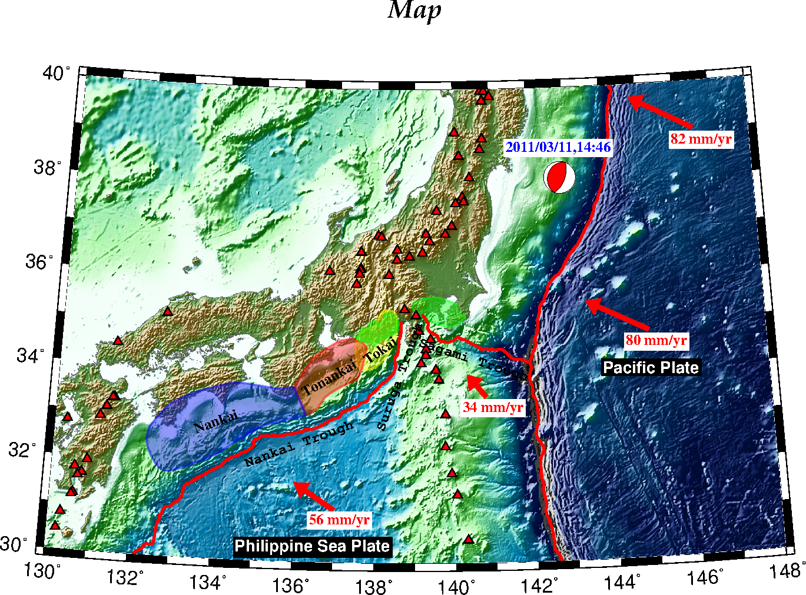
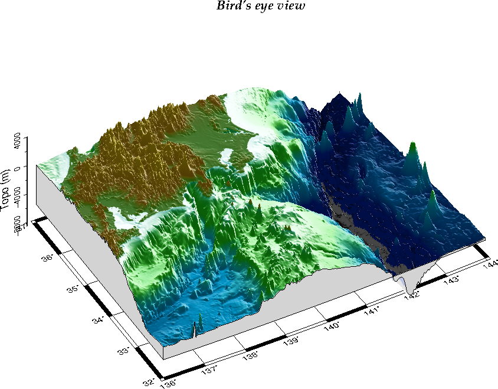

# GMT(Version 5.4.5)で陰影段彩図

(立体地形データ)  
[SRTM30_PLUS(EXTRACT XYZ GRID OF TOPOGRAPHY)](https://topex.ucsd.edu/cgi-bin/get_srtm30.cgi)

## 準備

[SRTM30_PLUS(EXTRACT XYZ GRID OF TOPOGRAPHY)](https://topex.ucsd.edu/cgi-bin/get_srtm30.cgi)からXYZ Dataを入手。 
今回は、130 west east 150 , 30 north south 40 と指定。作業フォルダ内に配置。データ名は、srtm130_150_30_40.txtとしました。  

cptファイルは、[GMT_relief.cpt](https://raw.githubusercontent.com/kakearney/cptcmap-pkg/master/cptcmap/cptfiles/GMT_relief.cpt)を使用。作業フォルダ内に配置。

東海・東南海・南海地震の想定震源域のデータをダウンロード
Fuyuki Hirose's HP[プレート形状の数値データ] : http://www.mri-jma.go.jp/Dep/st/member/fhirose/ja/PlateData.html  
plate_data.tar.gz [331 KB]をダウンロード。解凍。「mapdata」フォルダを作業フォルダ内に配置。    
今回使用するデータは「mapdata」フォルダに入っている  
- 「trench.dat」
- 「nankai.region」
- 「tokai.region」
- 「tonankai.region」
- 「kanto_eq.dat」
- 「tokai_asperity.data」
- 「voldata.dat」
- 「contour_map_PAC.gmt」の矢印

## GMT(Version 5.4.5)で陰影段彩図:正角円錐図法


## GMT(Version 5.4.5)で鳥瞰図


## GMT(Version 5.4.5)コード

### GMT(Version 5.4.5)で陰影段彩図

```GMT5.4.5
#
########## GMT - The Generic Mapping Tools, Version 5.4.5 ##########
#
#! /bin/bash # this line depends on your system
# parameter setting
# $infile : 地図作成に使用するファイル
infile=srtm130_150_30_40.txt
# $region:描画範囲
region=130/148/30/40
# $psfile:出力(地図)ファイル
#メルカトル図法
#psfile=srtm130_148_30_40M.ps
#正角円錐図法
psfile=srtm130_148_30_40L.ps
# $grdfile: grdファイル名
grdfile=srtm30.grd
# $intfile: intファイル名
intfile=srtm30.int
# $cptfile:カラーパレット(色設定)
cptfile=GMT_relief.cpt
# $proj:プロジェクション・サイズ
#メルカトル図法
#proj=M16
#正角円錐図法 : 地図の中心の経度，緯度， 標準緯線の緯度2つを指定
#-JL(lon1+lon2)*0.5/0.5*((lat1+lat2)-1)/lat1-3/lat2+3/size
#region=136/144/32/37 -> -JL140/34/29/40/16   -JL(lon1+lon2)*0.5/0.5*((lat1+lat2)-1)/lat1-3/lat2+3/size
proj=L139/34.5/27/43/16
# $WESN : 目盛をつける場所・図のタイトル
WESN=WeSn+t"Map"
# $xframe,yframe
#数字(s)は2間隔、ティックマーク(f)は1間隔、グリッド(g)はなし
xframe=a2f1
yframe=a2f1
#
# 図のタイトルを書くときの文字のフォント、大きさ、色を
gmt set FONT_TITLE       16p,32,black
#
########## 描画の準備（パラメータの変更がない限り一度実行すれば良い） ##########
#
#スプライン補間を用いてグリッディング（grdfileの作成）
gmt surface $infile -I30s -T0 -G$grdfile -R130/148/30/40
#入力データの勾配を計算して、陰影のデータを作る（intfileの作成）
#-A : 光源の方位（北から時計回りに角度で示す）
#-N : 正規化のファクター 
gmt grdgradient $grdfile -A315 -G$intfile -Ne0.9
#
########## 描画１（陰影段彩図の作成） ##########
#
gmt psbasemap -R$region -J$proj -B$WESN -Bx$xframe -By$yframe -K > $psfile
#陰影図を描く
gmt grdimage $grdfile  -I$intfile -R$region -J$proj -C$cptfile -K -O >> $psfile
gmt pscoast -R$region -J$proj -Dh -Wthinnest,gray40 -K -O >> $psfile
#gmt psconvert $psfile -Tg -A -E200
#
########## 描画２（trenchデータ等の読み込みと描画） ##########
#
trench=./mapdata/trench.dat
tokai=./mapdata/tokai.region
tonankai=./mapdata/tonankai.region
nankai=./mapdata/nankai.region
tasp=./mapdata/tokai_asperity.data
kasp=./mapdata/kanto_eq.dat
volcano=./mapdata/voldata.dat
#
# Anticipated source region（透過色を使う）
#To explicitly close polygons, use -L
# -: y（緯度）、x（経度）の順番で与える
# -i : とり出したい列から1引いたもので、とり出す列を指定( -: と -i1,0 は同じこと）
gmt psxy -J$proj -R$region $tokai  -i1,0 -L -Gyellow -t60 -Wthick,yellow -K -O >> $psfile
gmt psxy -J$proj -R$region $tonankai  -i1,0 -L -Gred -t60 -Wthick,red -K -O >> $psfile
gmt psxy -J$proj -R$region $nankai  -i1,0 -L -Gblue -t60 -Wthick,blue -K -O >> $psfile
#
# Asperities（透過色を使う）
# Kanto (Wald and Somerville, 1995, BSSA)
gmt psxy -J$proj -R$region $kasp -L -Ggreen -t60 -Wthick,green -K -O >> $psfile
# Tokai (Matsumura, 1997, Tectono.)
gmt psxy -J$proj -R$region $tasp -i1,0 -L -Ggreen -t60 -Wthick,green -K -O >> $psfile
#
# Trench(-Mパラメータは必要なし）
gmt psxy -J$proj -R$region $trench -i1,0 -Wthicker,red -K -O >> $psfile
#
# Volcano
gmt psxy -J$proj -R$region $volcano -i1,0 -ST0.15 -Gred -Wthinner,black -K -O >> $psfile
#
#gmt psconvert $psfile -Tg -A -E200
#
########## 描画３（テキストを書き込む） ########## 
#
# 古い書き方でも描画はされるが警告がでる
# 古い書き方 : x  y size angle fontno justify text
# 新しい方法 : -Fパラメータに取り込む順序 : -F+j+a+f  （[x,y],justify,angle,fontno,[text]）
#   fontnoは、フォントサイズ、フォント名もしくはフォント番号、色（例：10p,Helvetica,red）
#
# 9p,9,black
gmt pstext  -R$region -J$proj -F+j+a+f -O -K <<EOF >> $psfile
138.6 33.95 MC  70 9p,9,black Suruga Trough
140.5 34.3  MC -18 9p,9,black Sagami Trough
136.1 32.5  MC  20 9p,9,black Nankai Trough
138.1 34.5  MC  35 9p,5,black Tokai
136.8 33.9  MC  30 9p,5,black Tonankai
134   32.9  MC  20 9p,5,black Nankai
EOF
#
# -Gblack と　10p,1,white　で白抜き文字
gmt pstext  -R$region -J$proj -F+j+a+f -Gblack -O -K <<EOF >> $psfile
136.5 30.35 MC   0 10p,1,white Philippine Sea Plate
145   34    MC   0 10p,1,white Pacific Plate
EOF
#
########## 描画４（矢印、テキストを書き込む） ########## 
#
# Arrow (Wei & Seno, 1998, Geodynam. Series ed. by M. Flower et al., 27, 337-346)
gmt psxy  -R$region -J$proj -Sv0.1/0.3/0.2 -Gred -O -K <<EOF >> $psfile
 140.8 33.5 131 0.6375
EOF
gmt pstext  -R$region -J$proj -F+j+a+f -Gwhite -O -K <<EOF >> $psfile
 140.2 33.3 ML 0 9p,5,red 34 mm/yr
EOF
#
gmt psxy  -R$region -J$proj -Sv0.1/0.3/0.2 -Gred -O -K <<EOF >> $psfile
 137 31.1 145 1.05
EOF
gmt pstext  -R$region -J$proj -F+j+a+f -Gwhite -O -K <<EOF >> $psfile
 136.4 30.9 ML 0 9p,5,red 56 mm/yr
EOF
#
gmt psxy  -R$region -J$proj -Sv0.1/0.3/0.2 -Gred -N -O -K <<EOF >> $psfile
 145 34.8 156 1.5
EOF
gmt pstext  -R$region -J$proj -N -F+j+a+f -Gwhite -O -K <<EOF >> $psfile
 144.4 34.6 ML 0 9p,5,red 80 mm/yr
EOF
#
gmt psxy  -R$region -J$proj -Sv0.1/0.3/0.2 -Gred -N -O -K <<EOF >> $psfile
 146.5 39 155 1.5375
EOF
gmt pstext  -R$region -J$proj -N -F+j+a+f -Gwhite -K -O  <<EOF >> $psfile
 145.9 38.8 ML 0 9p,5,red 82 mm/yr
EOF
#
########## 描画５（メカニズム解、テキストを書き込む） ########## 
#
#メカニズム解の検索 - F-net - 防災科学技術研究所 : http://www.fnet.bosai.go.jp/event/search.php?LANG=ja
# GMT : psmeca -Sc を選択
gmt psmeca -R$region -J$proj  -Sc0.4 -CP0.03 -Gred -K -O <<EOF >> $psfile
#longitude latitude depth strike1 dip1 rake1(slip1) strike2 dip2 rake2(slip2) "mo(Nm) * 10^7" X Y text(origin_time(JST))
 142.8610  38.1035 20 22 63 91 200 27 88 1.07 29 0 0 
EOF
# 2011/03/11,14:46
gmt pstext  -R$region -J$proj -F+j+a+f -Gwhite -O <<EOF >> $psfile
 142.8610 38.75 MC 0 9p,5,blue 2011/03/11,14:46
EOF
#
########## PSファイルをpn[g]に変換する(-Tg) ##########
# pd[f]に変換する場合(-Tf)
#
gmt psconvert $psfile -Tg -A -E200
#
########## END ##########
```

### GMT(Version 5.4.5)で鳥瞰図

```GMT5.4.5
#
########## GMT - The Generic Mapping Tools, Version 5.4.5 ##########
#
#! /bin/bash # this line depends on your system
# parameter setting
# $infile : 地図作成に使用するファイル
infile=srtm130_150_30_40.txt
# $region:描画範囲
region=136/144/32/37
# $psfile:出力(地図)ファイル
psfile=srtm136_144_32_37_3D.ps
# $grdfile: grdファイル名
grdfile=srtm30_3D.grd
# $intfile: intファイル名
intfile=srtm30_3D.int
# $cptfile:カラーパレット(色設定)
cptfile=GMT_relief.cpt
# $proj:プロジェクション・サイズ
#正角円錐図法 : 地図の中心の経度，緯度， 標準緯線の緯度2つを指定
#-JL(lon1+lon2)*0.5/(lat1+lat2)*0.5-0.5/lat1-3/lat2+3/size
#region=136/144/32/37 -> -JL140/34/29/40/16 
proj=L140/34/29/40/16
#
# 図のタイトルを書くときの文字のフォント、大きさ、色を
gmt set FONT_TITLE       16p,32,black
#
########## 描画の準備（パラメータの変更がない限り一度実行すれば良い） ##########
#
#スプライン補間を用いてグリッディング（grdfileの作成）
gmt surface $infile -I30s -T0 -G$grdfile -R130/148/30/40
#入力データの勾配を計算して、陰影のデータを作る（intfileの作成）
#-A : 光源の方位（北から時計回りに角度で示す）
#-N : 正規化のファクター 
gmt grdgradient $grdfile -A45 -G$intfile -Ne0.9
#
########## 描画１（鳥瞰図の作成） ##########
#
gmt grdview $grdfile -I$intfile -R$region/-8500/4000 -J$proj -JZ5 -p210/40 -C$cptfile -N-6000+glightgray -Qi500 -Bxya1f1g1 -Bza4000f2000+l"Topo (m)" -BWeSnZ+t"Bird's eye view" > $psfile
#
########## PSファイルをpn[g]に変換する(-Tg) ##########
# pd[f]に変換する場合(-Tf)
#
gmt psconvert $psfile -Tg -A -E100
#
########## END ##########
```


