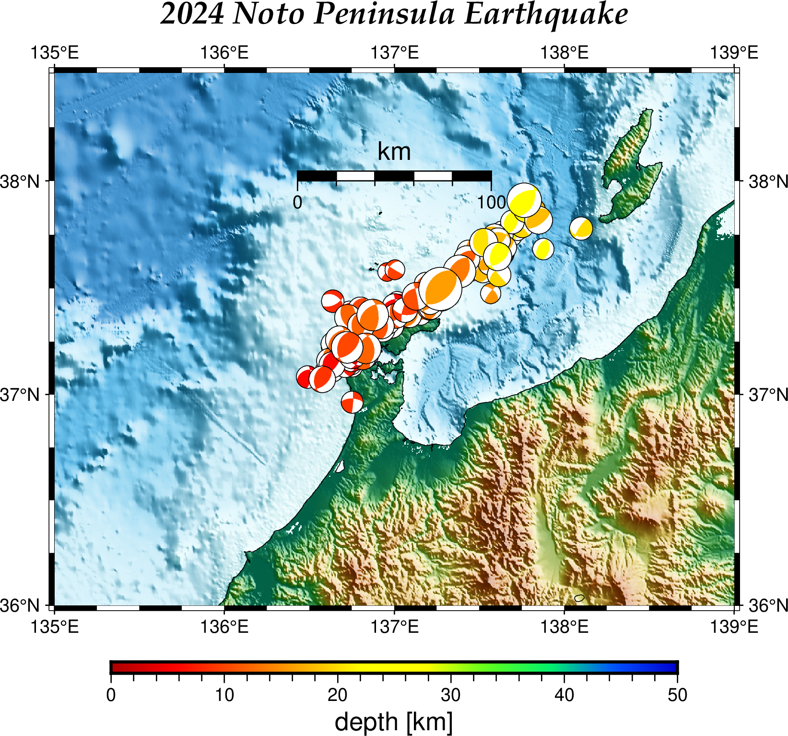

# GMT(Version  6.4.0)で陰影段彩図

[](https://hits.seeyoufarm.com) 

2019-10-12に[GMT(Version 5.4.5)で陰影段彩図](https://gitpress.io/@statrstart/GMT01)という記事を書きましたが、GMT6でやってみました。

2024-02-10 : 兵庫県南部地震 1995/01/17のデータを [Global CMT Catalog Search](https://www.globalcmt.org/CMTsearch.html)から得て地図に記入。

環境は、OS:Debian 12　GMT(Version  6.4.0)　Ghostscript 10.0.0です。透過色を出すのにちょっと苦労したので（ネットで検索しても
解決方法がなかなか見つからない）同じ状況の方の参考になれば幸いです。

（解決のヒントとなったサイト）  
[Google ColaboratoryでGMT(PyGMT)を使う #2](https://qiita.com/after-a-rain/items/80782fd97e27e8627326)  
「ところで， 1.準備 で，ghostscriptのバージョンを変える1行がありました．これは，本記事執筆時ではPyGMTと同時にインストールとされるghostscript 10.02.0ではtransparencyが使えなかったためです．」

（解決方法）`gmt begin nankai202402 png C-dALLOWPSTRANSPARENCY` とする。

- gmt begin オプション `-Cgs_option`
- gs: 透過色を認める。-dALLOWPSTRANSPARENCY

(陰影段彩図)  


(陰影段彩図:2024 Noto Peninsula Earthquake コードは省略)



## 準備

<http://www.scc.u-tokai.ac.jp/gmt/data/> や <https://www.earthbyte.org/webdav/gmt_mirror/gmt/data/>から  
`earth_relief_15s.grd` (2.6Gもある)をダウンロードする。

[F-net :メカニズム解の検索](https://www.fnet.bosai.go.jp/event/search.php?LANG=ja)から以下の条件で検索
- 1997/01/01から2024/01/31まで 
- Mj>=6.7 以上 （検索結果数 : 100 ）

今回は列名も含めてコピペしてテキストファイルとして保存する。（ファイル名は、japan1997_202401.txt とした。）

メカニズム解データの編集は、awk sed sort を使って

```
awk 'NR > 1{print $3,$2,$4,$7,$8,$9,$5}' japan1997_202401.txt | sed -e 's/;[-]*[0-9]*//g' | sort -k 7 > jmeca.txt
```

- awk の NR>1 の部分は保存した範囲によって変更する。データ部のみ保存ならこの部分は必要なし。
- awkでlongitude latitude depth strike dip rake Mjだけ取り出し、並べ替える
- sedでstrike1 dip1 rake1だけにする。（;で区切られている。マイナスの値もあるので「;[-]*[0-9]*」としこれを消す）
- sortでMjの昇順に並び替える。Mjが大きい方を後に書く（埋もれないようにする）ため。

震源深さによる色分けの範囲を決めるため最大値を求める。awkを使います。

```
awk 'NR==1 {max=$3} {if($3>max) max=$3} END{print max}' jmeca.txt
# 681.71
```

東海・東南海・南海地震の想定震源域のデータをダウンロード
Fuyuki Hirose's HP[プレート形状の数値データ] : http://www.mri-jma.go.jp/Dep/st/member/fhirose/ja/PlateData.html  
plate_data.tar.gz [331 KB]をダウンロード。解凍。「mapdata」フォルダを作業フォルダ内に配置。    
今回使用するデータは「mapdata」フォルダに入っている  
- 「trench.dat」
- 「nankai.region」
- 「tokai.region」
- 「tonankai.region」
- 「kanto_eq.dat」
- 「tokai_asperity.data」
- 「voldata.dat」
- 「contour_map_PAC.gmt」の矢印

### GMT6.4.0 コード

GMT(Version 5.4.5)のコードに比べてすっきりします。（-K -O は必要なし。 -J -Rは１行（gmt basemap）だけ ）

```
# 地図にする部分を切り出す。（nankai.nc）
gmt grdcut ~/GMT/earth_relief/earth_relief_15s.grd  -R129/148/30/40 -Gnankai.nc
# gmt 初期設定の確認 
# gmt defaults
# 図のタイトルを書くときの文字の大きさ、フォント(32:Palatino-BoldItalic)、色
gmt set FONT_TITLE  14p,32,black
gmt set FONT_SUBTITLE  12p,32,black
# 地図スケールの高さを 5p -> 10p
gmt set MAP_SCALE_HEIGHT  10p
#
################### 地図を書きます ################### 
# gmt begin オプション　-Cgs_option
# 透過色を認める。-dALLOWPSTRANSPARENCY
gmt begin nankai png C-dALLOWPSTRANSPARENCY
gmt basemap -JM16 -R129/148/30/40 -Bafg -BWSNE+t"Nankai Trough"+s"(Earthquake: Mj @~\263@~ 6.7 & 1997/01/01 \176 2024/01/31 + 1)"
gmt makecpt -Cgeo -T-8000/8000/200 -Z
gmt grdgradient nankai.nc -Ggrad.grd -A45 -Ne0.8
gmt grdimage nankai.nc -Igrad.grd -C
gmt coast -Df -W0.25 -LJBL+jTL+c35+w500k+f+o0/1+l
########## trenchデータ等の読み込みと描画 ##########
trench=./mapdata/trench.dat
tokai=./mapdata/tokai.region
tonankai=./mapdata/tonankai.region
nankai=./mapdata/nankai.region
tasp=./mapdata/tokai_asperity.data
kasp=./mapdata/kanto_eq.dat
volcano=./mapdata/voldata.dat
# Anticipated source region（透過色を使う）
#To explicitly close polygons, use -L
# -: y（緯度）、x（経度）の順番で与える
# -i : とり出したい列から1引いたもので、とり出す列を指定( -: と -i1,0 は同じこと）
gmt psxy $tokai -i1,0 -L -Gyellow -t60 -Wthick,yellow
gmt psxy $tonankai -i1,0 -L -Gred -t60 -Wthick,red
gmt psxy $nankai -i1,0 -L -Gblue -t60 -Wthick,blue
# Kanto (Wald and Somerville, 1995, BSSA)
gmt psxy $kasp -L -Ggreen -t60 -Wthick,green
# Tokai (Matsumura, 1997, Tectono.)
gmt psxy $tasp -i1,0 -L -Ggreen -t60 -Wthick,green
# Trench
gmt psxy $trench -i1,0 -Wthicker,red
# Volcano
gmt psxy $volcano -i1,0 -ST0.15 -Gred -Wthinner,black
########## テキストを書き込む ########## 
# 9p,9,black
gmt text -F+j+a+f <<EOF
138.6 33.95 MC  70 9p,9,black Suruga Trough
140.5 34.3  MC -18 9p,9,black Sagami Trough
136.1 32.5  MC  20 9p,9,black Nankai Trough
138.1 34.5  MC  35 9p,5,black Tokai
136.8 33.9  MC  30 9p,5,black Tonankai
134   32.9  MC  20 9p,5,black Nankai
EOF
# -Gblack と　10p,1,white　で白抜き文字
gmt text -F+jMC+a0+f10p,1,white -Gblack <<EOF 
136.5 30.35  Philippine Sea Plate
145   34     Pacific Plate
EOF
########## 矢印、テキストを書き込む ########## 
# Arrow (Wei & Seno, 1998, Geodynam. Series ed. by M. Flower et al., 27, 337-346)
gmt psxy -Sv0.1/0.3/0.2 -Gred <<EOF
 140.8 33.5 131 0.6375
EOF
gmt text -F+j+a+f -Gwhite <<EOF
 140.2 33.3 ML 0 9p,5,red 34 mm/yr
EOF
gmt psxy -Sv0.1/0.3/0.2 -Gred <<EOF
 137 31.1 145 1.05
EOF
gmt text -F+j+a+f -Gwhite <<EOF
 136.4 30.9 ML 0 9p,5,red 56 mm/yr
EOF
gmt psxy -Sv0.1/0.3/0.2 -Gred -N <<EOF
 145 34.8 156 1.5
EOF
gmt text -N -F+j+a+f -Gwhite <<EOF
 144.4 34.6 ML 0 9p,5,red 80 mm/yr
EOF
gmt psxy -Sv0.1/0.3/0.2 -Gred -N <<EOF
 146.5 39 155 1.5375
EOF
gmt text -N -F+j+a+f -Gwhite <<EOF
 145.9 38.8 ML 0 9p,5,red 82 mm/yr
EOF
########## メカニズム解 ########## 
gmt makecpt -Cseis -T0/700/1 -Z
gmt meca "jmeca.txt" -Sa0.3 -C
gmt text -F+jMC+a0+f8.5p,5,blue -Gwhite -D0/0.46 -N <<EOF
 133.3498 35.2752  2000/10/06
 132.7087 34.1200 2001/03/24
 138.6095 37.5568 2007/07/16
 140.8807 39.0298 2008/06/14
 142.8610 38.1035 2011/03/11
 130.763 32.7545 2016/04/16
EOF
gmt text -F+jMC+a0+f8.5p,5,blue -Gwhite -D-0.4/0.46 -N <<EOF
 136.6860 37.2207 2007/03/25
 137.2705 37.4962 2024/01/01
EOF
gmt text -F+jMC+a0+f8.5p,5,blue -Gwhite -D0/-0.46 -N <<EOF
 140.6727 36.9457 2011/04/11
EOF
gmt text -F+jMC+a0+f8.5p,5,blue -Gwhite -D0.8/0.42 -N <<EOF
 138.8703 37.2895 2004/10/23
EOF
# 兵庫県南部地震 1995/01/17
# [Global CMT Catalog Search](https://www.globalcmt.org/CMTsearch.html)
gmt meca -Sa0.3 -C  <<EOF
135.035 34.59833 16.00 324 70 12 7.3
EOF
echo "135.035 34.59833  1995兵庫県南部地震" | nkf -e | gmt text -F+jMC+a0+f7.5p,37,blue -Gwhite -D0/0.46 -N 
gmt colorbar -DJBR+jTR+o0/1+w5/0.2+h -Baf+l"Depth [km]"
gmt end
```
