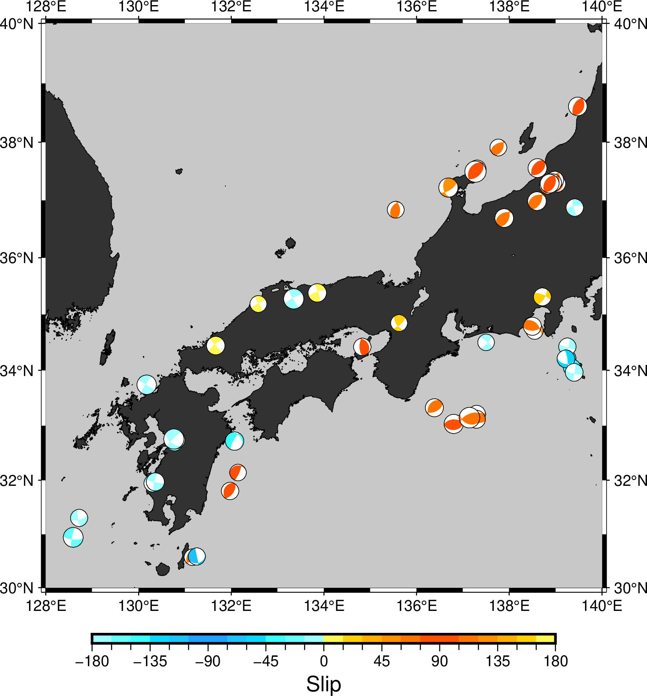
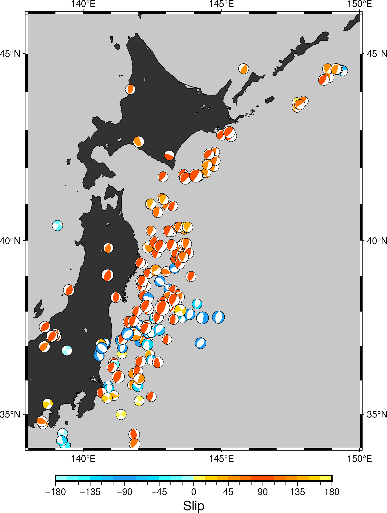

# GMT(Version  6.4.0)で陰影段彩図（2）

[](https://hits.seeyoufarm.com) 

2019-10-12に[GMT(Version 5.4.5)で陰影段彩図](https://gitpress.io/@statrstart/GMT01)という記事を書きましたが、GMT6でやってみました。

[正断層・逆断層・横ずれ断層](https://www.jishin.go.jp/resource/terms/tm_fault/)によると、「我が国の内陸地震では、
中部地方から西日本にかけては横ずれ断層型が多く、東北地方などの北日本では逆断層型が多いと言われています。」とのことなので
確認してみました。

環境は、OS:Debian 12　GMT(Version  6.4.0)　Ghostscript 10.0.0です。透過色を出すのにちょっと苦労したので（ネットで検索しても
解決方法がなかなか見つからない）同じ状況の方の参考になれば幸いです。

（解決のヒントとなったサイト）  
[Google ColaboratoryでGMT(PyGMT)を使う #2](https://qiita.com/after-a-rain/items/80782fd97e27e8627326)  
「ところで， 1.準備 で，ghostscriptのバージョンを変える1行がありました．これは，本記事執筆時ではPyGMTと同時にインストールとされるghostscript 10.02.0ではtransparencyが使えなかったためです．」

（解決方法）`gmt begin nankai202402 png C-dALLOWPSTRANSPARENCY` とする。

- gmt begin オプション `-Cgs_option`
- gs: 透過色を認める。-dALLOWPSTRANSPARENCY

(陰影段彩図)  

以下の５つの地震のデータは[Global CMT Catalog Search](https://www.globalcmt.org/CMTsearch.html)からダウンロードしました。

- 139.07333333 40.36 14 16 27 86 7.7  1983年日本海中部地震
- 144.3733333 42.92 101 133 6 -36 7.5  1993年釧路沖地震
- 139.18  42.7816667  35 0 35 91 7.8   1993年北海道南西沖地震
- 143.745 40.43 0 179 12  67 7.6       1994年三陸はるか沖地震
- 135.035 34.59833 16.00 324 70 12 7.3  1995年兵庫県南部地震


九州から沖縄、台湾までの地図（コードは省略）


## 準備

<http://www.scc.u-tokai.ac.jp/gmt/data/> や <https://www.earthbyte.org/webdav/gmt_mirror/gmt/data/>から  
`earth_relief_15s.grd` (2.6Gもある)をダウンロードする。

[F-net :メカニズム解の検索](https://www.fnet.bosai.go.jp/event/search.php?LANG=ja)から以下の条件で検索
- 1997/01/01から2024/01/31まで 
- Mj>=6.7 以上 （検索結果数 : 100 ）

今回は列名も含めてコピペしてテキストファイルとして保存する。（ファイル名は、japan1997_202401.txt とした。）

メカニズム解データの編集は、awk sed sort を使って

```
awk 'NR > 1{print $3,$2,$4,$7,$8,$9,$5}' japan1997_202401.txt | sed -e 's/;[-]*[0-9]*//g' | sort -k 7 > jmeca.txt
```

- awk の NR>1 の部分は保存した範囲によって変更する。データ部のみ保存ならこの部分は必要なし。
- awkでlongitude latitude depth strike dip rake Mjだけ取り出し、並べ替える
- sedでstrike1 dip1 rake1だけにする。（;で区切られている。マイナスの値もあるので「;[-]*[0-9]*」としこれを消す）
- sortでMjの昇順に並び替える。Mjが大きい方を後に書く（埋もれないようにする）ため。

震源深さによる色分けの範囲を決めるため最大値を求める。awkを使います。

```
awk 'NR==1 {max=$3} {if($3>max) max=$3} END{print max}' jmeca.txt
# 681.71
```

### GMT6.4.0 コード

GMT(Version 5.4.5)のコードに比べてすっきりします。（-K -O は必要なし。 -J -Rは１行（gmt basemap）だけ ）

```
# 地図にする部分を切り出す。（jap.nc）
gmt grdcut ~/GMT/earth_relief/earth_relief_15s.grd  -R129/148/30/46 -Gjap.nc
# gmt 初期設定の確認 
# gmt defaults
# 図のタイトルを書くときの文字の大きさ、フォント(32:Palatino-BoldItalic)、色
gmt set FONT_TITLE  14p,32,black
gmt set FONT_SUBTITLE  12p,32,black
gmt set FONT_LABEL 12p,26,black
# 地図スケールの高さを 5p -> 10p
gmt set MAP_SCALE_HEIGHT  10p
#
################### 地図を書きます ################### 
# gmt begin オプション　-Cgs_option
# 透過色を認める。-dALLOWPSTRANSPARENCY
gmt begin jap png C-dALLOWPSTRANSPARENCY
gmt basemap -JM16 -R129/148/30/46 -Bafg -BWSNE+t"Earthquake"+s"(Mj @~\263@~ 6.7 & 1997/01/01 \176 2024/01/31) + 5"
gmt makecpt -Cgeo -T-8000/8000/200 -Z
gmt grdgradient jap.nc -Ggrad.grd -A45 -Ne0.8
gmt grdimage jap.nc -Igrad.grd -C
gmt coast -Df -W0.25 -LJBL+jTL+c35+w500k+f+o0/1+l
########## メカニズム解 ########## 
gmt makecpt -Cseis -T0/700/1 -Z
gmt meca "jmeca.txt" -Sa0.3 -C
# 兵庫県南部地震ほか
# [Global CMT Catalog Search](https://www.globalcmt.org/CMTsearch.html)
gmt meca -Sa0.3 -C  <<EOF
139.07333333 40.36 14 16 27 86 7.7 
144.3733333 42.92 101 133 6 -36 7.5 
139.18  42.7816667  35 0 35 91 7.8 
143.745 40.43 0 179 12  67 7.6  
135.035 34.59833 16.00 324 70 12 7.3
EOF
# 日本語を使ってみる　nkf -e : EUCに変換
# 140.6727 36.9457 2011/04/11,17:16 福島県浜通り
echo "133.3498 35.2752 2000鳥取県西部地震" | nkf -e | gmt text -F+jMC+a0+f8p,37,blue -Gwhite -D0/0.45 -N 
echo "132.7087 34.1200 2001芸予地震" | nkf -e | gmt text -F+jMC+a0+f8p,37,blue -Gwhite -D0/0.45 -N 
echo "144.0785 41.7797 2003十勝沖地震" | nkf -e | gmt text -F+jMC+a0+f8p,37,blue -Gwhite -D0/-0.45 -N 
echo "138.8703 37.2895 2004新潟県中越地震" | nkf -e | gmt text -F+jMC+a0+f8p,37,blue -Gwhite -D1.3/0.4 -N 
echo "136.6860 37.2207 2007能登半島地震" | nkf -e | gmt text -F+jMC+a0+f8p,37,blue -Gwhite -D-0.9/0.45 -N 
echo "138.6095 37.5568 2007新潟県中越沖地震" | nkf -e | gmt text -F+jMC+a0+f8p,37,blue -Gwhite -D0.8/0.45 -N 
echo "140.8807 39.0298 2008岩手・宮城内陸地震" | nkf -e | gmt text -F+jMC+a0+f8p,37,blue -Gwhite -D0/0.45 -N 
echo "142.8610 38.1035 2011東北地方太平洋沖地震" | nkf -e | gmt text -F+jMC+a0+f8p,37,blue -Gwhite -D0/0.45 -N 
echo "130.763 32.7545 2016熊本地震" | nkf -e | gmt text -F+jMC+a0+f8p,37,blue -Gwhite -D0/0.45 -N 
echo "142.0067 42.6908 2018北海道胆振東部地震" | nkf -e | gmt text -F+jMC+a0+f8p,37,blue -Gwhite -D0/-0.45 -N
echo "137.2705 37.4962 2024能登半島地震" | nkf -e | gmt text -F+jMC+a0+f8p,37,blue -Gwhite -D-0.8/0.45 -N
echo "139.07333333 40.36 1983日本海中部地震" | nkf -e | gmt text -F+jMC+a0+f8p,37,blue -Gwhite -D0/0.45 -N 
echo "144.3733333 42.92 1993釧路沖地震" | nkf -e | gmt text -F+jMC+a0+f8p,37,blue -Gwhite -D0/0.45 -N 
echo "139.18  42.7816667  1993北海道南西沖地震" | nkf -e | gmt text -F+jMC+a0+f8p,37,blue -Gwhite -D0/0.45 -N 
echo "143.745 40.43  1994三陸はるか沖地震" | nkf -e | gmt text -F+jMC+a0+f8p,37,blue -Gwhite -D-0.5/0.45 -N 
echo "135.035 34.59833  1995兵庫県南部地震" | nkf -e | gmt text -F+jMC+a0+f8p,37,blue -Gwhite -D0/0.45 -N 
gmt colorbar -DJBR+jTR+o0/1+w5/0.2+h -Baf+l"Depth [km]"
gmt end
```

正断層、逆断層の度合い(slip)に応じて色分け（コードは省略）





#### 作成したslip.cpt

```
#
# gmt/no_green : For those who hate green [S, C=RGB]
# Color table using in Lab for Satellite Altimetry
# For folks who hate green in their color tables
# Designed by W.H.F. Smith, NOAA
#
#----------------------------------------------------------
# COLOR_MODEL = RGB
# SOFT_HINGE
#----------------------------------------------------------
-1	200/255/255	-0.92307696	127/255/255
-0.92307696	127/255/255	-0.84615388	85/255/255
-0.84615388	85/255/255	-0.7692308	42/255/255
-0.7692308	42/255/255	-0.69230772	0/207/255
-0.69230772	0/207/255	-0.61538464	32/191/255
-0.61538464	32/191/255	-0.53846156	32/159/255
-0.53846156	32/96/255	-0.46153848	32/159/255
-0.46153848	32/159/255	-0.3846154	32/191/255
-0.3846154	32/191/255	-0.30769232	0/207/255
-0.30769232	0/207/255	-0.23076924	42/255/255
-0.23076924	42/255/255	-0.15384616	85/255/255
-0.15384616	85/255/255	-0.07692308	127/255/255
-0.07692308	127/255/255	0	200/255/255
0	255/255/184	0.07692308	255/240/0
0.07692308	255/240/0	0.15384616	255/191/0
0.15384616	255/191/0	0.23076924	255/168/0
0.23076924	255/168/0	0.30769232	255/138/0
0.30769232	255/138/0	0.3846154	255/112/0
0.3846154	255/112/0	0.46153848	255/77/0
0.46153848	255/77/0	0.53846156	red
0.53846156	255/77/0	0.61538464	255/112/0
0.61538464	255/112/0	0.69230772	255/138/0
0.69230772	255/138/0	0.7692308	255/168/0
0.7692308	255/168/0	0.84615388	255/191/0
0.84615388	255/191/0	0.92307696	255/240/0
0.92307696	255/240/0	1	255/255/184
#----------------------------------------------------------
B	32/96/255
F	255/0/0
#----------------------------------------------------------
```
