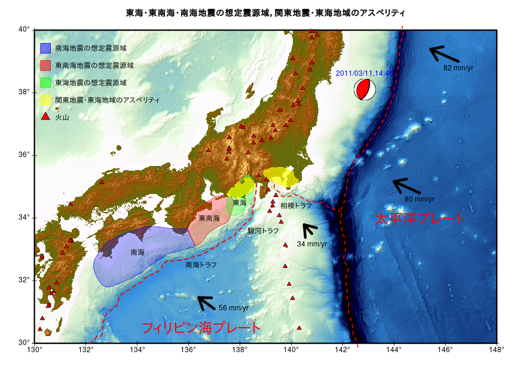

＊ 「tranch.dat」を読み込む箇所のコードをシンプルにしました。  
＊ 「voldata.dat」をlinuxのcutコマンド（windowsの場合、busyboxのcutコマンド）を使って取り込むコードを記事の最後に載せました。  

# Rで陰影段彩図06（陸地＋海洋）

前回(GMT(Version 5.4.5)で陰影段彩図)でダウンロードしたデータを使います。  
XYZ データを変換する必要があります。

(立体地形データ)  
[SRTM30_PLUS(EXTRACT XYZ GRID OF TOPOGRAPHY)](https://topex.ucsd.edu/cgi-bin/get_srtm30.cgi)

## 準備

[SRTM30_PLUS(EXTRACT XYZ GRID OF TOPOGRAPHY)](https://topex.ucsd.edu/cgi-bin/get_srtm30.cgi)からXYZ Dataを入手。 
今回は、130 west east 150 , 30 north south 40 と指定。作業フォルダ内に配置。データ名は、srtm130_150_30_40.txtとしました。  

東海・東南海・南海地震の想定震源域のデータをダウンロード
Fuyuki Hirose's HP[プレート形状の数値データ] : http://www.mri-jma.go.jp/Dep/st/member/fhirose/ja/PlateData.html  
plate_data.tar.gz [331 KB]をダウンロード。解凍。「mapdata」フォルダを作業フォルダ内に配置。    
今回使用するデータは「mapdata」フォルダに入っている  
- 「trench.dat」
- 「nankai.region」
- 「tokai.region」
- 「tonankai.region」
- 「kanto_eq.dat」
- 「tokai_asperity.data」
- 「voldata.dat」
- 「contour_map_PAC.gmt」の矢印

## Rで陰影段彩図(SRTM30Plusのデータ)


## Rコード

作業フォルダ名は「srtm30plus」としています。  
使用するデータのうち「voldata.dat」はGMTで使うデータを無理やりRに取り込んでいます。  
linuxのcutコマンド（windowsの場合はbusyboxのcutコマンド）を使うと簡単に取り込めました。 

```R
library(raster)
library(geosphere) # destPointRhumb
library(RFOC) # Seismic Focal Mechanisms 
#
setwd("srtm30plus")
#
########## 元データの読み込みとrasterize（rasterizeに時間がかかるので保存する。） ##########
#
d<-read.table("srtm130_150_30_40.txt",header=F,skip=1)
#
Lon.range = c(130, 148)
Lat.range = c(30, 40)
#
axes1<-seq(Lon.range[1],Lon.range[2],2)
axes2<-seq(Lat.range[1],Lat.range[2],2)
#
dat<-d[d$V1>=Lon.range[1] & d$V1<=Lon.range[2] & d$V2>=Lat.range[1] & d$V2<=Lat.range[2],]
summary(dat)
length(unique(dat[,1]))
length(unique(dat[,2]))
#
########## XYZデータ -> ラスター ##########
#
r <- raster(nrow=length(unique(dat[,2])),ncol=length(unique(dat[,1])))
extent(r) <- c(Lon.range[1],Lon.range[2],Lat.range[1],Lat.range[2])
crs(r)<-CRS("+init=epsg:4326")
r1 <- rasterize(dat[, c(1,2)], r, field = dat[, 3], fun=mean)
#
##### save する #####
#
#save(r1,file=paste0("r1_",Lon.range[1],"_",Lon.range[2],"_",Lat.range[1],"_",Lat.range[2],".Rdata"))
#load(paste0("r1_",Lon.range[1],"_",Lon.range[2],"_",Lat.range[1],"_",Lat.range[2],".Rdata"))
#
########## 描画の準備 ##########
#
#配色はGMTのカラーパレット“relief”を参考にした
ocean<-colorRampPalette(c("#000000", "#000413", "#000728", "#002650", "#005E8C", 
                          "#0096C8", "#45BCBB", "#8AE2AE", "#BCF8B9" , "#DBFBDC"))
#
land1 <- colorRampPalette(c("#467832","#786432"))
land2 <- colorRampPalette(c("#786433","#927E3C"))
land3 <- colorRampPalette(c("#927E3D","#C6B250"))
land4 <- colorRampPalette(c("#C6B251","#FAE664"))
land5 <- colorRampPalette(c("#FAE665","#FAEA7E"))
breakpoints <- c(seq(-11000,0,100),1,seq(50,500,50),seq(550,1000,50),seq(1100,2000,100),seq(2100,3000,100),seq(3500,9000,500))
colors <- c(ocean(110),land1(11),land2(10),land3(10),land4(10),land5(12))
slope <- terrain(r1, opt='slope')
aspect <- terrain(r1, opt='aspect')
hill <- hillShade(slope, aspect,35,315)
#
## 彩色
v<-getValues(r1)
#欠損値の個数
sum(is.na(v))
#欠損値があった場合
#直前の値を入れる
#v<-na.locf(v) #zoo package
#平均値を入れる
#v[is.na(v)] <- mean(v,na.rm=T)
#0を入れる
#v[is.na(v)] <- 0
v<-as.vector(cut(v, breaks=breakpoints, labels = colors, right = F))
v1<-rgb2hsv(col2rgb(v))
## 陰影
x<-getValues(hill)
#欠損値の個数
sum(is.na(x))
x[is.na(x)] <- mean(x,na.rm=T)
#
#最小値を m、最大値を Mにする正規化
m<-0 ; M<-max(v1[3,])
x<-(M-m)*((x-min(x))/(max(x)-min(x)))+m
#
h<-NULL
for ( i in 1:length(x)){
  h[i]<-gray(x[i])
}
#h
h1<-rgb2hsv(col2rgb(h))
#
d1<-NULL
d1<-(v1+h1)/2
d1[1,]<-v1[1,]
#
g<-c(col2rgb(hsv(d1[1,],d1[2,],d1[3,]))[1,],
     col2rgb(hsv(d1[1,],d1[2,],d1[3,]))[2,],
     col2rgb(hsv(d1[1,],d1[2,],d1[3,]))[3,] )
s<-NULL
r<-r1
s <- stack(r, r, r)
values(s)<-g
#
########## 描画 ##########
#
########## 描画(陰影段彩図) ##########
#
#png(paste0("srtm",Lon.range[1],"_",Lon.range[2],"_",Lat.range[1],"_",Lat.range[2],"R01.png"),width=860,height=640)
par(mar=c(4,4,3,2), xaxt="n", yaxt="n")
plotRGB(s,stretch='lin',axes=TRUE)
par(xpd=T)
rect(extent(s)[1],extent(s)[3],extent(s)[2],extent(s)[4],
     lwd=3)
text(axes1,extent(s)[3],paste0(as.character(axes1),"°"),pos=1)
text(extent(s)[1],axes2,paste0(as.character(axes2),"°"),pos=2)
points(x=axes1,y=rep(extent(s)[3],length(axes1)),cex=1,pch=3)
points(x=rep(extent(s)[1],length(axes2)),y=axes2,cex=1,pch=3)
par(xpd=F)
#dev.off()
#
########## トラフ等データ読み込み########## 
trench<-readLines("./mapdata/trench.dat")
fromto<-grep(">",trench)
trench1<-read.table(text=trench,nrows =fromto[1]-1,col.names=c("latitude","longitude"))
trench2<-read.table(text=trench,skip=fromto[1],nrows =fromto[2]-(fromto[1]+1),col.names=c("latitude","longitude"))
trench3<-read.table(text=trench,skip=fromto[2],col.names=c("latitude","longitude"))
#
nankai=read.table("./mapdata/nankai.region",h=F)
names(nankai)<-c("latitude","longitude")
#
tokai=read.table("./mapdata/tokai.region",h=F)
names(tokai)<-c("latitude","longitude")
#
tonankai=read.table("./mapdata/tonankai.region",h=F)
names(tonankai)<-c("latitude","longitude")
#
#火山データ読み込み（linuxのcutコマンドを使う方法は後述）
lines <- readLines(con <- file("./mapdata/voldata.dat", encoding = "EUC-JP"))
close(con)
lines<-substr(lines,1,16) 
f = file("out.txt", "w")
for (line in lines) {
  cat(line, "\n", sep="", file=f)  # ファイルに書き出す
}
vol=read.table("out.txt",h=F)
names(vol)<-c("latitude","longitude")
system("rm ./out.txt")
#
vol=vol[vol$longitude>=Lon.range[1] & vol$longitude<=Lon.range[2] & vol$latitude>=Lat.range[1] & vol$latitude<=Lat.range[2] ,]
#
trough<-data.frame(names=c("駿河トラフ","相模トラフ","南海トラフ","太平洋プレート","フィリピン海プレート","東海","東南海","南海"),
                   longitude=c(138.9,140.2,136.5,145,136.5,138,136.8,134),latitude=c(33.6,34.4,32.5,34,30.5,34.5,34,32.9))
#
# Asperities
# Kanto (Wald and Somerville, 1995, BSSA)
kasp=read.table("./mapdata/kanto_eq.dat",h=F,skip=1)
names(kasp)<-c("longitude","latitude")
#
# Tokai (Matsumura, 1997, Tectono.)
tasp=read.table("./mapdata/tokai_asperity.data",h=F)
names(tasp)<-c("latitude","longitude")
#
########## 描画(lines,polygon) ##########
#
lines(x=trench1$longitude, y = trench1$latitude,col="red",lty=2,lwd=2)
lines(x=trench2$longitude, y = trench2$latitude,col="red",lty=2,lwd=2)
lines(x=trench3$longitude, y = trench3$latitude,col="red",lty=2,lwd=2)
#
polygon(x=nankai$longitude, y = nankai$latitude, col=rgb(0,0,1,0.3),border=rgb(0,0,1,0.8))
#
polygon(x=tonankai$longitude, y = tonankai$latitude,col=rgb(1,0,0,0.3),border=rgb(1,0,0,0.8))
#
polygon(x=tokai$longitude, y = tokai$latitude, col=rgb(0,1,0,0.3),border=rgb(0,1,0,0.8))
#
polygon(x=kasp$longitude, y = kasp$latitude,col=rgb(1,1,0,0.8),border=rgb(1,1,0,1),angle=90,density=100)
polygon(x=tasp$longitude, y = tasp$latitude,col=rgb(1,1,0,0.8),border=rgb(1,1,0,1),angle=90,density=100)
#
points(x=vol$longitude, y =vol$latitude,pch=24,cex=1,col="black",bg="red")
#
########## 描画（テキスト） ##########
#
text(x = trough$longitude[c(1:3,6:8)], y = trough$latitude[c(1:3,6:8)],labels =trough$names[c(1:3,6:8)])
#
text(x = trough$longitude[4:5], y = trough$latitude[4:5],labels =trough$names[4:5],col="red",cex=2)
#
########## 描画（矢印、テキスト） ########## 
#
# Arrow (Wei & Seno, 1998, Geodynam. Series ed. by M. Flower et al., 27, 337-346)
#
#"34 mm/yr"
arrow1<-c(140.8, 33.5, 131, 0.6375)
arrow1<-c(arrow1,destPointRhumb(arrow1[1:2],90-arrow1[3],10^5*arrow1[4]/3*2))
#"56 mm/yr"
arrow2<-c(137, 31.1, 145, 1.05) 
arrow2<-c(arrow2,destPointRhumb(arrow2[1:2],90-arrow2[3],10^5*arrow2[4]/3*2))
#"80 mm/yr"
arrow3<-c(145, 34.8, 156, 1.5) 
arrow3<-c(arrow3,destPointRhumb(arrow3[1:2],90-arrow3[3],10^5*arrow3[4]/3*2))
#"82 mm/yr" 145.9 38.8
arrow4<-c(146.5, 39, 155, 1.5375) 
arrow4<-c(arrow4,destPointRhumb(arrow4[1:2],90-arrow4[3],10^5*arrow4[4]/3*2))
#
arrows(arrow1[1],arrow1[2],arrow1[5],arrow1[6],angle = 35, length = 0.3, code = 2,lwd=6) 
text(x=arrow1[1],y=arrow1[2],labels ="34 mm/yr",pos=1,offset=1) # offset : 座標からの距離
#
arrows(arrow2[1],arrow2[2],arrow2[5],arrow2[6],angle = 35, length = 0.3, code = 2,lwd=6) 
text(x=arrow2[1],y=arrow2[2],labels ="56 mm/yr",pos=4)
#
arrows(arrow3[1],arrow3[2],arrow3[5],arrow3[6],angle = 35, length = 0.3, code = 2,lwd=6) 
text(x=arrow3[1],y=arrow3[2],labels ="80 mm/yr",pos=1)
#
arrows(arrow4[1],arrow4[2],arrow4[5],arrow4[6],angle = 35, length = 0.3, code = 2,lwd=6) 
text(x=arrow4[1],y=arrow4[2],labels ="82 mm/yr",pos=1)
#
########## 描画（legend、title） ##########
#
legend("topleft",
       legend = c("南海地震の想定震源域",
                  "東南海地震の想定震源域",
                  "東海地震の想定震源域",
                  "関東地震・東海地域のアスペリティ",
                  "火山" ), 
       cex=1,pch=c(rep(22,4),24),col=c(rgb(0,0,1,1),rgb(1,0,0,1),rgb(0,1,0,1),rgb(1,1,0,1),"black"),pt.bg=c(rgb(0,0,1,0.5),rgb(1,0,0,0.5),rgb(0,1,0,0.5),rgb(1,1,0,0.5),"red"),
       pt.cex =c(rep(3.5,4),2),bty = "n",x.intersp = 1.5, y.intersp =2, inset = c(0.01, 0.03))
#
title("東海・東南海・南海地震の想定震源域，関東地震・東海地域のアスペリティ")
#
########## 描画（メカニズム解、テキスト） ########## 
#
#longitude latitude depth strike dip rake
eq<-c(142.8610 , 38.1035 , 20 , 22 , 63 , 91)
mc = CONVERTSDR(eq[4],eq[5],eq[6])
MEC <- MRake(mc$M)
MEC$UP = FALSE
justfocXY(MEC, x =eq[1], y = eq[2], focsiz= 0.5, fcol ="red",fcolback = "white", xpd = FALSE)
text(x=eq[1],y=eq[2]+0.5,labels="2011/03/11,14:46",col="blue")
#dev.off()
```

### 備考

「voldata.dat」はGMT用のデータです。文字コードは「EUC-JP」です。  
３行取り出してみると、  
44.1308 145.1653 1563,"Shiretoko-Iozan""知床硫黄山"},  
44.0739 145.1247 1660,"Rausudake""羅臼岳"},  
43.5697 144.5647  857,"Mashu""摩周"},  
となっています。  
linuxのcutコマンドを使って、区切り文字をコンマ、１番目の部分（緯度、経度、高さ）を取り出して、Rのread.tableでRに取り込みます。

```R
text<-system("cut -d, -f1 ./mapdata/voldata.dat",intern=T)
vol<-read.table(text=text,col.names=c("latitude","longitude","height"))
# 9999 -> NA
vol[vol==9999]<-NA
```

火山名も取り込みたいときは、linuxのcutコマンドを使って、区切り文字をコンマ、２番目の部分を取り出します。  

linuxの場合は、nkf を使うと簡単(sudo apt nkf)

```R
# nkf
volname<-system("cut -d, -f2 ./mapdata/voldata.dat |nkf -w ",intern=T)
```
nkfを使わない場合は取り込んだ後、iconvで変換。  
（注意）linuxとwindowsではEUC-JP等の表記が異なるようです。Rのiconvlist() コマンドで表記を確認してください。

```R
# iconv
# 表記を確認
iconvlist() 
volname<-system("cut -d, -f2 ./mapdata/voldata.dat",intern=T)
# linuxの場合(windowsの場合は小文字かも）
volname<-iconv(volname,from="EUCJP",to="UTF8")
``` 
volnameを見やすくしてvolデータにくっつけます。

```R
# 余分なコンマを削除する等々。
volname<-gsub('"','',gsub('""',"{",gsub('^"','',volname)))
# volにくっつける
vol$volname<-volname
```


