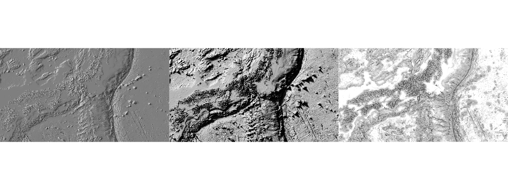
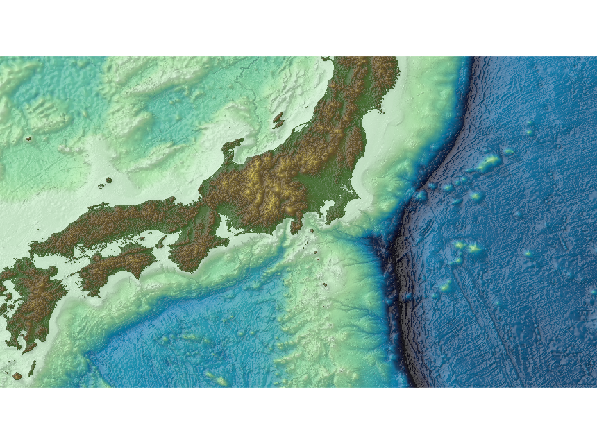
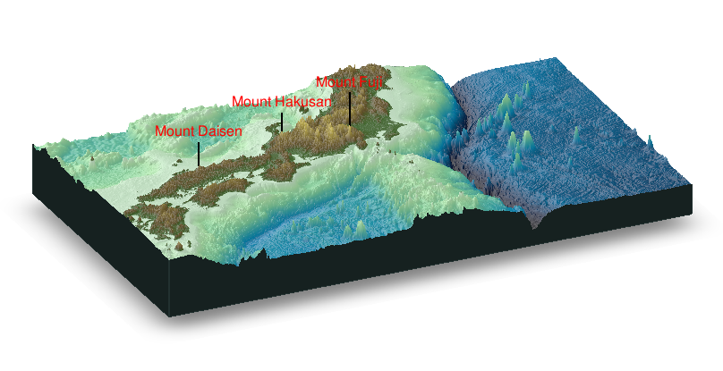
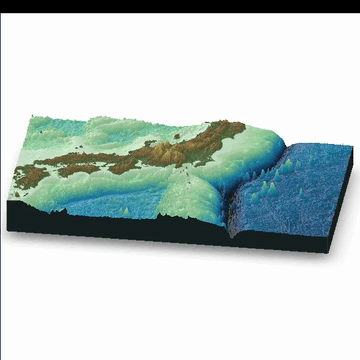

# Rで陰影段彩図07（陸地＋海洋）

「rayshader」パッケージを使い陰影段彩図、鳥瞰図を描きます。  
「GMT(Version 5.4.5)で陰影段彩図」でダウンロードしたデータを使います。  
XYZ データを変換する必要があります。

(立体地形データ)  
[SRTM30_PLUS(EXTRACT XYZ GRID OF TOPOGRAPHY)](https://topex.ucsd.edu/cgi-bin/get_srtm30.cgi)

## 準備

[SRTM30_PLUS(EXTRACT XYZ GRID OF TOPOGRAPHY)](https://topex.ucsd.edu/cgi-bin/get_srtm30.cgi)からXYZ Dataを入手。 
今回は、130 west east 150 , 30 north south 40 と指定。作業フォルダ内に配置。データ名は、srtm130_150_30_40.txtとしました。  

### R「rayshaderパッケージ」: sphere_shade,ray_shade,ambient_shade


## R「rayshaderパッケージ」で陰影段彩図(SRTM30Plusのデータ)


## R「rayshaderパッケージ」で鳥瞰図(SRTM30Plusのデータ)


## R「rayshaderパッケージ」でGIFアニメ(SRTM30Plusのデータ)
### mp4をffmpegでアニメGIFに変換


## Rコード

作業フォルダ名は「srtm30plus」としています。   

### データの読み込み、ラスターに変換 

```R
library(raster)
library(rayshader)
library(rgl)
#
setwd("srtm30plus")
#
d<-read.table("srtm130_150_30_40.txt",header=F,skip=1)
#
Lon.range = c(130, 148)
Lat.range = c(30, 40)
#
dat<-d[d$V1>=Lon.range[1] & d$V1<=Lon.range[2] & d$V2>=Lat.range[1] & d$V2<=Lat.range[2],]
summary(dat)
length(unique(dat[,1]))
length(unique(dat[,2]))
#
r <- raster(nrow=length(unique(dat[,2])),ncol=length(unique(dat[,1])))
extent(r) <- c(Lon.range[1],Lon.range[2],Lat.range[1],Lat.range[2])
crs(r)<-CRS("+init=epsg:4326")
r1 <- rasterize(dat[, c(1,2)], r, field = dat[, 3], fun=mean)
#save(r1,file=paste0("r1_",Lon.range[1],"_",Lon.range[2],"_",Lat.range[1],"_",Lat.range[2],".Rdata"))
#load(paste0("r1_",Lon.range[1],"_",Lon.range[2],"_",Lat.range[1],"_",Lat.range[2],".Rdata"))
```

### ラスター -> rayshaderで読み込める形,基本のプロット

```R
elmat = matrix(raster::extract(r1, raster::extent(r1), buffer = 1000),
               nrow = ncol(r1), ncol = nrow(r1))
#
########## Shade ##########
#
#png("rayshader01.png",width=1280,height=480)
par(mfrow=c(1,3))
#sunangleDefault 315(NW)
#Calculate Surface Color Map
elmat %>%
  sphere_shade(texture="bw",zscale = 50) %>%
plot_map()
#
#Calculate Raytraced Shadow Map
elmat %>% 
  ray_shade(lambert = T ,zscale = 50) %>%
  plot_map()
#
#Calculates Ambient（全方向性） Occlusion Shadow Map
elmat %>% 
  ambient_shade(zscale = 50) %>%
  plot_map()
#
#dev.off()
```

### 陰影段彩図
rayshaderで読み込むデータは「matrix」で緯度、経度の情報はありません。

```R
########## Shade+color ##########
#
#配色はGMTのカラーパレット“relief”を参考にした
ocean<-colorRampPalette(c("#000000", "#000413", "#000728", "#002650", "#005E8C", 
                          "#0096C8", "#45BCBB", "#8AE2AE", "#BCF8B9" , "#DBFBDC"))
#
land1 <- colorRampPalette(c("#467832","#786432"))
land2 <- colorRampPalette(c("#786433","#927E3C"))
land3 <- colorRampPalette(c("#927E3D","#C6B250"))
land4 <- colorRampPalette(c("#C6B251","#FAE664"))
land5 <- colorRampPalette(c("#FAE665","#FAEA7E"))
breakpoints <- c(seq(-11000,0,100),1,seq(50,500,50),seq(550,1000,50),seq(1100,2000,100),seq(2100,3000,100),seq(3500,9000,500))
colors <- c(ocean(110),land1(11),land2(10),land3(10),land4(10),land5(12))
#
#色付け
fliplr = function(x) {
 x[,ncol(x):1]
}
# 
tempfilename = tempfile()
png(tempfilename,width = nrow(elmat),height=ncol(elmat))
par(mar = c(0,0,0,0))
raster::image(fliplr(elmat),axes = FALSE,col = colors, breaks=breakpoints)
dev.off()
tempmap = png::readPNG(tempfilename)
#
#Combining base R plotting with rayshader's spherical color mapping and raytracing:
my.z<-50
#png(paste0("srtm",Lon.range[1],"_",Lon.range[2],"_",Lat.range[1],"_",Lat.range[2],"R02.png"),width=860,height=640)
elmat %>%
  sphere_shade(texture = "bw") %>%
  add_overlay(tempmap,alphalayer = 0.85) %>%
  add_shadow(ray_shade(elmat,zscale=my.z,lambert = T)) %>%
  add_shadow(ambient_shade(elmat,zscale=my.z)) %>%
# save_png(paste0("srtm",Lon.range[1],"_",Lon.range[2],"_",Lat.range[1],"_",Lat.range[2],"R02.png"),rotate=0)
  plot_map()
# dev.off()
```

### 鳥瞰図

```R
########## 3D ##########
## add label
lon = c(133.54,138.7305,136.7714)
lat = c(35.3711,35.3625,36.155)
ltext=c("Mount Daisen","Mount Fuji","Mount Hakusan")
z=c(5000,7000,4000)
# 経度、緯度から画像の位置を計算する。
lx= (nrow(elmat)*(lon-Lon.range[1]))/abs(Lon.range[2]-Lon.range[1])
ly= (ncol(elmat)*(lat-Lat.range[1]))/abs(Lat.range[2]-Lat.range[1])
#
my.z=50
elmat %>%
  sphere_shade(texture = "bw") %>%
  add_overlay(tempmap,alphalayer = 0.8) %>%
  add_shadow(ray_shade(elmat,zscale=my.z)) %>%
  plot_3d(elmat, zscale = my.z, fov =0 , theta = 335, zoom =0.95,  phi = 25, windowsize = c(1000, 800))
#
# 動く HTML ファイルとして保存
# rgl::writeWebGL(width=500, height=500)
#
  for (i in 1:length(lx)){
      render_label(elmat, x = lx[i], y = ly[i], z =z[i], 
             zscale = my.z, text = ltext[i], textsize = 1, linewidth = 2,textcolor ="red")
  }
rgl.snapshot("addtext.png", fmt = "png", top = TRUE)
```

### movie

```R
########## movie ##########
elmat %>%
  sphere_shade(texture = "bw") %>%
  add_overlay(tempmap,alphalayer = 0.8) %>%
  add_shadow(ray_shade(elmat,zscale=my.z)) %>%
  plot_3d(elmat, zscale = my.z)
  render_movie(filename ="srtm30.mp4",frames = 90,fps=3,  phi = 30, zoom = 0.85, theta = 335)
# ffmpeg をインストールしておく。
# system("ffmpeg -i srtm30.mp4 -vf 'palettegen' -y palette.png")
# system("ffmpeg -i srtm30.mp4 -i palette.png -lavfi 'fps=30,scale=360:-1:flags=lanczos [x]; [x][1:v] paletteuse=dither=bayer:bayer_scale=5:diff_mode=rectangle' -y srtm30.gif")
```

