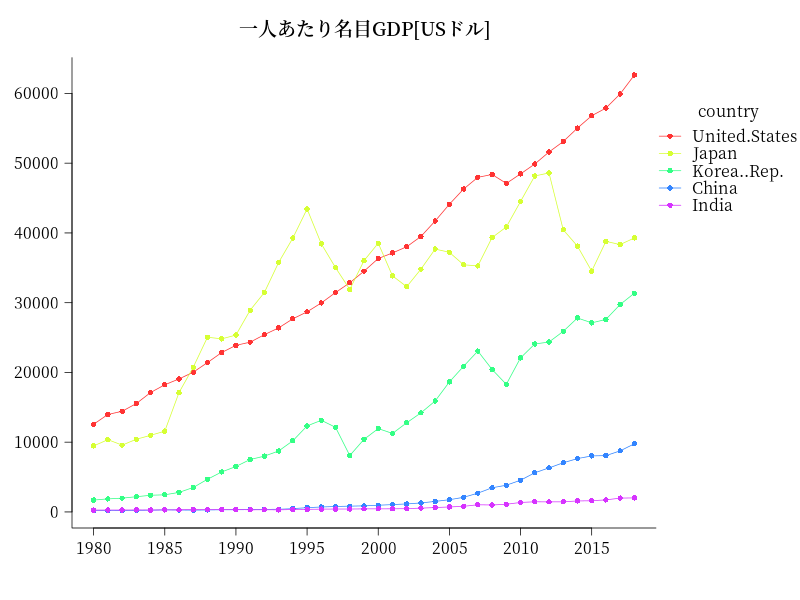

# RでGDPの推移を見る(世界銀行のデータ)

WDIパッケージ（世界銀行のデータを取ってくるパッケージ）を使ってGDPの推移をプロットします。  
ggplot2パッケージを使うと簡単なのですが、あえてmatplot関数を使ってグラフを描きます。

## GDP


## 一人あたり名目GDP[USドル]


## GDPの成長率


## Rコード

日本、アメリカ、中国、韓国、インドのデータを比較します。

```R
library(countrycode)
library(WDI)
library(ggplot2)
library(showtext)
# iso2cコードを調べる
countrycode("Japan","country.name","iso2c")
countrycode("USA","country.name","iso2c")
countrycode("China","country.name","iso2c")
countrycode("South Korea","country.name","iso2c")
countrycode("India","country.name","iso2c")
#
# iso2c
country<-c("JP","US", "CN", "KR","IN")
#
# 利用できる指標のリストを得る
wdi_cache <- WDIcache()
#
# グラフにしたい指標を探す（正規表現が使える）
# 名目GDP[USドル] :GDP [current USD] キーワード：GDP,US
WDIsearch("GDP.*US", cache = wdi_cache)
# [9,] "NY.GDP.MKTP.CD" 
# [9,] "GDP (current US$)" 
gdp <- WDI(country = country, indicator = "NY.GDP.MKTP.CD", start = 1980, end = 2018)
# 単位ドルを１００億ドルにする
gdp$NY.GDP.MKTP.CD<-round(gdp$NY.GDP.MKTP.CD/1e+10,0)
#
# 一人あたり名目GDP[USドル] キーワード：GDP,per capita
WDIsearch("per.*capita.*GDP", cache = wdi_cache)
WDIsearch("GDP.*per.*capita", cache = wdi_cache)
# [4,] "NY.GDP.PCAP.CD" 
# [4,] "GDP per capita (current US$)" 
gdppercapita <- WDI(country=country, indicator = "NY.GDP.PCAP.CD", start = 1980, end = 2018)
#
# GDPの成長率 キーワード：GDP,growth
WDIsearch("GDP.*growth", cache = wdi_cache)
WDIsearch("growth.*GDP", cache = wdi_cache)
gdpgrowth <- WDI(country=country, indicator ="NY.GDP.MKTP.KD.ZG", start = 1980, end = 2018)
#
# ggplot2でプロットする書式は例えば
ggplot(gdp, aes(year, NY.GDP.MKTP.CD, color=country))+
	geom_line(stat="identity") + 
	xlab("Year") +  ylab("") +
	ggtitle("GDP (current 10billionUS$)")
```

凡例がアルファベット順だと読みにくいと思うので、その点を工夫します。

### 各グラフの右端に国名を書く。

```R
# matplot
dat<-reshape(gdp[c("year","country","NY.GDP.MKTP.CD")], idvar="year", timevar="country", direction="wide")
colnames(dat)<-gsub("NY.GDP.MKTP.CD.","",colnames(dat))
# 行順をyearの昇順にする
dat<-dat[order(dat$year),]
#https://fonts.google.com/
font_add_google("Noto Serif JP", regular.wt = 400, bold.wt = 600)
#png("gdp01.png",width=800,height=600)
par(family="Noto Serif JP")
showtext_begin()
# 右の余白を大きく
par(mar=c(5,5,4,10))
matplot(dat[,1],dat[,-1],type="o",pch=16,col=rainbow(5,0.8),lty=1,las=1,xaxt="n",xlab="",ylab="",bty="l")
title("GDP[100億USドル]")
# 国名を書くy座標をposへ
pos<-dat[dat$year==2018,]
# 各グラフの右端に国名を書く。
text(x=par("usr")[2],y=pos[-1],labels=colnames(pos[-1]),pos=4,xpd=T) # ,col=rainbow(5)
ticks = seq(1980,2015,5)
axis(side=1,at = ticks)
showtext_end()
#dev.off()
```

### 凡例を2018年のデータの降順にする。

#### 一人あたり名目GDP[USドル]

```R
dat<-reshape(gdppercapita[c("year","country","NY.GDP.PCAP.CD")], idvar="year", timevar="country", direction="wide")
colnames(dat)<-gsub("NY.GDP.PCAP.CD.","",colnames(dat))
# 行順をyearの昇順にする
dat<-dat[order(dat$year) , ]
# 列順を2018年のデータの降順にする。(year列はそのまま)
pos<-dat[dat$year==2018,]
dat<-data.frame(year=dat[,1],dat[,-1][ , order(pos[-1],decreasing = T)])
#png("gdp02.png",width=800,height=600)
par(family="Noto Serif JP")
showtext_begin()
par(mar=c(5,5,4,10))
matplot(dat[,1],dat[,-1],type="o",pch=16,col=rainbow(5,0.8),lty=1,las=1,xaxt="n",xlab="",ylab="",bty="l")
title("一人あたり名目GDP[USドル]")
# 凡例を2018年のデータの降順にする。
legend(x=par("usr")[2],y=par("usr")[4]*0.9,title="country",pch=16,col=rainbow(5,0.8),lty=1,legend=colnames(dat[,-1]),
	,bty="n",xpd=T,y.intersp =1.2)
ticks = seq(1980,2015,5)
axis(side=1,at = ticks)
showtext_end()
#dev.off()
```

#### GDPの成長率

```R
dat<-reshape(gdpgrowth[c("year","country","NY.GDP.MKTP.KD.ZG")], idvar="year", timevar="country", direction="wide")
colnames(dat)<-gsub("NY.GDP.MKTP.KD.ZG.","",colnames(dat))
dat<-dat[order(dat$year),]
pos<-dat[dat$year==2018,]
dat<-data.frame(year=dat[,1],dat[,-1][,order(pos[-1],decreasing = T)])
#png("gdp03.png",width=800,height=600)
par(family="Noto Serif JP")
showtext_begin()
par(mar=c(5,5,4,10))
matplot(dat[,1],dat[,-1],type="o",pch=16,col=rainbow(5,0.8),lty=1,las=1,xaxt="n",xlab="",ylab="",bty="l")
title("GDPの成長率")
legend(x=par("usr")[2],y=par("usr")[4]*0.9,title="country",pch=16,col=rainbow(5,0.8),lty=1,legend=colnames(dat[,-1]),
	,bty="n",xpd=T,y.intersp =1.2)
ticks = seq(1980,2015,5)
axis(side=1,at = ticks)
abline(h=0,lty=3,lwd=0.8)
showtext_end()
#dev.off()
```

