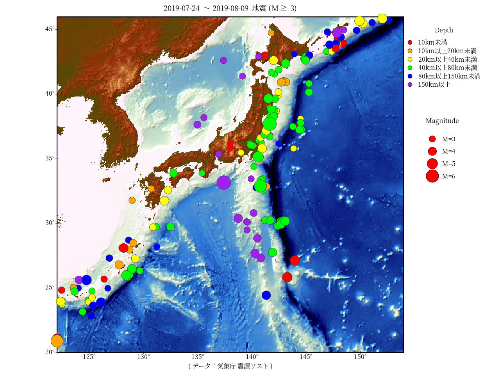

# RでWebスクレイピング02(気象庁 震源リスト)

＊Rコードは２０１９年９月１６日に実行しました。  

「Rで陰影段彩図04」で作成した陰影段彩図に「気象庁 震源リスト」から得た震源の位置をプロットします。  
今回は「RでWebスクレイピング01(気象庁 震源リスト)」で得たデータを陰影段彩図にプロットします。

## 「Rで陰影段彩図04」陰影段彩図＋気象庁 震源リスト


## Rコード

### パッケージの読み込み。陰影段彩図を描く準備。（「Rで陰影段彩図04」の再掲）

```R
library(raster)
library(rgdal)
library(marmap)
library(zoo)
Lon.range = c(122, 154)
Lat.range = c(20, 46)
#
axes1<-seq(125,150,5)
axes2<-seq(20,45,5)
#dat<-getNOAA.bathy(Lon.range[1],Lon.range[2],Lat.range[1],Lat.range[2],res=1,keep=TRUE)
#
dat<-read.bathy("marmap_coord_122;20;154;46_res_2.csv", header=TRUE)
r1<-marmap::as.raster(dat)
#配色はGMTのカラーパレット“relief”を参考にした
ocean<-colorRampPalette(c("#000000", "#000413", "#000728", "#002650", "#005E8C", 
                          "#0096C8", "#45BCBB", "#8AE2AE", "#BCF8B9" , "#DBFBDC"))
#
land1 <- colorRampPalette(c("#467832","#786432"))
land2 <- colorRampPalette(c("#786433","#927E3C"))
land3 <- colorRampPalette(c("#927E3D","#C6B250"))
land4 <- colorRampPalette(c("#C6B251","#FAE664"))
land5 <- colorRampPalette(c("#FAE665","#FAEA7E"))
breakpoints <- c(seq(-11000,0,100),1,seq(50,500,50),seq(550,1000,50),seq(1100,2000,100),seq(2100,3000,100),seq(3500,9000,500))
colors <- c(ocean(110),land1(11),land2(10),land3(10),land4(10),land5(12))
slope <- terrain(r1, opt='slope')
aspect <- terrain(r1, opt='aspect')
hill <- hillShade(slope, aspect,45,315) #,normalize=T
#欠損値の個数
sum(is.na(values(hill)))
#
m <- matrix(1, ncol=5, nrow=5)
hill <- focal(hill, m, fun="mean", na.rm=TRUE, NAonly=TRUE, pad=TRUE) 
sum(is.na(values(hill)))
#
## 彩色
v<-getValues(r1)
#欠損値の個数
sum(is.na(v))
#欠損値があった場合
#直前の値を入れる
#v<-na.locf(v) #zoo package
#平均値を入れる
#v[is.na(v)] <- mean(v,na.rm=T)
#0を入れる
#v[is.na(v)] <- 0
#
v<-as.vector(cut(v, breaks=breakpoints, labels = colors, right = F))
v1<-rgb2hsv(col2rgb(v))
#
## 陰影
x<-getValues(hill)
#欠損値の個数
#sum(is.na(x))
#x[is.na(x)] <- mean(x,na.rm=T)
#
#最小値を m、最大値を Mにする正規化
m<-0 ; M<-max(v1[3,])
x<-(M-m)*((x-min(x))/(max(x)-min(x)))+m
#
h<-NULL
for ( i in 1:length(x)){
  h[i]<-gray(x[i])
}
#h
h1<-rgb2hsv(col2rgb(h))
#
d1<-NULL
d1<-(v1+h1)/2
d1[1,]<-v1[1,]
#
g<-c(col2rgb(hsv(d1[1,],d1[2,],d1[3,]))[1,],
     col2rgb(hsv(d1[1,],d1[2,],d1[3,]))[2,],
     col2rgb(hsv(d1[1,],d1[2,],d1[3,]))[3,] )
s<-NULL
r<-r1
s <- stack(r, r, r)
values(s)<-g
```


### 「RでWebスクレイピング01(気象庁 震源リスト)」で保存したデータを読み込む

```R
load(file="eqdata20190724_0809.Rdata")
```

### データを加工する(「RでWebスクレイピング01(気象庁 震源リスト)」の再掲)

```R
#震源の深さによって色を分ける
eqdep<-c(-Inf,10,20,40,80,150,Inf)
eqcol<-c("red","orange","yellow","green","blue","purple")
#"D<10km"->"red" ,"10km<=D<20km"->"orange" ,"20km<=D<40km"->"yellow" ,"40km<=D<80km"->"green" ,"80km<=D<150km"->"blue","150km<=D"->"purple"
# cut関数 なに以上なになに未満となるようにright = F
eqdata$col<-as.vector(cut(eqdata$depth, breaks=eqdep, labels = eqcol, right = F))
#並べ替え:マグニチュードの昇順
sortlist <- order(eqdata$mag)
eq<- eqdata[sortlist,]
```


### プロットする最小のマグニチュードを決めて凡例を描く準備

```R
#データの期間（タイトルに書くため）
date<-c("2019-07-24","2019-08-09")
#プロットする最小のマグニチュード
ptmag<-3
over<-subset(eq,mag>=ptmag & 
               longitude>=Lon.range[1] & longitude<=Lon.range[2] &
               latitude>=Lat.range[1] & latitude<=Lat.range[2])
#マグニチュードに応じてプロットサイズを変える
msize<-1
cexsize=c(3,4,5,6)*msize
maglegend = c("M=3","M=4","M=5","M=6")
```

### 作図（googleのフォントを使う場合ネット接続が必要）

```R
library(showtext)
#https://fonts.google.com/
font_add_google("Noto Serif JP", regular.wt = 400, bold.wt = 600)
#png("Japaneq01.png",width=1280,height=960)
par(family="Noto Serif JP")
showtext_begin()
par(mar=c(4,1,3,8), xaxt="n", yaxt="n")
plotRGB(s,stretch='lin',axes=TRUE)
par(xpd=T)
rect(extent(s)[1],extent(s)[3],extent(s)[2],extent(s)[4],
     lwd=3)
text(axes1,extent(s)[3],paste0(as.character(axes1),"°"),pos=1)
text(extent(s)[1],axes2,paste0(as.character(axes2),"°"),pos=2)
points(x=axes1,y=rep(extent(s)[3],length(axes1)),cex=1,pch=3)
points(x=rep(extent(s)[1],length(axes2)),y=axes2,cex=1,pch=3)
#
points(x=over$longitude, y=over$latitude,cex=over$mag*msize,pch=21,bg=over$col,col="gray20")
#
legend("topright",title="Depth",
       legend = c("10km未満","10km以上20km未満","20km以上40km未満","40km以上80km未満","80km以上150km未満","150km以上"),  
       cex=1,pch=21,col=1,pt.bg=eqcol,
       pt.cex =2,bty = "n", x.intersp = 2, y.intersp =1.5, inset = c(-0.06, 0.03))
legend("topright",title="Magnitude",
       legend = maglegend, col=1,pch=21,pt.cex=cexsize,pt.bg=2,
       cex =1, x.intersp = 2, y.intersp =2.2,bty = "n", inset = c(-0.01, 0.3),adj = c(-0.1, 0.5))
#
par(xpd=F)
#bquote()内では、.(変数)とすることで、変数を受け取ることができる
date1<-date[1] ; date2<-date[length(date)]
title(bquote(.(date1) ~ "～" ~ .(date2) ~ 
               "地震 (" * M >= .(ptmag) * ")"))
title("","( データ：気象庁 震源リスト )",line=2)

showtext_end()
#dev.off()
```