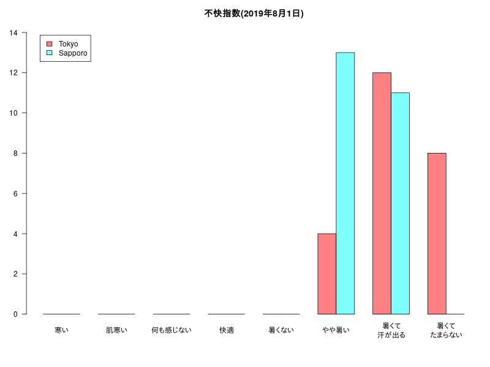

# 東京と札幌の気象の比較（とりあえず１日分）

今回は「2019/08/1」のデータを取ってきて「boxplot」「barplot」を作ります。  
スクレイピングするページのソースコードに目を通しておくと何をしているかわかりやすいとは思います。  
最終的には、「2001年から2019年まで」の「８月」のデータを「気象庁 過去の気象データ」から取ってきて  
- 「気温」と「湿度」の「boxplot」を作成する。
- 「不快指数」を算出し、「barplot」を作成する。  
  

### 「気温」と「湿度」の「boxplot」


### 「不快指数」(Discomfort index)の「barplot」


## Rコード

### 2019/8/1の東京、札幌のデータ取得

```R
library(rvest)
#
# 東京
url<-"http://www.data.jma.go.jp/obd/stats/etrn/view/hourly_s1.php?prec_no=44&block_no=47662&year=2019&month=08&day=1&view=p1"
#
html<-read_html(url, encoding = "UTF-8")
# class属性がh3タグのノード(1番め）のテキスト部分を抽出
titleT<-html_text(html_nodes(html, "h3")[1])
#
tables <- html_table(html,trim = TRUE, fill = T, dec = ".")
data <- data.frame(tables[[5]][-1,])
#必要な項目だけ取り出す::時 気圧.hPa.  降水量.mm. 気温 湿度 風向 風速
data<-data[,c(1,2,4,5,8,10,9)]
#列名を変更
colnames(data)<-c("時","気圧","降水量","気温","湿度","風向","風速")
#str(data)
# "風向"以外をnumeric
# data[c(1,2,3,4,5,7)]<-lapply(data[c(1,2,3,4,5,7)],as.numeric)
data[-6]<-lapply(data[-6],as.numeric)
#str(data)
Tokyo<-data
html_text(html_nodes(html, "h3")[1])
#
# 札幌
url<-"http://www.data.jma.go.jp/obd/stats/etrn/view/hourly_s1.php?prec_no=14&block_no=47412&year=2019&month=08&day=1&view=p1"
#
html<-read_html(url, encoding = "UTF-8")
# class属性がh3タグのノード(1番め）のテキスト部分を抽出
titleS<-html_text(html_nodes(html, "h3")[1])
#
tables <- html_table(html,trim = TRUE, fill = T, dec = ".")
data <- data.frame(tables[[5]][-1,])
#必要な項目だけ取り出す::時 気圧.hPa.  降水量.mm. 気温 湿度 風向 風速
data<-data[,c(1,2,4,5,8,10,9)]
#列名を変更
colnames(data)<-c("時","気圧","降水量","気温","湿度","風向","風速")
#str(data)
# "風向"以外をnumeric
# data[c(1,2,3,4,5,7)]<-lapply(data[c(1,2,3,4,5,7)],as.numeric)
data[-6]<-lapply(data[-6],as.numeric)
#str(data)
Sapporo<-data
html_text(html_nodes(html, "h3")[1])
```

### 「気温」と「湿度」の「boxplot」を作成

```R
#png("TS20190801.png",width=800,height=600)
par(mfrow=c(1,2))
# 気温
boxplot(Tokyo[,4],Sapporo[,4],names=c("Tokyo","Sapporo"),las=1)
title(paste(colnames(Tokyo)[4],"2019年8月1日"))
# 湿度
boxplot(Tokyo[,5],Sapporo[,5],names=c("Tokyo","Sapporo"),las=1)
title(paste(colnames(Tokyo)[5],"2019年8月1日"))
par(mfrow=c(1,1))
#dev.off()
```

### 「不快指数」(Discomfort index)の「barplot」

不快指数 DI=0.81T+0.01H×(0.99T−14.3)+46.3  

#### 算出するコード

```R
x <- c(54,55,59,60,64,65,69,70,74,75,79,80,84,85)
cut(x,breaks=c(0,55,60,65,70,75,80,85,100), 
	labels=c("寒い","肌寒い","何も感じない","快適","暑くない","やや暑い","暑くて汗が出る","暑くてたまらない"), 
	right = FALSE, include.lowest = TRUE)
#
# [1] 寒い             肌寒い           肌寒い           何も感じない    
# [5] 何も感じない     快適             快適             暑くない        
# [9] 暑くない         やや暑い         やや暑い         暑くて汗が出る  
#[13] 暑くて汗が出る   暑くてたまらない
```

####  「不快指数」の「barplot」

"暑くて汗が出る","暑くてたまらない"の表示を２行にしたいかったのでtext関数であとから書いています。

```R
# 東京
t<-Tokyo[,4] ; h<-Tokyo[,5]
x<-0.81*t+0.01*h*(0.99*t-14.3)+46.3
DI_T<-cut(x,breaks=c(0,55,60,65,70,75,80,85,100), 
	labels=c("寒い","肌寒い","何も感じない","快適","暑くない","やや暑い","暑くて汗が出る","暑くてたまらない"), 
	right = FALSE, include.lowest = TRUE)
#
# 札幌
t<-Sapporo[,4] ; h<-Sapporo[,5]
x<-0.81*t+0.01*h*(0.99*t-14.3)+46.3
DI_S<-cut(x,breaks=c(0,55,60,65,70,75,80,85,100), 
	labels=c("寒い","肌寒い","何も感じない","快適","暑くない","やや暑い","暑くて汗が出る","暑くてたまらない"), 
	right = FALSE, include.lowest = TRUE)
#
DI_TS<-cbind(Tokyo=table(DI_T),Sapporo=table(DI_S))
#
#png("DI20190801.png",width=800,height=600)
par(mar=c(6,3,3,1))
pos=barplot(t(DI_TS),beside=T,las=1,col=rainbow(2,0.5),ylim=c(0,max(DI_TS)*1.1),xaxt="n",legend=T,
	args.legend=list(x="topleft",inset =c(0.03,0.03)),main="不快指数(2019年8月1日)")
text(x=apply(pos,2,mean),y= -0.8 ,xpd=T,
	labels=c("寒い","肌寒い","何も感じない","快適","暑くない","やや暑い","暑くて\n汗が出る","暑くて\nたまらない"))
#dev.off()
```

