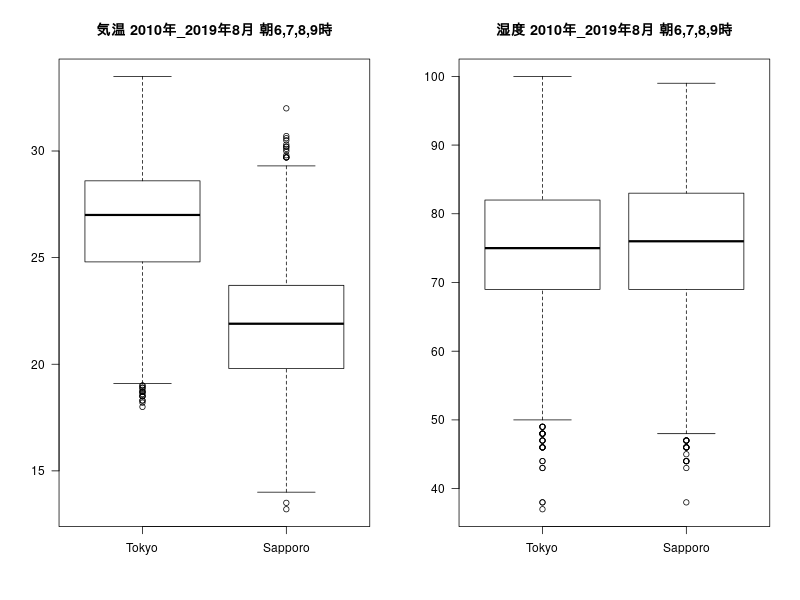
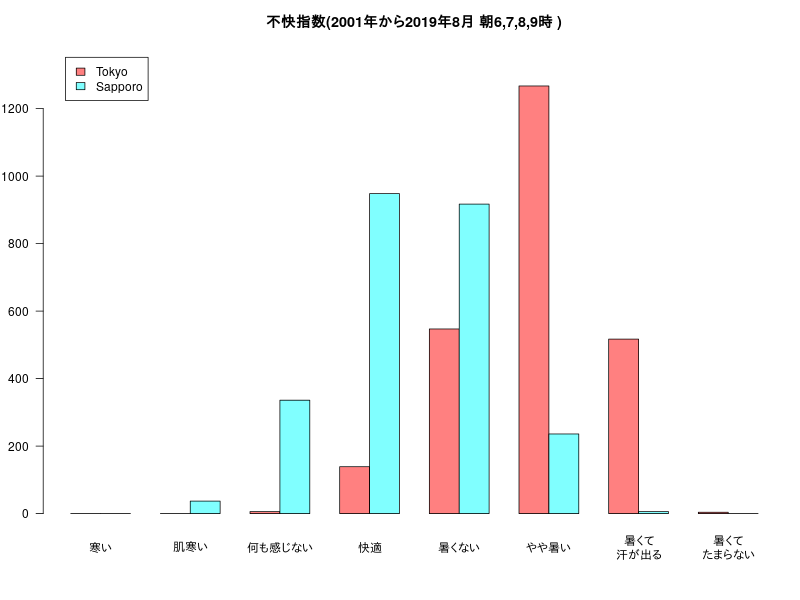

# 東京と札幌の「８月」の気象の比較

[日の出入り東京(東京都)2019年 8月](https://eco.mtk.nao.ac.jp/koyomi/dni/2019/s1308.html)    
[日の出入り札幌(北海道)2019年 8月](https://eco.mtk.nao.ac.jp/koyomi/dni/2019/s0008.html)  
東京：８月１日の日の出　4:48  
札幌：８月１日の日の出　4:24  

「2001年から2019年まで」の「８月」のデータを「気象庁 過去の気象データ」から取ってきて  
- 「気温」と「湿度」の「boxplot」を作成します。

- 「不快指数」を算出し、「barplot」を作成します。 

スクレイピングするページのソースコードに目を通しておくと何をしているかわかりやすいとは思います。  

### 「気温」と「湿度」の「boxplot」


### 「不快指数」(Discomfort index)の「barplot」


[東京五輪日程決定　マラソン６時　バスケ午前決勝](https://www.nikkansports.com/sports/news/201904160000322.html)  
- 男女マラソン、男女20キロ競歩が午前6時、男女50キロ競歩は同5時30分にスタート 
  
## 朝6,7,8,9時のデータ

### 「気温」と「湿度」の「boxplot」(朝6,7,8,9時のデータ)


### 「不快指数」(Discomfort index)の「barplot」(朝6,7,8,9時のデータ)


## 仮に朝５時にスタートする場合(朝5,6,7,8時のデータ)

### 「気温」と「湿度」の「boxplot」(朝6,7,8,9時のデータ)


### 「不快指数」(Discomfort index)の「barplot」(朝6,7,8,9時のデータ)


## Rコード

### 東京、札幌の2001〜2019の8月の1時間ごとのデータ取得

#### (注)多くのデータを取得するので、頻繁にアクセスすると気象庁のサイトに負荷がかかります。ダウンロードしたデータは必ず保存しときましょう。

#### 東京

```R
prec_no=44
block_no=47662
```

#### 札幌

```R
prec_no=14
block_no=47412
```

#### 共通（気象データを得る。ただし、block_noが５桁の場合）

```R
library(rvest)
#
# colnameをつけた0行のdata.frameを作成
x <- data.frame(matrix(rep(NA,8),nrow=1))[numeric(0), ]
names(x)<-c("date","time","pressure","precipitation","temperature","humidity","wind_direction","wind_speed")
#
year<-as.character(seq(2000,2019,1))
month<-8
day<- as.character(1:31)
#
for (i in year){
	for (j in day){
url <- paste0("http://www.data.jma.go.jp/obd/stats/etrn/view/hourly_s1.php?prec_no=",prec_no,"&block_no=",block_no,"&year=",i,"&month=",month,"&day=",j )
html<-read_html(url, encoding = "UTF-8")
#
tables <- html_table(html,trim = TRUE, fill = T, dec = ".")
data <- data.frame(tables[[5]][-1,])
#必要な項目だけ取り出す::時 気圧.hPa.  降水量.mm. 気温 湿度 風向 風速
data<-data[,c(1,2,4,5,8,10,9)]
# "風向"以外をnumeric
# data[c(1,2,3,4,5,7)]<-lapply(data[c(1,2,3,4,5,7)],as.numeric)
data[-6]<-lapply(data[-6],as.numeric)
#
date<-paste0(i,"/",month,"/",j)
d1<- data.frame(matrix(rep(date,24),ncol=1))
data<-cbind(d1,data)
#列名を変更
colnames(data)<-c("date","time","pressure","precipitation","temperature","humidity","wind_direction","wind_speed")
x<-rbind(x,data)
	}
}
```

#### 共通（望んだ場所のデータが得られているか確認）

class属性がh3タグのノード(1番め）のテキスト部分を抽出

```R
html_text(html_nodes(html, "h3")[1])
```

こんなふうに表示されます。  
[1] "東京　2019年8月31日　（１時間ごとの値）"  
[1] "札幌　2019年8月31日　（１時間ごとの値）"  

#### 共通（取得したデータの確認）

```R
str(x)
```

札幌の場合

'data.frame':	14880 obs. of  8 variables:  
 $ date          : Factor w/ 620 levels "2000/8/1","2000/8/2",..: 1 1 1 1 1 1 1 1 1 1 ...  
 $ time          : num  1 2 3 4 5 6 7 8 9 10 ...  
 $ pressure      : num  1004 1004 1004 1004 1004 ...  
 $ precipitation : num  NA NA NA NA NA NA NA NA NA NA ...  
 $ temperature   : num  25.3 24.8 24.2 23.8 23.4 24.3 25.9 28 29.7 31.3 ...  
 $ humidity      : num  83 84 86 87 91 86 80 74 73 68 ...  
 $ wind_direction: chr  "東北東" "東南東" "東北東" "東南東" ...  
 $ wind_speed    : num  1 1.5 1.8 2.1 2 2.2 2.3 2.8 3.3 3.3 ...  

### 何度もアクセスしなくてすむように必ずデータを保存する。

#### 東京

```R
Tokyo<-x
save(Tokyo,file="Tokyo.Rdata")
#load("Tokyo.Rdata")
```

#### 札幌

```R
Sapporo<-x
save(Sapporo,file="Sapporo.Rdata")
#load("Sapporo.Rdata")
```

### 「気温」と「湿度」の「boxplot」を作成

```R
#png("TS08.png",width=800,height=600)
par(mfrow=c(1,2))
# 気温
boxplot(Tokyo$temperature,Sapporo$temperature,names=c("Tokyo","Sapporo"),las=1)
title("気温 8月2010年_2019年")
# 湿度
boxplot(Tokyo$humidity,Sapporo$humidity,names=c("Tokyo","Sapporo"),las=1)
title("湿度 8月2010年_2019年")
par(mfrow=c(1,1))
#dev.off()
```

### 「不快指数」(Discomfort index)の「barplot」

不快指数 DI=0.81T+0.01H×(0.99T−14.3)+46.3  

#### 算出するコード

```R
x <- c(54,55,59,60,64,65,69,70,74,75,79,80,84,85)
cut(x,breaks=c(0,55,60,65,70,75,80,85,100), 
	labels=c("寒い","肌寒い","何も感じない","快適","暑くない","やや暑い","暑くて汗が出る","暑くてたまらない"), 
	right = FALSE, include.lowest = TRUE)
#
# [1] 寒い             肌寒い           肌寒い           何も感じない    
# [5] 何も感じない     快適             快適             暑くない        
# [9] 暑くない         やや暑い         やや暑い         暑くて汗が出る  
#[13] 暑くて汗が出る   暑くてたまらない
```

####  「不快指数」の「barplot」

"暑くて汗が出る","暑くてたまらない"の表示を２行にしたいかったのでtext関数であとから書いています。

```R
# 東京
t<-Tokyo$temperature ; h<-Tokyo$humidity
x<-0.81*t+0.01*h*(0.99*t-14.3)+46.3
DI_T<-cut(x,breaks=c(0,55,60,65,70,75,80,85,100), 
	labels=c("寒い","肌寒い","何も感じない","快適","暑くない","やや暑い","暑くて汗が出る","暑くてたまらない"), 
	right = FALSE, include.lowest = TRUE)
#
# 札幌
t<-Sapporo$temperature ; h<-Sapporo$humidity
x<-0.81*t+0.01*h*(0.99*t-14.3)+46.3
DI_S<-cut(x,breaks=c(0,55,60,65,70,75,80,85,100), 
	labels=c("寒い","肌寒い","何も感じない","快適","暑くない","やや暑い","暑くて汗が出る","暑くてたまらない"), 
	right = FALSE, include.lowest = TRUE)
#
DI_TS<-cbind(Tokyo=table(DI_T),Sapporo=table(DI_S))
#
#png("DI08.png",width=800,height=600)
par(mar=c(6,3,3,1))
pos=barplot(t(DI_TS),beside=T,las=1,col=rainbow(2,0.5),ylim=c(0,max(DI_TS)*1.1),xaxt="n",legend=T,
	args.legend=list(x="topleft",inset =c(0.03,0.03)),main="不快指数(8月2001年から2019年)")
text(x=apply(pos,2,mean),y= -500 ,xpd=T,
	labels=c("寒い","肌寒い","何も感じない","快適","暑くない","やや暑い","暑くて\n汗が出る","暑くて\nたまらない"))
#dev.off()
```

## 朝6,7,8,9時のデータ

```R
Tokyo2<-Tokyo[Tokyo$time=="6"|Tokyo$time=="7"|Tokyo$time=="8"|Tokyo$time=="9",c("temperature","humidity")]
Sapporo2<-Sapporo[Sapporo$time=="6"|Sapporo$time=="7"|Sapporo$time=="8"|Sapporo$time=="9",c("temperature","humidity")]
time<-"朝6,7,8,9時"
```

## 朝5,6,7,8時のデータ

```R
Tokyo2<-Tokyo[Tokyo$time=="5"|Tokyo$time=="6"|Tokyo$time=="7"|Tokyo$time=="8",c("temperature","humidity")]
Sapporo2<-Sapporo[Sapporo$time=="5"|Sapporo$time=="6"|Sapporo$time=="7"|Sapporo$time=="8",c("temperature","humidity")]
time<-"朝5,6,7,8時"
```

### 「気温」と「湿度」の「boxplot」を作成

```R
#png("TS086789.png",width=800,height=600)
par(mfrow=c(1,2))
# 気温
boxplot(Tokyo2$temperature,Sapporo2$temperature,names=c("Tokyo","Sapporo"),las=1)
title(paste("気温 2010年_2019年8月",time))
# 湿度
boxplot(Tokyo2$humidity,Sapporo2$humidity,names=c("Tokyo","Sapporo"),las=1)
title(paste("湿度 2010年_2019年8月",time))
par(mfrow=c(1,1))
#dev.off()
```

### 「不快指数」(Discomfort index)の「barplot」

不快指数 DI=0.81T+0.01H×(0.99T−14.3)+46.3  

####  「不快指数」の「barplot」

"暑くて汗が出る","暑くてたまらない"の表示を２行にしたいかったのでtext関数であとから書いています。

```R
# 東京
t<-Tokyo2$temperature ; h<-Tokyo2$humidity
x<-0.81*t+0.01*h*(0.99*t-14.3)+46.3
DI_T<-cut(x,breaks=c(0,55,60,65,70,75,80,85,100), 
	labels=c("寒い","肌寒い","何も感じない","快適","暑くない","やや暑い","暑くて汗が出る","暑くてたまらない"), 
	right = FALSE, include.lowest = TRUE)
#
# 札幌
t<-Sapporo2$temperature ; h<-Sapporo2$humidity
x<-0.81*t+0.01*h*(0.99*t-14.3)+46.3
DI_S<-cut(x,breaks=c(0,55,60,65,70,75,80,85,100), 
	labels=c("寒い","肌寒い","何も感じない","快適","暑くない","やや暑い","暑くて汗が出る","暑くてたまらない"), 
	right = FALSE, include.lowest = TRUE)
#
DI_TS<-cbind(Tokyo2=table(DI_T),Sapporo2=table(DI_S))
#
#png("DI086789.png",width=800,height=600)
par(mar=c(6,3,3,1))
pos=barplot(t(DI_TS),beside=T,las=1,col=rainbow(2,0.5),ylim=c(0,max(DI_TS)*1.1),xaxt="n",legend=T,
	args.legend=list(x="topleft",inset =c(0.03,0.03),legend=c("Tokyo","Sapporo")),main=paste("不快指数(2001年から2019年8月",time,")" ))
text(x=apply(pos,2,mean),y= -100 ,xpd=T,
	labels=c("寒い","肌寒い","何も感じない","快適","暑くない","やや暑い","暑くて\n汗が出る","暑くて\nたまらない"))
#dev.off()
```


