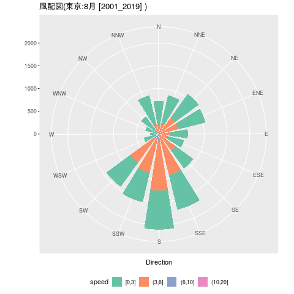
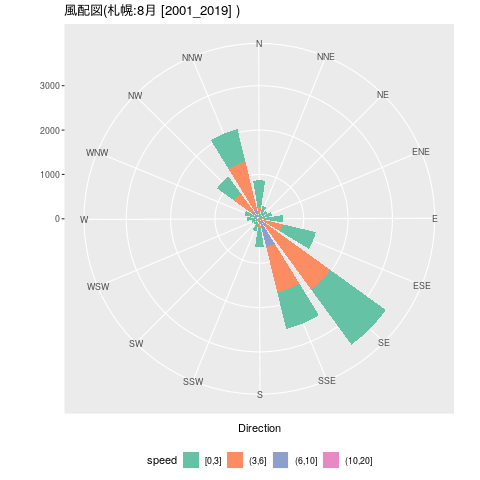

# Rで風配図(windrose)を作成する。

「RでWebスクレイピング05(気象庁 過去の気象データ:８月 2001〜2019)(＋朝5,6,7,8時のデータ)」で得たデータを使って風配図(windrose)を作ります。  
今回は、ggplot2を使います。  

## 風向き、風速の分布

### 東京

#### 風向き、風速の分布

|        |   N| NNE|  NE| ENE|   E| ESE|  SE| SSE|    S| SSW|  SW| WSW|   W| WNW|  NW| NNW|
|:-------|---:|---:|---:|---:|---:|---:|---:|---:|----:|---:|---:|---:|---:|---:|---:|---:|
|[0,3]   | 546| 629| 646| 615| 380| 380| 482| 783|  853| 663| 652| 295| 180| 266| 365| 659|
|(3,6]   | 169| 232| 417| 411| 254| 186| 436| 849| 1094| 775| 662|  49|  11|  39|  83| 199|
|(6,10]  |  10|  15|  24|  29|   4|   6|  17|  81|  152|  97| 110|   0|   1|   3|  34|  16|
|(10,20] |   1|   0|   1|   0|   2|   1|   0|   0|    0|   4|   7|   0|   1|   0|   0|   0|
|(20,    |   0|   0|   0|   0|   0|   0|   0|   0|    0|   0|   0|   0|   0|   0|   0|   0|

#### 風向きだけの分布

|   N| NNE|   NE|  ENE|   E| ESE|  SE|  SSE|    S|  SSW|   SW| WSW|   W| WNW|  NW| NNW|
|---:|---:|----:|----:|---:|---:|---:|----:|----:|----:|----:|---:|---:|---:|---:|---:|
| 726| 876| 1088| 1055| 640| 573| 935| 1713| 2099| 1539| 1431| 344| 193| 308| 482| 874|

## 風配図(windrose)



### 札幌

#### 風向き、風速の分布

|        |   N| NNE|  NE| ENE|   E| ESE|   SE|  SSE|   S| SSW|  SW| WSW|   W| WNW|  NW|  NNW|
|:-------|---:|---:|---:|---:|---:|---:|----:|----:|---:|---:|---:|---:|---:|---:|---:|----:|
|[0,3]   | 608| 274| 214| 274| 438| 768| 1541|  844| 432| 197| 125| 149| 248| 305| 463|  754|
|(3,6]   | 252|  22|   7|  21|  99| 520| 1776| 1052| 141|  87|  34|  32|  29|  39| 503| 1104|
|(6,10]  |   9|   1|   0|   0|   2|  20|  193|  613|  68|   8|   2|   6|   3|   6| 208|  216|
|(10,20] |   0|   0|   0|   0|   0|   0|    3|   44|   8|   0|   0|   0|   0|   0|   3|    6|
|(20,    |   0|   0|   0|   0|   0|   0|    0|    0|   0|   0|   0|   0|   0|   0|   0|    0|

#### 風向きだけの分布

|   N| NNE|  NE| ENE|   E|  ESE|   SE|  SSE|   S| SSW|  SW| WSW|   W| WNW|   NW|  NNW|
|---:|---:|---:|---:|---:|----:|----:|----:|---:|---:|---:|---:|---:|---:|----:|----:|
| 869| 297| 221| 295| 539| 1308| 3513| 2553| 649| 292| 161| 187| 280| 350| 1177| 2080|

## 風配図(windrose)



## Rコード

### 東京

```P
load("Tokyo.Rdata")
block<-"東京"
weather<-Tokyo
```

### 札幌

```R
load("Sapporo.Rdata")
block<-"札幌"
weather<-Sapporo
```

### 共通

```R
year<-"2001_2019"
month<-"8"
#
library(ggplot2)
library(knitr)
#
ord<-c("N","NNE","NE","ENE","E","ESE","SE","SSE","S","SSW","SW","WSW","W","WNW","NW","NNW")
#
wind<-data.frame(direction=as.vector(chartr("東西南北", "EWSN",weather$wind_direction)),
	speed=as.numeric(as.vector(weather$wind_speed)))
#directionにはいっているのは方向とは限らない。"静穏"や"///"や"x"
#directionに風向きが入っているデータだけ抽出
wind<- subset(wind,direction=="N"|direction=="NNE"|direction=="NE"|direction=="ENE"|direction=="E"|direction=="ESE"|direction=="SE"|direction=="SSE"|direction=="S"|direction=="SSW"|direction=="SW"|direction=="WSW"|direction=="W"|direction=="WNW"|direction=="NW"|direction=="NNW")
#
wind$direction<- factor(wind$direction,levels=ord)
#
#ダミーのデータ（すべての方向、風速は欠損値）を結合する。
dummy<-data.frame(direction=levels(wind$direction),speed=rep(NA,16))
newwind<-rbind(wind[,c("direction","speed")],dummy)
newwind$direction<- factor(newwind$direction,levels=ord)
# NA を含む行を削除する
newwind<-na.omit(newwind)
#
newwind$cut<-cut(newwind$speed,breaks=c(0,3,6,10,20,100),labels=c("[0,3]","(3,6]","(6,10]","(10,20]" ,"(20,  ") ,right =TRUE, include.lowest = TRUE) 
#
## 風向き、風速の分布
kable(table(newwind$cut,newwind$direction))
#
## 風向きだけの分布
kable(t(apply(table(newwind$cut,newwind$direction),2,sum)))
#
## 風配図(windrose)を作成
#png("windroseT08.png")
#png("windroseS08.png")
ggplot(newwind, aes(x =factor(direction),fill = cut)) + geom_bar(width =0.8) + coord_polar(theta = "x",start = -0.2) + 
     scale_fill_brewer(palette = "Set2") +
     theme(legend.position="bottom")+
     labs(fill = "speed",x="Direction",y="",title=paste0("風配図(",block,":",month,"月 [",year,"] )"))
#dev.off()
```