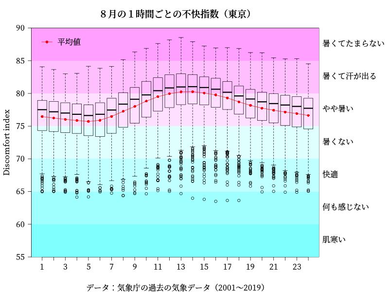
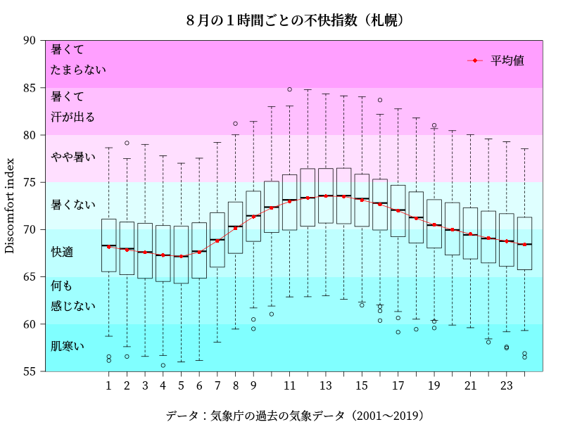

# Rでひと工夫したboxplotを作成する。

「RでWebスクレイピング05(気象庁 過去の気象データ:８月 2001〜2019)(＋朝5,6,7,8時のデータ)」で得たデータを使って箱ひげ図(boxplot)を作ります。  
背景を色分けしてみました。  

### 東京

## 箱ひげ図(boxplot)



### 札幌

## 箱ひげ図(boxplot)



## Rコード

### 東京

```R
load("Tokyo.Rdata")
# 不快指数 DI=0.81T+0.01H×(0.99T−14.3)+46.3
t<-Tokyo[,"temperature"] ; h<-Tokyo[,"humidity"]
Tokyo$DI<-0.81*t+0.01*h*(0.99*t-14.3)+46.3
# tapply関数を使って、１時間毎の平均値を求めます。
DI<-tapply(Tokyo[,"DI"],Tokyo[,"time"], mean,na.rm=T)
#
# ylimを決めるためにrange関数を使う。
range(Tokyo$DI,na.rm=T)
#[1] 63.50547 88.55150
#
# 作図
#png("DItimeT.png",width=800,height=600)
par(mar=c(5,4.5,4,8))
# ylimの目安：札幌の最小値から東京の最大値
ylim<-c(55,90)
# type="n"でグラフは書かない。yaxs="i"でy軸の隙間をなくす。
plot(DI,type="n",las=1,xaxt="n",xlab="",ylab="Discomfort index",ylim=ylim,yaxs="i")
axis(1,1:24)
# 背景を不快指数のレベルに応じて塗り分けるための境界
cutline<-c(ylim[1],60,65,70,75,80,85,ylim[2])
# 背景を不快指数のレベルに応じて塗り分ける
# 枠外にラベルをつける。
for ( i in 2:length(cutline)){
 rect(par("usr")[1],cutline[i-1],par("usr")[2],cutline[i],col=cm.colors(8)[i-1],lwd=0) 
 label=as.character(cut((cutline[i-1]+cutline[i])/2,breaks=c(0,55,60,65,70,75,80,85,100), 
	labels=c("寒い","肌寒い","何も感じない","快適","暑くない","やや暑い","暑くて汗が出る","暑くてたまらない"), 
	right = FALSE, include.lowest = TRUE))
 text(x=par("usr")[2],y=(cutline[i-1]+cutline[i])/2,labels=label,pos=4,xpd=T)
}
# 箱ひげ図（boxplot）
boxplot(Tokyo[,"DI"]~Tokyo[,"time"],ylim=c(60,90),xlab="",ylab="",axes=F,add=T)
# 平均値のグラフ
points(1:24,DI,col="red",pch=16)
lines(1:24,DI,col="red")
legend("topleft",legend="平均値",pch=16,col="red",lty=1,bty="n")
title("８月の１時間ごとの不快指数（東京）","データ：気象庁の過去の気象データ（2001〜2019）")
#dev.off()
```

### 札幌

```R
load("Sapporo.Rdata")
# 不快指数 DI=0.81T+0.01H×(0.99T−14.3)+46.3
t<-Sapporo[,"temperature"] ; h<-Sapporo[,"humidity"]
Sapporo$DI<-0.81*t+0.01*h*(0.99*t-14.3)+46.3
DI<-tapply(Sapporo[,"DI"],Sapporo[,"time"], mean,na.rm=T)
#
range(Sapporo$DI,na.rm=T)
#[1] 55.63283 84.82515
#
# 作図
#png("DItimeS.png",width=800,height=600)
par(mar=c(5,4.5,4,8))
ylim<-c(55,90)
plot(DI,type="n",las=1,xaxt="n",xlab="",ylab="Discomfort index",ylim=ylim,yaxs="i")
axis(1,1:24)
#
cutline<-c(ylim[1],60,65,70,75,80,85,ylim[2])
for ( i in 2:length(cutline)){
 rect(par("usr")[1],cutline[i-1],par("usr")[2],cutline[i],col=cm.colors(8)[i-1],lwd=0) 
 label=as.character(cut((cutline[i-1]+cutline[i])/2,breaks=c(0,55,60,65,70,75,80,85,100), 
	labels=c("寒い","肌寒い","何も感じない","快適","暑くない","やや暑い","暑くて汗が出る","暑くてたまらない"), 
	right = FALSE, include.lowest = TRUE))
 text(x=par("usr")[2],y=(cutline[i-1]+cutline[i])/2,labels=label,pos=4,xpd=T)
}
boxplot(Sapporo[,"DI"]~Sapporo[,"time"],ylim=c(60,90),xlab="",ylab="",axes=F,add=T)
points(1:24,DI,col="red",pch=16)
lines(1:24,DI,col="red")
legend("topleft",legend="平均値",pch=16,col="red",lty=1,bty="n")
title("８月の１時間ごとの不快指数（札幌）","データ：気象庁の過去の気象データ（2001〜2019）")
#dev.off()
```
