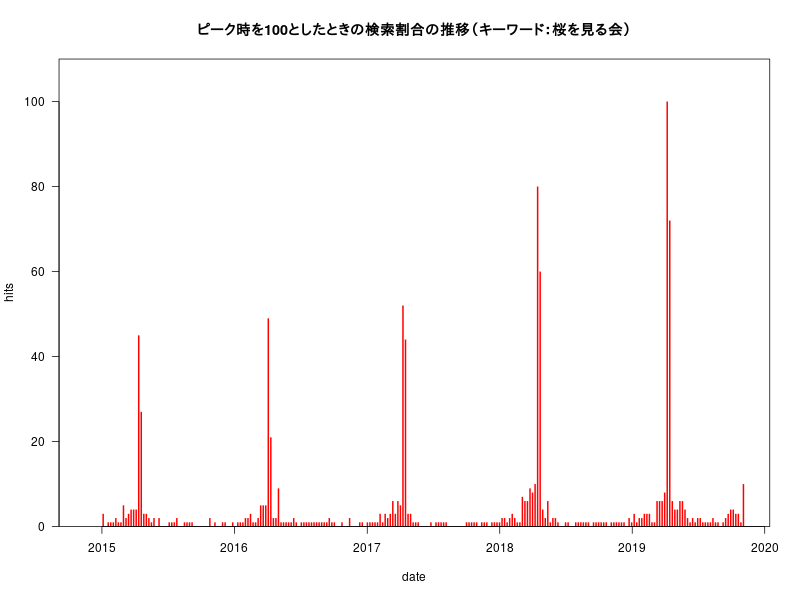
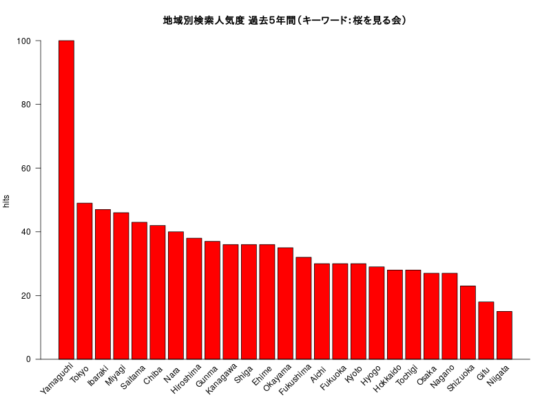
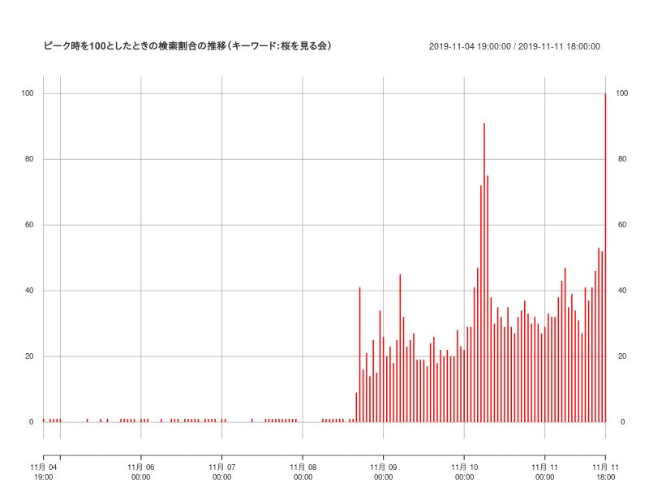
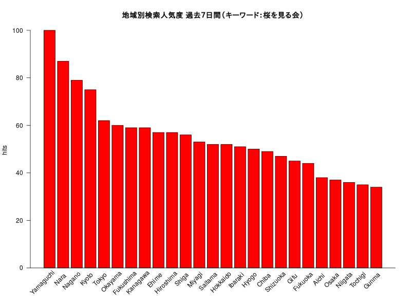

# RでWebスクレイピング09(gtrendsRで「桜を見る会」)

日本時間　2019/11/11 午後6時頃にアクセス

## Last five years (default)

### interest_over_time



### interest_by_region

＊ 山口県ダントツ



## Last seven days

### interest_over_time

＊ 「桜を見る会」への関心が高まっているのがわかる。



### interest_by_region



## Rコード

### Last five years (default)

interest_over_time

```R
#devtools::install_github("PMassicotte/gtrendsR")
library(gtrendsR)
library(plotrix)
sakura <- gtrends(c("桜を見る会"), geo ="JP")
### interest_over_time
#簡単にグラフにできる
#plot(sakura)
#barplot
#barplot(hits~date,col="red",las=1,data=sakura[[1]])
#png("sakura01.png",width=800,height=600)
plot(hits~date,type="h",lwd=2,lend=1,col="red",yaxs="i",ylim=c(0,max(sakura[[1]]$hits)*1.1),las=1,data=sakura[[1]])
title("ピーク時を100としたときの検索割合の推移（キーワード：桜を見る会）")
#dev.off()
```

interest_by_region

```R
# hitsがNAの地域は取り除く
dat<-na.omit(sakura[[3]])[,c("location","hits")]
# グラフを見やすくするためdat$locationから" Prefecture"を消す。
dat$location<-gsub(" Prefecture","",dat$location)
# hitsの降順にする。
dat$location<-factor(dat$location,levels=dat[order(dat$hits,decreasing =T),"location"])
#
#png("sakura02.png",width=800,height=600)
xpos<-barplot(hits~location,xaxt="n",col="red",las=1,xlab="",data=dat)
# plotrix::staxlab
staxlab(1,at=xpos[1:nrow(dat)],labels=dat$location,srt=45,adj =0.8,ticklen = 0.025)
abline(h=0)
title("地域別検索人気度 過去５年間（キーワード：桜を見る会）")
#dev.off()
```

### Last seven days

interest_over_time  

＊ xtsパッケージを使います。

```R
library(gtrendsR)
library(plotrix)
library(xts)
sakura7 <- gtrends(c("桜を見る会"), geo ="JP",time="now 7-d")
#簡単にグラフにできる
#plot(sakura7)
dat<-sakura7[[1]][,c("date", "hits")]
# 余分な文字"<"を取り除く
dat$hits<-as.numeric(gsub("<","",dat$hits))
#
# xtsクラスへ
dat.xts <- xts(dat[,-1], strptime(dat$date, "%Y-%m-%d %H:%M:%S"))
# 日本時間に直すために9時間（9*60*60 秒）加える
index(dat.xts)<-index(dat.xts)+9*60*60
colnames(dat.xts)<-"hits"
#
#png("sakura03.png",width=800,height=600)
plot.xts(dat.xts,type="h",lend=1,lwd=5,col="red",ylim=c(-5,max(dat.xts$hits)*1.05),
	main="ピーク時を100としたときの検索割合の推移（キーワード：桜を見る会）")
#dev.off()
```

interest_by_region

```R
dat<-na.omit(sakura7[[3]])[,c("location","hits")]
dat$location<-gsub(" Prefecture","",dat$location)
dat$location<-factor(dat$location,levels=dat[order(dat$hits,decreasing =T),"location"])
#
#png("sakura04.png",width=800,height=600)
xpos<-barplot(hits~location,xaxt="n",col="red",las=1,xlab="",data=dat)
staxlab(1,at=xpos[1:nrow(dat)],labels=dat$location,srt=45,adj =0.8,ticklen = 0.025)
abline(h=0)
title("地域別検索人気度 過去７日間（キーワード：桜を見る会）")
#dev.off()
```
