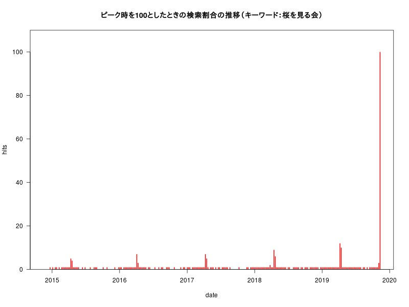
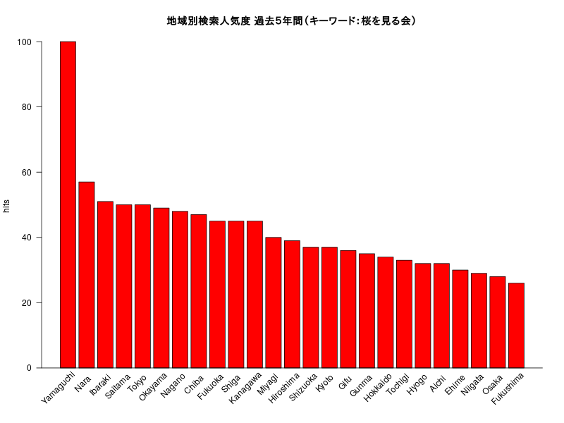
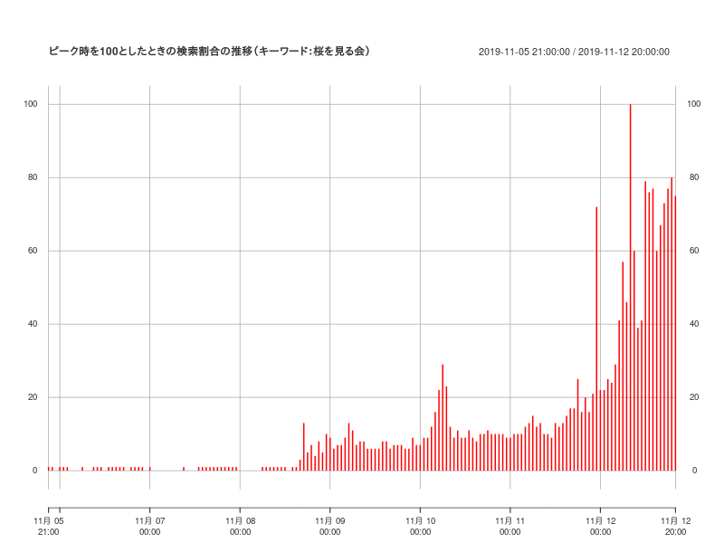

# RでWebスクレイピング09(gtrendsRで「桜を見る会」)

[公職選挙法(e-Gov)](https://elaws.e-gov.go.jp/search/elawsSearch/elaws_search/lsg0500/detail?lawId=325AC1000000100)  

## 第二百二十一条（買収及び利害誘導罪）

>次の各号に掲げる行為をした者は、三年以下の懲役若しくは禁錮 又は五十万円以下の罰金に処する。  
>一　当選を得若しくは得しめ又は得しめない目的をもつて選挙人又は選挙運動者に対し**金銭、物品その他の財産上の利益**若しくは公私の職務の供与、その供与の申込み若しくは約束をし又は**供応接待**、その申込み若しくは約束をしたとき。


## 第二百二十二条（多数人買収及び多数人利害誘導罪）  

>左の各号に掲げる行為をした者は、五年以下の懲役又は禁錮 に処する。  
>一　財産上の利益を図る目的をもつて公職の候補者又は公職の候補者となろうとする者のため**多数の選挙人又は選挙運動者**に対し前条第一項第一号から第三号まで、第五号又は第六号に掲げる行為をし又はさせたとき。

（追加）日本時間　2019/11/16 午前11時頃にアクセス

### interest_over_time

＊ 今週の検索割合圧倒的に多い。



### interest_by_region

＊ 今回も山口県ダントツ



（追加）日本時間　2019/11/12 午後8時頃にアクセス

＊ 検索割合が11/12は11/8の10倍くらい



日本時間　2019/11/11 午後6時頃にアクセス

## Last five years (default)

### interest_over_time


### interest_by_region

＊ 山口県ダントツ


## Last seven days

### interest_over_time

＊ 「桜を見る会」への関心が高まっているのがわかる。


### interest_by_region


## Rコード

### Last five years (default)

interest_over_time（改）

```R
#devtools::install_github("PMassicotte/gtrendsR")
library(gtrendsR)
library(plotrix)
sakura <- gtrends(c("桜を見る会"), geo ="JP")
### interest_over_time
#簡単にグラフにできる
#plot(sakura)
# 今回はデータのhits項目に"<1" （1未満）がみられるので"<"を取り除く
dat<-sakura[[1]][,c("date", "hits")]
dat$hits<-as.numeric(gsub("<","",dat$hits))
#barplot
#barplot(hits~date,col="red",las=1,data=dat)
#png("sakura01.png",width=800,height=600)
plot(hits~date,type="h",lwd=2,lend=1,col="red",yaxs="i",ylim=c(0,max(dat$hits)*1.1),las=1,data=dat)
title("ピーク時を100としたときの検索割合の推移（キーワード：桜を見る会）")
#dev.off()
```

interest_by_region

```R
# hitsがNAの地域は取り除く
dat<-na.omit(sakura[[3]])[,c("location","hits")]
# グラフを見やすくするためdat$locationから" Prefecture"を消す。
dat$location<-gsub(" Prefecture","",dat$location)
# hitsの降順にする。
dat$location<-factor(dat$location,levels=dat[order(dat$hits,decreasing =T),"location"])
#
#png("sakura02.png",width=800,height=600)
xpos<-barplot(hits~location,xaxt="n",col="red",las=1,xlab="",data=dat)
# plotrix::staxlab
staxlab(1,at=xpos[1:nrow(dat)],labels=dat$location,srt=45,adj =0.8,ticklen = 0.025)
abline(h=0)
title("地域別検索人気度 過去５年間（キーワード：桜を見る会）")
#dev.off()
```

### Last seven days

interest_over_time  

＊ xtsパッケージを使います。

```R
library(gtrendsR)
library(plotrix)
library(xts)
sakura7 <- gtrends(c("桜を見る会"), geo ="JP",time="now 7-d")
#簡単にグラフにできる
#plot(sakura7)
dat<-sakura7[[1]][,c("date", "hits")]
# 余分な文字"<"を取り除く
dat$hits<-as.numeric(gsub("<","",dat$hits))
#
# xtsクラスへ
dat.xts <- xts(dat[,-1], strptime(dat$date, "%Y-%m-%d %H:%M:%S"))
# 日本時間に直すために9時間（9*60*60 秒）加える
index(dat.xts)<-index(dat.xts)+9*60*60
colnames(dat.xts)<-"hits"
#
#png("sakura03.png",width=800,height=600)
plot.xts(dat.xts,type="h",lend=1,lwd=5,col="red",ylim=c(-5,max(dat.xts$hits)*1.05),
	main="ピーク時を100としたときの検索割合の推移（キーワード：桜を見る会）")
#dev.off()
```

interest_by_region

```R
dat<-na.omit(sakura7[[3]])[,c("location","hits")]
dat$location<-gsub(" Prefecture","",dat$location)
dat$location<-factor(dat$location,levels=dat[order(dat$hits,decreasing =T),"location"])
#
#png("sakura04.png",width=800,height=600)
xpos<-barplot(hits~location,xaxt="n",col="red",las=1,xlab="",data=dat)
staxlab(1,at=xpos[1:nrow(dat)],labels=dat$location,srt=45,adj =0.8,ticklen = 0.025)
abline(h=0)
title("地域別検索人気度 過去７日間（キーワード：桜を見る会）")
#dev.off()
```
