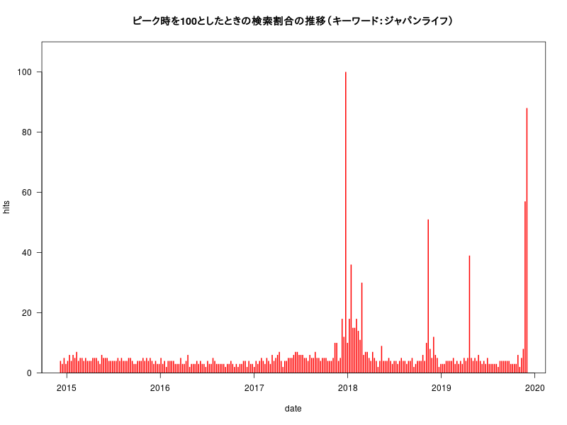
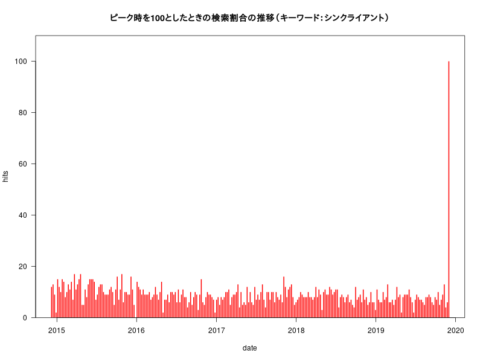
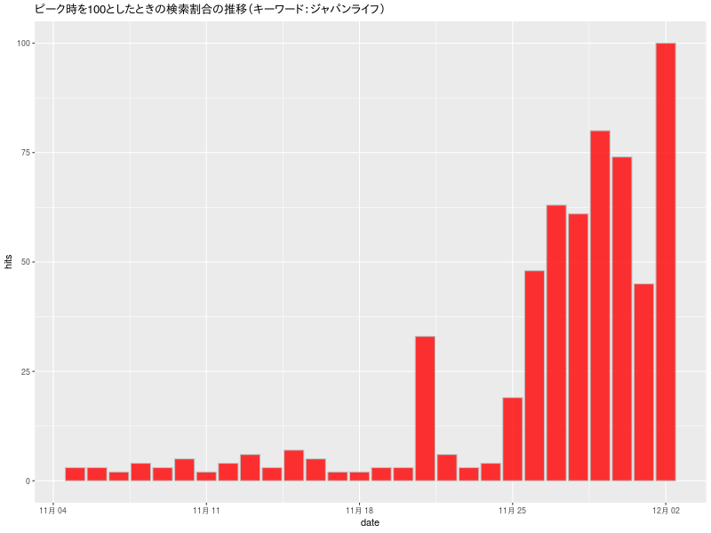

# RでWebスクレイピング10(gtrendsRで「ジャパンライフ」「シンクライアント」)

[公職選挙法(e-Gov)](https://elaws.e-gov.go.jp/search/elawsSearch/elaws_search/lsg0500/detail?lawId=325AC1000000100)  

## 第二百二十一条（買収及び利害誘導罪）

>次の各号に掲げる行為をした者は、三年以下の懲役若しくは禁錮 又は五十万円以下の罰金に処する。  
>一　当選を得若しくは得しめ又は得しめない目的をもつて選挙人又は選挙運動者に対し**金銭、物品その他の財産上の利益**若しくは公私の職務の供与、その供与の申込み若しくは約束をし又は**供応接待**、その申込み若しくは約束をしたとき。


## 第二百二十二条（多数人買収及び多数人利害誘導罪）  

>左の各号に掲げる行為をした者は、五年以下の懲役又は禁錮 に処する。  
>一　財産上の利益を図る目的をもつて公職の候補者又は公職の候補者となろうとする者のため**多数の選挙人又は選挙運動者**に対し前条第一項第一号から第三号まで、第五号又は第六号に掲げる行為をし又はさせたとき。

## Last five years (default)

### interest_over_time

#### Last five years (default)





#### Past 30 days



### related_topics

|subject  |related_topics |value            |geo |keyword        |
|:--------|:--------------|:----------------|:---|:--------------|
|5        |top            |Chairperson      |JP  |ジャパンライフ |
|3        |top            |President        |JP  |ジャパンライフ |
|3        |top            |Commercial law   |JP  |ジャパンライフ |
|3        |top            |Shinzō Abe      |JP  |ジャパンライフ |
|2        |top            |Amakudari        |JP  |ジャパンライフ |
|2        |top            |Product          |JP  |ジャパンライフ |
|1        |top            |Hiromi Yamaguchi |JP  |ジャパンライフ |
|1        |top            |Fraud            |JP  |ジャパンライフ |
|1        |top            |Akie Abe         |JP  |ジャパンライフ |
|1        |top            |crime victim     |JP  |ジャパンライフ |
|1        |top            |Life Corporation |JP  |ジャパンライフ |
|Breakout |rising         |Chairperson      |JP  |ジャパンライフ |
|Breakout |rising         |President        |JP  |ジャパンライフ |
|Breakout |rising         |Commercial law   |JP  |ジャパンライフ |
|Breakout |rising         |Shinzō Abe      |JP  |ジャパンライフ |
|Breakout |rising         |Amakudari        |JP  |ジャパンライフ |
|Breakout |rising         |Product          |JP  |ジャパンライフ |
|Breakout |rising         |Hiromi Yamaguchi |JP  |ジャパンライフ |
|Breakout |rising         |Fraud            |JP  |ジャパンライフ |
|Breakout |rising         |Akie Abe         |JP  |ジャパンライフ |
|Breakout |rising         |crime victim     |JP  |ジャパンライフ |

## Rコード

### Last five years (default)

interest_over_time

#### ジャパンライフ

```R
#devtools::install_github("PMassicotte/gtrendsR")
library(gtrendsR)
library(plotrix)
gtr <- gtrends(c("ジャパンライフ"), geo ="JP")
### interest_over_time
#簡単にグラフにできる
#plot(gtr)
# 今回はデータのhits項目に"<1" （1未満）がみられるので"<"を取り除く
dat<-gtr[[1]][,c("date", "hits")]
dat$hits<-as.numeric(gsub("<","",dat$hits))
#barplot
#barplot(hits~date,col="red",las=1,data=dat)
#png("hansya01.png",width=800,height=600)
plot(hits~date,type="h",lwd=2,lend=1,col="red",yaxs="i",ylim=c(0,max(dat$hits)*1.1),las=1,data=dat)
title("ピーク時を100としたときの検索割合の推移（キーワード：ジャパンライフ）")
#dev.off()
```

#### シンクライアント

```R
#devtools::install_github("PMassicotte/gtrendsR")
library(gtrendsR)
library(plotrix)
gtr <- gtrends(c("シンクライアント"), geo ="JP")
### interest_over_time
#簡単にグラフにできる
#plot(gtr)
# 今回はデータのhits項目に"<1" （1未満）がみられるので"<"を取り除く
dat<-gtr[[1]][,c("date", "hits")]
dat$hits<-as.numeric(gsub("<","",dat$hits))
#barplot
#barplot(hits~date,col="red",las=1,data=dat)
#png("Thinclient01.png",width=800,height=600)
plot(hits~date,type="h",lwd=2,lend=1,col="red",yaxs="i",ylim=c(0,max(dat$hits)*1.1),las=1,data=dat)
title("ピーク時を100としたときの検索割合の推移（キーワード：シンクライアント）")
#dev.off()
```

### Past 30 days

#### ジャパンライフ

interest_over_time  

＊ 今回は、ggplot2パッケージを使います。

```R
library(gtrendsR)
library(ggplot2)
gtr <- gtrends(c("ジャパンライフ"), geo ="JP",time="today 1-m")
#簡単にグラフにできる
#plot(gtr)
dat<-gtr[[1]][,c("date", "hits")]
# 余分な文字"<"を取り除く
dat$hits<-as.numeric(gsub("<","",dat$hits))
#
#png("hansya02.png",width=800,height=600)
ggplot(dat, aes(date, hits)) + 
	geom_bar(stat="identity",fill=rgb(1,0,0,0.8),colour="gray") +
	ggtitle("ピーク時を100としたときの検索割合の推移（キーワード：ジャパンライフ）")
#dev.off()
```
### 「related_topics」

```R
knitr::kable(gtr$related_topics[,1:5])
```
