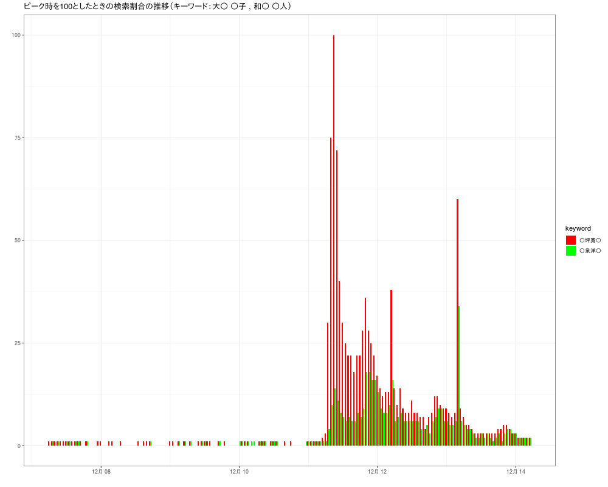

# RでWebスクレイピング10(gtrendsRで「某首相補佐官」と「某厚生労働省大臣官房審議官」)

某首相補佐官と、某厚生労働省大臣官房審議官の○倫報道があったので調べてみました。

### interest_over_time

#### Last seven days



思った以上に○倫報道された女性に関する情報を求めていることがわかります。  
○倫報道された男性に比べて２倍以上は検索されているようです。  

## Rコード

### Last seven days

interest_over_time

### 「某首相補佐官」と「某厚生労働省大臣官房審議官」

＊ 二人共公務員で公人のはずですが「私人」だと閣議決定されるかもしれませんので氏名を一部伏せ字にします。

今回は、キーワードが２つですのでggplot2パッケージを使ったほうが楽にグラフにできます。  
- legendを一部伏せ字にするためにscale_fill_manualを使用（labelsの順序に気をつける）  

- 下の隙間をなくすためにscale_y_continuousを使用。    

  日本時間に直すためにdateに9時間（9×60×60 秒）加えます。

```R
#devtools::install_github("PMassicotte/gtrendsR")
library(gtrendsR)
library(ggplot2)
library(xts)
# 一部伏せ字(検索するときには氏名を入れています)
gtr <- gtrends(c("○坪 ○子","和○ 洋○"), geo ="JP",time="now 7-d")
### interest_over_time
#簡単にグラフにできる
#plot(gtr)
# ggplot2を使って棒グラフ
# キーワードを複数にしている場合 ketword 項目もdatに入れる
# 今回はデータのhits項目に"<1" （1未満）がみられるので"<"を取り除く
dat<-gtr[[1]][,c("date", "hits","keyword")]
dat$hits<-as.numeric(gsub("<","",dat$hits))
# xtsクラスへ
dat.xts <- xts(dat[,-1], strptime(dat$date, "%Y-%m-%d %H:%M:%S"))
# 日本時間に直すために9時間（9*60*60 秒）加える
index(dat.xts)<-index(dat.xts)+9*60*60
#
g <- ggplot(dat,aes (x =date,y =as.numeric(hits),fill = keyword ))
g <- g + geom_bar(stat = "identity",position = "dodge")
# 下の隙間をなくす。
g <- g + scale_y_continuous(expand =c(0,0),limits=c(0,max(df$hits)*1.01),breaks = seq(0,100,20),labels = seq(0,100,20)) 
g <- g + theme_bw()
# labelsの順序は ○坪寛○ が先。
g <- g + scale_fill_manual(labels = c("○坪寛○","○泉洋○"), values = c("red","green")) 
g <- g + labs(x="",y="",title="ピーク時を100としたときの検索割合の推移（キーワード：大○ ○子 , 和○ ○人）")
#png("huri01.png",width=1000,height=800)
g
#dev.off()
```

