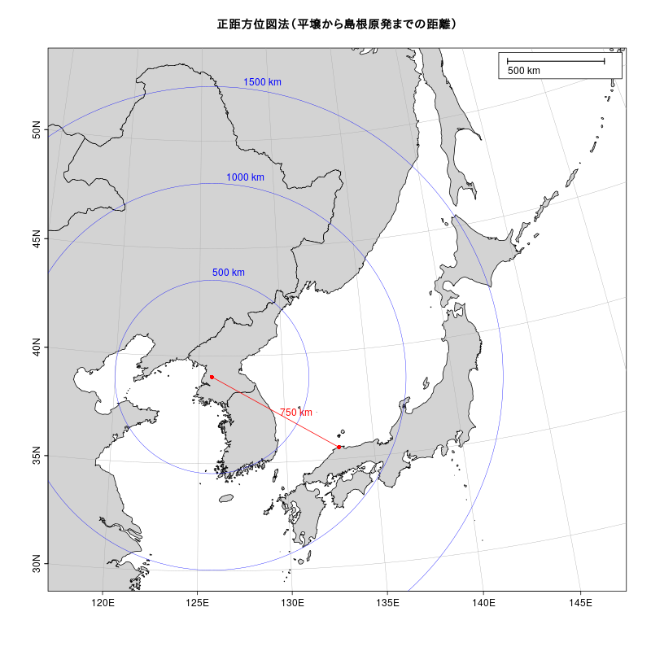

# Rで正距方位図法 (その1)  

(参考) [stackoverflow : Drawing a Circle with a Radius of a Defined Distance in a Map](https://stackoverflow.com/questions/23071026/drawing-a-circle-with-a-radius-of-a-defined-distance-in-a-map)の「plotCircle」関数    

### 正距方位図法（平壌から島根原発までの距離）



### 正距方位図法（板門店から島根原発までの距離）

 

## Rコード

### packageの読み込み、mapCircle関数の作成

```R
library(oce)
data(coastlineWorldFine, package="ocedata")
#
# stackoverflow : Drawing a Circle with a Radius of a Defined Distance in a Map
# https://stackoverflow.com/questions/23071026/drawing-a-circle-with-a-radius-of-a-defined-distance-in-a-map
#
mapCircle <- function(LonDec, LatDec, Km) {
    ER <- 6371 
    AngDeg <- seq(1:360)       #angles in degrees 
    Lat1Rad <- LatDec*(pi/180) #Latitude of the center of the circle in radians
    Lon1Rad <- LonDec*(pi/180) #Longitude of the center of the circle in radians
    AngRad <- AngDeg*(pi/180)  #angles in radians
    Lat2Rad <-asin(sin(Lat1Rad)*cos(Km/ER)+cos(Lat1Rad)*sin(Km/ER)*cos(AngRad)) 
    Lon2Rad <- Lon1Rad+atan2(sin(AngRad)*sin(Km/ER)*cos(Lat1Rad),cos(Km/ER)-sin(Lat1Rad)*sin(Lat2Rad))
    Lat2Deg <- Lat2Rad*(180/pi)
    Lon2Deg <- Lon2Rad*(180/pi)
    mapPolygon(Lon2Deg,Lat2Deg,border="blue", lwd=0.5)
    mapText(Lon2Deg[10],Lat2Deg[10],labels=paste(Km ,"km"), cex =1,col="blue",pos=3)
}
```

### 正距方位図法（平壌から島根原発までの距離）

```R
par(mar=c(2, 2, 3, 1))
lonlim <- c(120, 145)
latlim <- c(30, 52)
平壌<- c(125.764559, 39.036694)
島根原発<- c(132.9991667, 35.5383333)
#
# 正距方位図法  azimuthal equidistant projection
aeqd_proj <- paste("+proj=aeqd +lat_0=",平壌[2]," +lon_0=",平壌[1])
#
# png("aeqd_proj01.png",width=800,height=800)
mapPlot(coastlineWorldFine, projection=aeqd_proj ,
        col="lightgray", longitudelim=lonlim, latitudelim=latlim)
title("正距方位図法（平壌から島根原発までの距離）")
mapPoints(平壌[1],平壌[2],pch=16,col="red")
mapPoints(島根原発[1],島根原発[2],pch=16,col="red")
## Great circle 
l <- geodGc(longitude=c(平壌[1], 島根原発[1]), latitude=c(平壌[2],島根原発[2]), 1)
mapLines(l$longitude, l$latitude, col="red", lwd=1)
#
dist1<- round(geodDist(平壌[1],平壌[2],島根原発[1],島根原発[2]),0)
mapText(longitude=(平壌[1]+島根原発[1])/2, latitude=(平壌[2]+島根原発[2])/2, labels=paste(dist1,"km"),pos=4,col="red")
mapScalebar("topright")
#
mapCircle(平壌[1],平壌[2],500)
mapCircle(平壌[1],平壌[2],1000)
mapCircle(平壌[1],平壌[2],1500)
# dev.off()
```

### 正距方位図法（板門店から島根原発までの距離）

```R
par(mar=c(2, 2, 3, 1))
lonlim <- c(120, 145)
latlim <- c(30, 52)
板門店<- c(126.676397229037, 37.95557264311352)
島根原発<- c(132.9991667, 35.5383333)
#
# 正距方位図法  azimuthal equidistant projection
aeqd_proj <- paste("+proj=aeqd +lat_0=",板門店[2]," +lon_0=",板門店[1])
#
# png("aeqd_proj02.png",width=800,height=800)
mapPlot(coastlineWorldFine, projection=aeqd_proj ,
        col="lightgray", longitudelim=lonlim, latitudelim=latlim)
title("正距方位図法（板門店から島根原発までの距離）")
mapPoints(板門店[1],板門店[2],pch=16,col="red")
mapPoints(島根原発[1],島根原発[2],pch=16,col="red")
## Great circle 
l <- geodGc(longitude=c(板門店[1], 島根原発[1]), latitude=c(板門店[2],島根原発[2]), 1)
mapLines(l$longitude, l$latitude, col="red", lwd=1)
#
dist1<- round(geodDist(板門店[1],板門店[2],島根原発[1],島根原発[2]),0)
mapText(longitude=(板門店[1]+島根原発[1])/2, latitude=(板門店[2]+島根原発[2])/2, labels=paste(dist1,"km"),pos=4,col="red")
mapScalebar("topright")
#
mapCircle(板門店[1],板門店[2],500)
mapCircle(板門店[1],板門店[2],1000)
mapCircle(板門店[1],板門店[2],1500)
# dev.off()
```
