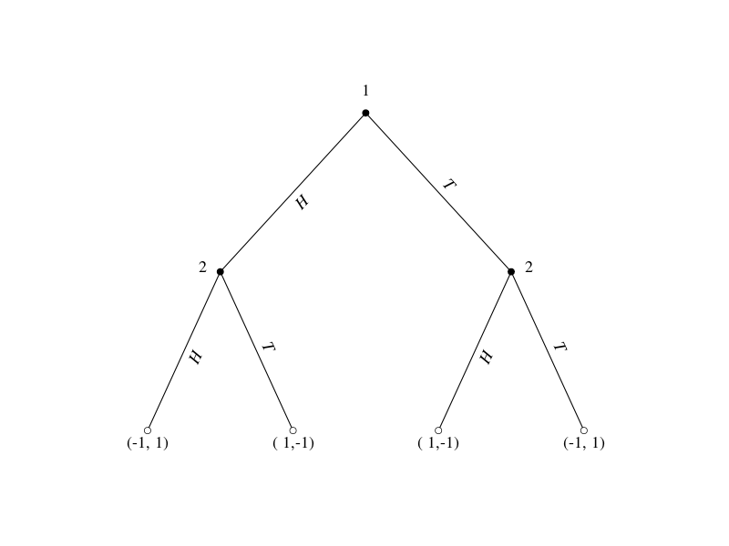
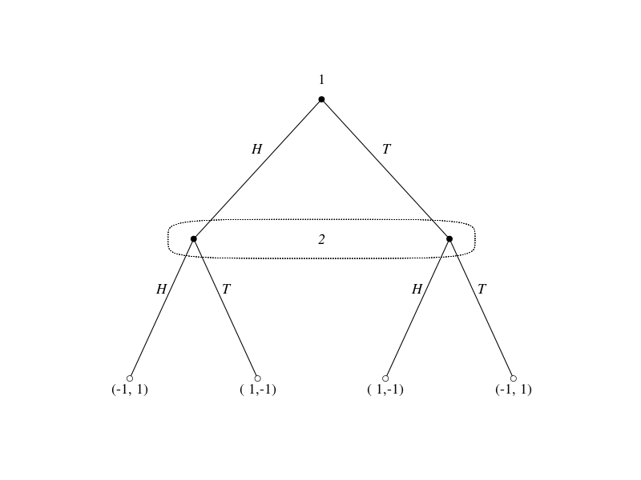
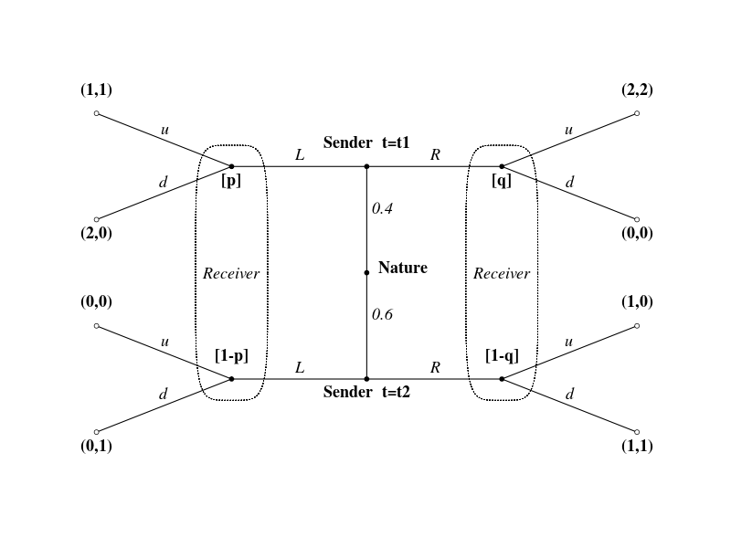
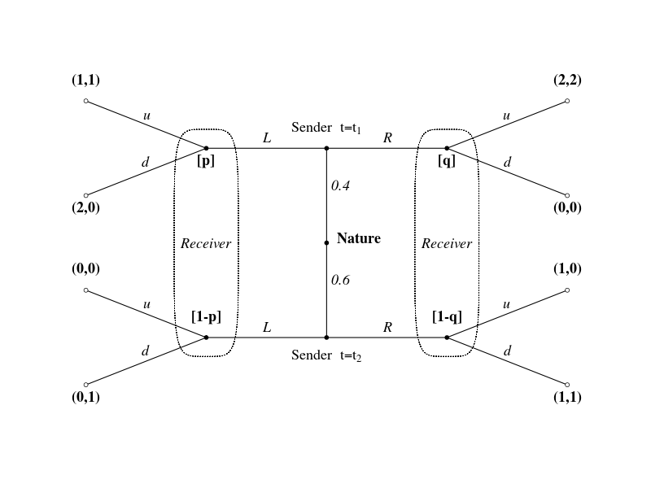

# R : ggraphでGame Tree (その1)

(参考) [TikZ : https://sites.google.com/site/kochiuyu/Tikz](https://sites.google.com/site/kochiuyu/Tikz)  
上記のサイトにTikzを使って描いた美しいグラフが載っていました。このうち「Game Tree」をggraphで描けないかと思いやってみました。

igraphパッケージに比べて、エッジのラベル位置の調整及び一部を線で囲むのが非常に楽です。

### Sequential Matching Pennies Game



### Sequential Matching Pennies Game



### Signalling Game  
#### expression関数を使っていないので、表記が　t1,t2



#### expression関数



## Rコード

- 左右対称なGame Treeはdiagram::coordinatesを使ってpositionの行列を作る。
- edge label位置はスペースと改行で調整

### Sequential Matching Pennies Game

#### グラフオブジェクトに変換。レイアウトを調整。ggraphレイアウト作成。

```R
dat<-data.frame(id1=as.character(rep(1:3,each=2)),id2=as.character(seq(2,7)),stringsAsFactors=F)
#
library(igraph)
library(ggraph)
library(diagram) # coordinates関数関数を使う
library(ggforce) # geom_ellipse関数を使う
#
g = graph_from_data_frame(dat, directed = F)
# layout作成
#coordinates(pos = NULL, mx = 0, my = 0, N = length(pos), hor = TRUE,relsize = 1) 
position <- coordinates(c(1,2,4))
position[,1]<- (position[,1]-min(position[,1]))/(max(position[,1])-min(position[,1]))
position[,2]<- (position[,2]-min(position[,2]))/(max(position[,2])-min(position[,2]))
#
# ggraph
manual_layout<-create_layout(graph= g, layout = "manual",
                             x=position[,1],
                             y=position[,2])
```

#### パラメータ設定

```R
vertex.label<-c("1","2","2","(-1, 1)","( 1,-1)","( 1,-1)","(-1, 1)")
vertex.shape<- rep(21,7)
vertex.color<- c(rep("black",3),rep("white",4))
vertex.label.dist= c(0,-0.04,0.04,rep(0,4))
vertex.label.degree= c(-pi/2,0,0,rep(pi/2,4))
vertex.size= rep(3,7)
# edge label位置調整
edge.label=rep(c("H","T"),times=3)
```

#### プロット

```R
set_graph_style(family = "Times", face = "italic", size = 11,
                text_size = 18, text_colour = "black")
#
ggraph(manual_layout) + 
  geom_edge_link(aes(label = edge.label), 
                 angle_calc = "along",
                 label_dodge = unit(5,"mm")) + 
  geom_node_point(shape=vertex.shape,
                  size = vertex.size,
                  fill=vertex.color) +
  geom_node_text(aes(label = vertex.label),
                 vjust=vertex.label.degree,
                 nudge_x =vertex.label.dist,fontface="plain") +   
  theme_graph() +
  xlim(c(min(position[,1])-0.2,max(position[,1])+0.2)) +
  ylim(c(min(position[,2])-0.2,max(position[,2])+0.2)) 
#
unset_graph_style()
```

### Sequential Matching Pennies Game

#### Game Tree の一部を線で囲む

#### (上からの続き)パラメータ変更し、プロット

```R
vertex.label<-c("1","","","(-1, 1)","( 1,-1)","( 1,-1)","(-1, 1)")
# edge label位置調整
edge.label=rep(c("H\n\n","T\n\n"),times=3)
#
set_graph_style(family = "Times", face = "italic", text_colour = "black",text_size = 18)
#
ggraph(manual_layout) + 
  geom_edge_link(aes(label = edge.label)) +
  geom_node_point(shape=vertex.shape,
                  size = vertex.size,
                  fill=vertex.color) +
  geom_node_text(aes(label = vertex.label),
                 vjust=vertex.label.degree,
                 nudge_x =vertex.label.dist,fontface="plain") +   
  theme_graph() +
  xlim(c(min(position[,1])-0.2,max(position[,1])+0.2)) +
  ylim(c(min(position[,2])-0.2,max(position[,2])+0.2)) +
  annotate("text", x= mean(position[2:3,1]) ,y=position[2,2],label="2") +
  geom_ellipse(aes(x0= mean(position[2:3,1]), 
		   y0=position[2,2], 
		   a= 1.2*(position[3,1]-position[2,1])/2, 
		   b=0.07,angle=0,m1 = 5), 
		   fill=NA, linetype=3,color="black",size=0.3)
#
unset_graph_style()
```

### Signalling Game

#### データ

```
id1	id2
1	3
2	5
3	4
4	5
3	6
5	7
4	8
8	12
9	11
10	13
11	12
12	13
11	14
13	15
```

#### グラフオブジェクトに変換。レイアウトを調整。ggraphレイアウト作成。

```R
# データをクリップボード経由で読み込む場合
dat<-read.table("clipboard",h=T,colClasses=c("character","character"),stringsAsFactors=F)
#
library(igraph)
library(ggraph)
library(diagram) # coordinates関数関数を使う
library(ggforce) # geom_ellipse関数を使う
# graph_from_data_frameはレイアウトが崩れる
# g = graph_from_data_frame(dat, directed = F)
#
# 隣接行列へ
id1<-dat$id1
succ<-NULL
id2<-NULL
for (i in 1:nrow(dat)){
        p<-unlist(strsplit(dat$id2[i], ","))
	id2<-c(id2,p)
        succ<-c(succ,rep(dat$id1[i],length(p)))
}
df<-data.frame(id2,succ,stringsAsFactors=T)
game<-as.matrix(get.adjacency(graph.edgelist(as.matrix(df), directed=T)))
game<-game+t(game)
game<-game[as.character(1:nrow(game)),as.character(1:nrow(game))]
#
## 隣接行列 -> グラフオブジェクト
g<-graph.adjacency(game,mode="undirected",weighted=NULL)
# layout作成
position <- coordinates(c(2,3,2,1,2,3,2))
position[,1]<- (position[,1]-min(position[,1]))/(max(position[,1])-min(position[,1]))
position[,2]<- (position[,2]-min(position[,2]))/(max(position[,2])-min(position[,2]))
#
# node 3,5,11,13のx座標を変える
position[3,1]<- (position[1,1]+position[4,1])/2
position[5,1]<- (position[2,1]+position[4,1])/2
position[11,1]<- (position[1,1]+position[4,1])/2
position[13,1]<- (position[2,1]+position[4,1])/2
#
plot(g,layout=position)
# ggraph
manual_layout<-create_layout(graph= g, layout = "manual",
                             x=position[,1],
                             y=position[,2])
```

#### パラメータ設定

```R
vertex.label<-c("(1,1)","(2,2)","[p]","Sender  t=t1","[q]","(2,0)","(0,0)","Nature","(0,0)","(1,0)","[1-p]","Sender  t=t2","[1-q]","(0,1)","(1,1)")
vertex.shape<- rep(21,15)
vertex.color<- c(rep("white",2),rep("black",3),rep("white",2),rep("black",1),rep("white",2),rep("black",3),rep("white",2))
# 上:-pi/2  下:pi/2 
vertex.label.degree= c(rep(-pi/2,2),pi/2,-pi/2,pi/2,rep(pi/2,2),0,rep(-pi/2,2),-pi/2,pi/2,-pi/2,rep(pi/2,2))
vertex.label.dist= c(rep(0,7),0.05,rep(0,7))
vertex.size= rep(2,15)
# edge label位置調整
edge.label= c(rep("u",2),"L","d","R","       0.4","d","       0.6",rep("u",2),"L","d","R","d")
edge.label=paste0(edge.label,"\n")
```

#### プロット

```R
set_graph_style(family = "Times", face = "italic", text_colour = "black",text_size = 18)
#
ggraph(manual_layout) + 
  geom_edge_link(aes(label = edge.label)) +
  geom_node_point(shape=vertex.shape,
                  size = vertex.size,
                  fill=vertex.color) +
  geom_node_text(aes(label = vertex.label),
                 vjust=vertex.label.degree,
                 nudge_x =vertex.label.dist,fontface="bold") +   
  theme_graph() +
  xlim(c(min(position[,1])-0.05,max(position[,1])+0.05)) +
  ylim(c(min(position[,2])-0.2,max(position[,2])+0.2)) +
  annotate("text", x= position[3,1] ,y=(position[3,2]+position[11,2])/2,label="Receiver") +
  annotate("text", x= position[5,1] ,y=(position[5,2]+position[13,2])/2,label="Receiver") +
  geom_ellipse(aes(x0= position[3,1], 
		   y0=(position[3,2]+position[11,2])/2, 
		   a= 0.05, 
		   b= 1.2*(position[3,2]-position[11,2])/2 , angle=0 , m1 = 5), 
		   fill=NA, linetype=3,color="black",size=0.3) +
  geom_ellipse(aes(x0= position[5,1], 
		   y0=(position[5,2]+position[13,2])/2, 
		   a= 0.05, 
		   b= 1.2*(position[5,2]-position[13,2])/2 ,angle=0 , m1 = 5), 
		   fill=NA, linetype=3,color="black",size=0.3) 
#
unset_graph_style()
```

#### expression関数（警告が出る）

```R
vertex.label<-c("(1,1)","(2,2)","[p]","","[q]","(2,0)","(0,0)","Nature","(0,0)","(1,0)","[1-p]",
	        "","[1-q]","(0,1)","(1,1)")
#
set_graph_style(family = "Times", face = "italic", text_colour = "black",text_size = 18)
#
ggraph(manual_layout) + 
  geom_edge_link(aes(label = edge.label)) +
  geom_node_point(shape=vertex.shape,
                  size = vertex.size,
                  fill=vertex.color) +
  geom_node_text(aes(label = vertex.label),
                 vjust=vertex.label.degree,
                 nudge_x =vertex.label.dist,fontface="bold") +   
  theme_graph() +
  xlim(c(min(position[,1])-0.05,max(position[,1])+0.05)) +
  ylim(c(min(position[,2])-0.2,max(position[,2])+0.2)) +
  annotate("text", x= position[3,1] ,y=(position[3,2]+position[11,2])/2,label="Receiver") +
  annotate("text", x= position[5,1] ,y=(position[5,2]+position[13,2])/2,label="Receiver") +
# expression関数を使う箇所は別に記入
  annotate("text", x= position[4,1] ,y=position[4,2],vjust= -1.2,label=expression(paste("Sender  t=",t[1])),parse=T) +
  annotate("text", x= position[12,1] ,y=position[12,2],vjust= 2,label=expression(paste("Sender  t=",t[2])),parse=T) +
  geom_ellipse(aes(x0= position[3,1], 
		   y0=(position[3,2]+position[11,2])/2, 
		   a= 0.05, 
		   b= 1.2*(position[3,2]-position[11,2])/2 , angle=0 , m1 = 5), 
		   fill=NA, linetype=3,color="black",size=0.3) +
  geom_ellipse(aes(x0= position[5,1], 
		   y0=(position[5,2]+position[13,2])/2, 
		   a= 0.05, 
		   b= 1.2*(position[5,2]-position[13,2])/2 ,angle=0 , m1 = 5), 
		   fill=NA, linetype=3,color="black",size=0.3) 
#
unset_graph_style()
```
