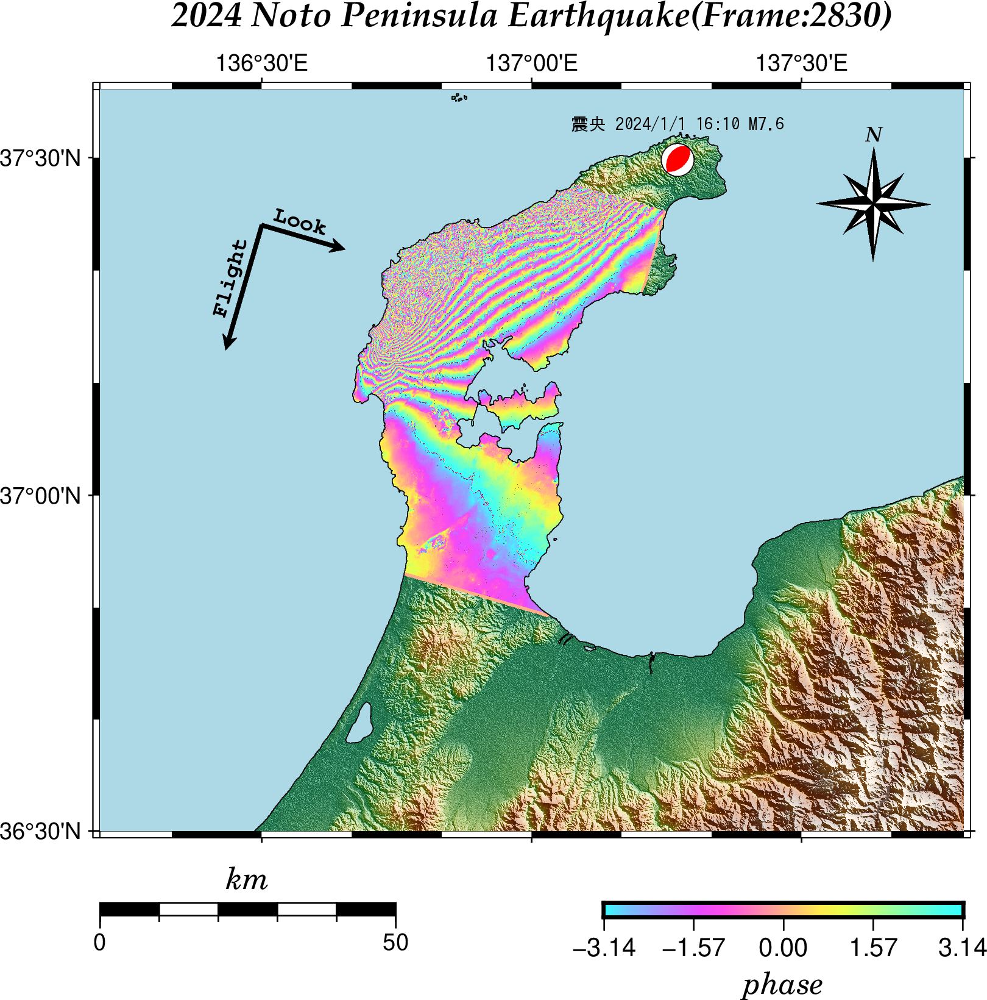
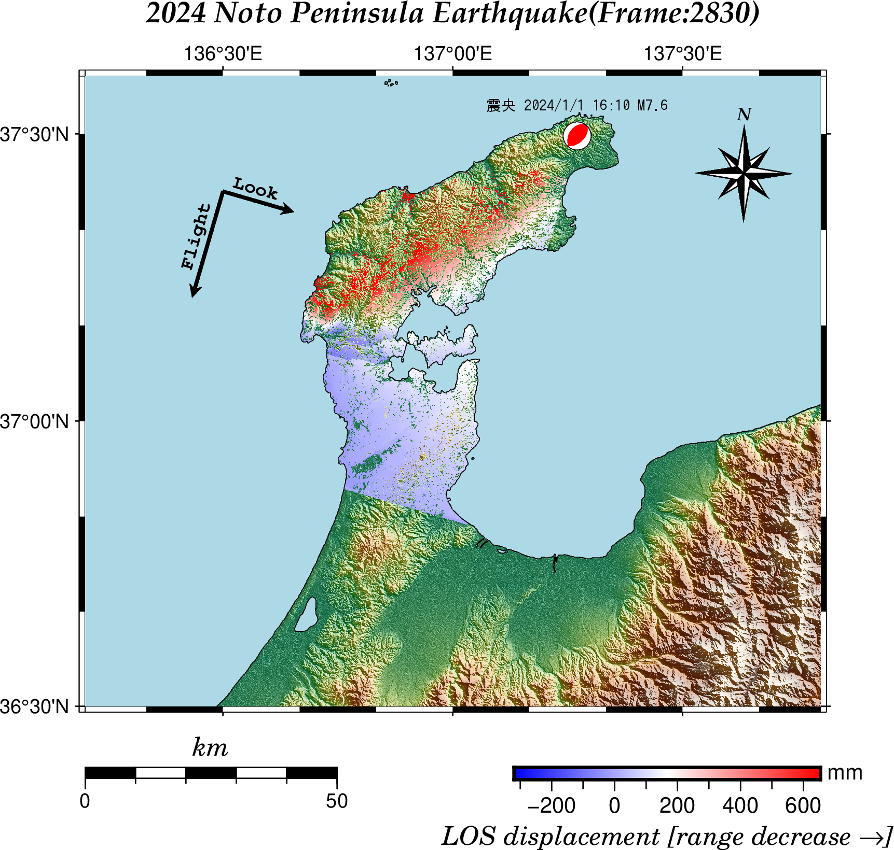

# GMTSARでALOS-2/PALSAR-2の無償公開データを利用した

[](https://hits.seeyoufarm.com) 

** 「この記事に使用したデータは、JAXAの無償公開データを利用しました。」 **

### 2023年6月6日（地震前）と2024年1月2日（地震後）の観測データを用いた差分干渉画像

[Theory and prac-ce of phase unwrapping](https://igppweb.ucsd.edu/~fialko/insar/unwrapping.pdf)

gmtsarによって得られた phasefilt_ll.grd (Gaussian filter+Goldstein と Werner filterをかけたもの)をgmt6で作図。



### 位相アンラッピング:位相(phase) --> 変位(displacement )



### 使用したデータ

#### ALOSシリーズ Open and Freeデータ

|Obs date(1) |Obs date(2) |Path |Frame|data|
|-------:|------:|-------:|-------:|------:|
|2024/01/02|2023/06/06 |26|2830|L1.1(CEOS) |

#### dem

[Generate DEM files for use with GMTSAR](https://topex.ucsd.edu/gmtsar/demgen/)

SRTM1 の 136.2 - 137.8  36.5 - 37.6  より広い範囲を指定してダウンロード

#### メカニズム解

[メカニズム解の検索](https://www.fnet.bosai.go.jp/event/search.php?LANG=ja)

#### 衛星の飛行方向

当初、「観測計画KMLから推定」していたのですが、[陸域観測技術衛星 2 号（ALOS-2）PALSAR-2 レベル 1.1/1.5/2.1/3.1　プロダクトフォーマット説明書（CEOS SAR フォーマット）](https://www.eorc.jaxa.jp/ALOS-2/doc/fdata/PALSAR-2_xx_Format_CEOS_J_e.pdf) を読むと、「シーン中心におけるビーム中心方向[度]」という項目があるのに気がつきました。
が、折角なので「観測計画KMLから推定」も残しておきます。

##### (1) 観測計画KMLから「推定」

[観測計画KMLダウンロード](https://www.eorc.jaxa.jp/ALOS/jp/alos-2/obs_plan_kml/map.html)から2023/06/06のデータをダウンロードし、
該当する部分の四角形から推定した。

衛星は観測対象の東西どちらを進行したのか？

ファイル命名規則

|衛星・センサ種別|シーン中心の通算周回番号|シーン中心のフレーム番号|シーン中心の観測年月日|観測モード|左右観測|処理レベル|昇降ノード|
|---:|---:|---:|---:|---:|---:|---:|---:|
|ALOS2|51898|2830|240102|UBS|L|1.1|D|

観測対象はD(南下する方向)からみてL(左側)にある ----> 西側を通った

衛星の飛行方向を求め、psxy -Sv で作図する際の角度に直します。

```gmt
# 方位角
echo 137.0060 36.8311 | gmt mapproject -Af137.2288/37.4361 -N -je | awk '{print $3}'
# 196.495444331
# psxy -Sv で使う角度に変換
echo 137.0060 36.8311 | gmt mapproject -Af137.2288/37.4361 -N -je | awk '{print 450-$3}'
# 253.505
```

なお、Rだと、geosphere パッケージを使って、

```R
library("geosphere")
# 真東が90度、真北が0度、真西が-90度、真南が-180度
bearing(c(137.2288,37.4361),c(137.0060,36.8311))
# -163.5046
360 + bearing(c(137.2288,37.4361),c(137.0060,36.8311))
# [1] 196.4954
# psxy -Sv
90-bearing(c(137.2288,37.4361),c(137.0060,36.8311))
# [1] 253.5046
```

##### (2) LED-ALOS2518982830-240102-UBSL1.1__D の「シーン中心におけるビーム中心方向[度]」をRでバイナリデータを読む

SAR リーダ(LEDから始まるファイル)

上記、プロダクトフォーマット説明書のP.31

ファイルディスクリプタ : レコード長(byte) 720 <--- ここは読み飛ばす

P.61 「シーン中心におけるビーム中心方向[度]」バイト:1815 - 1830 　タイプ: F16.7

```R
conn <- file("/media/aki/603B2C957AE78DAC/GMTSAR/noto20240102_1/raw/LED-ALOS2518982830-240102-UBSL1.1__D", "rb")
# ファイルディスクリプタ（読み飛ばすバイト数）
offset = 720
# 全部で「offset+1814」バイトを読み飛ばす
seek(conn, where = offset+1814, origin = "start")
# タイプ: F16.7だから n=16
a1<- readBin(conn, what=raw(), n = 16, size = 1)
rawToChar(a1)
close(conn)
# [1] 0
# [1] "     106.1804862"
# psxy -Sv で使う角度に直す。
# Look
( Look=360-(106.1804862 -90) )
# [1] 343.8195
#
# Flight
( Flight = Look - 90 )
# [1] 253.8195
```

(1)の推定値（253.505）との飛行方向の差は、約0.3度となりました。

### GMTSARのインストールは[GMTSAR:wiki](https://github.com/gmtsar/gmtsar/wiki/)を参考にする。  

（注）ORBITS.tar は5.8Gもあり、ダウンロードに非常に時間がかかる。
Envisat（エンビサット）とかヨーロッパリモートセンシング衛星(ERS)のデータを使わない限り必要ないのでフォルダだけ作っておいてダウンロードしないほうがよい。

「SAR.cpt」の作成は、[付録１ SAR 干渉解析結果の表現の標準化の指針](https://www.jishin.go.jp/main/eisei/eisei_furoku.pdf)を参考にした。

#### SAR.cpt

```
0	55/255/255	1	92/217/255
1	92/217/255	3	130/179/255
3	130/179/255	5	167/142/255
5	167/142/255	7	205/104/255
7	205/104/255	9	243/66/255
9	243/66/255	11	255/80/229
11	255/80/229	13	255/118/191
13	255/118/191	15	255/156/153
15	255/156/153	17	255/193/116
17	255/193/116	19	255/231/78
19	255/231/78	21	240/255/69
21	240/255/69	23	203/255/106
23	203/255/106	25	165/255/144
25	165/255/144	27	127/255/182
27	127/255/182	29	90/255/219
29	90/255/219	31	55/255/255
31	55/255/255	32	55/255/255
```

これをgmtのカラーパレットに追加する。例えば、debian12の場合、/usr/share/gmt/cpt/gmt に追加した。

(参考)

[SAR干渉画像の作成手順と見方](https://www.gsi.go.jp/uchusokuchi/sar_procedure.html)

[干渉SAR画像の見かたについて](https://www.eorc.jaxa.jp/ALOS-2/img_up/jpal2_howto_insar.htm)より抜粋。

- 観測データが干渉する（位相の差がとれる）のは2回の観測で波形が十分に類似している場合で、これは地表の状態がほぼ変わらずに一様に平行移動するような変位に相当し、
逆に2回の観測間で表面の状態が著しく変わった場合には干渉しなくなります。

- アンラッピングでは変位量が正しく算出されない可能性や、全体の変位量を1つのカラーバーで表すことで局所的な変動を見落とす可能性もあることから、
特に初期的な解析ではアンラッピングしない画像を示すことが多くあります。 

### GMTコード

#### phasefilt_ll.grd

EUC変換に nkf を使います。

SAR.cpt を使います。

```gmt
gmt grdcut dem.grd  -R136.2/137.8/36.5/37.6 -Gsar.nc
#
gmt set FONT_TITLE  14p,32,black
gmt set FONT_SUBTITLE  12p,32,black
gmt set FONT_LABEL 12p,26,black
# 地図スケールの高さを 5p -> 10p
gmt set MAP_SCALE_HEIGHT  10p
#
gmt begin noto0102_2830 png C-dALLOWPSTRANSPARENCY
gmt basemap -JM12 -R136.2/137.8/36.5/37.6 -Bafg -BWsNe+t"2024 Noto Peninsula Earthquake(Frame:2830)"
gmt makecpt -Cgeo -T0/3000/200 -Z
gmt grdgradient sar.nc -Ggrad.grd -A45 -Ne0.8
gmt grdimage sar.nc -Igrad.grd -C
### カラーパレットを作る ###
gmt makecpt -T-3.15/3.15/0.42 -CSAR.cpt  -Z
gmt grdimage phasefilt_ll.grd -C -Q
gmt colorbar -DJBR+jTR+o0/1+w5/0.2+h -Ba1.57f1.57+l"phase"
gmt coast -Slightblue -Df -W0.25 -LJBL+jTL+c35+w50k+f+o0/1+l
gmt psxy -Sv0.05/0.2/0.1 -Gblack <<EOF
136.5 37.4 253.8195 1.8
EOF
gmt psxy -Sv0.05/0.2/0.1 -Gblack <<EOF
136.5 37.4 343.8195 1.2
EOF
gmt meca -Sa0.3 -Gred  <<EOF
137.2705 37.4962 15.86 213 41 79 7.6
EOF
echo 136.5 37.4 BR 73.81951 9p,9,black "Flight" | gmt pstext -F+j+a+f -D-0.2/-0.2
echo 136.5 37.4 TL -16.18049 9p,9,black "Look" | gmt pstext -F+j+a+f -D0.2/0.25
# directional rose
gmt psbasemap -TdjRT+w1.5c+f2+l,,,N+o0.5c/0.5c
# gmt psbasemap -TdjRT+w1.5c+l,,,N+o0.5c/0.5c
# gmt psbasemap -TmjRT+w1.5c+l,,,N+o0.5c/0.5c
echo "137.2705 37.4962 震央 2024/1/1 16:10 M7.6" | nkf -e | gmt text -F+jMC+a0+f7p,37,black -G -D0/0.5 -N
gmt end
```

#### los_ll.grd

EUC変換に nkf を使います。

```gmt
gmt grdcut dem.grd  -R136.2/137.8/36.5/37.6 -Gsar.nc
#
gmt set FONT_TITLE  14p,32,black
gmt set FONT_SUBTITLE  12p,32,black
gmt set FONT_LABEL 12p,26,black
# 地図スケールの高さを 5p -> 10p
gmt set MAP_SCALE_HEIGHT  10p
# zの範囲を得て、U,Lに代入
U=$(gmt grdinfo -C -L2 los_ll.grd  | awk '{printf("%5.1f", $12+$13*2)}')
L=$(gmt grdinfo -C -L2 los_ll.grd  | awk '{printf("%5.1f", $12-$13*2)}')
#
gmt begin LOS_displacement png C-dALLOWPSTRANSPARENCY
gmt basemap -JM12 -R136.2/137.8/36.5/37.6 -Bafg -BWsNe+t"2024 Noto Peninsula Earthquake(Frame:2830)"
gmt makecpt -Cgeo -T0/3000/200 -Z
gmt grdgradient sar.nc -Ggrad.grd -A45 -Ne0.8
gmt grdimage sar.nc -Igrad.grd -C
# makecpt に -Dオプションをつける : z > 1 は z = 1 の色の「赤」で，z < -1 は z = -1 の色の「青」でぬる．
gmt makecpt -Cpolar -T$L/$U/1 -Z -D
gmt grdimage los_ll.grd -C -Q
gmt colorbar -DJBR+jTR+o0/1+w5/0.2+h -Baf+l"LOS displacement [range decrease @~\256@~]" -By+lmm
gmt coast -Slightblue -Df -W0.25 -LJBL+jTL+c35+w50k+f+o0/1+l
gmt psxy -Sv0.05/0.2/0.1 -Gblack <<EOF
136.5 37.4 253.8195 1.8
EOF
gmt psxy -Sv0.05/0.2/0.1 -Gblack <<EOF
136.5 37.4 343.8195 1.2
EOF
gmt meca -Sa0.3 -Gred  <<EOF
137.2705 37.4962 15.86 213 41 79 7.6
EOF
echo 136.5 37.4 BR 73.81951 9p,9,black "Flight" | gmt pstext -F+j+a+f -D-0.2/-0.2
echo 136.5 37.4 TL -16.18049 9p,9,black "Look" | gmt pstext -F+j+a+f -D0.2/0.25
# directional rose
gmt psbasemap -TdjRT+w1.5c+f2+l,,,N+o0.5c/0.5c
echo "137.2705 37.4962 震央 2024/1/1 16:10 M7.6" | nkf -e | gmt text -F+jMC+a0+f7p,37,black -G -D0/0.5 -N
gmt end
```

### （備忘録）gmtsarの基本的な操作手順(ALOS2の場合)

- noto20240102 フォルダ 作る
- noto20240102 フォルダ　内に　raw フォルダと topo フォルダを作る
- raw フォルダに以下のファイルを置く
	- IMG-HH-ALOS2487932830-230606-UBSL1.1__D  IMG-HH-ALOS2518982830-240102-UBSL1.1__D  LED-ALOS2487932830-230606-UBSL1.1__D     LED-ALOS2518982830-240102-UBSL1.1__D 
- topo フォルダに以下のファイルを置く
	- dem.grd 
- noto20240102 フォルダ に移動し、

まず、default（衛星名にALOS2を指定する）の設定で実行

```gmtsar
p2p_processing.csh ALOS2 IMG-HH-ALOS2487932830-230606-UBSL1.1__D IMG-HH-ALOS2518982830-240102-UBSL1.1__D
```

noto20240102 に config.ALOS2.txt が自動的に作成され処理が実行される（時間がそれなりにかかります。）

#### アンラッピングを行う場合（threshold_snaphu = 0　だと、この処理は飛ばされる。）

config.ALOS2.txt を編集する。

proc_stage = 1 を proc_stage = 5 に変更（５番目の処理から実行するということ。ここがそのまま 1 だと最初からになって時間の無駄になる。）

threshold_snaphu = 0 を例えば、threshold_snaphu = 0.1 に変更。

後ろに使用する「configファイル名をつけて」再実行（付け忘れると、config.ALOS2.txtが上書きされる。）

```gmtsar
p2p_processing.csh ALOS2 IMG-HH-ALOS2487932830-230606-UBSL1.1__D IMG-HH-ALOS2518982830-240102-UBSL1.1__D config.ALOS2.txt
```

threshold_snaphu 等の設定については、[Theory and prac-ce of phase unwrapping](https://igppweb.ucsd.edu/~fialko/insar/unwrapping.pdf)が参考になる。

（注意）defaultの数値(SLC_factor = 0.02)ではエラーが出ることがある。(2024/1/3 のデータ)

```gmtsar
p2p_processing.csh ALOS2 IMG-HH-ALOS2515060730-231206-UBSR1.1__A IMG-HH-ALOS2519200730-240103-UBSR1.1__A
```

エラーメッセージを読むと、

ERROR *** reset SLC_factor to something closer to 0.04494 <-------- この値  
This is not really an error. It is more of a warning that you could use a different SLC_factor in your config file.

config.ALOS2.txt の SLC_factor = 0.02 を SLC_factor = 0.045　に変更する。

後ろに使用する「configファイル名をつけて」再実行（付け忘れると、config.ALOS2.txtが上書きされる。）

```gmtsar
p2p_processing.csh ALOS2 IMG-HH-ALOS2515060730-231206-UBSR1.1__A IMG-HH-ALOS2519200730-240103-UBSR1.1__A config.ALOS2.txt
```
