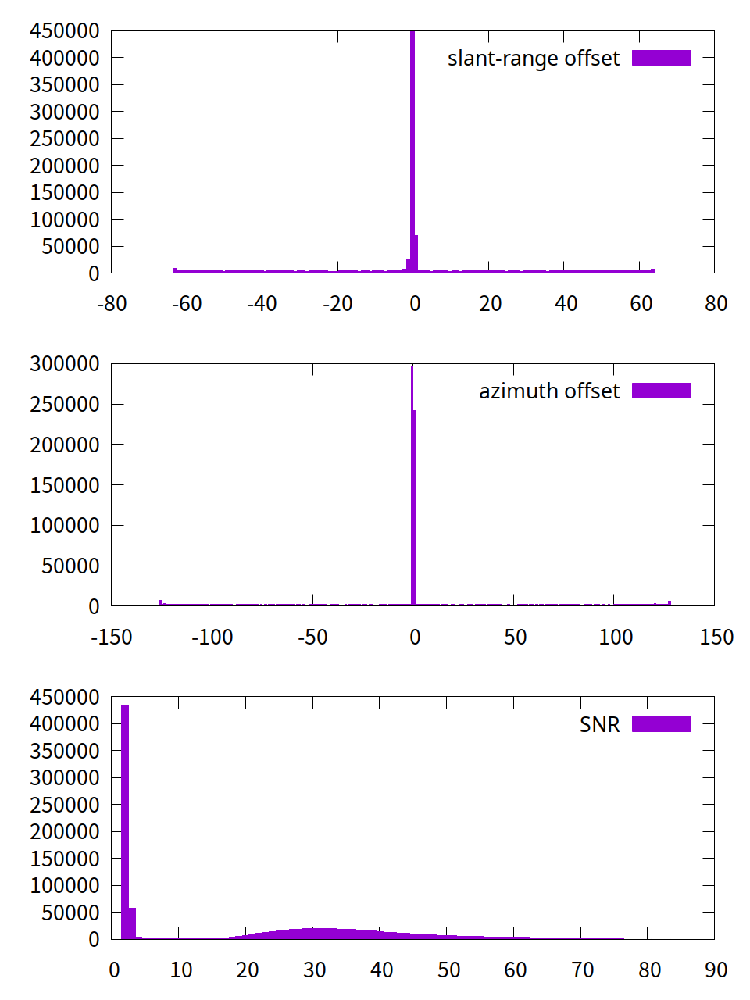
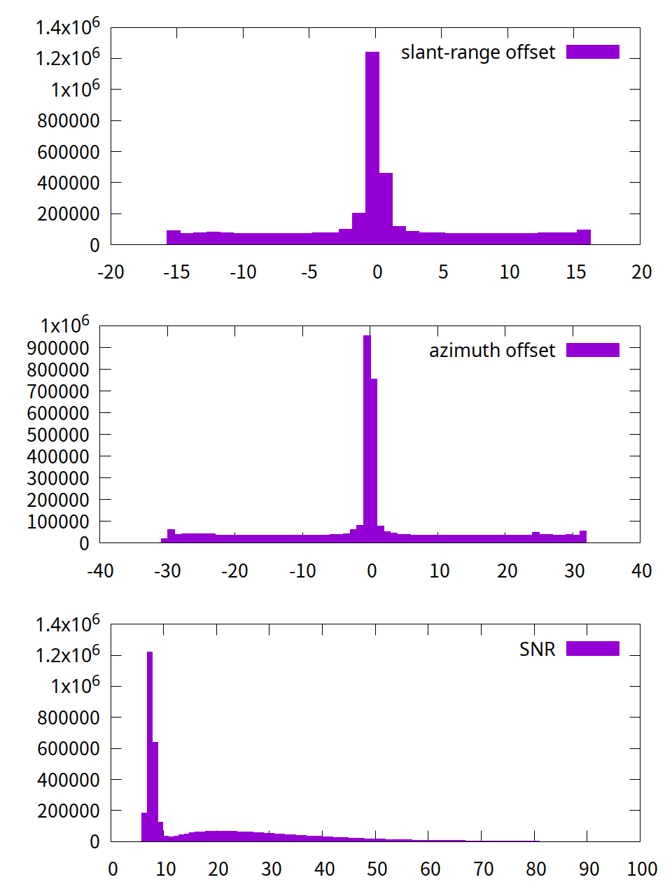
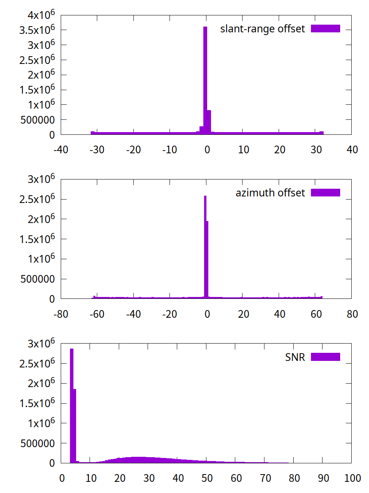
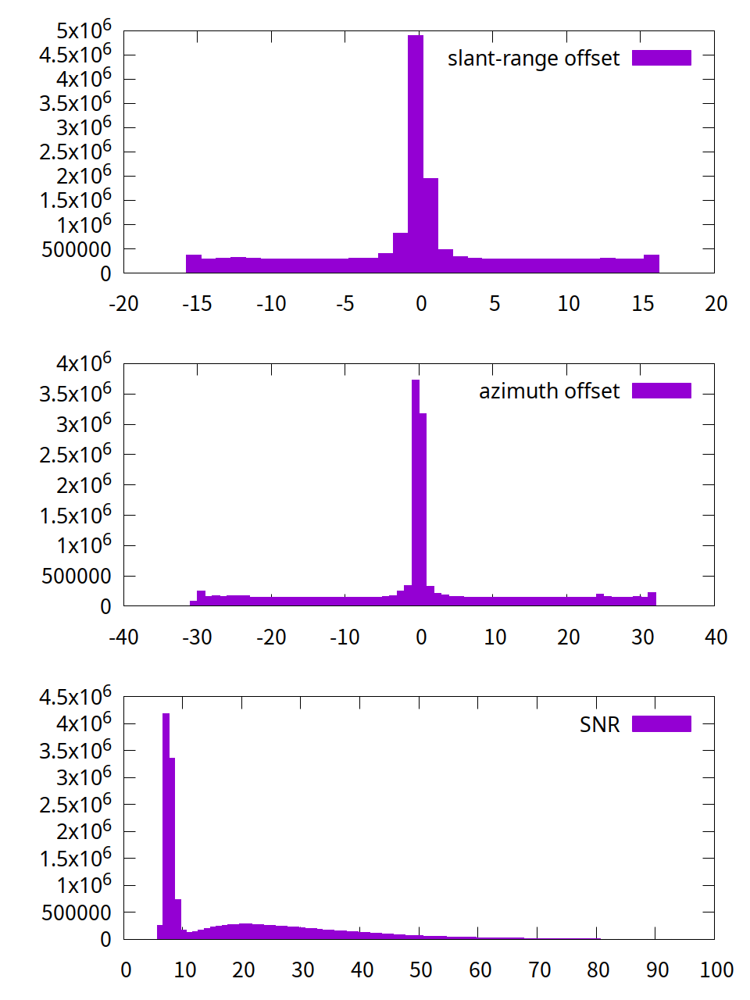

# GMTSARでピクセルオフセット法（プログラムの作成 その１）

[](https://hits.seeyoufarm.com) 

** 「この記事に使用したデータは、JAXAの無償公開データを利用しました。」 **

[GMTSARでピクセルオフセット法（準備編）](https://gitpress.io/@statrstart/gmtsar02)

- xcorr より約１６倍高速な「xcorr2_cl」をbuildしてインストールします。

ピクセルオフセット法をGMTSARで行うためのプログラムを２つ作成します。

1. make_a_offset.cshにslant-range offsetを行うところを加えた。make_pot.csh
2. make_a_offset.csh、もしくは、上記make_pot.cshを実行し、算出されたfreq_xcorr.datを用いてパラメータを変更してデータ作成とグラフ作成を行う easy_pot.csh

’（注）作成するといっても、gmtsarの「make_a_offset.csh」に[ Can GMTSAR do pixel offset？ #669 ](https://github.com/gmtsar/gmtsar/issues/669)の[make_xcorr_plot.csh.txt](https://github.com/gmtsar/gmtsar/files/10954822/make_xcorr_plot.csh.txt)を加えて、プロットする部分をgmt6仕様にしただけのものです。素人が趣味で作ったものですのでその点ご了承ください。

使用したパソコン、OS等

- PC : CHUWI HeroBox 2023 (Intel N100  8GB+256GB )
- OS : debian12（512GBのSSDを増設して、インストールした）
- gmt: Version 6.4.0
- gmtsarは記事時点で最新のもの。

ピクセルオフセット法を行うにはxcorrというプログラムを使うのですが、Intel N100のPCだと果てしなく時間（数日！！！）がかかります。

作成したプログラムは、githubで見つけた[gmtsar_optimize:https://github.com/cuihaoleo/gmtsar_optimize ](https://github.com/cuihaoleo/gmtsar_optimize)の「xcorr2_cl」を使っています。

（参考）

[局所的大変位を伴う地殻変動計測のためのピクセルオフセット解析](https://www.jstage.jst.go.jp/article/sokuchi/57/2/57_2_71/_pdf)

[SAR データの解析手法の高度化に関する研究（第 2 年次）](https://www.gsi.go.jp/common/000235835.pdf)

Pixel Offset法解析手順

1. 地形補正
2. オフセット計測
3. 「相関係数に基づくマスク」及び「メジアンフィルタの適用」

### マスク処理について

#### 1) make_a_offset.cshの84行から87行目に

```
# ********assume all offsets are less than 1. pixels 
# ********edit the following line <----------- これ大事！！
#
awk '{if ($4>-1.1 && $4<1.1) print $1,$3,$4,$5}'  freq_xcorr.dat >azi.dat
```
とあります。この設定では（azimuth_pixel_spacingは約2.2mですので）、変位が-2.42mより大きく2.42mより小さいデータだけを使って解析が行われるということになります。

range_pixel_spacingは約1.43mですので、この設定に合わせると、`$4`の部分は`$2`になり、azi.dat -> rng.dat とすると、2.42/1.43=1.69なので、

```
awk '{if ($2>-1.7 && $2<1.7) print $1,$3,$2,$5}'  freq_xcorr.dat >rng.dat
```
となるのですが、今回の2024能登半島地震では、「5m」ほどの変位が確認されているので、それも考慮して設定を変更します。

#### 2) SNR（信号雑音比）について

make_xcorr_plot.cshでは、マスク処理の部分は

```
awk '{if ($5 > '$SNR' ) print $1,$3,$4,$5}' freq_xcorr.dat > azi.dat
awk '{if ($5 > '$SNR' ) print $1,$3,$2,$5}' freq_xcorr.dat > rng.dat
```
となっています。上記手順３の「相関係数に基づくマスク」に近いのは「SNRによるマスク」だと思います。

#### 3) freq_xcorr.datの「slant-range offset」、「azimuth offset」、「SNR」の分布を調べる。

gnuplotを使って可視化します。freq_xcorr.datのあるフォルダで以下のコードを走らせます。

```
#!/bin/sh
gnuplot << EOF
set term pngcairo size 960,1280 font ",20"
set output 'offset.png'
f="freq_xcorr.dat"
set style fill solid
set multiplot layout 3,1 
plot f  u 2 bins binwidth=1 with boxes title "slant-range offset"
plot f  u 4 bins binwidth=1 with boxes title "azimuth offset"
plot f  u 5 bins binwidth=1 with boxes title "SNR"
unset multiplot   
unset output
pause 10
reread
exit
EOF
```

#### nx=1024 ny=1024 xsearch=128 ysearch=128



#### nx=2048 ny=2048 xsearch=32 ysearch=32



#### nx=3072 ny=3072 xsearch=64 ysearch=64



#### nx=4096 ny=4096 xsearch=32 ysearch=32



４つのグラフともSNRが10あたりから分布がなだらかになっています。

### 以上のことをふまえてマスク処理は

```
awk '{if ($4>-2 && $4<2 && $5>10) print $1,$3,$4,$5}'  freq_xcorr.dat >azi.dat
awk '{if ($2>-4 && $2<4 && $5>10) print $1,$3,$2,$5}'  freq_xcorr.dat >rng.dat
```
とします。

