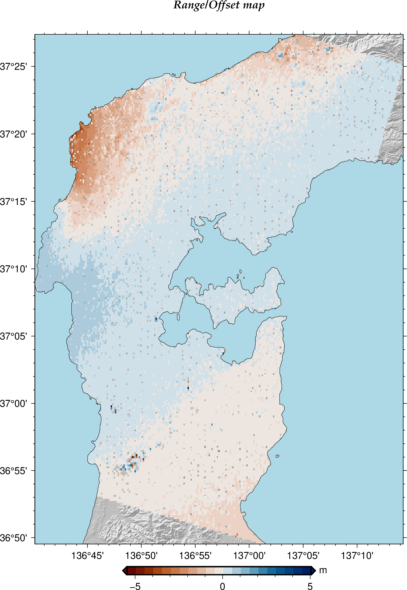
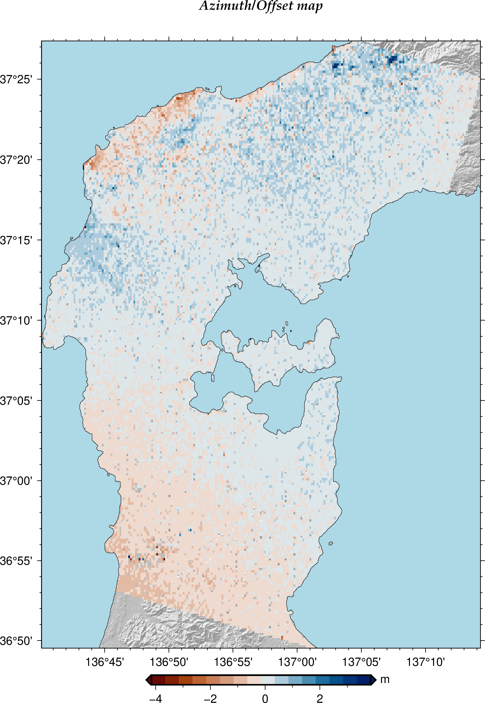
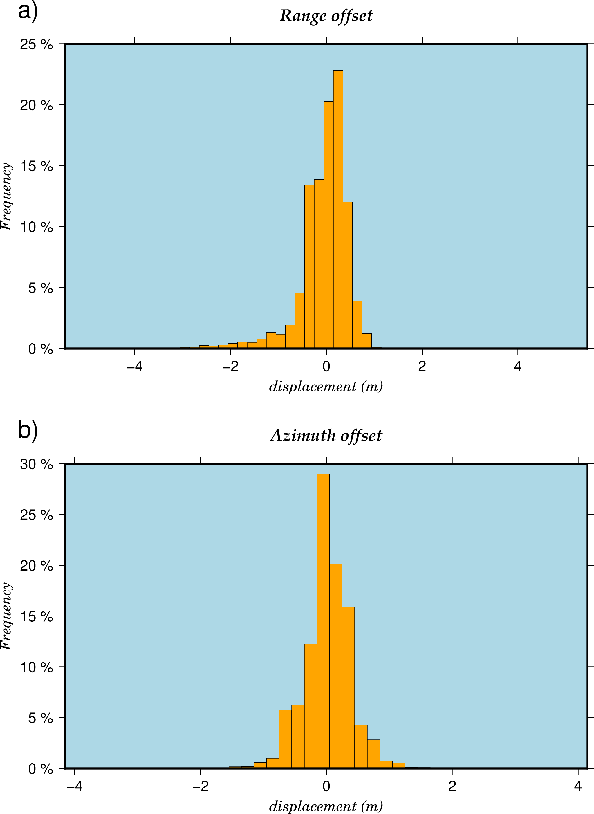
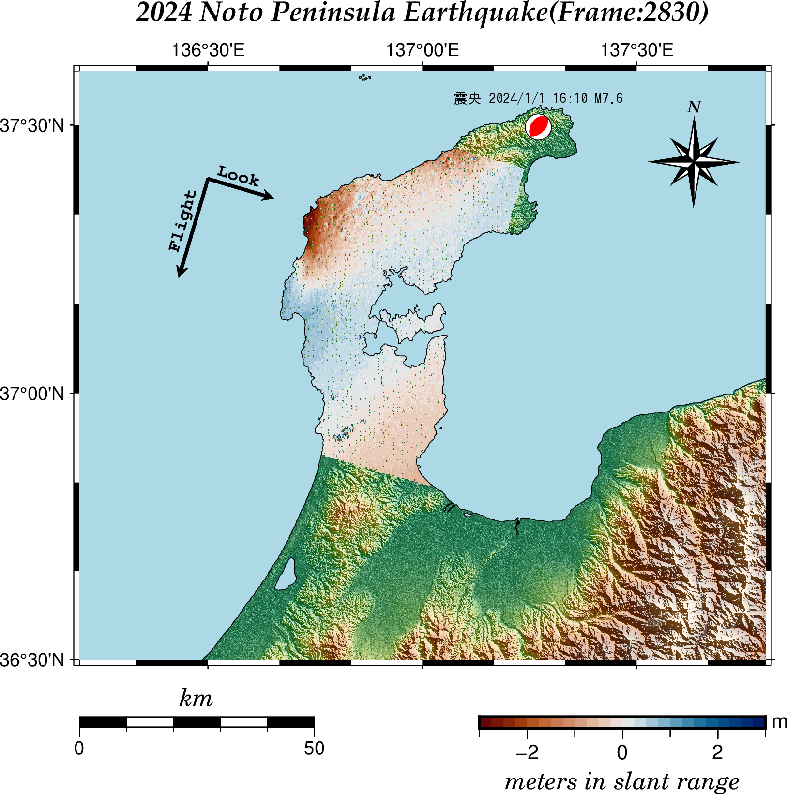
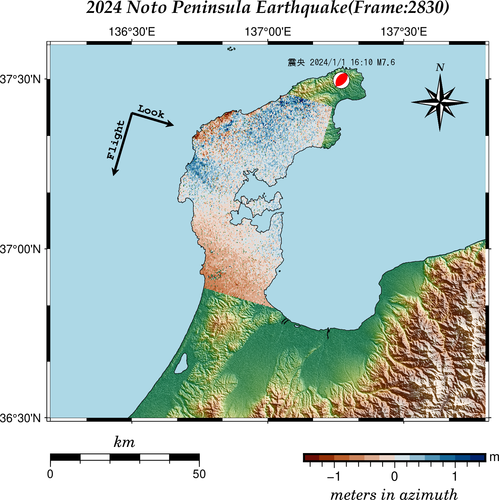

# GMTSARでピクセルオフセット法（プログラムの作成 その２）

[](https://hits.seeyoufarm.com) 

2024/3/21: プログラムの地図を描く部分一部変更

** 「この記事に使用したデータは、JAXAの無償公開データを利用しました。」 **

[GMTSARでピクセルオフセット法（準備編）](https://gitpress.io/@statrstart/gmtsar02)

- xcorr より約１６倍高速な「xcorr2_cl」をbuildしてインストールします。

[GMTSARでピクセルオフセット法（プログラムの作成 その1）](https://gitpress.io/@statrstart/gmtsar03)

- マスク処理について考えました。

ピクセルオフセット法をGMTSARで行うためのプログラムを２つ作成します。

1. make_a_offset.cshにslant-range offsetを行うところを加えた。make_pot.csh
2. make_a_offset.csh、もしくは、上記make_pot.cshを実行し、算出されたfreq_xcorr.datを用いてパラメータを変更してデータ作成とグラフ作成を行う easy_pot.csh

’（注）作成するといっても、gmtsarの「make_a_offset.csh」に[ Can GMTSAR do pixel offset？ #669 ](https://github.com/gmtsar/gmtsar/issues/669)の[make_xcorr_plot.csh.txt](https://github.com/gmtsar/gmtsar/files/10954822/make_xcorr_plot.csh.txt)を加えて、プロットする部分をgmt6仕様にしただけのものです。素人が趣味で作ったものですのでその点ご了承ください。

使用したパソコン、OS等

- PC : CHUWI HeroBox 2023 (Intel N100  8GB+256GB )
- OS : debian12（512GBのSSDを増設して、インストールした）
- gmt: Version 6.4.0
- gmtsarは記事時点で最新のもの。

ピクセルオフセット法を行うにはxcorrというプログラムを使うのですが、Intel N100のPCだと果てしなく時間（数日！！！）がかかります。

作成したプログラムは、githubで見つけた[gmtsar_optimize:https://github.com/cuihaoleo/gmtsar_optimize ](https://github.com/cuihaoleo/gmtsar_optimize)の「xcorr2_cl」を使っています。

### 下記のプログラムを実行して作成された地図、グラフ

CHUWI HeroBox 2023（debian12）では、xcorr2_clを使っても約１日かかります。標準の「xcorr」だと、16日かかる計算になります。

「2048 2048 32 32」 くらいで収めておいたほうがいいとは思います。

### make_pot.csh は、make_a_offset.cshと同じ書式で実行します。

```
make_pot.csh  IMG-HH-ALOS2487932830-230606-UBSL1.1__D.PRM IMG-HH-ALOS2518982830-240102-UBSL1.1__D.PRM  3072  3072  64 64 1
```

#### slant-range offset



#### azimuth offset



#### ヒストグラム



### easy_pot.csh の書式

freq_xcorr.dat が作成された後にパラメータを変更したいときは、easy_pot.cshを使います。

PRMファイルの指定は一つだけでよい。nx、 ny、 azimuth範囲、　range範囲、 SNRの最小値

(注意)3072 3072の部分（nx ,ny）は「freq_xcorr.dat」を作成したときの数値に合わせてください。

```
easy_pot.csh IMG-HH-ALOS2518982830-240102-UBSL1.1__D.PRM  3072  3072 5 7 15
```

### 出力されたrng_offset_ll.grd を使ってgmtで作成した地図



- カラーバーの範囲は-3<=x<=3 にしています。下の地理院地図は-2<=x<=2

比較してみてください。

国土地理院[「だいち２号」観測データの解析による令和６年能登半島地震に伴う地殻変動（2024年1月19日更新）](https://www.gsi.go.jp/uchusokuchi/20240101noto_insar.html)のピクセルオフセット法による解析結果（2024/1/2）

### 出力されたazi_offset_ll.grd を使ってgmtで作成した地図（コードは省略）



### gmtsar csh プログラム

#### make_pot.csh

（注意）xcorrではなくxcorr2_clを使っています。xcorrを使う場合は

```
if ($do_xcorr == 1 ) xcorr2_cl $master $aligned -nx $nx -ny $ny -xsearch $xsearch -ysearch $ysearch -noshift
```

を
```
if ($do_xcorr == 1 ) xcorr $master $aligned -nx $nx -ny $ny -xsearch $xsearch -ysearch $ysearch -noshift
```
と書き換えてください。（手間ひまかけても、xcorr2_clをビルド、インストールした方がいいです。）


```
#!/bin/csh -f
#       $Id$
# Script to drive the xcorr to do the azimuthal pixel-tracking
# Originated by Matt Wei, April 19, 2010
# Rewrote by Kang Wang 
# Last update: Aug. 09, 2013
#
# Revised by Xiaohua Xu, Nov 15, 2013: adding some pre_proc, redefined some parameters, add blockmedian, 
# add shaded part, delete some redundant lines, easier to use
#
# Revised by David Sandwell, Dec 28, 2018: corrected azi pixel size using ground velocity and added more comments
#
if ($#argv != 7) then
   echo ""
   echo "Usage: make_a_offset.csh Master.PRM Aligned.PRM nx ny xsearch ysearch do_xcorr"
   echo ""
   echo "       nx - number of offsets to compute in the range direction (~num_rng/4)  "
   echo "       ny - number of offsets to compute in the azimuth direction (~num_az/6)  "
   echo "       xsearch - size of correlation window in range (e.g., 16) "
   echo "       ysearch - size of correlation window in azimuth (e.g., 16) "
   echo "       do_xcorr - 1-recalculate xcorr; 0-use results from previous xcorr"
   echo ""
   exit 1
endif
echo "make_pot.csh" $1 $2 $3 $4 $5 $6
#
set master = $1
set aligned = $2
set nx = $3
set ny = $4
set xsearch = $5
set ysearch = $6
set do_xcorr = $7
#
# pre_proc needed files
#
cd intf/*/
mkdir azi_offset
cd azi_offset
#cp ../../../raw/$1 .
#cp ../../../raw/$2 .
cp ../../../SLC/$1 .
cp ../../../SLC/$2 .
#
ln -s ../../../SLC/*.SLC .
ln -s ../../../topo/trans.dat
ln -s ../../../topo/dem.grd
#
set PRF = `grep PRF $master |awk -F"=" '{print $2}'`
set SC_vel = `grep SC_vel $master|awk -F"=" '{print $2}'`
set earth_radius = `grep earth_radius $master|awk -F"=" '{print $2}'`
set SC_height = `grep SC_height $master|awk -F"=" '{print $2}'`
#
#  compute the ground velocity from the effrctive velocity using equation B12
#
set ground_vel = `echo $SC_vel $earth_radius $SC_height | awk '{print $1/sqrt(1+$3/$2)} '`
echo "ground velocity: " $ground_vel
set azi_size = `echo $ground_vel $PRF|awk '{printf "%10.3f",$1/$2}' `
echo "azi pixel size", $azi_size
#
set rng_samp_rate = `grep rng_samp_rate $master | head -1 | awk '{print $3}'`
set rng_size = `echo $rng_samp_rate | awk '{printf "%.6f", 299792458.0/$1/2}' `
echo "rng pixel size", $rng_size
#
# these SLC's are already aligned so reset all the offsets to zero
#
update_PRM $master rshift 0
update_PRM $master sub_int_r 0
update_PRM $master stretch_r 0.0
update_PRM $master a_stretch_r 0.0
update_PRM $master ashift 0
update_PRM $master sub_int_a 0.0
update_PRM $master stretch_a 0.0
update_PRM $master a_stretch_a 0.0
update_PRM $aligned rshift 0
update_PRM $aligned sub_int_r 0
update_PRM $aligned stretch_r 0.0
update_PRM $aligned a_stretch_r 0.0
update_PRM $aligned ashift 0
update_PRM $aligned sub_int_a 0.0
update_PRM $aligned stretch_a 0.0
update_PRM $aligned a_stretch_a 0.0 
#
# make azimuth offset if do_xcorr = 1
#
if ($do_xcorr == 1 ) xcorr2_cl $master $aligned -nx $nx -ny $ny -xsearch $xsearch -ysearch $ysearch -noshift
#
# ********edit the following line
#
awk '{if ($4>-2 && $4<2 && $5>10) print $1,$3,$4,$5}'  freq_xcorr.dat >azi.dat
awk '{if ($2>-4 && $2<4 && $5>10) print $1,$3,$2,$5}'  freq_xcorr.dat >rng.dat
# 
# do a block median on the offset data and grid the results
#
set xmin = `gmt gmtinfo azi.dat -C |awk '{print $1}'`
set xmax = `gmt gmtinfo azi.dat -C |awk '{print $2}'`
set ymin = `gmt gmtinfo azi.dat -C |awk '{print $3}'`
set ymax = `gmt gmtinfo azi.dat -C |awk '{print $4}'`
#
set xinc = `echo $xmax $xmin $nx |awk '{printf "%d", ($1-$2)/($3-1)}'`
set yinc = `echo $ymax $ymin $ny |awk '{printf "%d", ($1-$2)/($3-1)}'`
#
set xinc = `echo $xinc | awk '{print $1*12}'`
set yinc = `echo $yinc | awk '{print $1*12}'`
echo "xinc:"$xinc"  yinc:"$yinc
#
gmt blockmedian azi.dat -R$xmin/$xmax/$ymin/$ymax  -I$xinc/$yinc -Wi | awk '{print $1, $2, $3}'  > azi_b.dat
#
# azi_offset
gmt xyz2grd azi_b.dat -R$xmin/$xmax/$ymin/$ymax  -I$xinc/$yinc -Gaoff.grd 
gmt grdmath aoff.grd $azi_size MUL = azi_offset.grd
#
# project to lon/lat coordinates
#
proj_ra2ll_ascii.csh trans.dat azi_b.dat aoff.llo
#
set xmin2 = `gmt gmtinfo aoff.llo -C |awk '{print $1}'`
set xmax2 = `gmt gmtinfo aoff.llo -C |awk '{print $2}'`
set ymin2 = `gmt gmtinfo aoff.llo -C |awk '{print $3}'`
set ymax2 = `gmt gmtinfo aoff.llo -C |awk '{print $4}'`
#
set xinc2 = `echo $xmax2 $xmin2 $nx |awk '{printf "%12.5f", ($1-$2)/($3-1)}'`
set yinc2 = `echo $ymax2 $ymin2 $ny |awk '{printf "%12.5f", ($1-$2)/($3-1)}'`
set xinc2 = `echo $xinc2 | awk '{print $1*12}'`
set yinc2 = `echo $yinc2 | awk '{print $1*12}'`
#
echo "xinc2:"$xinc2"  yinc2:"$yinc2
#
gmt xyz2grd aoff.llo -R$xmin2/$xmax2/$ymin2/$ymax2  -I$xinc2/$yinc2 -r -fg -Gaoff_ll.grd
gmt grdmath aoff_ll.grd $azi_size MUL = azi_offset_ll.grd
#
gmt grdsample dem.grd -Gs_dem.grd -R$xmin2/$xmax2/$ymin2/$ymax2 -I$xinc2/$yinc2 -r
gmt grdgradient dem.grd -Gtmp.grd -A325 -Nt.5
gmt grdmath tmp.grd .5 ADD = dem_grd.grd
gmt grdgradient s_dem.grd -Gs_dem_grd.grd -A45 -Nt.5
#
# plot the azimuth offset
#
set r_topo = `gmt grdinfo dem.grd -T100`
gmt makecpt -Cgray -T-1/1/.1 -Z > topo.cpt
#
set x1 = `gmt grdinfo azi_offset_ll.grd -C |awk '{print $2 }'`
set x2 = `gmt grdinfo azi_offset_ll.grd -C |awk '{print $3 }'`
#
set y1 = `gmt grdinfo azi_offset_ll.grd -C |awk '{print $4 }'`
set y2 = `gmt grdinfo azi_offset_ll.grd -C |awk '{print $5 }'`
gmt grdlandmask -Gmask.grd -R$x1/$x2/$y1/$y2 -I0.002 -Df -NNaN/0
gmt grd2xyz mask.grd | gmt xyz2grd -Razi_offset_ll.grd -Gtmp.grd
gmt grdmath azi_offset_ll.grd tmp.grd OR = azipot.grd
set L = `gmt grdinfo -C azipot.grd  | awk '{printf -1*$6}'`
set U = `gmt grdinfo -C azipot.grd  | awk '{printf $7}'`
set U2 = `printf "$L\n$U\n" | awk 'NR==1 {max=$1} {if($1>max) max=$1} END {print max}'`
set L2 = `echo -$U2`
#
set xlim = `echo $x2 $x1|awk '{print $1-$2}'`
set ylim = `echo $y2 $y1|awk '{print $1-$2}'`
#
set length = 20 
set width = 16
#
set scl1 = `echo $ylim $length | awk '{print $2/$1 }' `
set scl2 = `echo $xlim $width | awk '{print $2/$1}'`
set scl = `echo $scl1 $scl2 | awk '{if ($1<$2) {print $1} else {print $2} }'`
#
set bounds = `gmt grdinfo -I- azi_offset_ll.grd`
#
gmt gmtdefaults -Ds > gmt.conf
gmt set MAP_FRAME_TYPE plain
gmt set FONT_TITLE  14p,32,black
gmt set FONT_SUBTITLE  12p,32,black
gmt set FONT_LABEL 12p,26,black
#
gmt begin azioff_ll png  C-dALLOWPSTRANSPARENCY
gmt basemap -Baf -BWSne+t"Azimuth/Offset map" -Jm$scl"c" $bounds
gmt grdimage dem_grd.grd -Ctopo.cpt -Q
gmt makecpt -Cvik -T$L2/$U2/0.5 -D -Ic
gmt grdimage azi_offset_ll.grd -C -Q
gmt coast -Df -W0.25 -Slightblue
gmt colorbar -DJBC+w8c/0.35c+e+o0/1 -C -Bxaf -By+lm
gmt end
echo "Azimuth/Offset map: azioff_ll.png"
#
# range:do a block median on the offset data and grid the results
#
set xmin = `gmt gmtinfo rng.dat -C |awk '{print $1}'`
set xmax = `gmt gmtinfo rng.dat -C |awk '{print $2}'`
set ymin = `gmt gmtinfo rng.dat -C |awk '{print $3}'`
set ymax = `gmt gmtinfo rng.dat -C |awk '{print $4}'`
#
set xinc = `echo $xmax $xmin $nx |awk '{printf "%d", ($1-$2)/($3-1)}'`
set yinc = `echo $ymax $ymin $ny |awk '{printf "%d", ($1-$2)/($3-1)}'`
#
set xinc = `echo $xinc | awk '{print $1*12}'`
set yinc = `echo $yinc | awk '{print $1*12}'`
echo "xinc:"$xinc"  yinc:"$yinc
#
gmt blockmedian rng.dat -R$xmin/$xmax/$ymin/$ymax -I$xinc/$yinc -Wi | awk '{print $1, $2, $3}' > rng_b.dat
#
# rng_offset
gmt xyz2grd rng_b.dat -R$xmin/$xmax/$ymin/$ymax  -I$xinc/$yinc -Groff.grd
gmt grdmath roff.grd $rng_size MUL = rng_offset.grd
#
# project to lon/lat coordinates
#
proj_ra2ll_ascii.csh trans.dat rng_b.dat roff.llo
#
# plot the range offset
#
set xmin2 = `gmt gmtinfo roff.llo -C |awk '{print $1}'`
set xmax2 = `gmt gmtinfo roff.llo -C |awk '{print $2}'`
set ymin2 = `gmt gmtinfo roff.llo -C |awk '{print $3}'`
set ymax2 = `gmt gmtinfo roff.llo -C |awk '{print $4}'`
#
set xinc2 = `echo $xmax2 $xmin2 $nx |awk '{printf "%12.5f", ($1-$2)/($3-1)}'`
set yinc2 = `echo $ymax2 $ymin2 $ny |awk '{printf "%12.5f", ($1-$2)/($3-1)}'`
set xinc2 = `echo $xinc2 | awk '{print $1*12}'`
set yinc2 = `echo $yinc2 | awk '{print $1*12}'`
#
echo "xinc2:"$xinc2"  yinc2:"$yinc2
#
gmt xyz2grd roff.llo -R$xmin2/$xmax2/$ymin2/$ymax2  -I$xinc2/$yinc2 -r -fg -Groff_ll.grd
gmt grdmath roff_ll.grd $rng_size MUL = rng_offset_ll.grd
#
gmt grdsample dem.grd -Gs_dem.grd -R$xmin2/$xmax2/$ymin2/$ymax2 -I$xinc2/$yinc2 -r
gmt grdgradient dem.grd -Gtmp.grd -A325 -Nt.5
gmt grdmath tmp.grd .5 ADD = dem_grd.grd
gmt grdgradient s_dem.grd -Gs_dem_grd.grd -A45 -Nt.5
#
set x1 = `gmt grdinfo rng_offset_ll.grd -C |awk '{print $2 }'`
set x2 = `gmt grdinfo rng_offset_ll.grd -C |awk '{print $3 }'`
#
set y1 = `gmt grdinfo rng_offset_ll.grd -C |awk '{print $4 }'`
set y2 = `gmt grdinfo rng_offset_ll.grd -C |awk '{print $5 }'`
gmt grdlandmask -Gmask.grd -R$x1/$x2/$y1/$y2 -I0.002 -Df -NNaN/0
gmt grd2xyz mask.grd | gmt xyz2grd -Rrng_offset_ll.grd -Gtmp.grd
gmt grdmath rng_offset_ll.grd tmp.grd OR = rngpot.grd
set L1 = `gmt grdinfo -C rngpot.grd  | awk '{printf -1*$6}'`
set U1 = `gmt grdinfo -C rngpot.grd  | awk '{printf $7}'`
set U3 = `printf "$L1\n$U1\n" | awk 'NR==1 {max=$1} {if($1>max) max=$1} END {print max}'`
set L3 = `echo -$U3`
# 
set xlim = `echo $x2 $x1|awk '{print $1-$2}'`
set ylim = `echo $y2 $y1|awk '{print $1-$2}'`
#
set scl1 = `echo $ylim $length | awk '{print $2/$1 }' `
set scl2 = `echo $xlim $width | awk '{print $2/$1}'`
set scl = `echo $scl1 $scl2 | awk '{if ($1<$2) {print $1} else {print $2} }'`
#
set bounds = `gmt grdinfo -I- rng_offset_ll.grd`
#
gmt begin rngoff_ll png  C-dALLOWPSTRANSPARENCY
gmt basemap -Baf -BWSne+t"Range/Offset map" -Jm$scl"c" $bounds
gmt grdimage dem_grd.grd -Ctopo.cpt  -Q 
gmt makecpt -Cvik -T$L3/$U3/0.5 -D -Ic
gmt grdimage rng_offset_ll.grd -C -Q
gmt coast -Df -W0.25 -Slightblue
gmt colorbar -DJBC+w8c/0.35c+e+o0/1 -C -Bxaf -By+lm
gmt end
echo "Range/Offset map: rngoff_ll.png"
#
# histogram
gmt grd2xyz azipot.grd | awk '$3 != "NaN"{print $3}' > azihist.dat
gmt grd2xyz rngpot.grd | awk '$3 != "NaN"{print $3}' > rnghist.dat
gmt begin histogram png
gmt subplot begin 2x1 -A+JTL+o0.3i -Fs6i/3.5i -M0.4i -X1.25i
gmt histogram rnghist.dat -Bxa+l"displacement (m)" -Bya+l"Frequency"+u" %" -BWSne+t"Range offset"+glightblue -R$L3/$U3/0/0 -W0.2 -L -Z1 -Gorange -c0
gmt histogram azihist.dat -Bxa+l"displacement (m)" -Bya+l"Frequency"+u" %" -BWSne+t"Azimuth offset"+glightblue -R$L2/$U2/0/0 -W0.2 -L -Z1 -Gorange -c1
gmt subplot end
gmt end
#
rm -f tmp.grd aoff_ll.grd aoff.grd aoff.llo  dem_grd.grd grey_tmp.cpt ps2rast* raln* ralt* s_dem.grd temp.dat topo.cpt roff_ll.grd roff.grd roff.llo 
```

#### easy_pot.csh

```
#!/bin/csh -f
#
#freq_xcorr.dat
#col 1 : x coordinate
#col 2 : slant-range offset
#col 3 : y coodinate
#col 4 : azimuth offset
#col 5 : SNR
#

if ($#argv != 6) then
   echo ""
   echo "Usage: easy_pot.csh PRM nx ny azi rng snr"
   echo ""
   echo "       PRM - Referenced PRM   "
   echo "       nx - The number which used when doing make_a_offset.csh (~num_rng/4) "
   echo "       ny - The number which used when doing make_a_offset.csh (~num_az/6) "
   echo "       assume all azi offsets are less than x pixels "
   echo "       assume all rng offsets are less than x pixels "
   echo "       SNR > x "
   echo ""
   exit 1
endif
echo "east_pot.csh" $1 $2 $3 $4 $5 $6
#
cd intf/*/azi_offset

set PRM = $1
set nx = $2
set ny = $3
set azi = $4
set rng = $5
set snr = $6
set PRF = `grep PRF $PRM |awk -F"=" '{print $2}'`
set SC_vel = `grep SC_vel $PRM|awk -F"=" '{print $2}'`
set earth_radius = `grep earth_radius $PRM|awk -F"=" '{print $2}'`
set SC_height = `grep SC_height $PRM|awk -F"=" '{print $2}'`
set rsr = `grep rng_samp_rate $PRM | awk -F"=" 'NR==1 {print $2}'`
set c = 299792458.0 # Speed of light
#
#  compute the ground velocity from the effrctive velocity using equation B12
#
set ground_vel = `echo $SC_vel $earth_radius $SC_height | awk '{print $1/sqrt(1+$3/$2)} '`
echo "ground velocity: " $ground_vel
set azi_size = `echo $ground_vel $PRF|awk '{printf "%10.3f",$1/$2}' `
echo "azi pixel size", $azi_size
#
# Compute the range pixel size
set rng_size = `echo $c $rsr | awk '{print $1/$2/2}'`
echo "range pixel size = "$rng_size
#
awk -v "azi=$azi" -v "snr=$snr" '{if ($4>-azi && $4<azi && $5>snr) print $1,$3,$4,$5}'  freq_xcorr.dat > azi.dat
awk -v "rng=$rng" -v "snr=$snr" '{if ($2>-rng && $2<rng && $5>snr) print $1,$3,$2,$5}'  freq_xcorr.dat > rng.dat
#
# do a block median on the offset data and grid the results
#
set xmin = `gmt gmtinfo azi.dat -C |awk '{print $1}'`
set xmax = `gmt gmtinfo azi.dat -C |awk '{print $2}'`
set ymin = `gmt gmtinfo azi.dat -C |awk '{print $3}'`
set ymax = `gmt gmtinfo azi.dat -C |awk '{print $4}'`
#
set xinc = `echo $xmax $xmin $nx |awk '{printf "%d", ($1-$2)/($3-1)}'`
set yinc = `echo $ymax $ymin $ny |awk '{printf "%d", ($1-$2)/($3-1)}'`
#
set xinc = `echo $xinc | awk '{print $1*12}'`
set yinc = `echo $yinc | awk '{print $1*12}'`
echo "xinc:"$xinc"  yinc:"$yinc
#
gmt blockmedian azi.dat -R$xmin/$xmax/$ymin/$ymax  -I$xinc/$yinc -Wi | awk '{print $1, $2, $3}'  > azi_b.dat
#
# azi_offset
gmt xyz2grd azi_b.dat -R$xmin/$xmax/$ymin/$ymax  -I$xinc/$yinc -Gaoff.grd 
gmt grdmath aoff.grd $azi_size MUL = azi_offset.grd
#
# project to lon/lat coordinates
#
proj_ra2ll_ascii.csh trans.dat azi_b.dat aoff.llo
#
set xmin2 = `gmt gmtinfo aoff.llo -C |awk '{print $1}'`
set xmax2 = `gmt gmtinfo aoff.llo -C |awk '{print $2}'`
set ymin2 = `gmt gmtinfo aoff.llo -C |awk '{print $3}'`
set ymax2 = `gmt gmtinfo aoff.llo -C |awk '{print $4}'`
#
set xinc2 = `echo $xmax2 $xmin2 $nx |awk '{printf "%12.5f", ($1-$2)/($3-1)}'`
set yinc2 = `echo $ymax2 $ymin2 $ny |awk '{printf "%12.5f", ($1-$2)/($3-1)}'`
set xinc2 = `echo $xinc2 | awk '{print $1*12}'`
set yinc2 = `echo $yinc2 | awk '{print $1*12}'`
#
echo "xinc2:"$xinc2"  yinc2:"$yinc2
#
gmt xyz2grd aoff.llo -R$xmin2/$xmax2/$ymin2/$ymax2  -I$xinc2/$yinc2 -r -fg -Gaoff_ll.grd
gmt grdmath aoff_ll.grd $azi_size MUL = azi_offset_ll.grd
#
gmt grdsample dem.grd -Gs_dem.grd -R$xmin2/$xmax2/$ymin2/$ymax2 -I$xinc2/$yinc2 -r
gmt grdgradient dem.grd -Gtmp.grd -A325 -Nt.5
gmt grdmath tmp.grd .5 ADD = dem_grd.grd
gmt grdgradient s_dem.grd -Gs_dem_grd.grd -A45 -Nt.5
#
# plot the azimuth offset
#
set r_topo = `gmt grdinfo dem.grd -T100`
gmt makecpt -Cgray -T-1/1/.1 -Z > topo.cpt
#
set x1 = `gmt grdinfo azi_offset_ll.grd -C |awk '{print $2 }'`
set x2 = `gmt grdinfo azi_offset_ll.grd -C |awk '{print $3 }'`
#
set y1 = `gmt grdinfo azi_offset_ll.grd -C |awk '{print $4 }'`
set y2 = `gmt grdinfo azi_offset_ll.grd -C |awk '{print $5 }'`
gmt grdlandmask -Gmask.grd -R$x1/$x2/$y1/$y2 -I0.002 -Df -NNaN/0
gmt grd2xyz mask.grd | gmt xyz2grd -Razi_offset_ll.grd -Gtmp.grd
gmt grdmath azi_offset_ll.grd tmp.grd OR = azipot.grd
set L = `gmt grdinfo -C azipot.grd  | awk '{printf -1*$6}'`
set U = `gmt grdinfo -C azipot.grd  | awk '{printf $7}'`
set U2 = `printf "$L\n$U\n" | awk 'NR==1 {max=$1} {if($1>max) max=$1} END {print max}'`
set L2 = `echo -$U2`
#
set xlim = `echo $x2 $x1|awk '{print $1-$2}'`
set ylim = `echo $y2 $y1|awk '{print $1-$2}'`
#
set length = 20 
set width = 16
#
set scl1 = `echo $ylim $length | awk '{print $2/$1 }' `
set scl2 = `echo $xlim $width | awk '{print $2/$1}'`
set scl = `echo $scl1 $scl2 | awk '{if ($1<$2) {print $1} else {print $2} }'`
#
set bounds = `gmt grdinfo -I- azi_offset_ll.grd`
#
gmt gmtdefaults -Ds > gmt.conf
gmt set MAP_FRAME_TYPE plain
gmt set FONT_TITLE  14p,32,black
gmt set FONT_SUBTITLE  12p,32,black
gmt set FONT_LABEL 12p,26,black
#
gmt begin azioff_ll png  C-dALLOWPSTRANSPARENCY
gmt basemap -Baf -BWSne+t"Azimuth/Offset map" -Jm$scl"c" $bounds
gmt grdimage dem_grd.grd -Ctopo.cpt -Q
gmt makecpt -Cvik -T$L2/$U2/0.5 -D -Ic
gmt grdimage azi_offset_ll.grd -C -Q
gmt coast -Df -W0.25 -Slightblue
gmt colorbar -DJBC+w8c/0.35c+e+o0/1 -C -Bxaf -By+lm
gmt end
echo "Azimuth/Offset map: azioff_ll.png"
#
# range:do a block median on the offset data and grid the results
#
set xmin = `gmt gmtinfo rng.dat -C |awk '{print $1}'`
set xmax = `gmt gmtinfo rng.dat -C |awk '{print $2}'`
set ymin = `gmt gmtinfo rng.dat -C |awk '{print $3}'`
set ymax = `gmt gmtinfo rng.dat -C |awk '{print $4}'`
#
set xinc = `echo $xmax $xmin $nx |awk '{printf "%d", ($1-$2)/($3-1)}'`
set yinc = `echo $ymax $ymin $ny |awk '{printf "%d", ($1-$2)/($3-1)}'`
#
set xinc = `echo $xinc | awk '{print $1*12}'`
set yinc = `echo $yinc | awk '{print $1*12}'`
echo "xinc:"$xinc"  yinc:"$yinc
#
gmt blockmedian rng.dat -R$xmin/$xmax/$ymin/$ymax -I$xinc/$yinc -Wi | awk '{print $1, $2, $3}' > rng_b.dat
#
# rng_offset
gmt xyz2grd rng_b.dat -R$xmin/$xmax/$ymin/$ymax  -I$xinc/$yinc -Groff.grd
gmt grdmath roff.grd $rng_size MUL = rng_offset.grd
#
# project to lon/lat coordinates
#
proj_ra2ll_ascii.csh trans.dat rng_b.dat roff.llo
#
# plot the range offset
#
set xmin2 = `gmt gmtinfo roff.llo -C |awk '{print $1}'`
set xmax2 = `gmt gmtinfo roff.llo -C |awk '{print $2}'`
set ymin2 = `gmt gmtinfo roff.llo -C |awk '{print $3}'`
set ymax2 = `gmt gmtinfo roff.llo -C |awk '{print $4}'`
#
set xinc2 = `echo $xmax2 $xmin2 $nx |awk '{printf "%12.5f", ($1-$2)/($3-1)}'`
set yinc2 = `echo $ymax2 $ymin2 $ny |awk '{printf "%12.5f", ($1-$2)/($3-1)}'`
set xinc2 = `echo $xinc2 | awk '{print $1*12}'`
set yinc2 = `echo $yinc2 | awk '{print $1*12}'`
#
echo "xinc2:"$xinc2"  yinc2:"$yinc2
#
gmt xyz2grd roff.llo -R$xmin2/$xmax2/$ymin2/$ymax2  -I$xinc2/$yinc2 -r -fg -Groff_ll.grd
gmt grdmath roff_ll.grd $rng_size MUL = rng_offset_ll.grd
#
gmt grdsample dem.grd -Gs_dem.grd -R$xmin2/$xmax2/$ymin2/$ymax2 -I$xinc2/$yinc2 -r
gmt grdgradient dem.grd -Gtmp.grd -A325 -Nt.5
gmt grdmath tmp.grd .5 ADD = dem_grd.grd
gmt grdgradient s_dem.grd -Gs_dem_grd.grd -A45 -Nt.5
#
set x1 = `gmt grdinfo rng_offset_ll.grd -C |awk '{print $2 }'`
set x2 = `gmt grdinfo rng_offset_ll.grd -C |awk '{print $3 }'`
#
set y1 = `gmt grdinfo rng_offset_ll.grd -C |awk '{print $4 }'`
set y2 = `gmt grdinfo rng_offset_ll.grd -C |awk '{print $5 }'`
gmt grdlandmask -Gmask.grd -R$x1/$x2/$y1/$y2 -I0.002 -Df -NNaN/0
gmt grd2xyz mask.grd | gmt xyz2grd -Rrng_offset_ll.grd -Gtmp.grd
gmt grdmath rng_offset_ll.grd tmp.grd OR = rngpot.grd
set L1 = `gmt grdinfo -C rngpot.grd  | awk '{printf -1*$6}'`
set U1 = `gmt grdinfo -C rngpot.grd  | awk '{printf $7}'`
set U3 = `printf "$L1\n$U1\n" | awk 'NR==1 {max=$1} {if($1>max) max=$1} END {print max}'`
set L3 = `echo -$U3`
# 
set xlim = `echo $x2 $x1|awk '{print $1-$2}'`
set ylim = `echo $y2 $y1|awk '{print $1-$2}'`
#
set scl1 = `echo $ylim $length | awk '{print $2/$1 }' `
set scl2 = `echo $xlim $width | awk '{print $2/$1}'`
set scl = `echo $scl1 $scl2 | awk '{if ($1<$2) {print $1} else {print $2} }'`
#
set bounds = `gmt grdinfo -I- rng_offset_ll.grd`
#
gmt begin rngoff_ll png  C-dALLOWPSTRANSPARENCY
gmt basemap -Baf -BWSne+t"Range/Offset map" -Jm$scl"c" $bounds
gmt grdimage dem_grd.grd -Ctopo.cpt  -Q 
gmt makecpt -Cvik -T$L3/$U3/0.5 -D -Ic
gmt grdimage rng_offset_ll.grd -C -Q
gmt coast -Df -W0.25 -Slightblue
gmt colorbar -DJBC+w8c/0.35c+e+o0/1 -C -Bxaf -By+lm
gmt end
echo "Range/Offset map: rngoff_ll.png"
#
# histogram
gmt grd2xyz azipot.grd | awk '$3 != "NaN"{print $3}' > azihist.dat
gmt grd2xyz rngpot.grd | awk '$3 != "NaN"{print $3}' > rnghist.dat
gmt begin histogram png
gmt subplot begin 2x1 -A+JTL+o0.3i -Fs6i/3.5i -M0.4i -X1.25i
gmt histogram rnghist.dat -Bxa+l"displacement (m)" -Bya+l"Frequency"+u" %" -BWSne+t"Range offset"+glightblue -R$L3/$U3/0/0 -W0.2 -L -Z1 -Gorange -c0
gmt histogram azihist.dat -Bxa+l"displacement (m)" -Bya+l"Frequency"+u" %" -BWSne+t"Azimuth offset"+glightblue -R$L2/$U2/0/0 -W0.2 -L -Z1 -Gorange -c1
gmt subplot end
gmt end
#
rm -f tmp.grd aoff_ll.grd aoff.grd aoff.llo azi.dat dem_grd.grd grey_tmp.cpt ps2rast* raln* ralt* s_dem.grd temp.dat topo.cpt roff_ll.grd roff.grd roff.llo rng.dat 
```

#### rng_offset_ll.grd を使ってgmtで作成した地図を作ったgmtコード

rng_offset_ll.grdと同じフォルダ内に「dem.grd」を置いておきます。

```
gmt grdcut dem.grd  -R136.2/137.8/36.5/37.6 -Gsar.nc

gmt set FONT_TITLE  14p,32,black
gmt set FONT_SUBTITLE  12p,32,black
gmt set FONT_LABEL 12p,26,black
# 地図スケールの高さを 5p -> 10p
gmt set MAP_SCALE_HEIGHT  10p
#
gmt begin rngoffset png C-dALLOWPSTRANSPARENCY
gmt basemap -JM12 -R136.2/137.8/36.5/37.6 -Bafg -BWsNe+t"2024 Noto Peninsula Earthquake(Frame:2830)"
gmt makecpt -Cgeo -T0/3000/200 -Z
gmt grdgradient sar.nc -Ggrad.grd -A45 -Ne0.8
gmt grdimage sar.nc -Igrad.grd -C
gmt makecpt -Cvik -T-3/3/0.25 -D -Ic
gmt grdimage rng_offset_ll.grd -C -Q
gmt colorbar -DJBR+jTR+o0/1+w5/0.2+h -Baf+l"meters in slant range" -By+lm
gmt coast -Slightblue -Df -W0.25 -LJBL+jTL+c35+w50k+f+o0/1+l
gmt psxy -Sv0.05/0.2/0.1 -Gblack <<EOF
136.5 37.4 253.505 1.8
EOF
gmt psxy -Sv0.05/0.2/0.1 -Gblack <<EOF
136.5 37.4 343.505 1.2
EOF
gmt meca -Sa0.3 -Gred  <<EOF
137.2705 37.4962 15.86 213 41 79 7.6
EOF
echo 136.5 37.4 BR 73.5046 9p,9,black "Flight" | gmt pstext -F+j+a+f -D-0.2/-0.2
echo 136.5 37.4 TL -16.4954 9p,9,black "Look" | gmt pstext -F+j+a+f -D0.2/0.25
# directional rose
gmt psbasemap -TdjRT+w1.5c+f2+l,,,N+o0.5c/0.5c
echo "137.2705 37.4962 震央 2024/1/1 16:10 M7.6" | nkf -e | gmt text -F+jMC+a0+f7p,37,black -G -D0/0.5 -N
gmt end
```
