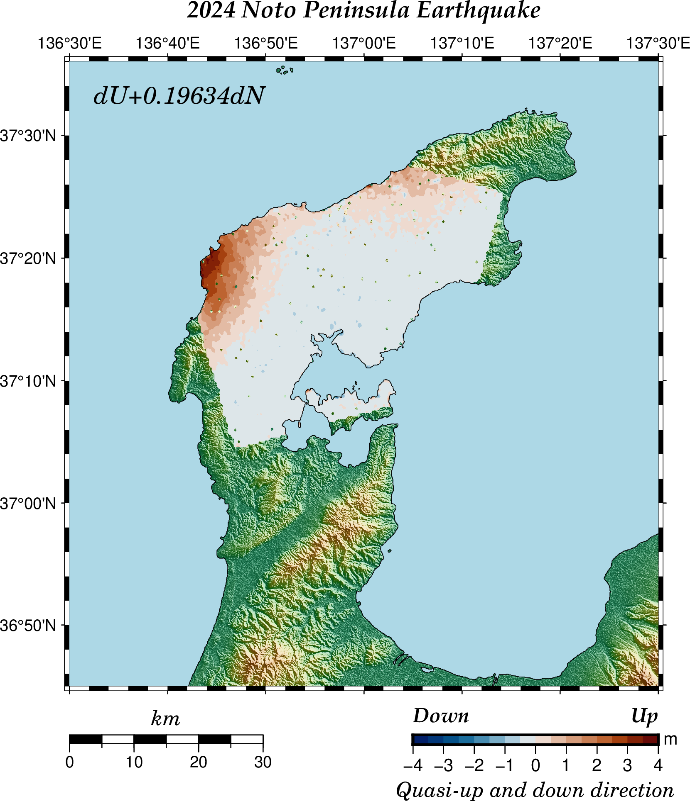
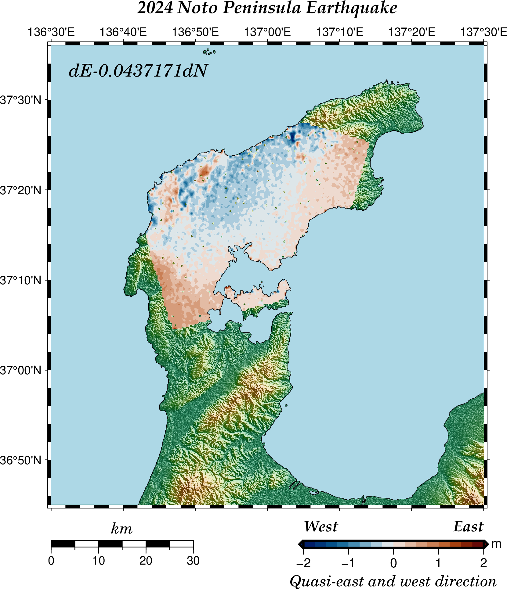

# GMTSARで2.5次元解析

[](https://hits.seeyoufarm.com) 

** 「この記事に使用したデータは、JAXAの無償公開データを利用しました。」 **

[ALOS-2 / PALSAR-2 ScanSAR 観測プロダクト](https://www.eorc.jaxa.jp/ALOS/jp/dataset/open_and_free/palsar2_l11_l22_j.htm)の令和6年(2024年)能登半島地震のデータ  
2024/1/1 Frame:770 & 2022/09/26 Frame:770 のペア及び 2024/1/2 Frame:2830 & 2023/06/06 Frame:2830のペア

(参考)  

1. [オプション２：斜面変状の移動量の更なる定量化を行う](https://www.gsi.go.jp/chirijoho/chirijoho40099.html)
2. [準上下・準東西方向とは](https://maps.gsi.go.jp/sar/mechanism/whats_2.5d_analysis.html)
3. [極座標への変換についてもう少し詳しく教えてほしい](https://science.shinshu-u.ac.jp/~tiiyama/?page_id=4311)
4. [三角関数の基本的性質](https://risalc.info/src/trigonometric-function.html#sup)

(関連する記事)

[GMTSARで2.5次元解析（計算式について）](https://gitpress.io/@statrstart/gmtsar05)

[GMTSARでピクセルオフセット法（プログラムの作成 その２）](https://gitpress.io/@statrstart/gmtsar04)の`make_pot.csh`を実行して得られた`rng_offset_ll.grd`を使う。

[「だいち2号」による令和6年能登半島地震の観測結果について](https://www.eorc.jaxa.jp/ALOS/jp/library/disaster/dis_pal2_noto_earthquake_20240110_j.htm)と
[「だいち２号」観測データの解析による令和６年能登半島地震に伴う地殻変動（2024年1月19日更新）](https://www.gsi.go.jp/uchusokuchi/20240101noto_insar.html)には
「 2.5次元解析」の図がでてきます。

### 2.5次元解析

024/1/1 & 2022/09/26 Frame:770 のペア及び 2024/1/2 & 2023/06/06 Frame:2830のペア

#### 準上下方向



#### 準東西方向



### GMTコード

#### 使用するファイル

２つのSAR リーダファイルと[GMTSARでピクセルオフセット法（プログラムの作成 その２）](https://gitpress.io/@statrstart/gmtsar04)の`make_pot.csh`を
実行して得られた`rng_offset_ll.grd`２つ

ファイルの場所は適切に変更する。

```sh
# 2024/1/1 Frame:770 & 2022/09/26 Frame:770
LED1=/home/usr/GMT/GMTSAR/noto20240101/raw/LED-ALOS2518900770-240101-UBSL1.1__A
rng1=/home/usr/GMT/GMTSAR/offset/20240101_2048/rng_offset_ll.grd
# 2024/1/2 Frame:2830 & 2023/06/06 Frame:2830
LED2=/home/usr/GMT/GMTSAR/noto20240102/raw/LED-ALOS2518982830-240102-UBSL1.1__D
rng2=/home/usr/GMT/GMTSAR/offset/20240102_2048/rng_offset_ll.grd
```

#### 前処理

```sh
# LED1から入射角、シーン中心におけるビーム中心方向を抽出し、EW,NS,UD成分に分解
# 入射角
incidence_angle=$(dd if=$LED1 ibs=1 skip=1205 count=8 2>/dev/null)
# シーン中心におけるビーム中心方向
look=$(dd if=$LED1 ibs=1 skip=2534 count=16 2>/dev/null)
# pi=atan2(0,-0)
EW1=$(echo| awk -v "ia=$incidence_angle" -v "look=$look"  '{print sin(ia*atan2(0,-0)/180)*sin(look*atan2(0,-0)/180)}' )
NS1=$(echo| awk -v "ia=$incidence_angle" -v "look=$look"  '{print sin(ia*atan2(0,-0)/180)*cos(look*atan2(0,-0)/180)}' )
UD1=$(echo| awk -v "ia=$incidence_angle" '{print -cos(ia*atan2(0,-0)/180)}' )
#
# LED2から入射角、シーン中心におけるビーム中心方向を抽出し、EW,NS,UD成分に分解
# 入射角
incidence_angle=$(dd if=$LED2 ibs=1 skip=1205 count=8 2>/dev/null)
# シーン中心におけるビーム中心方向
look=$(dd if=$LED2 ibs=1 skip=2534 count=16 2>/dev/null)
# pi=atan2(0,-0)
EW2=$(echo| awk -v "ia=$incidence_angle" -v "look=$look"  '{print sin(ia*atan2(0,-0)/180)*sin(look*atan2(0,-0)/180)}' )
NS2=$(echo| awk -v "ia=$incidence_angle" -v "look=$look"  '{print sin(ia*atan2(0,-0)/180)*cos(look*atan2(0,-0)/180)}' )
UD2=$(echo| awk -v "ia=$incidence_angle" '{print -cos(ia*atan2(0,-0)/180)}' )
# ２つのデータの重なる範囲
xy1=$(gmt grdinfo $rng1 -C | awk '{print $2,$3,$4,$5}')
xy2=$(gmt grdinfo $rng2 -C | awk '{print $2,$3,$4,$5}')
lon1=$(echo $xy1 $xy2 | awk 'NR==1{max=$1}{if(max<$5) max=$5} END{print max}')
lon2=$(echo $xy1 $xy2 | awk 'NR==1{min=$2}{if(min>$6) min=$6} END{print min}')
lat1=$(echo $xy1 $xy2 | awk 'NR==1{max=$3}{if(max<$7) max=$7} END{print max}')
lat2=$(echo $xy1 $xy2 | awk 'NR==1{min=$4}{if(min>$8) min=$8} END{print min}')
#echo $lon1 $lon2 $lat1 $lat2
# grdsample: Resample a grid onto a new lattice
# -nl : Use bilinear interpolation.
gmt grdsample $rng1 -R$lon1/$lon2/$lat1/$lat2 -Grng01.grd -I1s -nl
gmt grdsample $rng2 -R$lon1/$lon2/$lat1/$lat2 -Grng02.grd -I1s -nl
```

#### 計算

```sh
grd1=rng01.grd
grd2=rng02.grd
# 変位値計算
# up down
UD=$(echo $UD1 $EW1 $UD2 $EW2 | awk '{print $1/$2-$3/$4}')
NSud=$(echo $NS1 $EW1 $NS2 $EW2 $UD | awk '{print ($1/$2-$3/$4)/$5}')
gmt grdmath $grd1 $EW1 DIV = rngdU01.grd
gmt grdmath $grd2 $EW2 DIV = rngdU02.grd
gmt grdmath rngdU01.grd rngdU02.grd SUB = rng_dU.grd 
# $UDで割る　0.1963404 dN + dU
gmt grdmath rng_dU.grd $UD DIV = UD.grd
# east west
EW=$(echo $EW1 $UD1 $EW2 $UD2 | awk '{print $1/$2-$3/$4}')
NSew=$(echo $NS1 $UD1 $NS2 $UD2 $EW | awk '{print ($1/$2-$3/$4)/$5}')
gmt grdmath $grd1 $UD1 DIV = rngdS01.grd
gmt grdmath $grd2 $UD2 DIV = rngdS02.grd
gmt grdmath rngdS01.grd rngdS02.grd SUB = rng_dS.grd 
# $EWで割る　
gmt grdmath rng_dS.grd $EW DIV = EW.grd
UDtext=$(echo $NSud | awk '{printf "dU+"$1"dN\n" }' | sed 's/+-/-/g')
EWtext=$(echo $NSew | awk '{printf "dE+"$1"dN\n" }' | sed 's/+-/-/g')
```

#### 地図を描く

地図を作成するフォルダ内に`dem.grd`を置いておく

```sh
gmt grdcut dem.grd  -R136.5/137.5/36.75/37.6 -Gsar.nc
gmt set FONT_TITLE  14p,32,black
gmt set FONT_SUBTITLE  12p,32,black
gmt set FONT_LABEL 12p,26,black
# 地図スケールの高さを 5p -> 10p
gmt set MAP_SCALE_HEIGHT  10p
# UD
gmt begin UD png C-dALLOWPSTRANSPARENCY
gmt basemap -JM12 -R136.5/137.5/36.75/37.6 -Baf -BWsNe+t"2024 Noto Peninsula Earthquake"
gmt makecpt -Cgeo -T0/3000/200 -Z
gmt grdgradient sar.nc -Ggrad.grd -A45 -Ne0.8
gmt grdimage sar.nc -Igrad.grd -C
gmt makecpt -Cvik -T-4/4/0.5 -D
gmt grdimage UD.grd -C -Q
# 4m隆起した場所にマークをつける場合コメントアウトを取る
#gmt grd2xyz UD.grd | awk '{if ($3>=4 && $3!="NaN"){print $0}}' | gmt psxy -Sc0.15 -Gred
gmt coast -Df -W0.25 -Slightblue -LJBL+jTL+c35+w30k+f+o0/1+l
gmt colorbar -DJBR+jTR+o0/1+w5/0.2+h -Ba1f1 -Bx+l"Quasi-up and down direction" -By+lm
echo $UDtext | gmt text -F+cTL+f14p,26 -Dj0.5/0.5
echo 137.5 36.75 Up | gmt text -F+f12p,32,black+jRT -D0/-0.45 -N
echo 137.5 36.75 Down | gmt text -F+f12p,32,black+jLT -D-5/-0.45 -N
gmt end
# EW
gmt begin EW png C-dALLOWPSTRANSPARENCY
gmt basemap -JM12 -R136.5/137.5/36.75/37.6 -Baf -BWsNe+t"2024 Noto Peninsula Earthquake"
gmt makecpt -Cgeo -T0/3000/200 -Z
gmt grdgradient sar.nc -Ggrad.grd -A45 -Ne0.8
gmt grdimage sar.nc -Igrad.grd -C
gmt makecpt -Cvik -T-2/2/0.25 -D
gmt grdimage EW.grd -C -Q
gmt coast -Df -W0.25 -Slightblue -LJBL+jTL+c35+w30k+f+o0/1+l
gmt colorbar -DJBR+jTR+o0/1+w5/0.2+h+e -Ba1f1 -Bx+l"Quasi-east and west direction" -By+lm
echo $EWtext | gmt text -F+cTL+f14p,26 -Dj0.5/0.5
echo 137.5 36.75 East | gmt text -F+f12p,32,black+jRT -D0/-0.45 -N
echo 137.5 36.75 West | gmt text -F+f12p,32,black+jLT -D-5/-0.45 -N
gmt end
```
