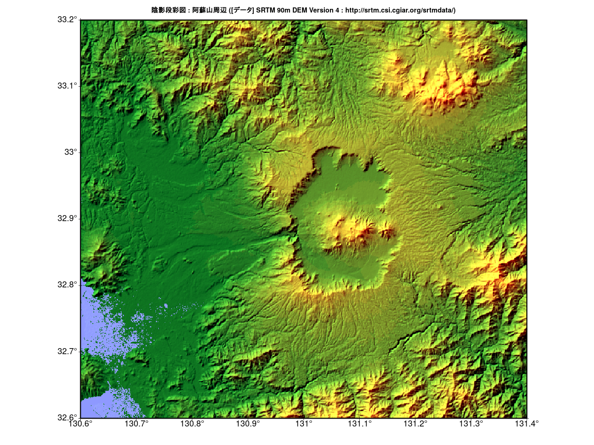

# Rで陰影段彩図01

陰影段彩図を作る際のGMTの処理を参考にRで陰影段彩図を作りました。  
透過色を使うよりも色がはっきりしたように思います。

(参考)  
GMT Tutorial  
[陰影図の光源を指定する](http://hydro.iis.u-tokyo.ac.jp/~agata/archive/GMT334/doc/html/tutorial/node70.html)

(立体地形データ)  
[SRTM 90m DEM Version 4](http://srtm.csi.cgiar.org/srtmdata/)

## 準備

[SRTM 90m DEM Version 4](http://srtm.csi.cgiar.org/srtmdata/)からsrtm_63_06.tifを入手。

## 手順
1. 立体地形データを読み込み(raster等)、必要な箇所を切り出す(crop)。
1. hillShadeを作成(terrain,hillShade)
1. 配色を決める。(terrain.colorsを使うか、colorRampPaletteで作成)
1. 標高と色を対応させる。( as.vector(cut(...)) )
1. 立体地形データの対応させた色 RGBをHSV色に変換する(rgb2hsv)
1. hillShadeの陰影の度合いにより対応させた色をHSV色に変換する(rgb2hsv)
1. 陰影の効果を付け加える(H:元データのHそのまま S,V:元データのS,VとhillShadeのS,Vのそれぞれ平均)
1. plotRGB関数を使えるようにする。( col2rgb(hsv()) 、stack)


## 陰影段彩図（阿蘇山）


## Rコード

### パッケージの読み込み(共通)

```R
library(raster)
library(rgdal)
library(zoo) #欠損値の処理
```

### データの読み込み、作図のパラメータの指定等

```R
# 立体地形データを読み込み
# SRTM 90m DEM Version 4 : http://srtm.csi.cgiar.org/srtmdata/
fn <- "SRTM90mVersion4/srtm_63_06/srtm_63_06.tif"
map<- raster(fn)
# 作図範囲を指定
Lon.range = c(130.6, 131.4)
Lat.range = c(32.6, 33.2)
# 目盛り
axes1<-seq(ceiling(Lon.range[1]*10)/10,floor(Lon.range[2]*10)/10,0.1)
axes2<-seq(ceiling(Lat.range[1]*10)/10,floor(Lat.range[2]*10)/10,0.1)
# タイトル名
title<-"陰影段彩図 : 阿蘇山周辺 ([データ] SRTM 90m DEM Version 4 : http://srtm.csi.cgiar.org/srtmdata/)"
# pngファイル名（図を保存する場合）
pngname<-"Aso01.png"
```

### データ処理と作図(共通)

```R
########## 必要な箇所を切り出す ##########
Crop <- c(Lon.range[1],Lon.range[2],Lat.range[1],Lat.range[2])
r1 <- crop(map,Crop)
#
########## hillShadeを作成 ##########
slope <- terrain(r1, opt='slope')
aspect <- terrain(r1, opt='aspect')
hill <- hillShade(slope, aspect,45,315) 
#
## 彩色
v<-getValues(r1)
#欠損値の個数
sum(is.na(v))
#直前の値を入れる(zoo package)
#v<-na.locf(v)
#平均値を入れる
#v[is.na(v)] <- mean(v,na.rm=T)
#0を入れる
v[is.na(v)] <- 0
#
########## 配色を決める。##########
breakpoints<-c(min(v,na.rm=T),0,seq(100,4000,100))
colors<-c("#45BCBB",terrain.colors(length(breakpoints)-2)) # "#45BCBB" : 海の色
#
########## 標高と色を対応させる。##########
v<-as.vector(cut(v, breaks=breakpoints, labels = colors, right = T)) # 0m以下を海とするので、right = Tとする
#
########## 立体地形データの対応させた色 RGBをHSV色に変換する ##########
v1<-rgb2hsv(col2rgb(v))
#
## 陰影
x<-getValues(hill)
#欠損値の個数
sum(is.na(x))
#平均値を入れる
x[is.na(x)] <- mean(x,na.rm=T)
#最大値を M、最小値を mにする正規化
m<-0 ; M<-max(v1[3,])
x<-(M-m)*((x-min(x))/(max(x)-min(x)))+m
#
########## hillShadeの陰影の度合いにより対応させた色をHSV色に変換する ##########
h<-NULL
for ( i in 1:length(x)){
  h[i]<-gray(x[i])
}
h1<-rgb2hsv(col2rgb(h))
#
########## 陰影の効果を付け加える ##########
d1<-NULL
d1<-(v1+h1)/2
d1[1,]<-v1[1,] # H
# plotRGB関数を使えるようにする。
g<-c(col2rgb(hsv(d1[1,],d1[2,],d1[3,]))[1,],
     col2rgb(hsv(d1[1,],d1[2,],d1[3,]))[2,],
     col2rgb(hsv(d1[1,],d1[2,],d1[3,]))[3,] )
s<-NULL
r<-r1
s <- stack(r, r, r)
values(s)<-g
#
########## 作図 ##########
#png(pngname,width=1280,height=960)
par(mar=c(4,4,3,2), xaxt="n", yaxt="n")
plotRGB(s,stretch='lin',axes=TRUE)
par(xpd=T)
text(axes1,extent(s)[3],paste0(as.character(axes1),"°"),pos=1,cex=1.5)
text(extent(s)[1],axes2,paste0(as.character(axes2),"°"),pos=2,cex=1.5)
rect(extent(s)[1],extent(s)[3],extent(s)[2],extent(s)[4],lwd=3)
points(x=axes1,y=rep(extent(s)[3],length(axes1)),cex=1,pch=3)
points(x=rep(extent(s)[1],length(axes2)),y=axes2,cex=1,pch=3)
par(xpd=F)
title(title)
#dev.off()
```
