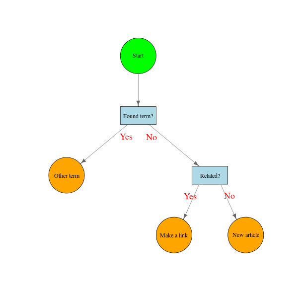

# R : igraphでフローチャート

layoutパラメータにx,y座標の行列を与えるとよい。  

### diagram::coordinatesでvertexの大まかな位置行列を作成してから調整。



[PERT/CPM](http://www2.econ.tohoku.ac.jp/~ksuzuki/teaching/2007/ch2c.pdf)の例題

### 手入力で位置行列を作成


### 開始時刻、余裕時間の表

|id  |作業名     | 作業時間| 最早開始時刻| 最早完了時刻| 最遅開始時刻| 最遅完了時刻| 全余裕時間| 自由余裕時間|
|:---|:----------|--------:|------------:|------------:|------------:|------------:|----------:|------------:|
|a   |整地       |        2|            0|            2|            0|            2|          0|            0|
|b   |基礎       |        4|            2|            6|            2|            6|          0|            0|
|c   |骨組み     |       10|            6|           16|            6|           16|          0|            0|
|d   |電気配線   |        7|           16|           23|           18|           25|          2|            2|
|e   |外部配管   |        4|           16|           20|           16|           20|          0|            0|
|f   |内部配管   |        5|           20|           25|           20|           25|          0|            0|
|g   |屋根       |        6|           16|           22|           20|           26|          4|            0|
|h   |外壁       |        7|           22|           29|           26|           33|          4|            0|
|i   |化粧ボード |        8|           25|           33|           25|           33|          0|            0|
|j   |外部塗装   |        9|           29|           38|           33|           42|          4|            0|
|k   |床張り     |        4|           33|           37|           34|           38|          1|            1|
|l   |内部塗装   |        5|           33|           38|           33|           38|          0|            0|
|m   |外部設備   |        2|           38|           40|           42|           44|          4|            4|
|n   |内部設備   |        6|           38|           44|           38|           44|          0|            0|
|Fin |完成       |        0|           44|           44|           44|           44|          0|            0|

#### クリティカルパス上の作業に色付け


#### (おまけ)スケジュール


## Rコード

### diagram::coordinatesでvertexの大まかな位置行列を作成してから調整。

#### edge label位置はスペースと改行で調整

```R
library(igraph)
library(diagram)
# 隣接行列を作成
project<-cbind(
	c(0,0,0,0,0,0),
	c(1,0,0,0,0,0),
	c(0,1,0,0,0,0),
	c(0,1,0,0,0,0),
	c(0,0,0,1,0,0),
	c(0,0,0,1,0,0))
# グラフオブジェクトに変換
g<-graph.adjacency(project)
#
# diagram::coordinatesでvertexの大まかな位置行列を作成
# もちろん、手入力で位置行列を作成してもよい。
pos <- coordinates(c(1,1,2,2))
# プロットしてみて位置を調整する場所を確認する。
#plot(g,edge.label=c("","Yes","No","Yes","No"),layout=pos,edge.arrow.size=0.6)
#
vertex.label<-c("Start","Found term?","Other term","Related?","Make a link","New article")
shape<-c("circle","rectangle","circle","rectangle","circle","circle")
vertex.color<-c("green","lightblue","orange","lightblue","orange","orange")
# vertex位置調整
pos[5,1]<-(pos[2,1]+pos[4,1])/2
pos[6,1]<-pos[6,1]+(pos[4,1]-pos[5,1])
# スペース、改行(\n)を用いてedge label位置調整
edge.label=c("","\n\nYes","\n\nNo","Yes   ","   No") 
#
# png("flowc01.png",width=600,height=600)
plot(g,vertex.shape=shape,vertex.size=40,vertex.size2=20,vertex.color=vertex.color,
	vertex.label.color="black",vertex.label=vertex.label,
	edge.label=edge.label,edge.arrow.size=0.8,edge.arrow.width=1,
	edge.width=0.8,	edge.color="gray40",edge.label.cex = 1.5,edge.label.color = "red",
	layout=pos)
# dev.off()
```

### 手入力で位置行列を作成

[PERT/CPM](http://www2.econ.tohoku.ac.jp/~ksuzuki/teaching/2007/ch2c.pdf)の例題を使わせていただきます。

#### vertex.label：長めなのは改行(\n)を入れて二行にする。

```R
library(igraph)
# 隣接行列を作成
project<-rbind(
	c(0,1,0,0,0,0,0,0,0,0,0,0,0,0,0),
	c(0,0,1,0,0,0,0,0,0,0,0,0,0,0,0),
	c(0,0,0,1,1,0,1,0,0,0,0,0,0,0,0),
	c(0,0,0,0,0,0,0,0,1,0,0,0,0,0,0),
	c(0,0,0,0,0,1,0,0,0,1,0,0,0,0,0),
	c(0,0,0,0,0,0,0,0,1,0,0,0,0,0,0),
	c(0,0,0,0,0,0,0,1,0,0,0,0,0,0,0),
	c(0,0,0,0,0,0,0,0,0,1,0,0,0,0,0),
	c(0,0,0,0,0,0,0,0,0,0,1,1,0,0,0),
	c(0,0,0,0,0,0,0,0,0,0,0,0,1,0,0),
	c(0,0,0,0,0,0,0,0,0,0,0,0,0,1,0),
	c(0,0,0,0,0,0,0,0,0,0,0,0,0,1,0),
	c(0,0,0,0,0,0,0,0,0,0,0,0,0,0,1),
	c(0,0,0,0,0,0,0,0,0,0,0,0,0,0,1),
	c(0,0,0,0,0,0,0,0,0,0,0,0,0,0,0))
duration<-c(2,4,10,7,4,5,6,7,8,9,4,5,2,6,0)
## 隣接行列 -> graph obj
g<-graph.adjacency(project*duration,weighted=T)
# 
# layoutを行列で与える
position<-cbind(c(0,0,1,2,2,3,2,3,4,4,5,5,5,6,7),
	        c(0,1,1,2,1,1,0,0,2,0,2,1,0,2,0))
vertex.label<-c("整地","基礎","骨組み","電気\n配線","外部\n配管","内部\n配管","屋根","外壁",
	"化粧\nボード","外部\n塗装","床張り","内部\n塗装","外部\n設備","内部\n設備","完成")
#
# png("flowc02.png",width=800,height=800)
plot(g,vertex.shape="rectangle",vertex.size=20,vertex.size2=20,vertex.color=c(rep("lightblue",14),"pink"),
	vertex.label=vertex.label,vertex.label.color="black",vertex.label.cex =1.5,
	edge.label=paste0(" ",E(g)$weight,"\n\n"),edge.arrow.size=0.6,edge.arrow.width=1,
	edge.width=0.8,	edge.color="gray50",edge.label.cex = 1.5,edge.label.color = "red",
	layout=position)
# dev.off()
```

### 開始時刻、余裕時間の表

```R
library(ProjectManagement)
library(knitr)
schedule<-schedule.pert(duration,project,PRINT =F)
schedule[1]
dat<-schedule[[2]]
id<- c(letters[1:14],"Fin")
name<-c("整地","基礎","骨組み","電気配線","外部配管","内部配管","屋根","外壁",
	"化粧ボード","外部塗装","床張り","内部塗装","外部設備","内部設備","完成")

df<-data.frame(id=id,作業名=name,作業時間=dat[,2],最早開始時刻=dat[,3],最早完了時刻=dat[,5],最遅開始時刻=dat[,4],最遅完了時刻=dat[,6],
	全余裕時間=dat[,7],自由余裕時間=dat[,8])
kable(df)
```

#### クリティカルパス上の作業に色付け


```R
# 全余裕時間
# 0の作業がクリティカルパス上の作業
TF<-dat[,7]
# 1:クリティカルパス上の作業 0:それ以外の作業にする。
TF[TF>0]<- -1
TF<- TF + 1
# vertex.color 1:pink 0:gray90
vertex.color<-gsub("0","gray90",gsub("1","pink",TF))
# png("flowc03.png",width=800,height=800)
plot(g,vertex.shape="rectangle",vertex.size=20,vertex.size2=20,vertex.color=vertex.color,
	vertex.label=vertex.label,vertex.label.color="black",vertex.label.cex =1.5,
	edge.label=paste0(" ",E(g)$weight,"\n\n"),edge.arrow.size=0.8,edge.arrow.width=1,
	edge.width=0.8,	edge.color="gray50",edge.label.cex = 1.5,edge.label.color = "red",
	layout=position)
# dev.off()
```

#### (おまけ)スケジュール

```R
bg=c("red","blue","green","purple")
linecol="gray60"
# png("flowc04.png",width=800,height=600)
par(mar=c(4,6,4,2),xpd=F)
plot(x=dat[,6],y=dat[,1],xlim=c(0,max(dat[,6])),ylim=c(0.5,max(dat[,1])*1.1),type="n",yaxt="n",xlab="経過時間",ylab="")
axis(2,at=seq(1,nrow(dat)),labels=F,tck=-0.01)
abline(h=dat[,1],lwd=1,col="lightgray")
abline(v=seq(0,max(dat[,6]),1),lwd=1,col="lightgray",lty=3)
segments(x0=dat[,3],x1=dat[,6],y0=rev(dat[,1]),col=linecol,lwd=8,lty=3)
segments(x0=dat[,3],x1=dat[,5],y0=rev(dat[,1]),col=linecol,lwd=8,lty=1)
segments(x0=dat[,4],x1=dat[,6],y0=rev(dat[,1]),col=linecol,lwd=8,lty=1)
for (i in 1:nrow(dat)){
	if (dat[i,3]==dat[i,4]){
			segments(x0=dat[i,3],x1=dat[i,5],y0=abs(i-nrow(dat))+1 ,col="red",lwd=8,lty=1)
				}
}		
points(x=dat[,3],y=rev(dat[,1]),pch=21,bg=bg[1],col="gray",cex=2)
points(x=dat[,4],y=rev(dat[,1]),pch=21,bg=bg[2],col="gray",cex=2)
points(x=dat[,5],y=rev(dat[,1]),pch=21,bg=bg[3],col="gray",cex=2)
points(x=dat[,6],y=rev(dat[,1]),pch=21,bg=bg[4],col="gray",cex=2)
text(x=par("usr")[1],y=rev(dat[,1]),label=name,pos=2,xpd=T)
title("スケジューリング")
legend("topright",pch=21,pt.cex=2,col="gray",pt.bg=bg,legend=colnames(dat)[3:6],inset=c(0.03,0.03),yjust=1.2)
rect(xleft=par("usr")[1], ybottom=par("usr")[3], xright=par("usr")[2], ytop=par("usr")[4],lwd=3)
# dev.off()
```

