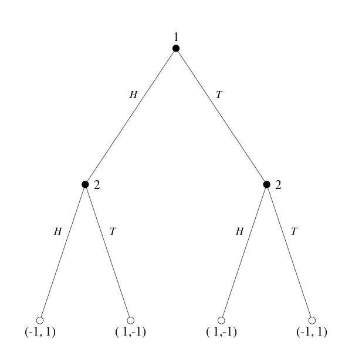
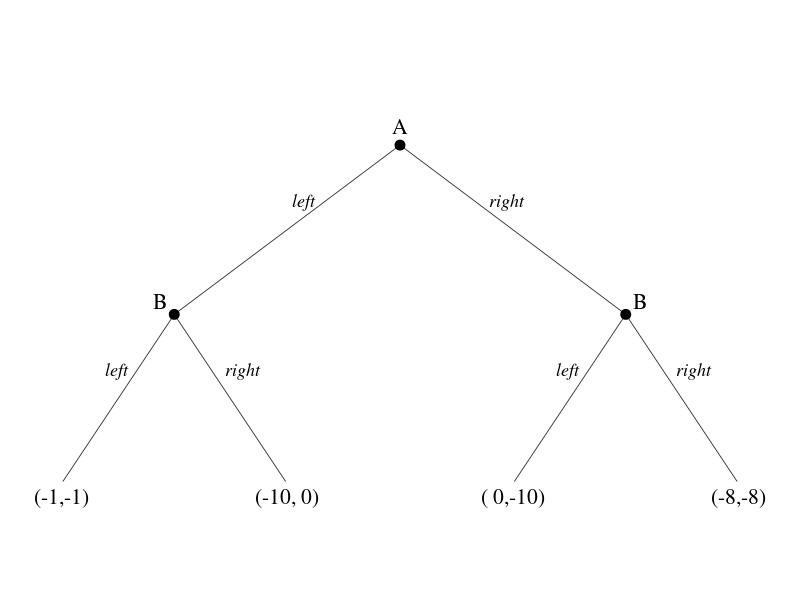
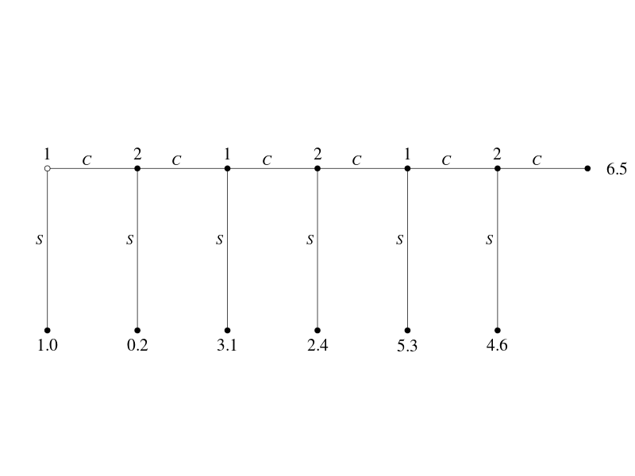
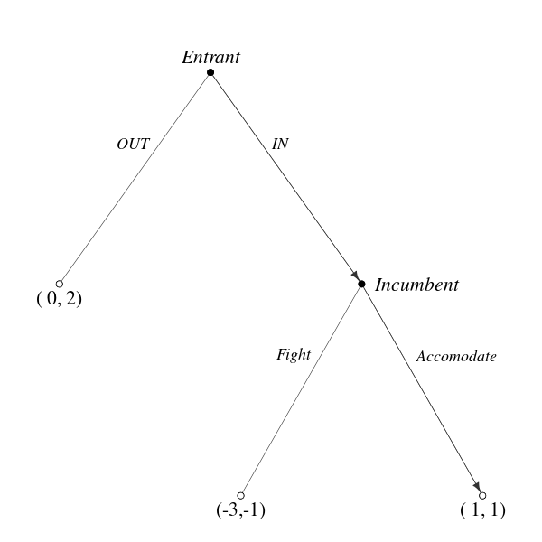

# R : igraphでGame Tree (その１)

(参考) [TikZ](https://sites.google.com/site/kochiuyu/Tikz)  
上記のサイトにTikzを使って描いた美しいグラフが載っていました。このうち「Game Tree」をigraphで描けないかと思いやってみました。

layoutパラメータにx,y座標の行列を与えるとよい。  

### Sequential Matching Pennies Game



### Left-Right Game 



### Centipede Game



### Predation Game



無向グラフを描いてから、有向グラフを重ね書きする。

## Rコード

- 左右対称なGame Treeはdiagram::coordinatesを使ってpositionの行列を作る。
- edge label位置はスペースと改行で調整
- 無向グラフを描いてから、有向グラフを重ね書きする。(4番めのグラフ)

### Sequential Matching Pennies Game

#### データ

```
id1	id2
1 	2
1 	3
2 	4
2 	5
3 	6
3 	7
```

#### 共通

```R
# データをクリップボード経由で読み込む場合
dat<-read.table("clipboard",h=T,colClasses=c("character","character"),stringsAsFactors=F)
# データをデータフレームにする場合(この部分は共通ではない)
# dat<-data.frame(id1=as.character(c(1,1,2,2,3,3)),id2=as.character(c(2,3,4,5,6,7)),stringsAsFactors=F)
#
library(igraph)
library(diagram)
#
# 隣接行列へ
id1<-dat$id1
succ<-NULL
id2<-NULL
for (i in 1:nrow(dat)){
        p<-unlist(strsplit(dat$id2[i], ","))
	id2<-c(id2,p)
        succ<-c(succ,rep(dat$id1[i],length(p)))
}
df<-data.frame(id2,succ,stringsAsFactors=T)
game<-as.matrix(get.adjacency(graph.edgelist(as.matrix(df), directed=T)))
game<-game+t(game)
game<-game[as.character(1:nrow(game)),as.character(1:nrow(game))]
#
## 隣接行列 -> グラフオブジェクト
g<-graph.adjacency(game,mode="undirected",weighted=NULL)
```

#### パラメータ設定

```R
vertex.label<-c("1","2","2","(-1, 1)","( 1,-1)","( 1,-1)","(-1, 1)")
vertex.shape<- rep("circle",7)
vertex.color<- c(rep("black",3),rep("white",4))
vertex.label.dist= rep(1.2,7)
vertex.label.degree= c(-pi/2,0,0,rep(pi/2,4))
# edge label位置調整
# 複数のスペースを入れたい位置に"-"を入れてそれをgsubで複数のスペースに置き換える。
edge.label=rep(c("H--","--T"),times=3)
edge.label=gsub("-","    ",edge.label)
#
vertex.size=5
vertex.label.font= 1
vertex.label.color="black"
vertex.label.cex = 1.8
#
edge.label.cex = 1.5
edge.label.color = "black"
edge.label.font=3
edge.width=1.2
edge.color="gray20"
# layout作成
position <- coordinates(c(1,2,4))
asp<- 1
```

#### 共通

```R
# plot
par(mar=c(2,2,4,2))
plot(g,
  # vertex
	vertex.label=vertex.label,
	vertex.shape=vertex.shape,
	vertex.color=vertex.color,
	vertex.label.dist=vertex.label.dist,
	vertex.label.degree=vertex.label.degree,
	vertex.size= vertex.size,
	vertex.label.font= vertex.label.font,
	vertex.label.color= vertex.label.color,
	vertex.label.cex = vertex.label.cex,
  # edge
	edge.label=edge.label,
	edge.label.cex = edge.label.cex,
	edge.label.color = edge.label.color,
	edge.label.font= edge.label.font,
	edge.width= edge.width,
	edge.color= edge.color,
  # layout
	layout=position,
	asp=asp)
```

### Left-Right Game 

#### データ

```
id1	id2
1 	2
1 	3
2 	4
2 	5
3 	6
3 	7
```

#### 共通

```R
# データをクリップボード経由で読み込む場合
dat<-read.table("clipboard",h=T,colClasses=c("character","character"),stringsAsFactors=F)
# データをデータフレームにする場合(この部分は共通ではない)
# dat<-data.frame(id1=as.character(c(1,1,2,2,3,3)),id2=as.character(c(2,3,4,5,6,7)),stringsAsFactors=F)
#
library(igraph)
library(diagram)
#
# 隣接行列へ
id1<-dat$id1
succ<-NULL
id2<-NULL
for (i in 1:nrow(dat)){
        p<-unlist(strsplit(dat$id2[i], ","))
	id2<-c(id2,p)
        succ<-c(succ,rep(dat$id1[i],length(p)))
}
df<-data.frame(id2,succ,stringsAsFactors=T)
game<-as.matrix(get.adjacency(graph.edgelist(as.matrix(df), directed=T)))
game<-game+t(game)
game<-game[as.character(1:nrow(game)),as.character(1:nrow(game))]
#
## 隣接行列 -> グラフオブジェクト
g<-graph.adjacency(game,mode="undirected",weighted=NULL)
```

#### パラメータ設定

```R
vertex.label<-c("A","B","B","(-1,-1)","(-10, 0)","( 0,-10)","(-8,-8)")
vertex.shape<-c(rep("circle",3),rep("none",4))
vertex.color<- c(rep("black",3),rep("white",4))
vertex.label.dist= c(1.5,rep(1.2,6))
vertex.label.degree= c(-pi/2,-pi/2-0.5,-pi/2+0.5,rep(pi/2,4))
# edge label位置調整
# 複数のスペースを入れたい位置に"-"を入れてそれをgsubで複数のスペースに置き換える。
edge.label=rep(c("left--","---right"),times=3)
edge.label=gsub("-","    ",edge.label)
#
vertex.size=3
vertex.label.font= 1
vertex.label.color="black"
vertex.label.cex = 1.8
#
edge.label.cex = 1.5
edge.label.color = "black"
edge.label.font=3
edge.width=1.2
edge.color="gray20"
# layout作成
position <- coordinates(c(1,2,4))
asp<- 0.5
```

#### 共通

```R
# plot
par(mar=c(2,2,4,2))
plot(g,
  # vertex
	vertex.label=vertex.label,
	vertex.shape=vertex.shape,
	vertex.color=vertex.color,
	vertex.label.dist=vertex.label.dist,
	vertex.label.degree=vertex.label.degree,
	vertex.size= vertex.size,
	vertex.label.font= vertex.label.font,
	vertex.label.color= vertex.label.color,
	vertex.label.cex = vertex.label.cex,
  # edge
	edge.label=edge.label,
	edge.label.cex = edge.label.cex,
	edge.label.color = edge.label.color,
	edge.label.font= edge.label.font,
	edge.width= edge.width,
	edge.color= edge.color,
  # layout
	layout=position,
	asp=asp)
```

### Centipede Game

#### データ

```
id1	id2
1	2
2	3
3	4
4	5
5	6
6	7
1	8
2	9
3	10
4	11
5	12
6	13
```

#### 共通

```R
# データをクリップボード経由で読み込む場合
dat<-read.table("clipboard",h=T,colClasses=c("character","character"),stringsAsFactors=F)
# データをデータフレームにする場合(この部分は共通ではない)
# dat<-data.frame(id1=as.character(c(1,2,3,4,5,6,1,2,3,4,5,6)),id2=as.character(c(2,3,4,5,6,7,8,9,10,11,12,13)),stringsAsFactors=F)
#
library(igraph)
library(diagram)
#
# 隣接行列へ
id1<-dat$id1
succ<-NULL
id2<-NULL
for (i in 1:nrow(dat)){
        p<-unlist(strsplit(dat$id2[i], ","))
	id2<-c(id2,p)
        succ<-c(succ,rep(dat$id1[i],length(p)))
}
df<-data.frame(id2,succ,stringsAsFactors=T)
game<-as.matrix(get.adjacency(graph.edgelist(as.matrix(df), directed=T)))
game<-game+t(game)
game<-game[as.character(1:nrow(game)),as.character(1:nrow(game))]
#
## 隣接行列 -> グラフオブジェクト
g<-graph.adjacency(game,mode="undirected",weighted=NULL)
```

#### パラメータ設定

```R
vertex.label<-c(rep(1:2,3),"6.5","1.0","0.2","3.1","2.4","5.3","4.6")
vertex.shape<- rep("circle",13)
vertex.color<- c("white",rep("black",12))
vertex.label.dist= c(rep(2.5,6),1.5,rep(2.5,6)) 
vertex.label.degree= c(rep(-pi/2,6),0,rep(pi/2,6))
# edge label位置調整
# 複数のスペースを入れたい位置に"-"を入れてそれをgsubで複数のスペースに置き換える。
# edge.labelの描かれれる順序に気をつける。
# edge.label= 1:12
edge.label= rep(c("-C\n","\n\nS-"),6)
edge.label=gsub("-","    ",edge.label)
#
vertex.size=2
vertex.label.font= 1
vertex.label.color="black"
vertex.label.cex = 1.8
#
edge.label.cex = 1.5
edge.label.color = "black"
edge.label.font=3
edge.width=1.2
edge.color="gray20"
# layout作成
position <- cbind(
	c(seq(0,6),seq(0,5)),
	c(rep(0,7),rep(-1,6)))
asp=0.3
```

#### 共通

```R
# plot
par(mar=c(2,2,4,2))
plot(g,
  # vertex
	vertex.label=vertex.label,
	vertex.shape=vertex.shape,
	vertex.color=vertex.color,
	vertex.label.dist=vertex.label.dist,
	vertex.label.degree=vertex.label.degree,
	vertex.size= vertex.size,
	vertex.label.font= vertex.label.font,
	vertex.label.color= vertex.label.color,
	vertex.label.cex = vertex.label.cex,
  # edge
	edge.label=edge.label,
	edge.label.cex = edge.label.cex,
	edge.label.color = edge.label.color,
	edge.label.font= edge.label.font,
	edge.width= edge.width,
	edge.color= edge.color,
  # layout
	layout=position,
	asp=asp)
```

### Predation Game

```
id1	id2
1	2
1	3
3	4
3	5
```

#### 共通

```R
# データをクリップボード経由で読み込む場合
dat<-read.table("clipboard",h=T,colClasses=c("character","character"),stringsAsFactors=F)
# データをデータフレームにする場合(この部分は共通ではない)
# dat<-data.frame(id1=as.character(c(1,1,3,3)),id2=as.character(c(2,3,4,5)),stringsAsFactors=F)
#
library(igraph)
library(diagram)
#
# 隣接行列へ
id1<-dat$id1
succ<-NULL
id2<-NULL
for (i in 1:nrow(dat)){
        p<-unlist(strsplit(dat$id2[i], ","))
	id2<-c(id2,p)
        succ<-c(succ,rep(dat$id1[i],length(p)))
}
df<-data.frame(id2,succ,stringsAsFactors=T)
game<-as.matrix(get.adjacency(graph.edgelist(as.matrix(df), directed=T)))
game<-game+t(game)
game<-game[as.character(1:nrow(game)),as.character(1:nrow(game))]
#
## 隣接行列 -> グラフオブジェクト
g<-graph.adjacency(game,mode="undirected",weighted=NULL)
```

#### パラメータ設定

```R
vertex.label<- c("Entrant","( 0, 2)","    Incumbent","(-3,-1)","( 1, 1)")
vertex.shape<- rep("circle",5)
vertex.color<- c("black","white","black","white","white")
vertex.label.dist=c(1,1,3,1,1)
vertex.label.degree= c(-pi/2,pi/2,0,pi/2,pi/2)
vertex.label.font=c(3,1,3,1,1)
#
# edge label位置調整
# 複数のスペースを入れたい位置に"-"を入れてそれをgsubで複数のスペースに置き換える。
edge.label=c("OUT---","--IN","Fight---","------Accomodate") 
edge.label=gsub("-","    ",edge.label)
#
vertex.size=3
#vertex.label.font= 1
vertex.label.color="black"
vertex.label.cex = 1.8
#
edge.label.cex = 1.5
edge.label.color = "black"
edge.label.font=3
edge.width=0.8
edge.color="gray20"
# layout作成
position <- rbind(
	c(0,0),
	c(-1,-1),
	c(1,-1),
	c(0.2,-2),
	c(1.8,-2))
asp=1
```

#### 共通

```R
# plot
par(mar=c(2,2,4,2))
plot(g,
  # vertex
	vertex.label=vertex.label,
	vertex.shape=vertex.shape,
	vertex.color=vertex.color,
	vertex.label.dist=vertex.label.dist,
	vertex.label.degree=vertex.label.degree,
	vertex.size= vertex.size,
	vertex.label.font= vertex.label.font,
	vertex.label.color= vertex.label.color,
	vertex.label.cex = vertex.label.cex,
  # edge
	edge.label=edge.label,
	edge.label.cex = edge.label.cex,
	edge.label.color = edge.label.color,
	edge.label.font= edge.label.font,
	edge.width= edge.width,
	edge.color= edge.color,
  # layout
	layout=position,
	asp=asp)
```

#### 重ね書き

```R
# 1->3 , 3->5 の有向グラフを重ね書きする。
game1<- cbind(
	c(0,0,0,0,0),
	c(0,0,0,0,0),
	c(1,0,0,0,0), # 1->3
	c(0,0,0,0,0),
	c(0,0,1,0,0)) # 3->5
g1<-graph.adjacency(game1,mode="directed",weighted=NULL)
plot(g1,
  # layout
	layout=position,
	asp=asp,
	add=T,
  # vertex
	vertex.label="",
	vertex.shape=vertex.shape,
	vertex.color=vertex.color,
	vertex.size=vertex.size,
  # edge
	edge.width=edge.width,
	edge.color=edge.color,
  # arrow(設定)
	edge.arrow.size=0.8,
	edge.arrow.width=1)
```

