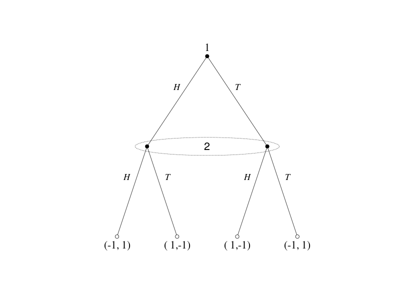
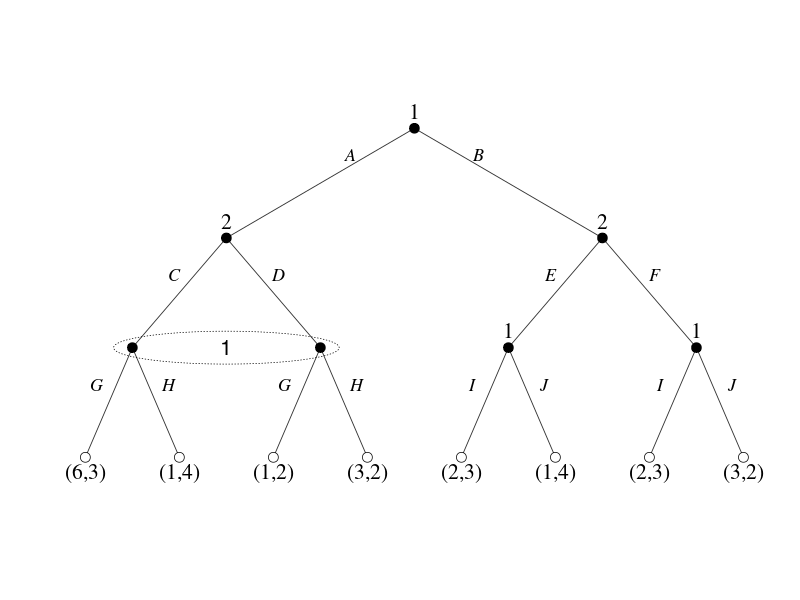
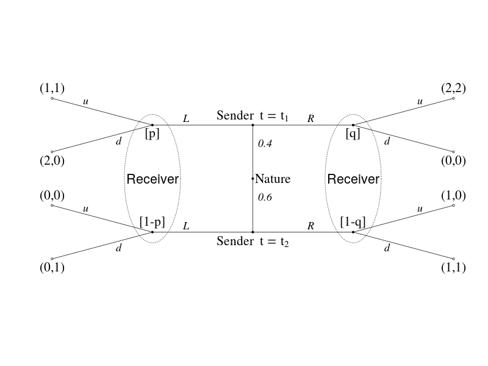
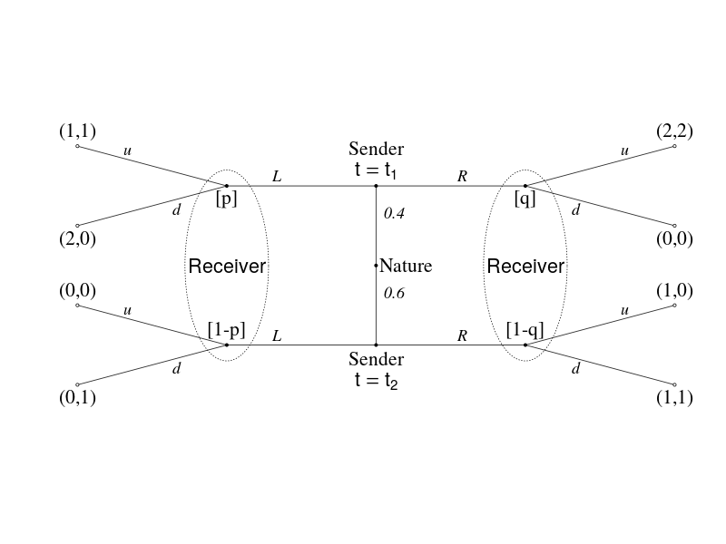
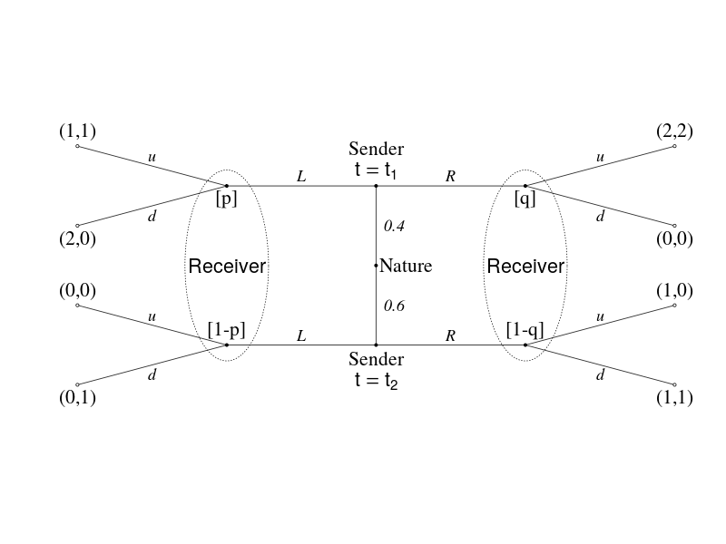

# R : igraphでGame Tree (その2)

## Game Tree の一部を線で囲む  

(参考) [TikZ : https://sites.google.com/site/kochiuyu/Tikz](https://sites.google.com/site/kochiuyu/Tikz)  
上記のサイトにTikzを使って描いた美しいグラフが載っていました。このうち「Game Tree」をigraphで描けないかと思いやってみました。

線で囲わない場合と比べて、なにかと面倒です。

- パラメータ rescale=F  とする。
- xlim , ylim 設定
- diagramパッケージのcoordinates関数をただ使うだけではダメ。

### Sequential Matching Pennies Game



### Game Tree with Incomplete Information 



### Signalling Game  
#### expression関数を使う（改行を使うとレイアウトが崩れるので１行で。）



### Signalling Game  
#### expression関数を使う（2行にするためにひと工夫。）



### Signalling Game 
#### さらにedge label の位置をedgeの中心に



## Rコード

- 左右対称なGame Treeはdiagram::coordinatesを使ってpositionの行列を作る。
- edge label位置はスペースと改行で調整

### Sequential Matching Pennies Game

#### データ

```
id1	id2
1 	2
1 	3
2 	4
2 	5
3 	6
3 	7
```

#### 共通

```R
# データをクリップボード経由で読み込む場合
dat<-read.table("clipboard",h=T,colClasses=c("character","character"),stringsAsFactors=F)
# データをデータフレームにする場合(この部分は共通ではない)
# dat<-data.frame(id1=as.character(rep(1:3,each=2)),id2=as.character(seq(2,7)),stringsAsFactors=F)
#
library(igraph)
library(diagram)
library(plotrix) # ellipse
#
# 隣接行列へ
id1<-dat$id1
succ<-NULL
id2<-NULL
for (i in 1:nrow(dat)){
        p<-unlist(strsplit(dat$id2[i], ","))
	id2<-c(id2,p)
        succ<-c(succ,rep(dat$id1[i],length(p)))
}
df<-data.frame(id2,succ,stringsAsFactors=T)
game<-as.matrix(get.adjacency(graph.edgelist(as.matrix(df), directed=T)))
game<-game+t(game)
game<-game[as.character(1:nrow(game)),as.character(1:nrow(game))]
#
## 隣接行列 -> グラフオブジェクト
g<-graph.adjacency(game,mode="undirected",weighted=NULL)
```

#### パラメータ設定

```R
vertex.label<-c("1","","","(-1, 1)","( 1,-1)","( 1,-1)","(-1, 1)")
vertex.shape<- rep("circle",7)
vertex.color<- c(rep("black",3),rep("white",4))
vertex.label.dist= rep(0.7,7)
vertex.label.degree= c(-pi/2,0,0,rep(pi/2,4))
vertex.size= rep(2,7)
# edge label位置調整
# 複数のスペースを入れたい位置に"-"を入れてそれをgsubで複数のスペースに置き換える。
edge.label=rep(c("H--","--T"),times=3)
edge.label=gsub("-","    ",edge.label)
#
vertex.label.font= 1
vertex.label.color="black"
vertex.label.cex = 1.8
#
edge.label.cex = 1.5
edge.label.color = "black"
edge.label.font=3
edge.width=1.2
edge.color="gray20"
# layout作成
position <- coordinates(c(1,2,4))
position[,1]<- (position[,1]-min(position[,1]))/(max(position[,1])-min(position[,1]))
position[,2]<- (position[,2]-min(position[,2]))/(max(position[,2])-min(position[,2]))
asp<- 1
```

#### プロット

##### 共通

```R
plot(g,
  # vertex
	vertex.label= vertex.label,
	vertex.shape= vertex.shape,
	vertex.color= vertex.color,
	vertex.label.dist= vertex.label.dist,
	vertex.label.degree= vertex.label.degree,
	vertex.size= vertex.size,
	vertex.label.font= vertex.label.font,
	vertex.label.color= vertex.label.color,
	vertex.label.cex = vertex.label.cex,
  # edge
	edge.label=edge.label,
	edge.label.cex = edge.label.cex,
	edge.label.color = edge.label.color,
	edge.label.font= edge.label.font,
	edge.width= edge.width,
	edge.color= edge.color,
  # layout
	layout=position,
	asp=asp,
	rescale=F,
	xlim=c(min(position[,1]),max(position[,1])),
	ylim=c(min(position[,2])-0.1,max(position[,2])+0.1) )
```

##### 線で囲む

```R
text(mean(position[2:3,1]),position[2,2],"2",cex= vertex.label.cex)
draw.ellipse(x=mean(position[2:3,1]), y=position[2,2],
               a = 1.2*abs(diff(position[2:3,1]))/2, b= 0.05,lty=3)
```

### Game Tree with Incomplete Information 

#### データ

```
id1	id2
1 	2
1 	3
2 	4
2 	5
3 	6
3 	7
4	8
4	9
5	10
5	11
6	12
6	13
7	14
7	15
```

#### 共通

```R
# データをクリップボード経由で読み込む場合
dat<-read.table("clipboard",h=T,colClasses=c("character","character"),stringsAsFactors=F)
# データをデータフレームにする場合(この部分は共通ではない)
# dat<-data.frame(id1=as.character(rep(1:7, each=2)),id2=as.character(seq(2,15)),stringsAsFactors=F)
#
library(igraph)
library(diagram)
library(plotrix) # ellipse作成
#
# 隣接行列へ
id1<-dat$id1
succ<-NULL
id2<-NULL
for (i in 1:nrow(dat)){
        p<-unlist(strsplit(dat$id2[i], ","))
	id2<-c(id2,p)
        succ<-c(succ,rep(dat$id1[i],length(p)))
}
df<-data.frame(id2,succ,stringsAsFactors=T)
game<-as.matrix(get.adjacency(graph.edgelist(as.matrix(df), directed=T)))
game<-game+t(game)
game<-game[as.character(1:nrow(game)),as.character(1:nrow(game))]
#
## 隣接行列 -> グラフオブジェクト
g<-graph.adjacency(game,mode="undirected",weighted=NULL)
```

#### パラメータ設定

```R
vertex.label<-c("1","2","2","","","1","1","(6,3)","(1,4)","(1,2)","(3,2)","(2,3)","(1,4)","(2,3)","(3,2)")
vertex.shape<-c(rep("circle",7),rep("circle",8))
vertex.color<- c(rep("black",7),rep("white",8))
vertex.label.dist= rep(0.7,15)
vertex.label.degree= c(rep(-pi/2,7),rep(pi/2,8))
vertex.size= rep(1.5,15)
# edge label位置調整
# 複数のスペースを入れたい位置に"-"を入れてそれをgsubで複数のスペースに置き換える。
edge.label=c("A\n","B\n","C--","--D","E--","--F","G--","--H","G--","--H","I--","--J","I--","--J") 
edge.label=gsub("-","    ",edge.label)
#
vertex.label.font= 1
vertex.label.color="black"
vertex.label.cex = 1.8
#
edge.label.cex = 1.5
edge.label.color = "black"
edge.label.font=3
edge.width=1.2
edge.color="gray20"
# layout作成
position <- coordinates(c(1,2,4,8))
position[,1]<- (position[,1]-min(position[,1]))/(max(position[,1])-min(position[,1]))
position[,2]<- (position[,2]-min(position[,2]))/(max(position[,2])-min(position[,2]))
asp=0.5
```

#### プロット

##### 共通

```R
plot(g,
  # vertex
	vertex.label= vertex.label,
	vertex.shape= vertex.shape,
	vertex.color= vertex.color,
	vertex.label.dist= vertex.label.dist,
	vertex.label.degree= vertex.label.degree,
	vertex.size= vertex.size,
	vertex.label.font= vertex.label.font,
	vertex.label.color= vertex.label.color,
	vertex.label.cex = vertex.label.cex,
  # edge
	edge.label=edge.label,
	edge.label.cex = edge.label.cex,
	edge.label.color = edge.label.color,
	edge.label.font= edge.label.font,
	edge.width= edge.width,
	edge.color= edge.color,
  # layout
	layout=position,
	asp=asp,
	rescale=F,
	xlim=c(min(position[,1]),max(position[,1])),
	ylim=c(min(position[,2])-0.1,max(position[,2])+0.1) )
```

##### 線で囲む

```R
text(mean(position[4:5,1]),position[4,2],"1",cex= vertex.label.cex)
draw.ellipse(x=mean(position[4:5,1]), y=position[4,2],
               a = 1.2*abs(diff(position[4:5,1]))/2, b= 0.05,lty=3)
```


### Signalling Game

#### データ

```R
id1	id2
1	3
2	5
3	4
4	5
3	6
5	7
4	8
8	12
9	11
10	13
11	12
12	13
11	14
13	15
```

#### 共通

```R
# データをクリップボード経由で読み込む場合
dat<-read.table("clipboard",h=T,colClasses=c("character","character"),stringsAsFactors=F)
#
# dat<-data.frame(id1=as.character(c(1,2,3,4,3,5,4,8,9,10,11,12,11,13)),id2=as.character(c(3,5,4,5,6,7,8,12,11,13,12,13,14,15)),stringsAsFactors=F)
#
library(igraph)
library(diagram)
library(plotrix) # ellipse作成
#
# 隣接行列へ
id1<-dat$id1
succ<-NULL
id2<-NULL
for (i in 1:nrow(dat)){
        p<-unlist(strsplit(dat$id2[i], ","))
	id2<-c(id2,p)
        succ<-c(succ,rep(dat$id1[i],length(p)))
}
df<-data.frame(id2,succ,stringsAsFactors=T)
game<-as.matrix(get.adjacency(graph.edgelist(as.matrix(df), directed=T)))
game<-game+t(game)
game<-game[as.character(1:nrow(game)),as.character(1:nrow(game))]
#
## 隣接行列 -> グラフオブジェクト
g<-graph.adjacency(game,mode="undirected",weighted=NULL)
```

#### パラメータ設定

##### expression関数を使う（改行を使うとレイアウトが崩れるので１行で。）

```R
vertex.label<-c("(1,1)","(2,2)","[p]",expression(paste("Sender  ",t==t[1])),"[q]","(2,0)","(0,0)","Nature",
	"(0,0)","(1,0)","[1-p]",expression(paste("Sender  ",t==t[2])),"[1-q]","(0,1)","(1,1)")
vertex.shape<- rep("circle",15)
vertex.color<- c(rep("white",2),rep("black",3),rep("white",2),rep("black",1),rep("white",2),rep("black",3),rep("white",2))
vertex.label.dist= c(rep(0.8,7),0.7,rep(0.8,7))
# 上:-pi/2  下:pi/2 
vertex.label.degree= c(rep(-pi/2,2),pi/2,-pi/2,pi/2,rep(pi/2,2),0,rep(-pi/2,2),-pi/2,pi/2,-pi/2,rep(pi/2,2))
vertex.size= rep(0.5,15)
# edge labelの書かれる順序を確認
edge.label= seq(1,14)
#
vertex.label.font= 1
vertex.label.color="black"
vertex.label.cex = 1.8
#
edge.label.cex = 1.5
edge.label.color = "black"
edge.label.font=3
edge.width=1.2
edge.color="gray20"
# layout作成
position <- coordinates(c(2,3,2,1,2,3,2))
position[,1]<- (position[,1]-min(position[,1]))/(max(position[,1])-min(position[,1]))
position[,2]<- (position[,2]-min(position[,2]))/(max(position[,2])-min(position[,2]))
asp=0.4
```

##### edge labelを入力、3,5,11,13のx座標を変える

```R
# edge label位置調整
# 複数のスペースを入れたい位置に"-"を入れてそれをgsubで複数のスペースに置き換える。
edge.label= c(rep("u\n",2),"L\n","\nd","----R\n","--0.4","\nd","--0.6",rep("u\n",2),"L\n","\nd","----R\n","\nd")
edge.label=gsub("-","    ",edge.label)
#
position[3,1]<- (position[1,1]+position[4,1])/2
position[5,1]<- (position[2,1]+position[4,1])/2
position[11,1]<- (position[1,1]+position[4,1])/2
position[13,1]<- (position[2,1]+position[4,1])/2
position[,1]<- (position[,1]-min(position[,1]))/(max(position[,1])-min(position[,1]))
position[,2]<- (position[,2]-min(position[,2]))/(max(position[,2])-min(position[,2]))
```

#### プロット

##### 共通

```R
plot(g,
  # vertex
	vertex.label= vertex.label,
	vertex.shape= vertex.shape,
	vertex.color= vertex.color,
	vertex.label.dist= vertex.label.dist,
	vertex.label.degree= vertex.label.degree,
	vertex.size= vertex.size,
	vertex.label.font= vertex.label.font,
	vertex.label.color= vertex.label.color,
	vertex.label.cex = vertex.label.cex,
  # edge
	edge.label=edge.label,
	edge.label.cex = edge.label.cex,
	edge.label.color = edge.label.color,
	edge.label.font= edge.label.font,
	edge.width= edge.width,
	edge.color= edge.color,
  # layout
	layout=position,
	asp=asp,
	rescale=F,
	xlim=c(min(position[,1]),max(position[,1])),
	ylim=c(min(position[,2])-0.1,max(position[,2])+0.1) )
```

##### 線で囲む

```R
text(position[3,1],mean(position[c(3,11),2]),"Receiver",cex= vertex.label.cex)
text(position[5,1],mean(position[c(5,13),2]),"Receiver",cex= vertex.label.cex)
draw.ellipse(x=position[3,1], y=mean(position[c(3,11),2]),
               a = 0.07, b= 1.2*abs(diff(position[c(3,11),2]))/2,lty=3)
draw.ellipse(x=position[5,1], y=mean(position[c(5,13),2]),
               a = 0.07, b= 1.2*abs(diff(position[c(5,13),2]))/2,lty=3)
```

#### expression関数を使う（２行にするには）

```R
vertex.label<-c("(1,1)","(2,2)","[p]","Sender\n\n","[q]","(2,0)","(0,0)","Nature",
	"(0,0)","(1,0)","[1-p]","Sender","[1-q]","(0,1)","(1,1)")
# png("gtree08.png",width=800,height=600)
plot(g,
  # vertex
	vertex.label= vertex.label,
	vertex.shape= vertex.shape,
	vertex.color= vertex.color,
	vertex.label.dist= vertex.label.dist,
	vertex.label.degree= vertex.label.degree,
	vertex.size= vertex.size,
	vertex.label.font= vertex.label.font,
	vertex.label.color= vertex.label.color,
	vertex.label.cex = vertex.label.cex,
  # edge
	edge.label=edge.label,
	edge.label.cex = edge.label.cex,
	edge.label.color = edge.label.color,
	edge.label.font= edge.label.font,
	edge.width= edge.width,
	edge.color= edge.color,
  # layout
	layout=position,
	asp=asp,
	rescale=F,
	xlim=c(min(position[,1]),max(position[,1])),
	ylim=c(min(position[,2])-0.1,max(position[,2])+0.1) )
text(position[3,1],mean(position[c(3,11),2]),"Receiver",cex= vertex.label.cex)
text(position[5,1],mean(position[c(5,13),2]),"Receiver",cex= vertex.label.cex)
draw.ellipse(x=position[3,1], y=mean(position[c(3,11),2]),
               a = 0.07, b= 1.2*abs(diff(position[c(3,11),2]))/2,lty=3)
draw.ellipse(x=position[5,1], y=mean(position[c(5,13),2]),
               a = 0.07, b= 1.2*abs(diff(position[c(5,13),2]))/2,lty=3)
#
text(position[4,1],position[4,2],expression(t==t[1]),cex= vertex.label.cex,pos=3)
text(position[12,1],position[12,2]-0.1,expression(t==t[2]),cex= vertex.label.cex,pos=1)
# dev.off()
```

#### edge label の位置が気になる

```R
edge.label= c(rep("u\n",2),"L\n","\nd","R\n","--0.4","\nd","--0.6",rep("u\n",2),"L\n","\nd","R\n","\nd")
edge.label=gsub("-","    ",edge.label)
## edgeの真ん中
edge.label.x = rep(0, ecount(g))
edge.label.y = rep(0, ecount(g))
for(i in 1:ecount(g)) {
    edge.label.x[i] = (position[as.numeric(ends(g,i))[1],1] + position[as.numeric(ends(g,i))[2],1])/2
    edge.label.y[i] = (position[as.numeric(ends(g,i))[1],2] + position[as.numeric(ends(g,i))[2],2])/2
}
# 
# png("gtree09.png",width=800,height=600)
plot(g,
  # vertex
	vertex.label= vertex.label,
	vertex.shape= vertex.shape,
	vertex.color= vertex.color,
	vertex.label.dist= vertex.label.dist,
	vertex.label.degree= vertex.label.degree,
	vertex.size= vertex.size,
	vertex.label.font= vertex.label.font,
	vertex.label.color= vertex.label.color,
	vertex.label.cex = vertex.label.cex,
  # edge
	edge.label=edge.label,
	edge.label.cex = edge.label.cex,
	edge.label.color = edge.label.color,
	edge.label.font= edge.label.font,
	edge.width= edge.width,
	edge.color= edge.color,
  # edge.labelの位置
	edge.label.x=edge.label.x, 
	edge.label.y=edge.label.y,
  # layout
	layout=position,
	asp=asp,
	rescale=F,
	xlim=c(min(position[,1]),max(position[,1])),
	ylim=c(min(position[,2])-0.1,max(position[,2])+0.1) )
text(position[3,1],mean(position[c(3,11),2]),"Receiver",cex= vertex.label.cex)
text(position[5,1],mean(position[c(5,13),2]),"Receiver",cex= vertex.label.cex)
draw.ellipse(x=position[3,1], y=mean(position[c(3,11),2]),
               a = 0.07, b= 1.2*abs(diff(position[c(3,11),2]))/2,lty=3)
draw.ellipse(x=position[5,1], y=mean(position[c(5,13),2]),
               a = 0.07, b= 1.2*abs(diff(position[c(5,13),2]))/2,lty=3)
#
text(position[4,1],position[4,2],expression(t==t[1]),cex= vertex.label.cex,pos=3)
text(position[12,1],position[12,2]-0.1,expression(t==t[2]),cex= vertex.label.cex,pos=1)
# dev.off()
```

