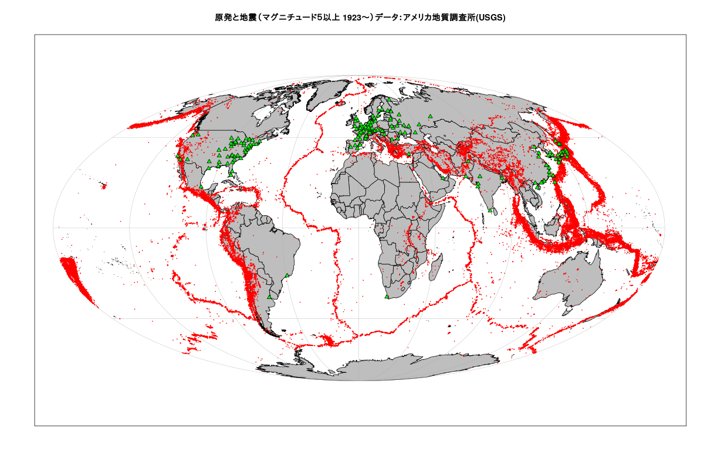

# 原発と地震 (その1)  

世界の原発の位置は[wikipedia : List of nuclear power stations](https://en.wikipedia.org/wiki/List_of_nuclear_power_stations)   
マグニチュード５以上の地震データは[アメリカ地質調査所(USGS)](https://www.usgs.gov/)  

### 原発と地震（マグニチュード５以上 1923〜）データ：アメリカ地質調査所(USGS)



### 作成したデータ：githubに置いときます。

[eqdata1923_20200202.Rdata](https://github.com/statrstart/statrstart.github.com/raw/master/source/data/eqdata1923_20200202.Rdata)  
[nuclearPower.Rdata](https://github.com/statrstart/statrstart.github.com/raw/master/source/data/nuclearPower.Rdata)  


## Rコード

### アメリカ地質調査所(USGS):地震データダウンロード

```R
#震源データをダウンロードする年
start<-1923 ; end<-2020
#
#すべての地域
lon=c(-180,180)
lat=c(-90,90)
#
#マグニチュード5以上
minmagnitude<-5
eq<- NULL
cdestfile <- "DL.csv"
for (i in start:end){
year<-as.character(i)
url<-paste0("http://earthquake.usgs.gov/fdsnws/event/1/query?format=csv&starttime=",as.numeric(year),"-01-01&endtime=",as.numeric(year)+1,
"-01-01&minmagnitude=",minmagnitude,"&minlatitude=",lat[1],"&maxlatitude=",lat[2],"&minlongitude=",lon[1],"&maxlongitude=",lon[2],"&eventtype=earthquake")
download.file(url,cdestfile)
d<-read.csv(cdestfile)
eq<- rbind(eq,d)
}
#
rm(cdestfile)
eqdata <- subset(eq, select=c(time,longitude,latitude,depth,mag))
#
#データサイズを減らすため時間を削って日付だけにする
#日本時間には直していません。
eqdata$date<-substring(eqdata$time,1,10)
eqdata<- eqdata[,c(6,2,3,4,5)]
#
# 保存
save(eqdata,file="eqdata1923_20200202.Rdata")
```

### 世界の原発の位置を[wikipedia : List of nuclear power stations](https://en.wikipedia.org/wiki/List_of_nuclear_power_stations)から入手
#### 2020.02.04 実行

```R
library(rvest)
html <- read_html("https://en.wikipedia.org/wiki/List_of_nuclear_power_stations")
results <- html_table(html,fill=T)
In_service<- results[[2]] # In service
Under_construction<- results[[3]] # Under construction
Decommissioned<- results[[4]] # Decommissioned
# In service
dat<- In_service[,c(1,4,5)] # 原発名　国　位置
lonlat<- gsub("\\(.*$","",gsub("^.*/","",dat[,3]))
dat$longitude<- unlist(lapply(lonlat,function(x){gsub("[^0-9\\.\\-]","",strsplit(x, ";")[[1]][2])}))
dat$latitude<- unlist(lapply(lonlat,function(x){gsub("[^0-9\\.\\-]","",strsplit(x, ";")[[1]][1])}))
dat$longitude<-as.numeric(dat$longitude)
dat$latitude<- as.numeric(dat$latitude)
dat<-dat[,-3]
# gsub("[^0-9\\.\\-]","",dat$longitude)
dat$CurrentStatus<- rep("In service",nrow(dat))
nuclearPower<- dat
#
# Under construction
dat<- Under_construction[,c(1,6,7)] # 原発名　国　位置
lonlat<- gsub("\\(.*$","",gsub("^.*/","",dat[,3]))
dat$longitude<- unlist(lapply(lonlat,function(x){gsub("[^0-9\\.\\-]","",strsplit(x, ";")[[1]][2])}))
dat$latitude<- unlist(lapply(lonlat,function(x){gsub("[^0-9\\.\\-]","",strsplit(x, ";")[[1]][1])}))
dat$longitude<-as.numeric(dat$longitude)
dat$latitude<- as.numeric(dat$latitude)
dat<-dat[,-3]
# gsub("[^0-9\\.\\-]","",dat$longitude)
dat$CurrentStatus<- rep("Under construction",nrow(dat))
nuclearPower<- rbind(nuclearPower,dat)
#
# Decommissioned
dat<- Decommissioned[,c(1,3,4)]
lonlat<- gsub("\\(.*$","",gsub("^.*/","",dat[,3]))
dat$longitude<- unlist(lapply(lonlat,function(x){gsub("[^0-9\\.\\-]","",strsplit(x, ";")[[1]][2])}))
dat$latitude<- unlist(lapply(lonlat,function(x){gsub("[^0-9\\.\\-]","",strsplit(x, ";")[[1]][1])}))
dat$longitude<-as.numeric(dat$longitude)
dat$latitude<- as.numeric(dat$latitude)
dat<-dat[,-3]
# gsub("[^0-9\\.\\-]","",dat$longitude)
dat$CurrentStatus<- rep("Decommissioned",nrow(dat))
nuclearPower<- rbind(nuclearPower,dat)
#
save(nuclearPower,file="nuclearPower.Rdata")
```

### 原発と地震（マグニチュード５以上 1923〜）

#### 原発の現在の状況は考慮していません。

```R
load("nuclearPower.Rdata")
load("eqdata1923_20200202.Rdata")
# 
library(oce)
data(coastlineWorldFine, package="ocedata")
# png("npeqWorld.png",width=1200,height=800)
mapPlot(coastlineWorldFine, projection="+proj=moll", col='gray')
mapPoints(eqdata$longitude,eqdata$latitude,pch=21,bg=rgb(1,0,0,alpha=1),col="red",cex=0.1)
mapPoints(nuclearPower$longitude, nuclearPower$latitude,pch=24,bg=rgb(0,1,0,alpha=1),col="black",cex=1)
title("原発と地震（マグニチュード５以上 1923〜）データ：アメリカ地質調査所(USGS)")
# dev.off()
```


