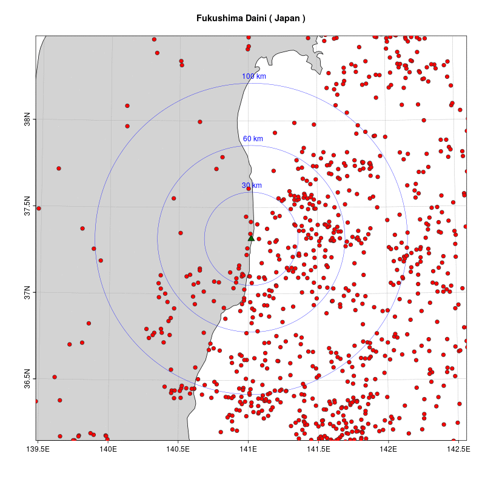
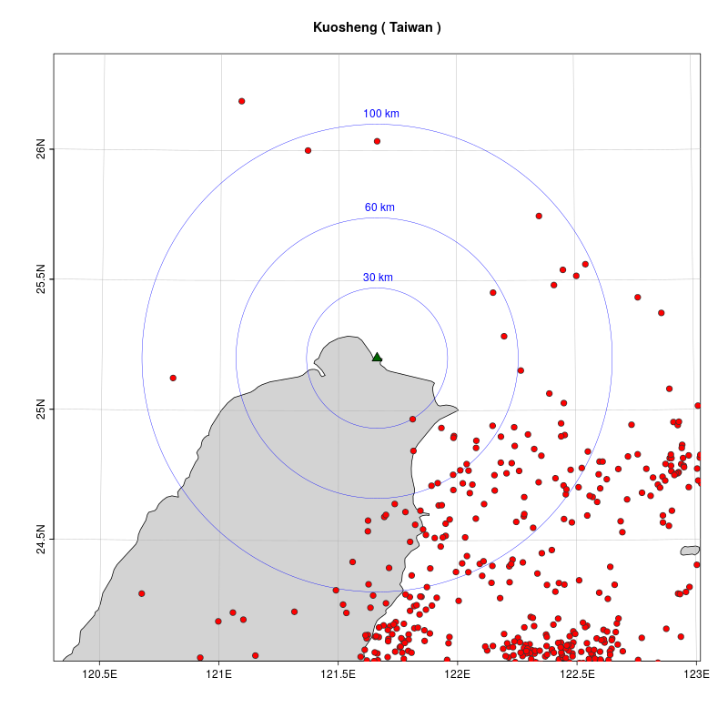
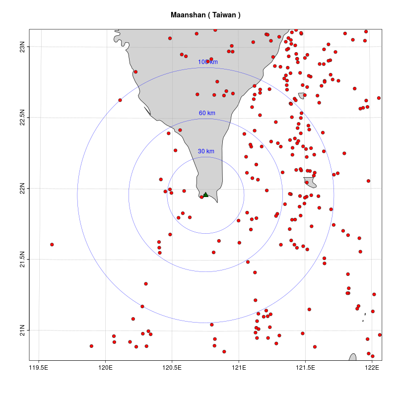

# 原発と地震 (その2) 日本と台湾

前の記事  
[原発と地震 (その1)(https://gitpress.io/@statrstart/nuclearPower01)](https://gitpress.io/@statrstart/nuclearPower01)  

### 使用したデータ
世界の原発の位置は[wikipedia : List of nuclear power stations](https://en.wikipedia.org/wiki/List_of_nuclear_power_stations)   
マグニチュード５以上の地震データは[アメリカ地質調査所(USGS)](https://www.usgs.gov/)  

[eqdata1923_20200202.Rdata](https://github.com/statrstart/statrstart.github.com/raw/master/source/data/eqdata1923_20200202.Rdata)  
[nuclearPower.Rdata](https://github.com/statrstart/statrstart.github.com/raw/master/source/data/nuclearPower.Rdata)  

### 原発と地震（マグニチュード５以上 1923〜）データ：アメリカ地質調査所(USGS)

#### 日本（アニメーションGIF）



#### 台湾





## Rコード

### パッケージの読み込み。関数読み込み。など

```R
library(oce)
data(coastlineWorldFine, package="ocedata")
#
load("nuclearPower.Rdata")
load("eqdata1923_20200202.Rdata")
#
# stackoverflow : Drawing a Circle with a Radius of a Defined Distance in a Map
# https://stackoverflow.com/questions/23071026/drawing-a-circle-with-a-radius-of-a-defined-distance-in-a-map
#
mapLonLat <- function(LonDec, LatDec, Km) {
    ER <- 6371 #Mean Earth radius in kilometers. Change this to 3959 and you will have your function working in miles.
    AngDeg <- seq(1:360) #angles in degrees 
    Lat1Rad <- LatDec*(pi/180)#Latitude of the center of the circle in radians
    Lon1Rad <- LonDec*(pi/180)#Longitude of the center of the circle in radians
    AngRad <- AngDeg*(pi/180)#angles in radians
    Lat2Rad <-asin(sin(Lat1Rad)*cos(Km/ER)+cos(Lat1Rad)*sin(Km/ER)*cos(AngRad)) #Latitude of each point of the circle rearding to angle in radians
    Lon2Rad <- Lon1Rad+atan2(sin(AngRad)*sin(Km/ER)*cos(Lat1Rad),cos(Km/ER)-sin(Lat1Rad)*sin(Lat2Rad))#Longitude of each point of the circle rearding to angle in radians
    Lat2Deg <- Lat2Rad*(180/pi)#Latitude of each point of the circle rearding to angle in degrees (conversion of radians to degrees deg = rad*(180/pi) )
    Lon2Deg <- Lon2Rad*(180/pi)#Longitude of each point of the circle rearding to angle in degrees (conversion of radians to degrees deg = rad*(180/pi) )
    return(data.frame(Lon2Deg,Lat2Deg))
}
#
nuclearPower<- nuclearPower[order(nuclearPower$Country),]
# In service と Under construction　の原発のみ(Decommissioned以外)
nuclearPower<- nuclearPower[nuclearPower$CurrentStatus != "Decommissioned"  ,]
```

### 原発別（１６６）pngファイル作成

```R
for (i in 1:nrow(nuclearPower)){
np<- c(nuclearPower$longitude[i], nuclearPower$latitude[i])
LonDec<- np[1]
LatDec<- np[2]
Km<- 120
LonLat<- mapLonLat(LonDec, LatDec, Km)
par(mar=c(2, 2, 3, 2))
lonlim <- range(LonLat[,1])
latlim <- range(LonLat[,2])
#
# 正距方位図法  azimuthal equidistant projection
aeqd_proj <- paste("+proj=aeqd +lon_0=",np[1]," +lat_0=",np[2])
#
 png(paste0("npeq",i,".png"),width=800,height=800)
mapPlot(coastlineWorldFine, projection=aeqd_proj ,
        col="lightgray", longitudelim=lonlim, latitudelim=latlim)
title(paste(nuclearPower[,1][i],"(",nuclearPower[,2][i],")"))
mapPoints(np[1],np[2],pch=24,bg="darkgreen",col="black",cex=1.5)
#
angle<- 1
pos<- 3
Km<- 30
dist<- mapLonLat(np[1],np[2],Km)
    mapPolygon(dist[,1],dist[,2],border="blue", lwd=0.5)
    mapText(dist[angle,1],dist[angle,2],labels=paste(Km ,"km"), cex =1,col="blue",pos=pos)
Km<- 60
dist<- mapLonLat(np[1],np[2],Km)
    mapPolygon(dist[,1],dist[,2],border="blue", lwd=0.5)
    mapText(dist[angle,1],dist[angle,2],labels=paste(Km ,"km"), cex =1,col="blue",pos=pos)
Km<-100
dist<- mapLonLat(np[1],np[2],Km)
    mapPolygon(dist[,1],dist[,2],border="blue", lwd=0.5)
    mapText(dist[angle,1],dist[angle,2],labels=paste(Km ,"km"), cex =1,col="blue",pos=pos)
#
mapPoints(eqdata$longitude,eqdata$latitude,pch=21,bg=rgb(1,0,0,alpha=1),col="gray20",cex=1.2)
 dev.off()
}
```


