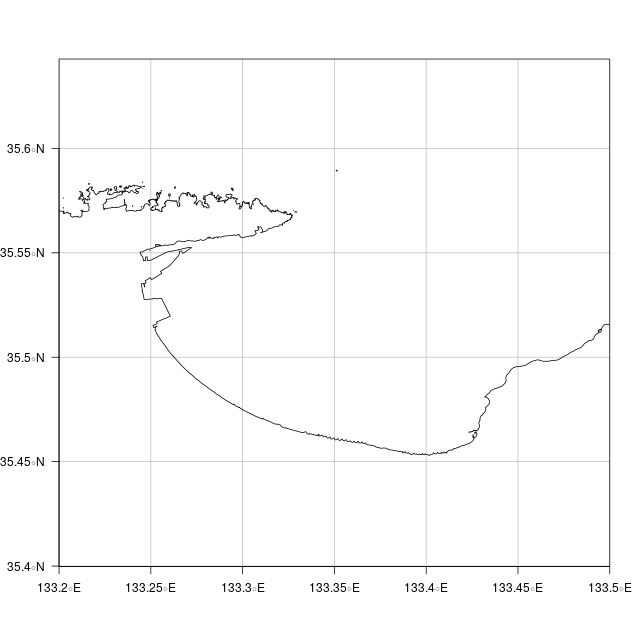

# Rでシェープファイルのマージ

sfパッケージを使えば、簡単です。しかも速い。

## 準備

国土数値情報　海岸線データ : http://nlftp.mlit.go.jp/ksj/gml/datalist/KsjTmplt-C23.html  
から海岸線のあるすべての県のデータをダウンロード。  
ダウンロードしたファイルを「JapanCoast」フォルダにまとめておく。  
「JapanCoast」フォルダ内にマージしたシェープファイルを保存するための「Japan」フォルダを作成する。

## Rコード

マージする際、属性データは行政区域コードだけを残します。 

```R
# sfパッケージを読み込む。
library(sf)
# 作業フォルダ変更（ダウンロードしたファイルのある「JapanCoast」フォルダ）
setwd("JapanCoast")
# 作業フォルダ内のshapeファイルをすべてマージする
# shapeファイル名を取得
shapefile <- list.files(path=".", pattern=".*\\.shp", full.names=T)
#国土数値情報　海岸線データの座標系は「JGD2000」(EPSGコード:4612)
pj <- "+init=epsg:4612"
options(stringsAsFactors=FALSE)
# １番目のshapeファイルを読み込む。
s.sf <- st_read(shapefile[1])
st_crs(s.sf)<-pj
# ２番目のshapeファイルを読み込み、マージする。
for (i in shapefile[-1]){
s.sf0 <- st_read(i)
st_crs(s.sf0)<-pj
#属性データは行政区域コードだけを残します。
s.sf<-rbind(s.sf["C23_001"],s.sf0["C23_001"])
}
# シェープファイルとして書き込む。
st_write(s.sf, "Japan/Jlinesf.shp")
```

## 作成したシェープファイルを使って地図を作ってみる
### grepl()で県別に


### crop(st_crop関数)


## Rコード

「行政区域コード」があるので県別の海岸線が作りやすい。

### 作業フォルダ変更（マージしたshapeファイルのある「JapanCoast/Japan」フォルダ）

```R
setwd("../JapanCoast/Japan")
```

### マージしたシェープファイルを使って地図を作成

```R
library(sf)
options(stringsAsFactors=FALSE)
p = sf::st_read("Jlinesf.shp")
st_crs(p) = "+init=epsg:4612"
#
#沖縄県の海岸線
p47<-subset(p, grepl("47...", p$C23_001)) 
#png("okinawaline01.png",width=640,height=640)
plot(st_geometry(p47),axes=T, graticule=T,las=1)
title("沖縄県の海岸線")
#dev.off()
#
#鳥取県の海岸線
p31<-subset(p, grepl("31...", p$C23_001)) 
#png("tottoriline01.png",width=640,height=640)
plot(st_geometry(p31),axes=T, graticule=T,las=1,xaxs="i")
title("鳥取県の海岸線")
#dev.off()
#
# Crop 
out <- st_crop(p, xmin=133.2,xmax=133.5,ymin=35,ymax=36)
#png("tottoriline02.png",width=640,height=640)
plot(st_geometry(out),axes=T, graticule=T,las=1,xaxs="i")
#dev.off()
```

### データ量を減らすにはrmapshaper::ms_simplifyを使います。

```R
# データ量を約 1/4 に
library(rmapshaper)
p_4 = ms_simplify(p, keep=0.25, keep_shapes=TRUE)
#できたデータをシェープファイル形式で保存
st_write(p_4, "Jline_4.shp") 
#GeoJSON形式で保存する場合。
#st_write(p_4, "Jline_4.geojson")
```

## (参考)これまでマージする際、やっていた方法（属性データは行政区域コードのみ）

```R
library(rgdal)
library(maptools)
### 作業フォルダ変更（ダウンロードしたファイルのある「JapanCoast」フォルダ）
setwd("JapanCoast")
### 作業フォルダ内のzipファイルをすべて解凍する場合は以下を実行
# zipファイル名を取得
zipfile <- list.files(path=".", pattern=".*\\.zip", full.names=T)
for ( i in zipfile){
	unzip(i)
}
### 作業フォルダ内のshapeファイル名を取得。１番目のshapeファイルを読み込む。
# shapeファイル名を取得
shapefile <- list.files(path=".", pattern=".*\\.shp", full.names=T)
#国土数値情報　海岸線データの座標系は「JGD2000」(EPSGコード:4612)
pj <- CRS("+init=epsg:4612")
df <- readOGR(shapefile[1],stringsAsFactors = F)
### 属性データは行政区域コードだけにしてマージ
coastline<-SpatialLines(df@lines)
# 属性データ 行政区域コードの追加
coastline<-SpatialLinesDataFrame(coastline, data=data.frame(C23_001=df$C23_001, row.names=0:(length(coastline)-1)))  
proj4string(coastline) <- pj
#上で作成したSpatialLinesDataFrame(coastline)にマージしていく（属性データは行政区域コードのみ）
for ( i in shapefile[-1]){
	df<-readOGR(i,stringsAsFactors = F)
	sub<-SpatialLines(df@lines)
# idの数列ベクトルを作る
	id <- seq(length(coastline@lines),length(coastline@lines)+length(sub@lines)-1,1)
# linesのIDを変更する（as.characterでidの数列ベクトルを文字列に変換する）
	for ( j in 1:length(sub@lines) ) {
	    sub@lines[[j]]@ID <- as.character(id[j])
	}
# 属性データの追加（SpatialLinesのID = 属性データフレームの行名）
	sub<-SpatialLinesDataFrame(sub, data=data.frame(C23_001=df$C23_001, row.names=length(coastline@lines):(length(coastline@lines)+length(sub@lines)-1)))  
	proj4string(sub) <- pj
	coastline<- spRbind(coastline,sub)
}
#作成したデータの保存
writeOGR(coastline, dsn="Japan" ,layer="Jline",driver="ESRI Shapefile") 
```
