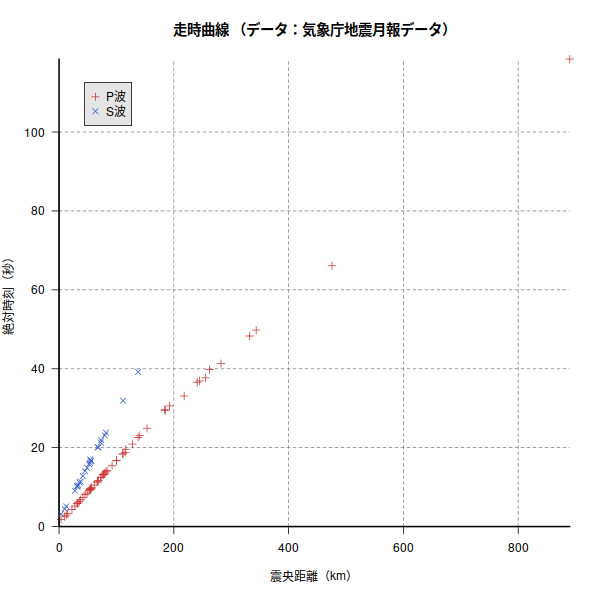
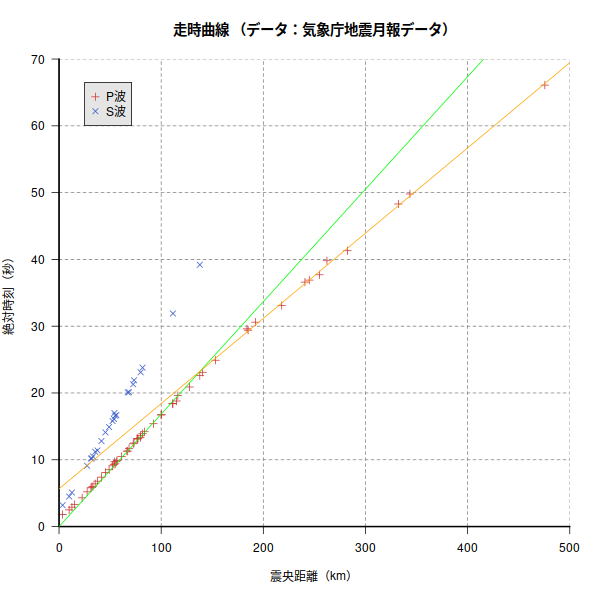
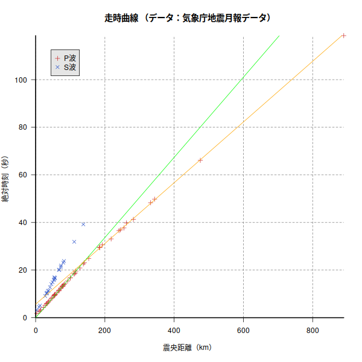

# Rで走時曲線を描く

[](https://hits.seeyoufarm.com) 

OSはLinuxを想定しています。

(参考) 

[教材用「走時曲線」描画用　地震月報データからのデータ抽出スクリプト備忘録（改訂版）](http://www.yossi-okamoto.net/2010_Study/travel-time.html)

(データ) 

[https://www.data.jma.go.jp/svd/eqev/data/bulletin/catalog/table3/d201610t.zip](https://www.data.jma.go.jp/svd/eqev/data/bulletin/catalog/table3/d201610t.zip)

解凍して出てきた「d201610c.txt」から鳥取県中部地震（2016年10月21日14時7分、地震の規模はM6.6、震源の深さは11 km） のデータを切り出して、「tottorityubu」というファイル名で保存しておく。

### プロット



### プロット範囲を狭くして描画、単回帰直線を２本加える



### 最初の散布図に、（上で得た）単回帰直線を２本加える



### 切り出して、保存した「tottorityubu」ファイル

被害のあった地震の場合、被害状況も書いてありますが、そこは削除します。

１行目、２行目は地震の起こった日時、震源地マグニチュード等。３行目は空行。４行目はヘッダー。５行目からプロットするデータ。

１行目からはawkを使って、地震発生時間を秒に変換します。

```
              2016Y 10M 21D 14H  7M 22.57S +/-0.03 EASTERN TOTTORI PREF     R=(6,221) MAXI=C
              LAT=35 22.83N +/-0.15 LONG=133 51.37E +/-0.12 DEPTH= 11KM +/-0.49 MAG1=6.6D MAG2=6.2W

STATION  PHA  TIME        RES   PHA  TIME     RES   N-S AMP    E-W AMP    U-D AMP          DELTA   AZM    MAG  MRES
KURAYO   P    14 07 24.38  -0.2 S    07 25.84  -0.1                                            3.5 271.8
N.SKGH   IP   14 07 25.08  -0.1 S    07 27.08   0.2  2257  0.1  3070  0.1  1569  0.3           9.9 259.9          
N.KSBH   IP   14 07 25.48   0.0 S    07 27.66   0.2  1545  0.1  2287  0.1  1891  0.7          12.6 149.5          
DP2SNT   IP   14 07 25.95   0.1                                                               15.2  75.9
N.AKSH   IP   14 07 26.92  -0.0                                 2288  0.5  1672  0.2          22.6 295.1          
N.YBRH   IP   14 07 27.83   0.1 ES   07 31.73   0.4  1324  0.5  1311  0.1 608.2  0.4          27.5 216.5          
N.KWHH   IP   14 07 28.41   0.1 S    07 32.81   0.5  1228  0.4  1149  0.5 700.6  0.5          31.2  87.0          
DP.QMT   IP   14 07 28.48   0.0 S    07 32.83   0.3                                           32.1 181.6
N.MZKH   IP   14 07 28.55  -0.1 IS   07 33.14   0.2  1301  0.6 519.5  0.3 367.9  0.5          33.2 265.3          
N.CHZH   IP   14 07 28.96  -0.1 S    07 33.82   0.3 701.1  0.2 359.6  0.9 638.8  0.7          35.4 112.0          
DP.TTT   IP   14 07 29.37  -0.0 S    07 34.00  -0.1  2759  0.5  1258  0.2 818.3  0.3          37.6  66.0          
N.SYOH   IP   14 07 30.03   0.0 S    07 35.44   0.2 871.6  0.5  1373  0.3 818.5  0.6          41.5 145.2          
N.HINH   P    14 07 30.66   0.0 S    07 36.73   0.4  1038  0.4 722.5  0.6 571.7  0.9          45.4 248.8          
N.IAMH   IP   14 07 31.14  -0.1 S    07 37.47   0.1  1022  0.8 552.2  0.6 266.5  0.4          49.0  64.1          
N.OHAH   IP   14 07 31.67  -0.1 S    07 38.44   0.2 569.9  0.8 364.8  0.7 298.0  0.7          52.4 126.3          
N.HKBH   IP   14 07 31.88  -0.2 S    07 38.70   0.0 278.0  0.4 190.8  0.7 268.3  0.3          53.8 203.6          
N.MHSH   IP   14 07 32.34   0.2 S    07 39.62   0.9  1671  0.3 874.8  0.5 642.7  0.3          54.2 291.5          
N.HKTH   IP   14 07 32.02  -0.2 S    07 39.24   0.2 414.8  0.6 231.4  1.0                     55.0 260.4
AIDA     IP   14 07 32.33  -0.1 S    07 39.35   0.0                       471.7  0.5          56.1 149.8          
AIDA     M    14 07                                  3266  4.6  5732  4.6            *        56.1 149.8  6.5D -0.1
N.TKBH   IP   14 07 32.46  -0.1                     329.8  0.5 386.3  0.8 280.8  0.7          56.8 180.3          
N.SGOH   IP   14 07 33.10  -0.2                     302.7  0.3 281.5  1.2 280.2  0.5          61.3 233.4          
N.TTAH   IP   14 07 33.95  -0.2                     315.2  0.3 274.2  0.3 337.6  0.3          66.4 218.3          
DP.TRT   IP   14 07 33.91  -0.3 S    07 42.66   0.2                                           67.2 243.2
N.KMGH   IP   14 07 34.32  -0.2 S    07 42.74  -0.1 421.5  0.3 293.9  0.3 243.5  0.5          68.5 141.0          
N.SETH   IP   14 07 35.03  -0.1 S    07 43.89  -0.1 173.5  0.6 344.7  0.6 201.1  0.6          72.6 164.3          
DP2OYT   IP   14 07 35.11  -0.2 S    07 44.53   0.3                       205.0  0.5          73.4  94.2          
IKUMA    IP   14 07 35.80   0.0                                           581.0  1.1          76.4 280.1          
IKUMA    M    14 07                                  6182  8.8  3906  8.4            *        76.4 280.1
KASUMI   IP   14 07 35.69  -0.1                                           330.3  1.0          76.7  72.1          
KASUMI   M    14 07                                  5614  8.4  2159  8.2            *        76.7  72.1
N.KSIH   IP   14 07 35.77  -0.1                     681.7  0.8 282.7  0.4 359.1  0.7          77.3 282.1          
SAIJYO   IP   14 07 35.90  -0.4                                           266.1  0.7          79.6 238.4          
SAIJYO   M    14 07                                  4960  5.0  2301  5.8            *        79.6 238.4  6.6D -0.0
N.SGUH   IP   14 07 36.15  -0.2 S    07 45.72  -0.3 256.6  0.6 230.9  0.6 207.5  0.2          79.9 128.4          
N.HNSH   IP   14 07 36.49  -0.1 S    07 46.44  -0.1 327.2  0.5 570.5  0.4 291.1  0.3          81.8 152.1          
N.BSEH   IP   14 07 36.82  -0.1                     213.0  0.4 157.5  0.7 196.7  0.6          83.7 201.0          
SAKAUR   IP   14 07 38.03  -0.3                                           308.6  0.6          92.4 278.6          
SAKAUR   M    14 07                                  5974  9.7  1662  4.0            *        92.4 278.6
KASAI    IP   14 07 39.31  -0.2                                           304.7  0.2          99.9 115.7          
KASAI    M    14 07                                  1629  3.3  2010  4.1            *        99.9 115.7  6.4D -0.2
N.KAMH   IP   14 07 39.45  -0.2                     265.9  0.3 162.1  0.3 198.3  0.6         100.3 107.7          
JOUGE    M    14 07                                  2624  5.0  1593  3.8            *       103.9 218.4  6.4D -0.2
N.UUMH   IP   14 07 40.98  -0.3                     134.1  0.3 264.9  0.4 128.1  0.7         111.0 157.2          
SAKAID   IP   14 07 41.02  -0.4 S    07 54.53  -0.2                       463.0  0.3         111.5 176.6          
OKI2     IP   14 07 41.44  -0.5                                                              115.0 331.6
OKI2     M    14 07                                  7238  2.0  6860  1.9            *       115.0 331.6  7.0D  0.4
YASAKA   IP   14 07 42.23   0.1                                                              116.3  75.8
YASAKA   M    14 07                                  5600  2.5  2665  4.4            *       116.3  75.8  6.8D  0.2
MIKI     M    14 07                                  2278  3.2  2974  3.4            *       126.0 119.8  6.6D  0.0
GOTSU2   P    14 07 43.50  -0.4                                                              127.8 254.4
GOTSU2   M    14 07                                  4225  8.1  1626  3.7            *       127.8 254.4
AWJNGS   P    14 07 45.16  -0.3 S    08 01.81   0.0                                          137.8 135.8
AWJNGS   M    14 07                                  2613  6.0  2415  4.1            *       137.8 135.8  6.6D  0.0
WACHI    P    14 07 45.74  -0.1                                                              140.6  93.8
WACHI    M    14 07                                  1592  3.1  1292  4.6            *       140.6  93.8  6.4D -0.2
MIMANA   M    14 07                                  1288  4.3  4292  5.3            *       150.8 169.6  6.8D  0.2
TOYOHI   P    14 07 47.50  -0.2                                                              153.3 239.3
TOYOHI   M    14 07                                  3452  3.9  1655  3.8            *       153.3 239.3  6.7D  0.1
MONOBE   M    14 07                                  1621  2.7  3192  6.2            *       182.9 179.4
KURAHA   M    14 07                                  1116  6.1  1472  3.7            *       183.5 221.9
AIOI     P    14 07 52.15   0.2                                                              184.0 162.6
AIOI     M    14 07                                  1216  5.3  3255  5.3            *       184.0 162.6  6.8D  0.2
HEGURI   P    14 07 51.96  -0.1                                                              185.1 115.2
HEGURI   M    14 07                                   852  4.1   981  4.0            *       185.1 115.2  6.4D -0.2
TANBAR   P    14 07 53.16   0.1                                                              192.2 203.0
TANBAR   M    14 07                                   987  4.0   962  3.7            *       192.2 203.0  6.4D -0.2
MIHAMA   M    14 07                                  2687  3.0  1110  3.7            *       193.6  84.4  6.8D  0.2
HIKIMI   M    14 07                                  3421  8.2  1204  4.5            *       199.7 242.5
KOUYA    M    14 07                                   775  9.4   553  8.8            *       204.1 128.5
KHARUN   M    14 07                                   707  1.7  1979  5.8            *       210.1 189.1  6.7D  0.1
MINABE   P    14 07 55.65  -0.8                                                              218.0 140.6
MINABE   M    14 07                                  1050  9.4  1211 10.2            *       218.0 140.6
KIRAGA   M    14 07                                  1030  5.1  2255  6.5            *       222.4 173.2
TENKAW   M    14 07                                   593  4.5   385  3.8            *       222.7 123.0  6.2D -0.4
EIGENJ   M    14 07                                  1149  4.3  1090  5.7            *       231.9  95.9  6.6D  0.0
KUDAMA   M    14 07                                  1486  3.1  1691  6.4            *       233.6 231.7
TANABE   M    14 07                                   766  5.0   962  8.5            *       236.5 136.6
NAGAHA   M    14 07                                   777  3.8   517  9.1            *       238.4 212.5
KUBOKA   P    14 07 59.15  -0.3                                                              240.7 197.9
KUBOKA   M    14 07                                   819  4.4  1190  4.2            *       240.7 197.9  6.6D -0.0
KAGA     M    14 07                                  1375 11.9  1436  9.2            *       244.7  65.2
KATADA   P    14 07 59.50  -0.5                                                              245.0 106.9
KATADA   M    14 07                                   571  2.0   661  4.2            *       245.0 106.9  6.4D -0.2
KIHOKU   P    14 08 00.32  -0.9                                                              254.9 119.1
KIHOKU   M    14 08                                   384  2.8   447  4.2            *       254.9 119.1  6.2D -0.4
HAGIMI   M    14 08                                  2688  8.7   750  3.5            *       256.3 255.8
TANIAI   P    14 08 02.36   0.1                                                              262.3  84.0
TANIAI   M    14 08                                  1993  4.6   450  7.0            *       262.3  84.0
HIROMI   M    14 08                                   705  3.6   698  5.6            *       265.5 205.7  6.5D -0.1
ICHIAK   M    14 08                                  1908  5.6  1434  1.9            *       271.7  91.0  6.9D  0.3
KUSIMO   M    14 08                                  1287  4.4  1012  3.4            *       276.4 140.2  6.7D  0.1
ISE      P    14 08 03.91  -0.9                                                              282.3 112.0
ISE      M    14 08                                   388  7.8   466  3.6            *       282.3 112.0
YTOYOT   M    14 08                                  2023 10.4  1352  9.8            *       283.9 245.0
KUNIMI   M    14 08                                  1214  3.2  1521  3.6            *       285.8 228.0  6.8D  0.2
TOSASH   M    14 08                                   583  5.5   903  4.7            *       295.7 199.5  6.6D  0.0
OBARA    M    14 08                                  1437  6.0   400  4.4            *       309.1  91.3  6.8D  0.2
HAKUI    M    14 08                                   884  2.9   887  3.5            *       314.1  56.0  6.7D  0.1
KUROKA   M    14 08                                  1582  6.7   379  3.1            *       318.4  84.5
BEPPUA   M    14 08                                  1170  2.3  1531  3.5            *       319.6 225.5  6.9D  0.3
USUKI    M    14 08                                   479  3.1   743  5.2            *       321.6 217.7  6.6D -0.0
NIUKAW   M    14 08                                  1082  7.6   447  4.6            *       326.2  72.3
TT1OBS   P    14 08 10.89  -0.3                                                              332.2 125.1
AKAIKE   M    14 08                                  1663  5.7   888 11.5            *       336.4 237.6
SKAMAE   M    14 08                                   556  4.8   352  4.2            *       338.5 212.8  6.5D -0.1
TTATEY   M    14 08                                  1411  6.8   804  3.5            *       341.6  65.5
TT2OBS   P    14 08 12.43  -0.2                                                              343.5 121.2
TAKISA   M    14 08                                   780  9.0   326  5.9            *       356.8  98.2
YASUOK   M    14 08                                  1235  9.7   570  5.3            *       363.8  89.2
NAKATS   M    14 08                                   746  8.7   828  9.0            *       371.3 228.5
KITAKA   M    14 08                                   437  4.0   674  8.5            *       377.5 216.7
SINONB   M    14 08                                  1307  4.4   889  5.1            *       383.1  99.3  6.9D  0.3
HICHIY   M    14 08                                   413  4.1   307  3.6            *       385.0 212.8  6.5D -0.1
ITAYA    M    14 08                                  1174  7.7   836  8.7            *       385.4 236.8
TAKATO   M    14 08                                  1228  9.1   508  5.0            *       391.1  80.7
KUROMA   M    14 08                                  1408  8.2   470  5.9            *       397.6  93.7
NSAKAI   M    14 08                                   778  8.7   451  9.8            *       399.6  72.2
SAGARA   M    14 08                                  1308  9.4  1536  4.2            *       402.4  99.9
TSUNO    M    14 08                                   321  4.7   245  4.7            *       410.0 212.8  6.4D -0.2
IKI      M    14 08                                  1688  6.6   625  3.3            *       417.2 246.3
ODAWA2   P    14 08 28.70  -0.8                                                              475.6  90.0
OKUSHM   P    14 09 21.07  -0.5                                                              889.8  31.5
``` 

### Rコード

#### データの編集

```R
loc="tottorityubu"
# 地震の起こった時刻を秒にする（時*60*60+分*60+秒）
command= paste("cat",loc,"  | awk 'NR == 1{print($4,$5,$6)}' | sed -e 's/H//g' |  sed -e 's/M//g' |  sed -e 's/S//g' | awk '{print ($1*60*60+$2*60+$3) }' ")
event=as.numeric(system( command,intern=TRUE))
# 必要な箇所の切り出し。時間を秒に変換する。output.csvというファイル名で保存。
command= paste("cat",loc," | awk 'NR>4{if ( substr($0,10,1) == \"P\" || substr($0,10,1) == \"E\" || substr($0,10,1) == \"I\") print $0}' | awk 'BEGIN {FIELDWIDTHS = \"6 3 2 3 2 1 2 1 5 2 4 1 2 3 2 1 5 2 4 2 4 6 5 2 3 1 5 2 3 8 6 1 5 2 4 1 4\"; OFS=\",\"}
{print($1,$5*60*60+$7*60+$9,$5*60*60+$15*60+$17,$31,$33)}' > output.csv ")
system( command)
dat=read.csv("output.csv",header=FALSE)
```
#### グラフを描く(1)

```R
xmax=max(dat[,4],na.rm =TRUE)
ymax=max(max(dat[,2]-event ,na.rm =TRUE),max(dat[,3]-event ,na.rm =TRUE))
#
# png("souji01.png",width=600,height=600)
plot(x=dat[,4],y=dat[,2]-event,xlim=c(0,xmax),ylim=c(0,ymax),las=1,xlab="震央距離（km）",ylab="絶対時刻（秒）",bty="n",pch=3,col="brown3",
	panel.first = grid(lty = 2, col = "gray50"),xaxs="i",yaxs="i",xpd=TRUE)
box(bty="l",lwd=2)
points(x=dat[,4],y=dat[,3]-event,pch=4,col="royalblue3",xpd=TRUE)
legend("topleft",inset=0.05,legend=c("P波","S波"),pch=c(3,4),col=c("brown3","royalblue3"),bg="gray90")
title("走時曲線 （データ：気象庁地震月報データ）")
# dev.off()
``` 

#### グラフを描く(2)

```R
## xmax,ymax を変更
xmax=500
ymax=70
# png("souji02.png",width=600,height=600)
plot(x=dat[,4],y=dat[,2]-event,xlim=c(0,xmax),ylim=c(0,ymax),las=1,xlab="震央距離（km）",ylab="絶対時刻（秒）",bty="n",pch=3,col="brown3",
	panel.first = grid(lty = 2, col = "gray50"),xaxs="i",yaxs="i",xpd=TRUE)
box(bty="l",lwd=2)
points(x=dat[,4],y=dat[,3]-event,pch=4,col="royalblue3",xpd=TRUE)
legend("topleft",inset=0.05,legend=c("P波","S波"),pch=c(3,4),col=c("brown3","royalblue3"),bg="gray90")
title("走時曲線 （データ：気象庁地震月報データ）")
# 震央距離<=150
dat1=dat[dat[,4]<=150,]
# 200<=震央距離<=500
dat2=dat[dat[,4]>=200 & dat[,4]<=500,]
# 単回帰直線を引く
# 原点を通る（切片なし）
lm1 <- lm( (V2-event)~V4+0, data=dat1)
abline(lm1,col="green") 
# 切片あり
lm2 <- lm( (V2-event)~V4, data=dat2)
abline(lm2,col="orange") 
# dev.off()
```

#### グラフを描く(3)

```R
# 最初の散布図に単回帰直線を引いてみる。
xmax=max(dat[,4],na.rm =TRUE)
ymax=max(max(dat[,2]-event ,na.rm =TRUE),max(dat[,3]-event ,na.rm =TRUE))
# png("souji03.png",width=600,height=600)
plot(x=dat[,4],y=dat[,2]-event,xlim=c(0,xmax),ylim=c(0,ymax),las=1,xlab="震央距離（km）",ylab="絶対時刻（秒）",bty="n",pch=3,col="brown3",
	panel.first = grid(lty = 2, col = "gray50"),xaxs="i",yaxs="i",xpd=TRUE)
box(bty="l",lwd=2)
points(x=dat[,4],y=dat[,3]-event,pch=4,col="royalblue3",xpd=TRUE)
legend("topleft",inset=0.05,legend=c("P波","S波"),pch=c(3,4),col=c("brown3","royalblue3"),bg="gray90")
title("走時曲線 （データ：気象庁地震月報データ）")
abline(lm1,col="green") 
abline(lm2,col="orange") 
# dev.off()
```
