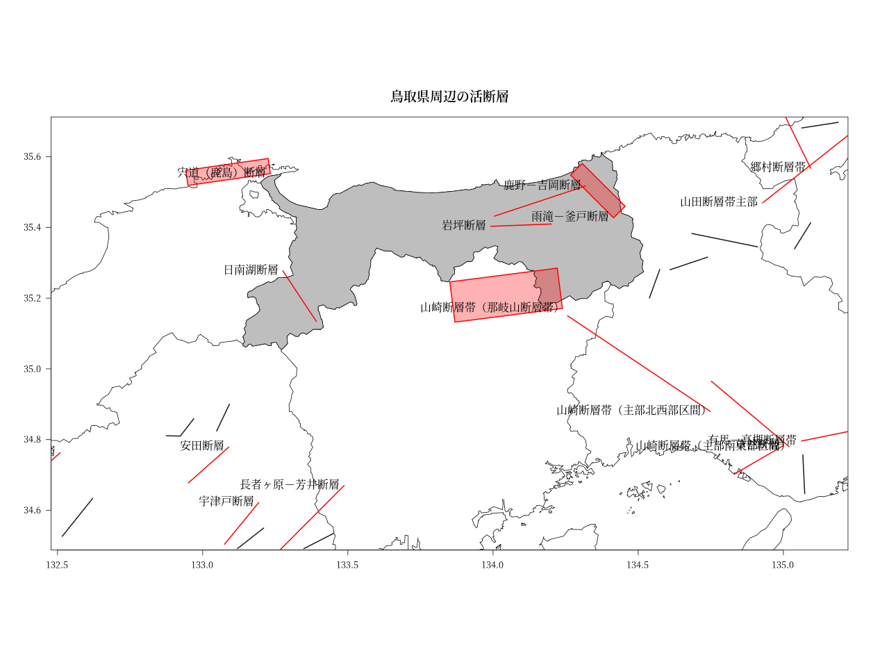

# RでJ-SHIS 活断層

鳥取県周辺の活断層を視覚化してみます。  
spとsfの両方で作図してみました。

## 準備

J-SHIS データダウンロード: http://www.j-shis.bosai.go.jp/map/JSHIS2/download.html?lang=jp  
から震源断層を特定した地震動予測地図の地図データのシェープファイルをダウンロードし、解凍。

## 鳥取県周辺の活断層(sp)


## 鳥取県周辺の活断層(sf)


## Rコード

今回のコードのポイントは「シェープファイルの一部重複した値を持つデータを取り除く」ことでした。  
「データフレームの重複した値を持つ行を取り除く」方法は「!duplicated()」をよく使います。  
「dplyr パッケージ の distinct()」を使うとシンプルに書けるそうです。  
今回採用した「シェープファイルの一部重複した値を持つデータを取り除く方法」は  
rownames(unique()) + is.element()　です。is.element関数なんて初めて知りました。  
あと、地図に断層名を記入する際「(ケース○)」を消すのにgsub関数を使っています。  

spとsfでコードが異なる箇所  
- データの読み込み
	- sp : readOGR
	- sf : st_read
- シェープファイルの一部重複した値を持つデータを取り除く
	- sp : rname<-rownames(unique(Tfault@data[,c(4,5,6,7,8,9,10)])) ; Tfault<-Tfault[is.element(rownames(Tfault@data),rname),]
	- sf : rname<-rownames(unique(Tfault[,c(4,5,6,7,8,9,10)])) ; Tfault<-Tfault[is.element(rownames(Tfault),rname),]
- プロット
	- sp : plot(Tfault,.....)
	- sf : plot(st_geometry(Tfault),.....)  

### sp

```R
library(rgdal)
library(mapdata)
#
# TYPE1 : 震源断層を特定でき、複数の矩形により表せる地震の断層形状
# LND_A98F 主要活断層帯に発生する固有地震
Fault <- readOGR(dsn="P-Y2019-PRM-SHAPE",layer="P-Y2019-PRM-SHAPE-TYPE1_LND_A98F",encoding = "cp932")
# LND_AGR1 主要活断層帯以外の活断層に発生する地震
Fault2<-readOGR(dsn="P-Y2019-PRM-SHAPE",layer="P-Y2019-PRM-SHAPE-TYPE1_LND_AGR1",encoding = "cp932")
#
#xlim=c(132.9,134.6) ; ylim=c(35,35.7)
xlim=c(132.5,135.2) ; ylim=c(34.5,35.7)
Tfault<-subset(Fault,Fault$LON>=xlim[1] & Fault$LON<=xlim[2]&Fault$LAT>=ylim[1]&Fault$LAT<=ylim[2])
#Tfault@data
#Tfault[-2,]
rname<-rownames(unique(Tfault@data[,c(4,5,6,7,8,9,10)]))
Tfault<-Tfault[is.element(rownames(Tfault@data),rname),]
#
Tfault2<-subset(Fault2,Fault2$LON>=xlim[1]&Fault2$LON<=xlim[2]&Fault2$LAT>=ylim[1]&Fault2$LAT<=ylim[2])
#
library(showtext)
#https://fonts.google.com/
font_add_google("Noto Serif JP", regular.wt = 400, bold.wt = 600)
#png("Tfaultsp.png",width=1280,height=960)
#oma	座標軸よりも外側にある余白を指定する
par(family="Noto Serif JP")
par(oma = c(3, 3, 3, 2))
showtext_begin()
map("japan",xlim=xlim, ylim=ylim, interior=T)
map("japan","tottori",fill=T,col="gray",add=T)
map.axes(cex.axis=0.8,las=1)
#map.scale(xlim[1],ylim[2],relwidth=0.25,cex=0.6,metric=TRUE,ratio=TRUE)
plot(Tfault,add=T,border = "red",col=rgb(1,0,0,0.3),lwd=2)
plot(Tfault2,add=T,border = "gray10",col=rgb(1,1,1,0.3),lwd=2)
text(x=Tfault$LON,y=Tfault$LAT, labels=gsub("（ケース.）", "", as.vector(Tfault$LTENAME)),pos=2)
title("鳥取県周辺の活断層")
showtext_end()
#dev.off()
```

### sf

```R
library(sf)
library(mapdata)
options(stringsAsFactors=FALSE)
Fault = sf::st_read("P-Y2019-PRM-SHAPE/P-Y2019-PRM-SHAPE-TYPE1_LND_A98F.shp", options="ENCODING=cp932")
Fault2 = sf::st_read("P-Y2019-PRM-SHAPE/P-Y2019-PRM-SHAPE-TYPE1_LND_AGR1.shp", options="ENCODING=cp932")
xlim=c(132.5,135.2) ; ylim=c(34.5,35.7)
Tfault<-subset(Fault,Fault$LON>=xlim[1] & Fault$LON<=xlim[2]&Fault$LAT>=ylim[1]&Fault$LAT<=ylim[2])
#
rname<-rownames(unique(Tfault[,c(4,5,6,7,8,9,10)]))
Tfault<-Tfault[is.element(rownames(Tfault),rname),]
#
Tfault2<-subset(Fault2,Fault2$LON>=xlim[1]&Fault2$LON<=xlim[2]&Fault2$LAT>=ylim[1]&Fault2$LAT<=ylim[2])
#
library(showtext)
#https://fonts.google.com/
font_add_google("Noto Serif JP", regular.wt = 400, bold.wt = 600)
#png("Tfaultsf.png",width=1280,height=960)
#oma	座標軸よりも外側にある余白を指定する
par(family="Noto Serif JP")
par(oma = c(3, 3, 3, 2))
showtext_begin()
map("japan",xlim=xlim, ylim=ylim, interior=T)
map("japan","tottori",fill=T,col="gray",add=T)
map.axes(cex.axis=0.8,las=1)
#map.scale(xlim[1],ylim[2],relwidth=0.25,cex=0.6,metric=TRUE,ratio=TRUE)
plot(st_geometry(Tfault),add = T,border = "red",col=rgb(1,0,0,0.3),lwd=2)
plot(st_geometry(Tfault2),add = T,border = "gray10",col=rgb(1,1,1,0.3),lwd=2)
text(x=Tfault$LON,y=Tfault$LAT, labels=gsub("（ケース.）", "", as.vector(Tfault$LTENAME)),pos=2)
title("鳥取県周辺の活断層")
showtext_end()
#dev.off()
```
