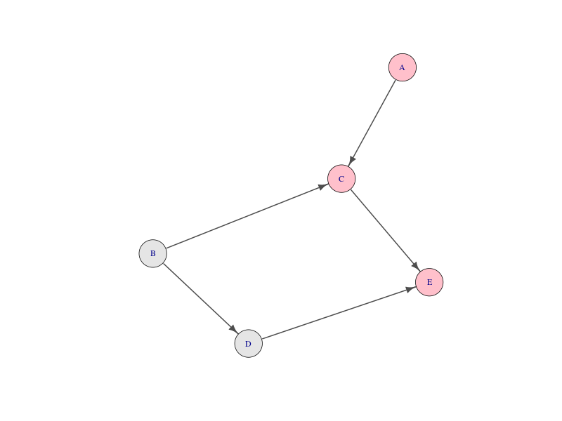
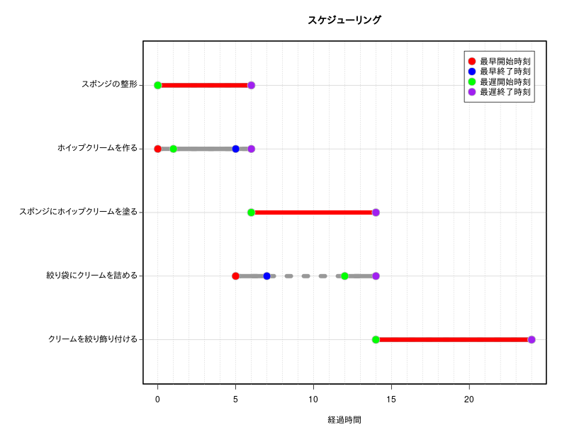

# 「問題解決の数理('17)」スケジューリング： プロジェクトの管理（自作コード）

(参考)  
[問題解決の数理（’１７）](https://info.ouj.ac.jp/~maps17/01_02/)  
[ＲでＯＲ：日程計画(PERT)](http://www.f.waseda.jp/sakas/R/ROR/orPERT.html)  
[作業開始・完了時刻と余裕時間](http://www.kogures.com/hitoshi/webtext/or-pt-yoyuu/index.html)  


「ケーキの飾りつけプロジェクトの作業リスト」を隣接行列と所要時間に分割、変換して、
"最早開始時刻","最早終了時刻","最遅開始時刻","最遅終了時刻","全余裕時間","自由余裕時間"を算出します。

### クリティカルパスの視覚化



### "最早開始時刻","最早終了時刻","最遅開始時刻","最遅終了時刻"の視覚化



### 余裕時間

|                                 | 全余裕時間| 自由余裕時間| 干渉余裕時間|
|:--------------------------------|----------:|------------:|------------:|
|スポンジの整形                   |          0|            0|            0|
|ホイップクリームを作る           |          1|            0|            1|
|スポンジにホイップクリームを塗る |          0|            0|            0|
|絞り袋にクリームを詰める         |          7|            7|            0|
|クリームを絞り飾り付ける         |          0|            0|            0|


### 入力データ(表計算ソフト、エディタで作成)

```
id  duration   prec
A	6	-
B	5	-
C	8	A,B
D	2	B
E	10	C,D
```

### 隣接行列に変換

```R
library(igraph)
# ここではクリップボードにコピペして読み込む。
dat<-read.table("clipboard",h=T,colClasses=c("character","numeric","character"),stringsAsFactors=T)
id<-dat$id
duration<-dat$duration
succ<-NULL
prec<-NULL
for (i in 1:nrow(dat)){
        p<-unlist(strsplit(dat$prec[i], ","))
	prec<-c(prec,p)
        succ<-c(succ,rep(dat$id[i],length(p)))
}
dat<-data.frame(prec,succ,stringsAsFactors=T)
dat<-subset(dat,dat$prec!="-")
project<-as.matrix(get.adjacency(graph.edgelist(as.matrix(dat), directed=T)))
project<-project[id,id]
project
#
#   A B C D E
# A 0 0 1 0 0
# B 0 0 1 1 0
# C 0 0 0 0 1
# D 0 0 0 0 1
# E 0 0 0 0 0
#
```

### 隣接行列を入力データとする場合（上記の操作は必要なし）

```R
# 隣接行列
project<-matrix(
	c(0,0,0,0,0,    # A列 先行作業 : なし
	  0,0,0,0,0,    # B列 先行作業 : なし
	  1,1,0,0,0,    # C列 先行作業 : A,B
	  0,1,0,0,0,    # D列 先行作業 : B
	  0,0,1,1,0),   # E列 先行作業 : C,D
	  nrow=5,ncol=5,byrow=F)
#
id<-c("A","B","C","D","E")
colnames(project)<- id
rownames(project)<- id
project
#
#  A B C D E
#A 0 0 1 0 0
#B 0 0 1 1 0
#C 0 0 0 0 1
#D 0 0 0 0 1
#E 0 0 0 0 0
#
duration<-c(6,5,8,2,10)
```

### "最早開始時刻","最早終了時刻","最遅開始時刻","最遅終了時刻","全余裕時間","自由余裕時間"を算出

＊ ネットで見つけたいくつかのデータで試してみただけなので不具合があると思います。

```R
## ES , EF : 0 をいれる。
pert = matrix(0,ncol=ncol(project),nrow=2)
## LS , LF : NA をいれる。
pert = rbind(pert,matrix(NA,ncol=ncol(project),nrow=2))
## TF , FF : 0 をいれる。
pert = rbind(pert,matrix(0,ncol=ncol(project),nrow=2))
pert=rbind(duration,pert)
# ES:earliest start time,  EF:earliest finish time, 
# LS:latest finish time, LF:latest start time
# TF:total float time, FF:free float time, 
colnames(pert) = id
rownames(pert) = c("duration","ES", "EF", "LS", "LF", "TF", "FF")
## ES , EF
ids<-id
# 要素がすべて0の列（先行作業のない作業）
for (i in ids){
	if ( all(project[,i]==0) ){
		pert[2,i]= 0 ; pert[3,i]= pert[1,i]
		ids<- ids[!is.element(ids,i)]
	}
}
# 「先行作業のない作業」がない場合は計算できないのでそのまま終了
n<- length(ids) + 1
while (length(ids)<length(id) & length(ids)>0 & length(ids) < n) { 
n <- length(ids)
for (i in ids){
	if ( all(project[ids,i]==0) ){
		pert[2,i]= max(project[,i]*pert[3,]) ; pert[3,i]= pert[1,i]+pert[2,i]
		ids<- ids[!is.element(ids,i)]
		}
	}
}
## LS , LF :: pert の　EF行の要素がすべて0より大きいときだけ実行
if (all(pert[3,]>0)){
ids<-id
tproj<-t(project)
# 0の箇所にNAを代入
tproj[tproj==0]<-NA
for (i in ids){
	if ( !any(tproj[,i]==1,na.rm=T) ){
		pert[5,i]= max(pert[3,]) ; pert[4,i]= max(pert[3,])-pert[1,i]
		ids<- ids[!is.element(ids,i)]
	}
}
while (length(ids)<length(id) & length(ids)>0) { 
for (i in ids){
	if (  !any(tproj[ids,i]==1,na.rm=T)  ){
		pert[5,i]= min(tproj[,i]*pert[4,],na.rm=T) ; pert[4,i]= pert[5,i]-pert[1,i]
		ids<- ids[!is.element(ids,i)]
		}
	}
}
# 全余裕時間(TF)=最遅終了時刻 - 最早終了時刻
pert[6,] <- pert[5,]-pert[3,]
# 自由余裕時間(FF):後続作業のない作業の自由余裕時間は全余裕時間と等しい。
# 		    後続作業がある場合は、すべての「後続作業」の最早開始時刻の最小値から、最早終了時刻を引いたもの
# (すべての「後続作業」の最早開始時刻-最早終了時刻)
# すべての「後続作業」の最早開始時刻 0,5,6 (0無視するために) 最早終了時刻 4 とすると
# すべての「後続作業」の最早開始時刻-最早開始時刻 -4,1,2 絶対値　4,1,2 これの最小値　1
for ( i in 1:nrow(project)){
	if (all(project[i,]==0)){   # 後続作業のない作業
		pert[7,i]<-pert[6,i]
		} else {
		pert[7,i]<- min(abs((project[i,] * pert[2,])-pert[3,i]))
		}
	}
}
# クリティカルパスの構成要素は,例えば TF=0 だから
( cp<-colnames(pert)[pert[6,]==0] )
# [1] "A" "C" "E"
```

### クリティカルパスの視覚化

```R
library(igraph)
## 隣接行列 -> graph obj
g<-graph.adjacency(project)
# plot(g)
V(g)$color<- is.element(attr(V(g),"name"),cp)
V(g)$color<-gsub("FALSE","gray90",gsub("TRUE","pink",V(g)$color))
# png("cp01.png",width=800,height=600)
plot(g,vertex.size = 20,edge.color="gray30",edge.width=2,
	 edge.arrow.size = 1,color=V(g)$color,layout = layout.fruchterman.reingold)
# dev.off()
# パラメータを変更
#plot(g,vertex.shape="crectangle",vertex.size = 20, edge.color="gray30",edge.width=2.5,
#	edge.arrow.size =1.2,color=V(g)$color,layout = layout.fruchterman.reingold)
# tkplotを使って視覚化
# tkplot(g,vertex.size =30,edge.width=3,edge.color="gray30",edge.arrow.size =2,color=V(g)$color)
```

### "最早開始時刻","最早終了時刻","最遅開始時刻","最遅終了時刻"の視覚化

```R
name <-c("スポンジの整形","ホイップクリームを作る","スポンジにホイップクリームを塗る",
	"絞り袋にクリームを詰める","クリームを絞り飾り付ける")
legend=c("最早開始時刻","最早終了時刻","最遅開始時刻","最遅終了時刻")
bg=c("red","blue","green","purple")
linecol="gray60"
# png("SK01.png",width=800,height=600)
par(mar=c(4,14,4,2),xpd=F)
plot(x=0,y=1,xlim=c(0,max(pert[3,])),ylim=c(0.5,ncol(pert)*1.1),type="n",yaxt="n",xlab="経過時間",ylab="")
axis(2,labels=F,tck=-0.01)
abline(h=1:ncol(pert),lwd=1,col="lightgray")
abline(v=seq(0,max(pert[3,]),1),lwd=1,col="lightgray",lty=3)
segments(x0=pert[2,],x1=pert[5,],y0= ncol(pert):1 ,col=linecol,lwd=8,lty=3)
segments(x0=pert[2,],x1=pert[3,],y0= ncol(pert):1 ,col=linecol,lwd=8,lty=1)
segments(x0=pert[4,],x1=pert[5,],y0= ncol(pert):1 ,col=linecol,lwd=8,lty=1)
for (i in 1:ncol(pert)){
	if (pert[2,i]==pert[4,i]){
			segments(x0=pert[2,i],x1=pert[3,i],y0=abs(i-ncol(pert))+1 ,col="red",lwd=8,lty=1)
				}
}
points(x=pert[2,],y= ncol(pert):1 ,pch=21,bg=bg[1],col="gray",cex=2)
points(x=pert[3,],y= ncol(pert):1 ,pch=21,bg=bg[2],col="gray",cex=2)
points(x=pert[4,],y= ncol(pert):1 ,pch=21,bg=bg[3],col="gray",cex=2)
points(x=pert[5,],y= ncol(pert):1 ,pch=21,bg=bg[4],col="gray",cex=2)
text(x=par("usr")[1],y= ncol(pert):1 ,label=name,pos=2,xpd=T)
title("スケジューリング")
#legend("topright",pch=21,pt.cex=2,col="gray",pt.bg=bg,legend=rownames(pert)[2:5],inset=c(0.03,0.03),yjust=1.2)
legend("topright",pch=21,pt.cex=2,col="gray",pt.bg=bg,legend=legend,inset=c(0.03,0.03),yjust=1.2)
rect(xleft=par("usr")[1], ybottom=par("usr")[3], xright=par("usr")[2], ytop=par("usr")[4],lwd=3)
# dev.off()
```
 
### 余裕時間

```R
全余裕時間 <- pert[6,]   # TF : 全余裕時間
自由余裕時間 <- pert[7,] # FF : 自由余裕時間
干渉余裕時間 <- pert[6,]-pert[7,] #干渉余裕時間 IF :ＴＦ－ＦＦ
Float<-data.frame(全余裕時間,自由余裕時間,干渉余裕時間)
rownames(Float)<-name
knitr::kable(Float)
```

|                                 | 全余裕時間| 自由余裕時間| 干渉余裕時間|
|:--------------------------------|----------:|------------:|------------:|
|スポンジの整形                   |          0|            0|            0|
|ホイップクリームを作る           |          1|            0|            1|
|スポンジにホイップクリームを塗る |          0|            0|            0|
|絞り袋にクリームを詰める         |          7|            7|            0|
|クリームを絞り飾り付ける         |          0|            0|            0|


