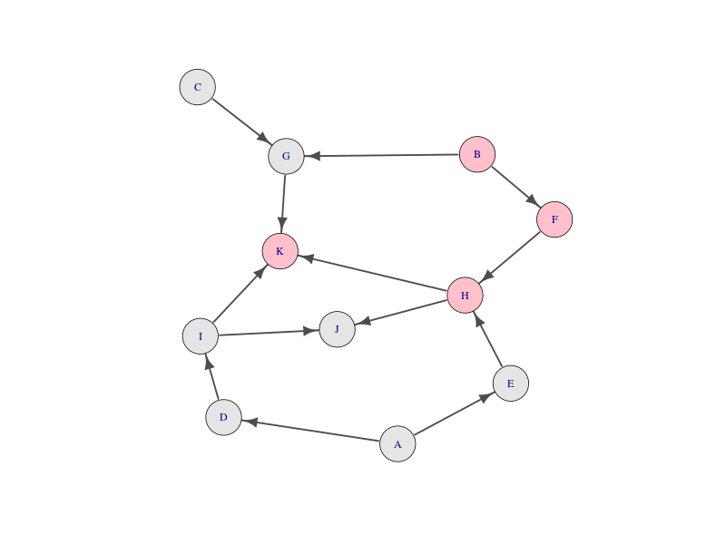
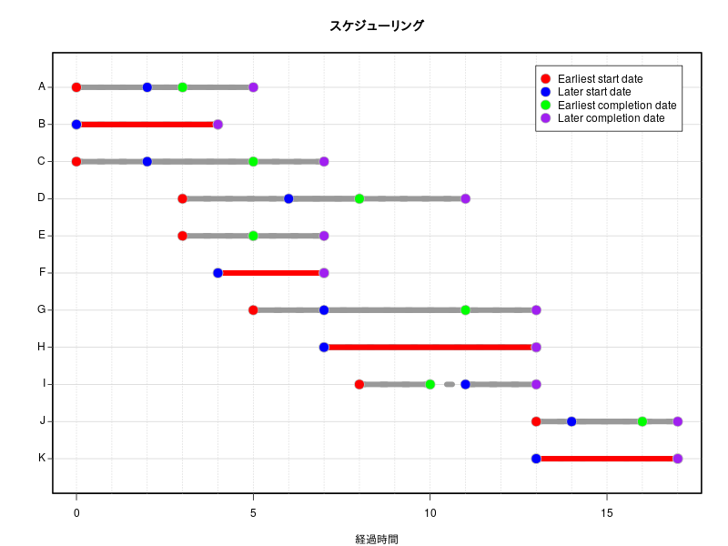
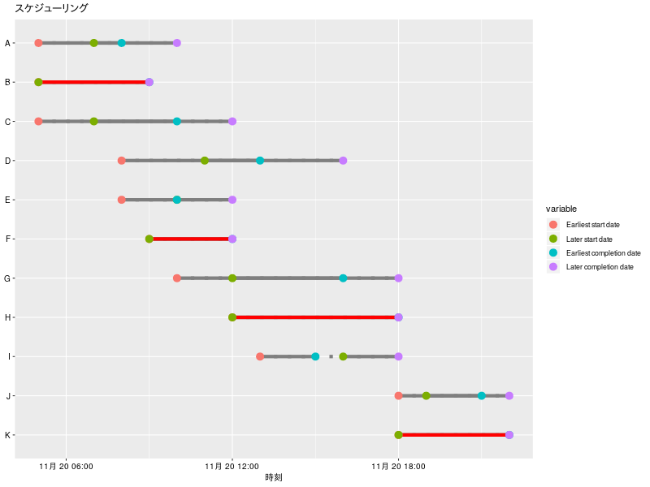

# 「問題解決の数理('17)」スケジューリング:プロジェクトの管理（ProjectManagement パッケージ）

(参考)  
[問題解決の数理（’１７）](https://info.ouj.ac.jp/~maps17/01_02/)  
[ＲでＯＲ：日程計画(PERT)](http://www.f.waseda.jp/sakas/R/ROR/orPERT.html)  
[作業開始・完了時刻と余裕時間](http://www.kogures.com/hitoshi/webtext/or-pt-yoyuu/index.html)  

## [ＲでＯＲ：日程計画(PERT)](http://www.f.waseda.jp/sakas/R/ROR/orPERT.html)の例題を使わせていただきます。

### クリティカルパスの視覚化



### "最早開始時刻","最早終了時刻","最遅開始時刻","最遅終了時刻"の視覚化



#### ggplot2使用（x軸：時刻）



### パッケージの読み込み

```R
library(ProjectManagement)
library(reshape2)
library(ggplot2)
library(knitr)
library(igraph)
```

### 入力データ(表計算ソフト、エディタで作成)

```
id  duration   prec
A        3        -
B        4        -
C        5        -
D        5        A
E        2        A
F        3        B
G        6      B,C
H        6      E,F
I        2        D
J        3      H,I
K        4    G,H,I
```

### 隣接行列に変換

```R
# ここではクリップボードにコピペして読み込む。
dat<-read.table("clipboard",h=T,colClasses=c("character","numeric","character"),stringsAsFactors=T)
id<-dat$id
duration<-dat$duration
succ<-NULL
prec<-NULL
for (i in 1:nrow(dat)){
        p<-unlist(strsplit(dat$prec[i], ","))
	prec<-c(prec,p)
        succ<-c(succ,rep(dat$id[i],length(p)))
}
dat<-data.frame(prec,succ,stringsAsFactors=T)
dat<-subset(dat,dat$prec!="-")
library(igraph)
project<-as.matrix(get.adjacency(graph.edgelist(as.matrix(dat), directed=T)))
( project<-project[id,id] )
#
#   A B C D E F G H I J K
# A 0 0 0 1 1 0 0 0 0 0 0
# B 0 0 0 0 0 1 1 0 0 0 0
# C 0 0 0 0 0 0 1 0 0 0 0
# D 0 0 0 0 0 0 0 0 1 0 0
# E 0 0 0 0 0 0 0 1 0 0 0
# F 0 0 0 0 0 0 0 1 0 0 0
# G 0 0 0 0 0 0 0 0 0 0 1
# H 0 0 0 0 0 0 0 0 0 1 1
# I 0 0 0 0 0 0 0 0 0 1 1
# J 0 0 0 0 0 0 0 0 0 0 0
# K 0 0 0 0 0 0 0 0 0 0 0
#
```

### ProjectManagementパッケージを使用して、"最早開始時刻","最早終了時刻","最遅開始時刻","最遅終了時刻","全余裕時間","自由余裕時間"を算出

```R
schedule<-schedule.pert(duration,project,PRINT =F)
schedule[1]
#
# $`Total duration of the project`
# [1] 17
#
dat<-schedule[[2]]
name <- id
TF<- dat[,7] #全余裕時間
FF<- dat[,8] #自由余裕時間
IF<- dat[,7]-dat[,8] #干渉余裕時間:ＴＦ－ＦＦ
Float<-data.frame(TF,FF,IF)
rownames(Float)<-name
kable(Float)
```
#### 余裕時間

|   | TF| FF| IF|
|:--|--:|--:|--:|
|A  |  2|  0|  2|
|B  |  0|  0|  0|
|C  |  2|  0|  2|
|D  |  3|  0|  3|
|E  |  2|  2|  0|
|F  |  0|  0|  0|
|G  |  2|  2|  0|
|H  |  0|  0|  0|
|I  |  3|  3|  0|
|J  |  1|  1|  0|
|K  |  0|  0|  0|

### クリティカルパスの視覚化

```R
g<-graph.adjacency(project)
V(g)$color<- is.element(attr(V(g),"name"),rownames(Float[Float[,1]==0,]))
V(g)$color<-gsub("FALSE","gray90",gsub("TRUE","pink",V(g)$color))
# png("cp02.png",width=800,height=600)
plot(g, vertex.size = 20, edge.color="gray30",edge.width=2.5,
	edge.arrow.size =1.2,color=V(g)$color,layout = layout.fruchterman.reingold)
# dev.off()
```

### "最早開始時刻","最早終了時刻","最遅開始時刻","最遅終了時刻"の視覚化

```R
bg=c("red","blue","green","purple")
linecol="gray60"
# png("SK02.png",width=800,height=600)
par(mar=c(4,4,4,2),xpd=F)
plot(x=dat[,6],y=dat[,1],xlim=c(0,max(dat[,6])),ylim=c(0.5,max(dat[,1])+0.5),type="n",yaxt="n",xlab="経過時間",ylab="")
axis(2,at=seq(1,nrow(dat),1),labels=F,tck=-0.01)
abline(h=dat[,1],lwd=1,col="lightgray")
abline(v=seq(0,max(dat[,6]),1),lwd=1,col="lightgray",lty=3)
segments(x0=dat[,3],x1=dat[,6],y0=rev(dat[,1]),col=linecol,lwd=8,lty=3)
segments(x0=dat[,3],x1=dat[,5],y0=rev(dat[,1]),col=linecol,lwd=8,lty=1)
segments(x0=dat[,4],x1=dat[,6],y0=rev(dat[,1]),col=linecol,lwd=8,lty=1)
for (i in 1:nrow(dat)){
	if (dat[i,3]==dat[i,4]){
			segments(x0=dat[i,3],x1=dat[i,5],y0=abs(i-nrow(dat))+1 ,col="red",lwd=8,lty=1)
				}
}		
points(x=dat[,3],y=rev(dat[,1]),pch=21,bg=bg[1],col="gray",cex=2)
points(x=dat[,4],y=rev(dat[,1]),pch=21,bg=bg[2],col="gray",cex=2)
points(x=dat[,5],y=rev(dat[,1]),pch=21,bg=bg[3],col="gray",cex=2)
points(x=dat[,6],y=rev(dat[,1]),pch=21,bg=bg[4],col="gray",cex=2)
text(x=par("usr")[1],y=rev(dat[,1]),label=name,pos=2,xpd=T)
title("スケジューリング")
legend("topright",pch=21,pt.cex=2,col="gray",pt.bg=bg,legend=colnames(dat)[3:6],inset=c(0.03,0.03),yjust=1.2)
rect(xleft=par("usr")[1], ybottom=par("usr")[3], xright=par("usr")[2], ytop=par("usr")[4],lwd=3)
# dev.off()
```
### ggplot2

```R
df<-dat[,3:6]
df$name<-factor(name,levels=rev(name))
xstart1<-df[,1] ; xend2<-df[,4] ; ypos<- df$name
xstart2<-df[,2] ; xend1<-df[,3]
criticalS<-df[df[,1]==df[,2],][,1]
criticalE<-df[df[,1]==df[,2],][,3]
criticalN<-df[df[,1]==df[,2],]$name
mm <- melt(df,id="name")
```

#### 任意：例えば１日ですむような作業の場合 x軸 を実時間で表したいとき

```R
# "2019-11-20 05:00:00"を起点とした実時間
t<-as.POSIXct("2019-11-20 05:00:00")
# 1分 = 60秒 ; 1時間= 60*60 秒
sec<-60*60
# "2019-11-20"を起点とした日付
#t<- as.Date("2019-11-20")
#sec<- 1
xstart1 <- t+ sec*xstart1
xstart2 <- t+ sec*xstart2
xend1 <- t+ sec*xend1
xend2 <- t+ sec*xend2
criticalS <- t+ sec*criticalS
criticalE <- t+ sec*criticalE
mm$value <- t+mm$value*sec
```
#### グラフの表示

```R
linecol<- "gray50"
# 線の種類
#“blank”“solid”“dashed”“dotted”“dotdash”“longdash”“twodash”
# png("SK03.png",width=800,height=600)
ggplot(mm, aes(x =value,y=name,colour=variable)) +
	annotate("segment",x=xstart1,xend=xend2,y=ypos,yend=ypos,colour=linecol,size=2,linetype="dotted") +
	annotate("segment",x=xstart1,xend=xend1,y=ypos,yend=ypos,colour=linecol,size=2,linetype="solid") +
	annotate("segment",x=xstart2,xend=xend2,y=ypos,yend=ypos,colour=linecol,size=2,linetype="solid") +
	annotate("segment",x=criticalS,xend=criticalE,y=criticalN,yend=criticalN,colour="red",size=2,linetype="solid") +
	geom_point(size=4) +
	xlab("時刻") + ylab(NULL) +
	theme(axis.text.y=element_text(size=10,colour="black"),axis.text.x=element_text(size=10,colour="black")) +
	ggtitle("スケジューリング")
# dev.off()
```

