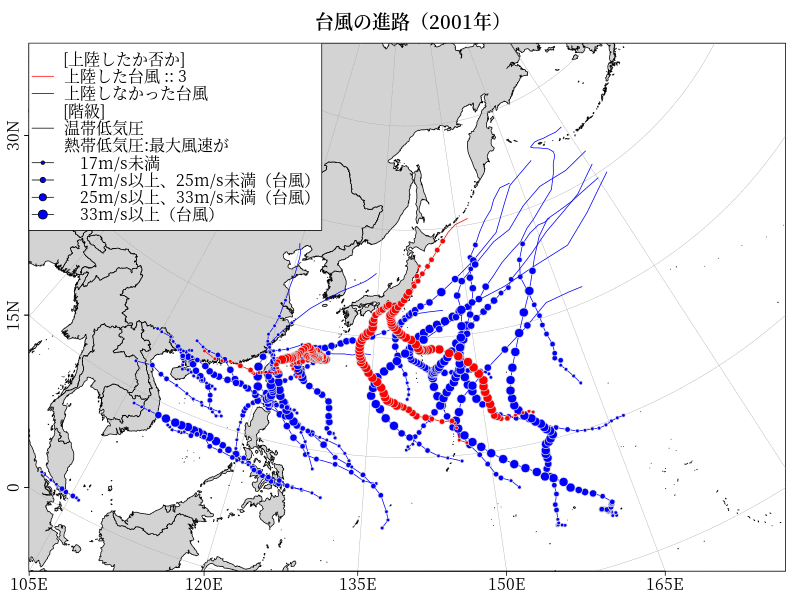

# Rで台風の経路図

気象庁の台風位置表から年ごとの台風の経路図を作ってみました。

## 台風の経路図（2001年から2019年台風第13号まで）


## Rコード

2019年は台風第13号までのデータなので別に作成

### 2019年は台風第13号まで

＊グラフを保存する場合はグラフを描く箇所のコメントアウトをはずす。

```R
library(oce)
library(ocedata)
library(showtext)
#10月18日現在、csvに含まれているのは2019年台風第13号までのデータです。
year=2019
d<-read.csv(paste0("https://www.data.jma.go.jp/fcd/yoho/typhoon/position_table/table",year,".csv"),h=T,fileEncoding ='cp932',stringsAsFactors=F)
#tail(d,1)
#     年 月 日 時.UTC. 台風番号 台風名 階級 緯度  経度 中心気圧 最大風速
#418 2019  8 31       0     1912  PODUL    2 17.9 102.1     1000        0
#    X50KT長径方向 X50KT長径 X50KT短径 X30KT長径方向 X30KT長径 X30KT短径 上陸
#418             0         0         0             0         0         0    0
# 台風ごとの中心気圧のmin
#with(d, tapply(中心気圧, list(台風名), min, na.rm = TRUE))
# 上陸した台風は１、上陸しなかった台風は０
#with(d, tapply(上陸, list(台風名), max, na.rm = TRUE))
# 台風名
#names<-as.vector(unique(d$台風名))
# 上陸(landing)した台風名
yes<-unique(d[d$上陸==1,]$台風名)
# zy : legendでbquote()関数で表示
zy<-length(yes)
# 上陸しなかった台風名
no<-unique(d$台風名)[!is.element(as.vector(unique(d$台風名)),unique(d[d$上陸==1,]$台風名))]
#
#ランベルト正角円錐図法(Lambert's conformal conic projection)
#Popular mid-latitude projections
data(coastlineWorldFine, package="ocedata")
#font_add_google("Noto Serif JP", regular.wt = 400, bold.wt = 600)
#
#png(paste0("typhoon",year,".png"),width=800,height=600)
#par(family="Noto Serif JP")
#showtext_begin()
par(mar=c(2,2,3,1))
#
mapPlot(coastlineWorldFine,
         longitudelim=c(100,180), latitudelim=c(7, 60),
         projection="+proj=lcc +lat_0=2 +lat_1=65 +lon_0=140", col="lightgray")
# 上陸しなかった台風
for ( i in no){
	lon=d[d$台風名== i ,]$経度
	lat=d[d$台風名== i ,]$緯度  
        rank=(d[d$台風名== i ,]$階級%%7)%%6
	mapLines(lon, lat, col='blue',lwd=1)
        mapPoints(lon,lat,bg="blue",col="lightgray",cex=rank/3,pch=21)
}
# 上陸した台風
for ( i in yes){
	lon=d[d$台風名== i ,]$経度
	lat=d[d$台風名== i ,]$緯度  
        rank=(d[d$台風名== i ,]$階級%%7)%%6
	mapLines(lon, lat, col='red', lwd=1)
        mapPoints(lon,lat,bg="red",col="lightgray",cex=rank/3,pch=21)
}
# bquote()内では、.(変数)とすることで、変数を受け取ることができる
legend("topleft",legend=c("[上陸したか否か]", #legend title: pt.cex=lwd=0
                         paste("上陸した台風 ::",bquote(.(zy))),
			 "上陸しなかった台風",
			 "[階級]",		##legend title: pt.cex=lwd=0
			 "温帯低気圧",
			 "熱帯低気圧:最大風速が",
			 "　17m/s未満",
			 "　17m/s以上、25m/s未満（台風）",
			 "　25m/s以上、33m/s未満（台風）",
			 "　33m/s以上（台風）"),
	bty = "o",box.lty =1,box.lwd =1, bg ="white",y.intersp =1.2,
	pch=21,lty=c(0,1,1,0,1,0,rep(1,4)),
	pt.bg="blue",pt.cex=c(rep(0,6),2,3,4,5)/3,pt.lwd=c(0,1,1,0,1,0,rep(1,4)),
        col=c("black","red","blue",rep("black",7)))
title(paste0("台風の進路（",year,"年 台風第13号までのデータ）"))
#showtext_end()
#dev.off()
```
### 2001年から2018年まで

for文を使うのでできた地図はpngで保存するようにしています。  
上のコードをfor文で回すだけなのでそこ以外は同じ。

```R
library(oce)
library(ocedata)
library(showtext)
#
data(coastlineWorldFine, package="ocedata")
#
year=seq(2001,2018,1)
#
for (nen in year){
d<-read.csv(paste0("https://www.data.jma.go.jp/fcd/yoho/typhoon/position_table/table",nen,".csv"),h=T,fileEncoding ='cp932',stringsAsFactors=F)
#head(d,1)
# 台風ごとの中心気圧のmin
#with(d, tapply(中心気圧, list(台風名), min, na.rm = TRUE))
# 上陸した台風は１、上陸しなかった台風は０
#with(d, tapply(上陸, list(台風名), max, na.rm = TRUE))
# 台風名
#names<-as.vector(unique(d$台風名))
# 上陸(landing)した台風名
yes<-unique(d[d$上陸==1,]$台風名)
# zy : legendでbquote()関数で表示
zy<-length(yes)
# 上陸しなかった台風名
no<-unique(d$台風名)[!is.element(as.vector(unique(d$台風名)),unique(d[d$上陸==1,]$台風名))]
#
names<-as.vector(unique(d$台風名))
#ランベルト正角円錐図法(Lambert's conformal conic projection)
#Popular mid-latitude projections
#https://fonts.google.com/
font_add_google("Noto Serif JP", regular.wt = 400, bold.wt = 600)
#
png(paste0("typhoon",nen,".png"),width=800,height=600)
par(family="Noto Serif JP")
showtext_begin()
par(mar=c(2,2,3,1))
mapPlot(coastlineWorldFine,
         longitudelim=c(100,180), latitudelim=c(7, 60),
         projection="+proj=lcc +lat_0=2 +lat_1=65 +lon_0=140", col="lightgray")
# 上陸しなかった台風
for ( i in no){
	lon=d[d$台風名== i ,]$経度
	lat=d[d$台風名== i ,]$緯度  
        rank=(d[d$台風名== i ,]$階級%%7)%%6
	mapLines(lon, lat, col='blue',lwd=1)
        mapPoints(lon,lat,bg="blue",col="lightgray",cex=rank/3,pch=21)
}
# 上陸した台風
for ( i in yes){
	lon=d[d$台風名== i ,]$経度
	lat=d[d$台風名== i ,]$緯度  
        rank=(d[d$台風名== i ,]$階級%%7)%%6
	mapLines(lon, lat, col='red',lwd=1)
        mapPoints(lon,lat,bg="red",col="lightgray",cex=rank/3,pch=21)
}
title(paste0("台風の進路（",nen,"年）"))
# bquote()内では、.(変数)とすることで、変数を受け取ることができる
legend("topleft",legend=c("[上陸したか否か]", #legend title: pt.cex=lwd=0
                         paste("上陸した台風 ::",bquote(.(zy))),
			 "上陸しなかった台風",
			 "[階級]",		##legend title: pt.cex=lwd=0
			 "温帯低気圧",
			 "熱帯低気圧:最大風速が",
			 "　17m/s未満",
			 "　17m/s以上、25m/s未満（台風）",
			 "　25m/s以上、33m/s未満（台風）",
			 "　33m/s以上（台風）"),
	bty = "o",box.lty =1,box.lwd =1, bg ="white",y.intersp =1.2,
	pch=21,lty=c(0,1,1,0,1,0,rep(1,4)),
	pt.bg="blue",pt.cex=c(rep(0,6),2,3,4,5)/3,pt.lwd=c(0,1,1,0,1,0,rep(1,4)),
        col=c("black","red","blue",rep("black",7)))
showtext_end()
dev.off()
}
```


(注意)   
- OSはlinuxを使っています。
- convert コマンドは、ImageMagickに含まれる画像変換コマンドです。

```
system("convert -delay 100 -loop 0 typhoon*.png typhoon2001_201908.gif")
```


